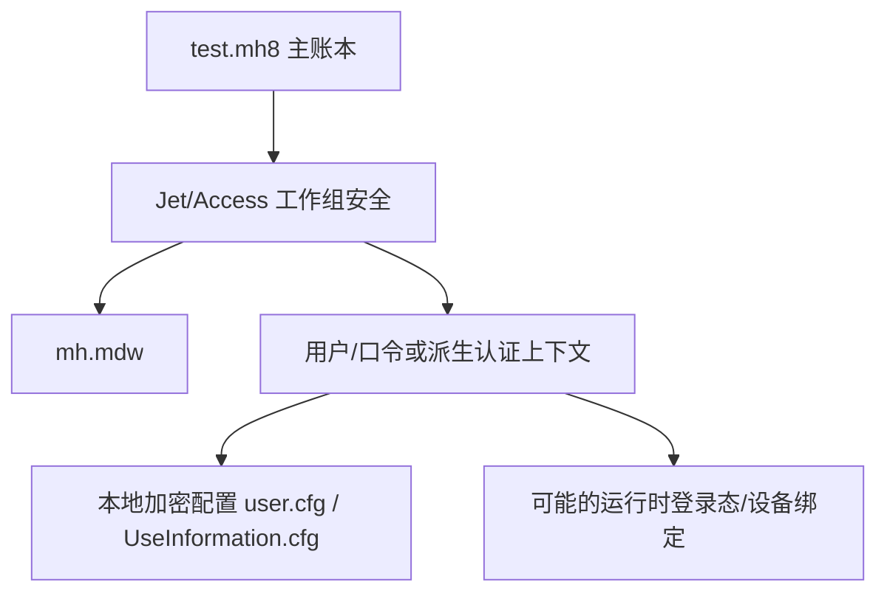

# 主账本认证研究计划

本文档面向当前最核心未解问题：

- 如何打通 `test.mh8` 的正式认证
- 如何在不破坏原库的前提下拿到真实表结构和样例数据

## 1. 当前已知事实

### 1.1 文件与格式

- `test.mh8`
  - 头部明确为 `Standard Jet DB`
- `MoneyHome8.data`
  - 可解压为 Jet 内置库
- `mhlink.mdb`
  - 可直接只读打开

### 1.2 权限行为

- 打开中的 `test.mh8`
  - 报“文件已在使用中”
- 关闭后的 `test.mh8`
  - 不带 `SystemDB` 报“没有必要权限”
  - 带 `SystemDB=mh.mdw` 报“不是有效的账户名称或密码”
- 使用 `Access.Application.OpenCurrentDatabase(...)`
  - 可返回 `OPEN_OK`
  - 但对象集合：
    - `AllTables = 0`
    - `AllQueries = 0`
    - `TableDefs = 0`
    - `QueryDefs = 0`

### 1.3 辅助认证线索

- `mh.mdw`
  - 参与工作组认证
- `user.cfg` / `UseInformation.cfg`
  - 存在加密配置层
- `MoneyHome8.exe`
  - 带 `requireAdministrator`

## 2. 当前最可能的认证模型

当前最合理的模型是：

## 3. 后续认证研究优先级

### Priority 1：纯只读连接侧实验

目标：

- 在不依赖 UI 的前提下最大化获取认证上下文

建议实验：

1. 使用 32 位 DAO / ADO / ODBC 分别测试：
   - `Admin`
   - `User`
   - 空用户
   - 带 `SystemDB`
2. 继续用 `Access.Application` / DAO 区分：
   - 能否打开库
   - 能否枚举对象
   - 能否访问容器
   - 能否读取 `CurrentProject` 和 `CurrentDb().Properties`
3. 尝试读取 `Workspace.Users` / `Workspace.Groups`
4. 继续提取 `mh.mdw` 中的可见结构词、系统对象名

当前进展补充：

- `DAO.DBEngine.120`
  - 已确认可用
  - 原始账本会先命中文件锁
  - 副本账本会稳定落到“权限不足”
- `DAO.DBEngine.36`
  - 本机未注册
- `DBEngine.Workspaces(0).UserName`
  - 当前返回 `admin`
- `CreateWorkspace`
  - 空用户会报：
    - `不是有效的账户名称或密码`
  - `Admin / admin + 空口令`
    - 可建工作区
  - 但 `Users / Groups` 仍为空集合

这意味着后续 DAO 线的重点不再是“有没有 DAO”，而是：

- 如何让 DAO 16.0 进入对象可见层
- 为什么它当前连简单 `UID / PWD` 试探都无法越过权限层
- `admin / Admin` 是否只是工作区用户名，还是也对应主账本可用账号

成功标志：

- 至少得到明确的：
  - 用户存在 / 用户不存在 / 口令错误 / 权限不足
  - 以及“打开成功但对象不可见”是否稳定复现
  - 以及对象不可见时，到底是 `TableDefs` 空、`CurrentProject` 空，还是 `Properties` 也空

当前新增约束：

- `admin / Admin` 作为用户名候选应继续保留
- 空用户名优先级下降

### Priority 2：配置材料研究

目标：

- 证明 `user.cfg` / `UseInformation.cfg` 是否与数据库认证直接相关

建议实验：

1. 对 `user.cfg` 与 `UseInformation.cfg` 的 Base64 载荷做：
   - 长度分析
   - 熵分析
   - 重复块分析
   - 与程序二进制中的固定字节模式对照
2. 检查是否存在：
   - 固定 IV/固定头
   - 可见 JSON/XML 字段
   - 明文用户名片段
3. 对比登录前后文件是否变化

成功标志：

- 能判断这些配置更像：
  - 登录态
  - 设备绑定
  - 数据库口令封装
  - 其他应用配置

当前进展补充：

- `user.cfg`
  - 文件较小
  - 修改时间停留在 `2025-12-01`
  - `content` 解码后约 `1336` 字节
  - 熵约 `7.79`
  - 更像静态密文容器
- `UseInformation.cfg`
  - 文件更大
  - 修改时间为今天 `2026-07-28 16:01:22`
  - `content` 解码后约 `2064` 字节
  - 熵约 `7.88`
  - 更像当前运行态活跃材料
- 两个文件当前都没有发现：
  - `admin`
  - `test`
  - `mh8`
  - `MoneyWise`
  等直接明文痕迹
- 两者解码后的 `16` 字节块都没有重复
  - 这不支持“简单分块表格/重复模板”的直觉
- 本轮“关闭程序 -> 离线采样 -> 重新打开程序”对比中，早期曾出现一次误判：
  - 在程序刚启动但尚未完全稳定时采样
    - 看起来所有材料都未变化
  - 但在程序真正进入 `test - 财智8` 稳定状态后再次采样，已确认：
    - `UseInformation.cfg`
      - `3009 -> 3011`
      - `2026-07-28 16:01:22 -> 2026-07-28 16:44:48`
      - SHA256 发生变化
    - `Moneyhome.ini`
      - 修改时间变化为 `2026-07-28 16:35:26`
      - `UsedTimes`
        - `142 -> 143`
      - SHA256 发生变化
    - `user.cfg`
      - 未变化
    - `mh.mdw`
      - 未变化
    - `test.mh8`
      - 最终进入新的锁定与更新时间阶段

- 进一步的启动过程监测又补出了更细的顺序：
  - `+5s`
    - `Moneyhome.ini` 先变化
  - `+10s`
    - 主窗口标题出现 `财智8`
    - `UseInformation.cfg` 随后变化
    - 且 `key1 / key2 / key3 / content` 四段一起换新
  - `+22s ~ +23s`
    - `mh.ldb` 重新出现
    - `test.mh8` 重新进入锁定并更新时间推进
  - `+37s`
    - 主窗口标题稳定为 `test - 财智8`

这说明：

- `Moneyhome.ini`
  - 更像程序状态/使用计数层
- `UseInformation.cfg`
  - 更像打开流程中段生成的一整组运行态上下文
- `test.mh8 / mh.ldb`
  - 更像账本正式占用落盘阶段

补充理解：

- 启动监测中看到的 `UseInformation.cfg`
  - 存在“启动中途先变化、稳定后落盘为新值”的特征
- 并且它不是只替换 `content`
  - 当前证据更支持整组 `key1 / key2 / key3 / content` 一起更新
- 再次重启时还能看到：
  - 启动前段短暂保留上一轮稳定值
  - 随后在标题出现 `财智8` 附近整组切到新值
- 继续重启样本又补出一个更重要的现象：
  - 中途切到的新值
    - 不一定就是最终稳定值
  - 在至少一次样本里，程序稳定到 `test - 财智8` 后：
    - `UseInformation.cfg` 会回落到上一轮稳定态哈希
- 因此后续对它的比较不能只做：
  - 启动前 vs 启动后单点
- 更应记录：
  - 中间态
  - 最终稳定态

这意味着 Priority 2 里更应优先做：

1. `UseInformation.cfg` 的运行前后对比
2. `user.cfg` 与 `UseInformation.cfg` 的角色分工判断
3. `key / key1 / key2 / key3` 是否只是材料标签，而不是口令本体

并且要进一步收紧触发条件：

- 不要只在“进程刚启动”的过早时点采样
- 更应该盯：
  - 启动早期 vs 稳定打开后
  - 登录/同步前后
  - 设置变更前后
  - 首次启动 vs 二次启动
  - 远程交互前后

当前最应该优先补的时机是：

1. `Moneyhome.ini` 已变化但 `UseInformation.cfg` 尚未变化
2. `UseInformation.cfg` 已变化但主窗口尚未稳定为 `test - 财智8`
3. `test.mh8` 尚未锁定的中间阶段
4. 账本正式锁定后的稳定阶段

当前最有价值的新判断：

- `UseInformation.cfg` 更像“整组会话材料刷新”
- 而不是“一个固定 key + 一个变动 content”的简单模式
- 并且它更像“启动过程中的临时会话态 + 最终稳定持久态”双阶段模型

### Priority 3：运行时旁路研究

目标：

- 不依赖静态解密，直接从运行时拿连接上下文

建议实验：

1. 启动后观察：
   - 是否创建临时工作文件
   - 是否改写 `user.cfg`
   - 是否访问 `mh.mdw` / `mhlink.mdb`
2. 若后续会话允许更稳定的桌面自动化：
   - 打开登录/系统设置页
   - 观察是否可见当前用户名、同步用户、工作组相关项

成功标志：

- 至少拿到一个“认证上下文存在于何处”的明确方向

## 4. 主账本表结构一旦打通后的首批读取顺序

### 第一批

- `TBAcctGroup`
- `TBAcctDetail`
- `TBCategory`
- `TBCurrency`
- `TBPerson`
- `TBTransaction`

### 第二批

- `TBBudget`
- `TBRemindSetting`
- `TBTemplate`
- `TBPayModeHistory`
- `TBOpenFund`
- `TBSecurities`

### 第三批

- `TBGoalSetting`
- `TBFPExpensesInformation`
- `TBReportSettings`
- `TBPreciousMetals`
- `TBFuturesGoods`
- `TBFinancingContract`
- `TBSyncRecord`

## 5. 风险控制

- 只读优先
- 不在原库上做结构修改
- 不尝试暴力口令写回
- 不删除 `ldb`/锁文件模拟恢复

## 6. 当前结论

在现阶段，最有性价比的推进顺序是：

1. 继续从只读连接与配置侧打认证链
2. 一旦认证打通，立刻优先做主账本正式枚举
3. 再回头验证所有模式假设与字段语义
