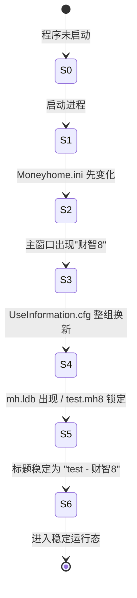
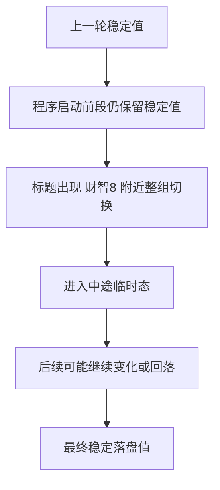

# 主账本认证状态机

本文档把当前关于 `test.mh8` 认证链的证据整理成“状态 -> 触发 -> 现象 -> 含义”的状态机视角，便于：

- 理解原程序启动时到底发生了什么
- 区分文件锁、权限不足、对象不可见这几个不同层级
- 指导 Rust 重构时的兼容读取策略

依赖文档：

- [auth-mechanism-evidence.md](C:\DCG-SZ\SZ-System-Docs\CodexWorkSpace\Finance-own\docs\auth-mechanism-evidence.md)
- [auth-research-plan.md](C:\DCG-SZ\SZ-System-Docs\CodexWorkSpace\Finance-own\docs\auth-research-plan.md)
- [provider-behavior-comparison.md](C:\DCG-SZ\SZ-System-Docs\CodexWorkSpace\Finance-own\docs\provider-behavior-comparison.md)
- [access-com-behavior.md](C:\DCG-SZ\SZ-System-Docs\CodexWorkSpace\Finance-own\docs\access-com-behavior.md)

## 1. 当前最稳的核心判断

截至 `2026-07-28`，最稳的判断不是“我们已经解开口令”，而是：

1. 原程序启动时，认证上下文不是一步完成，而是分阶段形成。
2. `Moneyhome.ini`、`UseInformation.cfg`、`mh.ldb / test.mh8` 分别在不同时间点变化。
3. `UseInformation.cfg` 更像启动流程中的会话态/上下文材料，而不是一个固定不变的静态密钥文件。
4. `Access COM`、`DAO 16.0`、`ODBC/ACE` 命中的阻断层级并不相同：
   - 有的卡文件锁
   - 有的卡权限不足
   - 有的能开库但对象不可见

## 2. 启动状态机

## 3. 各状态的外部可观测现象

| 状态 | 可观测现象 | 当前含义 |
| --- | --- | --- |
| `S0 未启动` | 账本未锁定，`mh.ldb` 不存在或不可用 | 纯离线状态 |
| `S1 启动进程` | `MoneyHome8.exe` 创建，但窗口标题未稳定 | 初始化开始 |
| `S2 Moneyhome.ini 变化` | `UsedTimes` 增加，INI 哈希变化 | 程序状态/使用计数先落盘 |
| `S3 主窗口出现 财智8` | 主壳窗口已出现，但还未稳定到 `test - 财智8` | UI 壳已起来，账本未完全稳定 |
| `S4 UseInformation.cfg 整组换新` | `key1/key2/key3/content` 四段同时变化 | 会话态/上下文材料生成 |
| `S5 账本锁定` | `mh.ldb` 出现，`test.mh8` 开始被占用 | 主账本进入正式使用状态 |
| `S6 标题稳定` | 标题为 `test - 财智8` | 账本已稳定打开 |

## 4. 当前最重要的证据分层

## 4.1 文件锁层

证据：

- 原程序打开时：
  - `test.mh8` 被锁定
  - `mh.ldb` 出现
- `DAO 16.0` 对原始账本：
  - 稳定回 `文件已在使用中`

含义：

- 文件锁是最外层门槛
- 但它不是唯一门槛

## 4.2 权限不足层

证据：

- `DAO 16.0` 对 `artifacts/test-copy.mh8`
  - 去掉文件锁后稳定回：
    - `没有使用该对象的必要权限`

含义：

- 即便绕开文件锁，主账本仍卡在权限/工作组层

## 4.3 对象不可见层

证据：

- `Access.Application.OpenCurrentDatabase(...)`
  - `OPEN_OK`
- 但：
  - `AllTables = 0`
  - `TableDefs = 0`
  - `QueryDefs = 0`
  - `AllForms = 0`
  - `AllReports = 0`

含义：

- 某些路径已经越过“文件能不能开”这一步
- 但仍未获得对象集合访问权

## 5. 对 `UseInformation.cfg` 的当前状态机理解

当前最强的模型是：

当前证据支持：

- `key1 / key2 / key3 / content`
  - 会整组切换
- 它不像：
  - 固定 `key`
  - 可变 `content`
  的简单模式

当前仍未完全证明的点：

- “中途临时态”与“最终稳定态”的精确因果关系
- 最终稳定态是否一定会回落到某个既有值
- 它是否与登录/同步动作再发生第二次切换

## 6. 这对 Rust 重构的直接意义

## 6.1 不要把旧认证理解成单口令问题

当前最不该做的假设：

- 只要找到一个数据库口令就万事大吉

更符合证据的理解是：

- 工作组文件
- 本地配置材料
- 启动时上下文生成
- 对象层权限

共同决定旧主账本能否被真正读取

## 6.2 Rust 导入器应按“分阶段失败”设计

建议导入器状态至少区分：

- `file_locked`
- `permission_denied`
- `auth_context_missing`
- `opened_but_objects_invisible`
- `schema_visible`

这样更贴近当前证据，而不是只回一个“打开失败”。

## 6.3 早期实现不要依赖旧认证完全打通

因为当前证据已经足以支撑：

- 新库选型
- 功能台账
- 数据流设计
- 运行态 UI 结构

但还不足以支撑：

- 完整旧格式读写兼容
- 主账本正式 schema 全量导出

## 7. 当前最优先的下一步

基于这份状态机，后续最值钱的实验是：

1. 在 `S3 -> S4` 之间再细化采样
2. 在 `S4 -> S6` 之间记录更多联动材料
3. 观察是否有：
   - 登录/同步
   - 设置修改
   - 其它 UI 操作
   触发第二轮 `UseInformation.cfg` 整组切换
4. 继续把：
   - 文件锁
   - 权限不足
   - 对象不可见
   三层严格分开记录

## 8. 当前结论

截至 `2026-07-28`，我们已经能把旧主账本认证链从“黑箱打不开”推进到“分阶段状态机”。

这虽然还没有直接拿到主账本正式表结构，但已经显著提升了：

- 对旧系统启动行为的理解
- 对配置材料角色的判断
- 对 Rust 兼容层失败分层设计的清晰度
