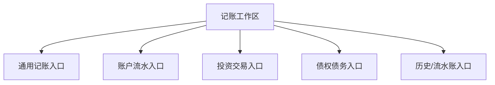

# 记账工作区证据与规格

本文档专门面向 `记账` 顶层工作区，整理当前截图、运行时 DFM、相关实体和后续验证点。顶部动态下拉结构仍是待验证项，但录入、流水、模板和专项交易能力已不再只是名称假设。

## 1. 当前证据

### 顶层入口证据

- `Moneyhome.ini` 快捷键中存在：
  - `财务数据=Ctrl+1`
  - `财务报表=Ctrl+2`
  - `财务分析=Ctrl+3`
- 顶部导航截图中已出现：
  - `记账`

### 相关窗体证据

以下窗体强烈指向“记账/流水/交易录入中心”：

- `TTransDlgFm`
- `TCashTransFm`
- `TCurrentTransFm`
- `TThirdDepositsTransFm`
- `TWasteBookFm`
- `TExpenseDlgFm`
- `TCashXferDlgFm`
- `TCashWithdrawDlgFm`
- `TClaimsTransFm`
- `TForeignTransFm`
- `TSecurityTransFm`
- `TOpenFundTransFm`
- `TFixedDepositTransFm`
- `TFuturesTransFm`
- `TGoldTransFm`
- `TInsureTransFm`
- `TSocialSecurityTransFm`
- `TMarginTransFm`
- `TMoneyTransFm`
- `TPRacTransFm`

### 相关数据实体证据

以下实体都与“记账工作区”高度相关：

- `Transaction`
- `TransactionType`
- `TransactionTheme`
- `Template`
- `Schedule`
- `DebtAccount`
- `DebtObject`
- `Security`
- `Fund`
- `PreciousMetal`
- `FuturesContract`
- `InsurancePolicy`
- `PayModeHistory`

### 运行时 DFM 直接证据

- 已解析 `TMainForm.btnAddTrans -> btnAddTransClick`
- 已解析通用交易的日期、备注、主题、保存并新添和附件操作
- 已解析日常收支的账户、项目、金额、日期、主题、备注和分期付款
- 已解析转账、分拆、批量模板、交易计划和转账计划
- 已解析 `TWasteBookFm` 的查询字段、过滤、退款、转计划和批量编辑命令
- 已解析现金、活期、第三方储值、债权债务、外汇、证券、基金、定期、期货、贵金属、融资融券、保险、社保、理财和实物资产交易页

## 2. 功能结构

根据运行时窗体边界，`记账` 工作区至少需要承载以下功能结构；顶部菜单的真实分组和顺序仍待截图确认：

### 2.1 通用记账入口

运行时 DFM 已确认：

- 收入录入
- 支出录入
- 转账录入
- 交易模板
- 交易计划

### 2.2 账户流水入口

运行时 DFM 已确认：

- 现金流水
- 活期流水
- 第三方储值流水
- 定期流水

### 2.3 投资交易入口

运行时窗体已确认：

- 外汇交易
- 证券交易
- 开放式基金交易
- 债券交易
- 期货交易
- 黄金交易
- 标准贵金属交易
- 融资融券交易

### 2.4 债权债务入口

运行时窗体已确认：

- 借入
- 借出
- 收款
- 还款
- 坏账
- 权益互换/债转股

### 2.5 历史/流水账入口

运行时 DFM 已确认：

- 流水账
- 日记账
- 过滤/查找
- 日期范围

## 3. 与其它工作区的边界

### 记账 vs 财务数据

- `财务数据`
  - 偏浏览、汇总、列表管理
- `记账`
  - 偏录入、编辑、执行动作

### 记账 vs 财务报表

- `财务报表`
  - 输出聚合结果
- `记账`
  - 写入或编辑原始交易

### 记账 vs 财务分析

- `财务分析`
  - 预算、规划、目标、诊断
- `记账`
  - 驱动预算和分析所依赖的原始交易

## 4. 候选页面与实体映射

| 候选页面 | 主要窗体 | 主要实体 |
| --- | --- | --- |
| 收入/支出 | `TExpenseDlgFm` / `TIncExp*` | `Transaction`, `Category`, `Person` |
| 转账 | `TCashXferDlgFm` | `Transaction`, `Account` |
| 现金流水 | `TCashTransFm` | `Transaction`, `Account` |
| 活期流水 | `TCurrentTransFm` | `Transaction`, `Account` |
| 第三方储值流水 | `TThirdDepositsTransFm` | `Transaction`, `Account` |
| 债权债务 | `TClaimsTransFm` / `TDebt*` | `DebtAccount`, `DebtObject` |
| 外汇 | `TForeignTransFm` | `ForeignExchangeTransaction` |
| 证券 | `TSecurityTransFm` | `SecurityTransaction`, `Quote`, `FeeRule` |
| 基金 | `TOpenFundTransFm` | `FundTransaction`, `Quote` |
| 流水账 | `TWasteBookFm` | `Transaction` |
| 日记账 | `TDiaryDlgFm` / `TDiaryUntFm` | `Transaction`, `DiaryEntry?` |

## 5. 当前最可能的实现方式

Rust 初版中，`记账` 工作区可以先做成下面三层：

1. 快捷录入层
  - 收入
  - 支出
  - 转账
2. 流水浏览层
  - 通用流水
  - 账户流水
3. 专项交易层
  - 证券/基金/外汇/债权债务等专项交易

## 6. 当前缺口

还缺：

- 顶部 `记账` 动态下拉菜单的真实分组、顺序与快捷入口
- 录入页、流水页和专项交易页的代表性截图
- 转账、分拆、退款、转计划和自动执行的真实数据结果
- 专项交易手续费、持仓成本和收益计算口径

## 7. 验证优先级

### Priority 1

- 验证通用收支、转账和分拆的真实写入结果

### Priority 2

- 补拍顶部动态下拉和通用录入/流水页面

### Priority 3

- 验证证券、基金、外汇和债权债务的代表性交易流程

### Priority 4

- 验证模板、计划、退款、转计划和附件生命周期
