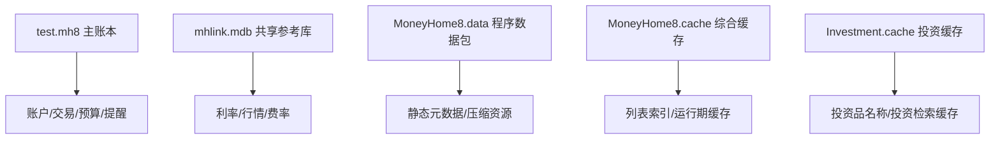

# 程序缓存与数据包排查记录

本文档记录 `MoneyHome8.data`、`MoneyHome8.cache`、`Investment.cache` 等非账本文件的取证结果，用于判断它们在整体系统中的职责。

## 1. `MoneyHome8.data`

### 基本特征

- 路径：
  - `C:\Program Files (x86)\MoneyWise\MoneyHome8\Program\MoneyHome8.data`
- 大小：
  - 约 `2.77 MB`
- 文件头：
  - `.MH8D`
- 文件头可见文本：
  - `MoneyHome8 Data`
  - `MoneyWise`
- 文件头后部可见压缩特征：
  - `78 DA`

### 当前判断

- 这不是 Jet/Access 数据库。
- 更像程序自定义的数据包或压缩资源容器。
- 可能用于承载：
  - 静态业务元数据
  - 默认字典
  - 初始配置
  - 程序运行时需要的内部结构

## 2. `MoneyHome8.cache`

### 基本特征

- 路径：
  - `C:\Program Files (x86)\MoneyWise\MoneyHome8\Program\MoneyHome8.cache`
- 大小：
  - 约 `10.61 MB`
- 文件头：
  - `MoneyHomeCache`

### 已见内容特征

- 出现大量 `_LIST` 与 `_PY` 后缀结构
- 可见大量中文投资品、基金、证券、债券类名称
- 尾部样例可见：
  - `ISA Fixed 1Yr - 20270427`
  - `ISAFIXED1YR-20270427`

### 当前判断

- 这是程序级缓存，不是主账本真相源。
- 很可能包含：
  - 投资品名称索引
  - 按类别组织的列表缓存
  - 运行时页面展示所需的快速检索数据

## 3. `Investment.cache`

### 基本特征

- 路径：
  - `C:\Program Files (x86)\MoneyWise\MoneyHome8\Program\Investment.cache`
- 大小：
  - 约 `3.19 MB`
- 文件头：
  - `MoneyHomeCache`

### 已见内容特征

- 明显聚焦投资域
- 可见大量：
  - 基金名称
  - ETF 名称
  - 证券公司名称
  - 投资类产品名称
  - 利率债、债券、指数、港股、高股息等关键词

样例：

- `180ETF基金`
- `300ETF基金`
- `Ellington投资`
- `中信证券`
- `中银证券`
- `东方金账簿货币A`
- `上银慧臻利率债债券A`

### 当前判断

- 这是投资域专用缓存。
- 很可能服务于：
  - 投资一览
  - 证券/基金/债券选择器
  - 行情对象检索
  - 投资品名称展示

## 4. 与主账本和共享库的关系

当前最合理的数据层次是：

## 5. 对重构的意义

### 5.1 不应把所有文件都当成“数据库”

- `test.mh8`
  - 更像受权限保护的 Jet 主账本
- `mhlink.mdb`
  - 更像可共享读取的参考数据库
- `.data`
  - 更像自定义数据包
- `.cache`
  - 更像展示/检索缓存

### 5.2 Rust 重构建议

- `ledger_store`
  - 面向主账本
- `reference_store`
  - 面向参考数据库
- `package_loader`
  - 面向 `.data` 包解析
- `cache_loader`
  - 面向 `.cache` 读取与索引恢复

## 6. 待验证问题

- `.MH8D` 数据包是否可直接 zlib 解压出结构化内容
- `MoneyHome8.cache` 与 `Investment.cache` 的记录格式是否一致
- `_LIST` / `_PY` 后缀在缓存协议中的精确定义
- 缓存中的投资品是否完全来自 `mhlink.mdb`，还是包含额外外部源
