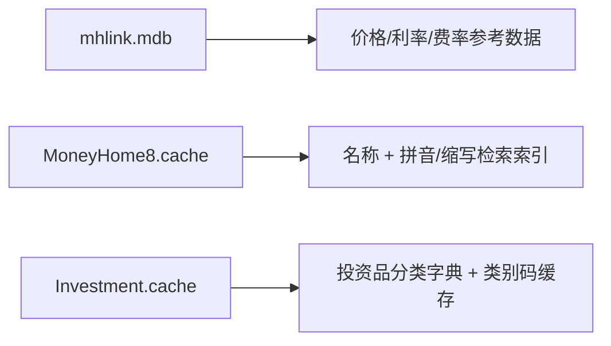

# Cache 语义推断

本文档基于 `MoneyHome8.cache` 与 `Investment.cache` 的字符串样本，对其结构语义做当前最合理的技术推断。

说明：

- 本文包含“已确认事实”和“基于样本的推断”两层信息。
- 所有推断都以当前样本为依据，不等同于协议已完整逆向。

## 1. `MoneyHome8.cache`

### 1.1 已确认事实

- 文件头为 `MoneyHomeCache`
- 可见大量形如：
  - `<代码>_PY`
  - `<名称>_PY`
  - `<代码>_LIST`
  - `<名称>_LIST`
- 典型样本：

```text
600030_PY
中信证券_PY
ZXZQ
ZXZX
600030…中信证券_LIST…600030…中信证券…ZXZQ…ZXZX
```

```text
400005_PY
东方金账簿货币A_PY
DFJZBHBA
400005…东方金账簿货币A_LIST…400005…东方金账簿货币A…DFJZBHBA
```

```text
502040_PY
上证50LOF基金_PY
SZ50LOFJJ
502040…上证50LOF基金_LIST…502040…上证50LOF基金…SZ50LOFJJ
```

### 1.2 当前推断

#### `_LIST`

更像“展示记录”：

- 原始代码
- 显示名称
- 附加检索键

#### `_PY`

更像“检索索引”：

- 代码索引
- 中文名称索引
- 拼音首字母或缩写

#### 拼音/缩写索引证据

例如：

- `中信证券` -> `ZXZQ`
- `东方金账簿货币A` -> `DFJZBHBA`
- `上证50LOF基金` -> `SZ50LOFJJ`

这强烈说明 `_PY` 并不只是随意后缀，而是服务于拼音/缩写搜索。

### 1.3 对功能的意义

这类缓存很可能支撑：

- 投资品搜索下拉框
- 按代码搜索
- 按中文名称搜索
- 按拼音首字母搜索
- 列表页快速渲染

## 2. `Investment.cache`

### 2.1 已确认事实

- 文件头同样为 `MoneyHomeCache`
- 样本中大量出现：
  - `<代码>_3`
  - `<代码>_4`
  - `<代码>_9`
- 同时可见紧随其后的中文产品名

典型样本：

```text
7502040_3 上证50LOF基金
7502048_3 上证50LOF
```

```text
900013_4 中信证券品质生活混合A
013013_4 中银证券科技创新混合
```

```text
400005_9 东方金账簿货币A
```

### 2.2 当前推断

`Investment.cache` 更像“投资品字典 + 类别编码”的缓存。

#### `_3`

高概率对应：

- LOF
- ETF
- 场内基金
- 指数/证券化基金类对象

证据：

- `上证50LOF基金`
- `钢铁LOF`
- `券商LOF`

#### `_4`

高概率对应：

- 场外基金
- 混合/股票/债券类基金产品
- 证券公司发行的基金产品

证据：

- `中信证券品质生活混合A`
- `中银证券科技创新混合`
- `诺安中证500指数增强A`

#### `_9`

高概率对应：

- 货币基金
- 现金管理类产品

证据：

- `东方金账簿货币A`
- `银华货币市场B`
- `南方现金通货币A`

### 2.3 对功能的意义

`Investment.cache` 很可能支撑：

- 投资品分类浏览
- 基金/货币/LOF/ETF 等产品筛选
- 投资录入时的标的选择
- 投资一览页的对象名称反查

## 3. 与共享参考库的关系

当前最合理的关系是：



推断：

- `mhlink.mdb` 更偏“数值参考”
- `.cache` 更偏“名称索引与列表加速”

## 4. 对 Rust 重构的直接影响

- 投资品选择器不要只支持代码匹配。
- 至少需要支持：
  - 名称检索
  - 拼音首字母检索
  - 代码检索
  - 类别筛选
- 缓存层与参考库应分离：
  - `reference_store` 提供数值
  - `cache_store` 提供索引和名称映射

## 5. 待验证问题

- `_PY` 是否总是“拼音缩写”，还是也包含英文缩写/内部别名
- `_LIST` 记录中各字段的精确分隔规则
- `_3 / _4 / _9` 的正式类别枚举含义
- `Investment.cache` 中是否还包含未在 `mhlink.mdb` 出现的离线对象元数据
