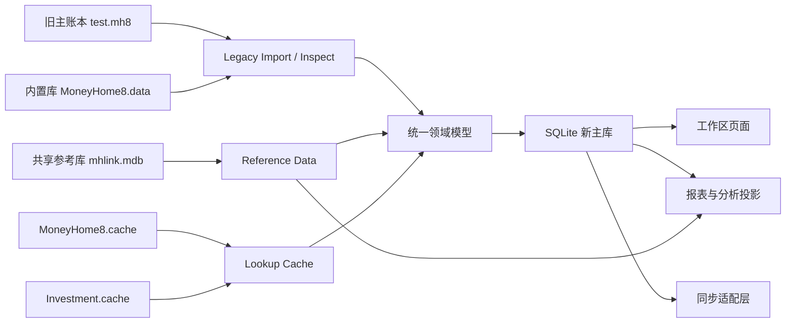
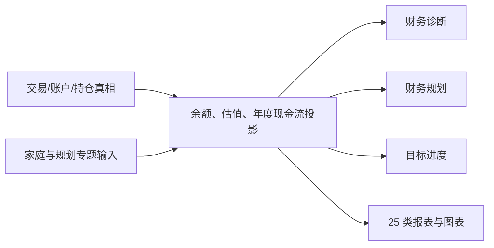

# MoneyHome8 跨模块数据流总表

本文档把当前已知的数据流从“单场景描述”进一步提升为“跨模块总表”，重点回答：

1. 某类数据从哪里来
2. 在哪些模块之间流转
3. 最终驱动什么页面、统计或同步动作
4. Rust 重构时哪些边界必须拆开

依赖文档：

- [data-source-map.md](C:\DCG-SZ\SZ-System-Docs\CodexWorkSpace\Finance-own\docs\data-source-map.md)
- [scenario-data-flows.md](C:\DCG-SZ\SZ-System-Docs\CodexWorkSpace\Finance-own\docs\scenario-data-flows.md)
- [entity-flow-map.md](C:\DCG-SZ\SZ-System-Docs\CodexWorkSpace\Finance-own\docs\entity-flow-map.md)
- [migration-strategy.md](C:\DCG-SZ\SZ-System-Docs\CodexWorkSpace\Finance-own\docs\migration-strategy.md)
- [local-database-selection.md](C:\DCG-SZ\SZ-System-Docs\CodexWorkSpace\Finance-own\docs\local-database-selection.md)
- [runtime-dfm-functional-evidence.md](C:\DCG-SZ\SZ-System-Docs\CodexWorkSpace\Finance-own\docs\runtime-dfm-functional-evidence.md)

## 1. 总结论

当前最稳定的数据流判断是：

- 原软件不是“一个账本文件 + 一套页面”
- 而是“主账本 + 参考库 + 内置库 + 缓存 + 认证上下文 + 同步/通知协议”的复合型系统

这意味着 Rust 重构必须至少拆成下面几层：

1. `legacy_import`
2. `reference_data`
3. `lookup_cache`
4. `app_store`
5. `analytics_projection`
6. `sync_adapter`

如果不这样拆，后续会很容易把：

- 旧格式兼容
- 本地新库
- 行情/费率/汇率
- 搜索缓存
- 同步状态

全部揉成一个难维护的大仓储。

## 2. 数据流总图

## 3. 核心数据流总表

| 数据主题 | 来源 | 流转路径 | 典型使用方 | Rust 边界建议 | 当前缺口 |
| --- | --- | --- | --- | --- | --- |
| 账本元数据 | `test.mh8`、`Moneyhome.ini` | 打开账本 -> 当前账本上下文 -> 最近账本/默认账本 | 启动页、文件菜单 | `ledger_context` | 旧账本正式认证 |
| 账户与账户组 | 主账本核心表 | 导入/读取 -> 账户树 -> 汇总计算 | 账户中心、报表、目标、提醒 | `accounts` | 正式表结构与样例 |
| 分类、标签、人员、币种 | 主账本核心表 + 内置字典 | 导入/读取 -> 交易录入/统计聚合 | 记账、报表、预算、同步 | `master_data` | 正式表结构 |
| 通用交易 | 主账本交易表 / 新 SQLite 主库 | 录入/模板/计划 -> 交易分录与拆分 -> 余额重算 -> 流水投影 -> 报表/预算/提醒 | 记账、财务记录、报表、预算 | `transactions` | 正式样例与旧计算口径 |
| 债权债务与信用 | 主账本专项对象 | 专项录入 -> 统计 -> 提醒/账单日 | 债务页、信用卡页、报表 | `debts_credit` | 真实样例与字段 |
| 投资对象主数据 | 主账本对象表 + 缓存 | 检索 -> 选择标的 -> 交易录入 | 证券/基金/外汇/理财等 | `investments.catalog` | 正式对象表与 UI 流程 |
| 行情 | `mhlink.mdb.TBSecuPrice` | 行情读取 -> 持仓估值 -> 投资报表/提醒 | 投资一览、投资报表、提醒 | `reference_data.quote_repo` | 与主账本真实关联方式 |
| 利率 | `mhlink.mdb.HBRate` | 规则读取 -> 收益试算/到期金额 | 定期、理财、债务 | `reference_data.rate_repo` | 与具体交易字段的正式映射 |
| 费率 | `mhlink.mdb.TBTransFee` | 费率读取 -> 手续费计算 | 证券、基金、部分理财交易 | `reference_data.fee_repo` | 费率套用规则细节 |
| 名称/拼音搜索索引 | `MoneyHome8.cache` | 搜索关键字 -> 代码/名称命中 -> 标的候选 | 投资选择器 | `lookup_cache.search_repo` | 协议布局细节 |
| 投资类别字典 | `Investment.cache` | 类型码 -> 目录分类 -> UI 筛选 | 投资录入、投资统计 | `lookup_cache.catalog_repo` | `_3/_4/_9` 官方定义 |
| 预算 | 主账本预算对象 + 交易聚合 | 预算规则 -> 交易汇总 -> 已用/剩余 | 财务预算、提醒、分析 | `planning.budget` | 预算表单与正式字段 |
| 提醒 | 主账本提醒对象 + 通知配置 | 提醒规则 -> 本地提醒/远程上报 | 计划提醒、限额提醒、今日提醒 | `planning.reminder` | 本地持久化与远端回写细节 |
| 财务规划 | `TFP*` 专题输入 + 账户数据 | 家庭/年度输入 -> 年度预测 -> 规划结果 | 财务规划、目标 | `planning.forecast` | 规划算法、结果模型与真实样例 |
| 目标储蓄 | 目标对象 + 目标账户关系 + 余额/市值 | 目标规则 -> 账户绑定 -> 余额/估值聚合 -> 进度展示 | 财务目标 | `planning.goal` | 进度口径与真实样例数据 |
| 报表投影 | 交易、账户、估值、预算 | 公共筛选 -> 25 类查询投影 -> 表格/图表 -> 导出/打印 | 财务报表、财务分析 | `reports` | 动态结果列、排序分组、事件公式和导出格式 |
| 导入导出 | 通用交换文件、交割单、信用卡账单、报表投影 | 来源 -> 原始行暂存 -> 映射 -> 预览校验 -> 幂等提交/导出 DTO | 导入页、迁移工具、报表 | `import_export` | 通用 XML 完整回导语义、其余旧文件格式和动态结果 |
| 备份还原 | SQLite 主账簿、附件目录、备份策略 | 一致性快照 -> 完整性/哈希校验 -> 清单 -> 保留/压缩 -> 新账簿或覆盖还原 | 账簿菜单、系统设置 | `backup_restore` | 旧压缩格式、默认数量和命名规则 |
| 附件 | 发票、收银条、存折、照片、视频、截图和文档 | 受管复制 -> 哈希 -> 元数据 -> 业务关系 -> 预览/打开 -> 解除关系 -> 最后引用删除 | 交易、账户和附件对话框 | `attachments` | 账户样例已确认旧 `账簿名/Account/账户 ID` 目录、动态菜单和最后文件清理；共享引用、交易传播和故障回滚待补 |
| 同步对象 | 账户、分类、人员、标签、交易、余额等 | 本地真相 -> DTO -> 双向合并/单向覆盖 -> 冲突和批次日志 | 登录、同步、通知 | `sync_adapter` | 旧服务协议、冲突算法和认证链 |

## 4. 最重要的跨模块依赖

## 4.1 交易是最大的中心数据流

几乎所有业务最终都围绕交易流转：

- 账户余额依赖交易
- 预算执行依赖交易
- 报表依赖交易
- 投资持仓变化依赖交易
- 目标进度依赖交易
- 同步中最重的对象之一也是交易

因此 Rust 里必须把交易当作中心域，而不是页面附属对象。

运行时 DFM 进一步确认交易投影至少需要：

- 双日期：`TransDate`, `FakeTransDate`
- 账户双端：`AcctNo1`, `AcctNo2`
- 收入/支出与本币折算：`IncAmount`, `ExpAmount`, `IncLocal`, `ExpLocal`
- 分类、对象、标签、备注、附件和状态

这些是旧格式迁移映射，不要求新 SQLite 沿用同名字段。新库应使用交易头、账户分录和分类拆分行表达同一语义，并在单事务中完成转账及手续费写入。

## 4.2 账户与估值共同决定资产视图

资产负债并不只来自账户余额：

- 现金/活期/定期类更接近余额口径
- 证券/基金/黄金等要结合行情估值
- 债权债务还涉及本金、利息和状态

所以：

- `accounts`
- `investments`
- `reference_data`

三层必须协同，但不能硬耦合。

## 4.3 缓存层不是主数据真相源

当前最稳的判断是：

- `MoneyHome8.cache`
  - 主要解决检索体验
- `Investment.cache`
  - 主要解决分类与候选集

它们很重要，但不应被当作最终业务真相表。

因此重构时要避免：

- 直接把缓存文件当主业务库
- 把缓存字段命名传播到全部领域对象

## 4.4 同步层应当建立 DTO 边界

原软件的同步步骤已经明确分对象拆开：

- 币种
- 人员
- 标签
- 分类
- 账户
- 交易
- 默认币种
- 余额

因此 Rust 里应当：

- 领域模型保持本地语义
- 同步层单独建立远端 DTO
- 同步映射单独维护

不要让远端字段直接渗透主领域对象。

## 4.5 规划、目标与报表是独立投影链

运行时控件直接确认：

- 财务规划按家庭资料、工资、资产收支、购置、教育、退休、通胀和年度情况分专题输入
- 财务目标绑定账户集合，并以余额/市值形成进度
- 报表使用资产、人员、活动类型、分类、标签、币种/对象和金额范围作为公共筛选

因此新系统应采用：

诊断、规划、目标和报表均不得反向修改交易真相；用户修改规划输入或报表筛选时，只重建对应投影。

运行时 DFM 进一步固定了真相层与查询层的边界：

- `FakeTransDate`、`Bala`、`IncLocal`、`ExpLocal`、`TransCheck` 和 `YKRate` 属于旧程序计算/展示字段，不应作为新库真相字段回写
- 财务记录明确对本币流入、本币流出和差额求和；标签页明确对流入、流出和资产金额求和
- 证券、基金、期货、贵金属等统计窗体共同使用持仓量、成本、市值、占比、行情价、盈亏和收益率投影
- 旧程序报表数据集没有 DFM 静态 SQL，新系统应改为显式参数化查询，避免运行时拼接 SQL 成为隐含全局状态

## 4.6 数据交换必须经过暂存与审计边界

运行时窗体已直接确认：

- 整账簿导入导出共同覆盖 21 类基础资料与业务数据
- 通用导出支持日期、账户范围和“增加 / 删除并覆盖”模式
- 交割单支持 12 类交易、10 个字段、分隔符识别、映射方案、预览和批量修正
- 导入预览将“原始数据”和“准备导入的记录”分离，导入选中记录初始禁用
- 备份代码使用 `.mh8k`，并禁止源账簿与备份目标同路径；还原目标账簿使用 `.mh8`，明确警告关闭当前账簿和覆盖数据
- 附件依赖账簿名派生目录；账户样例实际复制到 `test/Account/23`，预览、打开和文件夹命令都读取受管副本，修改账簿名或目录会破坏旧版调用

因此新系统的数据流固定为：

预览、导出和同步 DTO 均不是业务真相。覆盖导入、覆盖还原和单向上传必须明确影响范围并生成可恢复快照。

## 4.7 事件命令必须经过应用边界

[runtime-event-command-dataflow.md](C:\DCG-SZ\SZ-System-Docs\CodexWorkSpace\Finance-own\docs\runtime-event-command-dataflow.md) 已把 `2000` 个旧处理器逐项映射为应用命令候选、数据方向和 Rust 边界，并解析出 `159` 条精确命名调用边。该目录用于保证旧按钮、菜单、快捷键和生命周期事件不会在重构时静默丢失。

分类是需求拆分候选，不替代动态副作用证据。`command_handler`、`domain_command_handler`、`import_pipeline`、`persistence_service` 和 `integration_adapter` 必须进入应用层；输入、绘制、尺寸和生命周期事件默认留在展示层，只有代码或运行结果证明副作用后才能升级。

破坏性操作和文件流程的直接代码合同见 [runtime-destructive-and-file-operation-contract.md](C:\DCG-SZ\SZ-System-Docs\CodexWorkSpace\Finance-own\docs\runtime-destructive-and-file-operation-contract.md)。账户删除、账户组解除关系、基础资料引用保护、批量删除、模板覆盖、备份、还原和导出均已有明确提示或格式证据。

## 5. Rust 重构时最应该固定的模块边界

## 5.1 旧账本导入边界

推荐职责：

- 打开旧账本
- 检查认证状态
- 枚举可见结构
- 映射为统一实体

不应承担：

- 新系统长期主写入职责

## 5.2 新主库存储边界

推荐职责：

- 承担全部新增、编辑、删除
- 维护可审计的统一实体
- 为报表和同步提供稳定来源

推荐存储：

- `SQLite`

## 5.3 参考数据边界

推荐职责：

- 行情
- 费率
- 利率

不应承担：

- 用户主业务写入

## 5.4 缓存边界

推荐职责：

- 搜索
- 代码/名称/拼音检索
- 投资品目录筛选

不应承担：

- 持仓真相
- 交易真相

## 5.5 报表边界

推荐职责：

- 聚合查询
- 列表报表
- 趋势图表
- 分析视图
- 为表格与图表提供同一结果 DTO
- 提供流水、账户余额、投资持仓、已实现盈亏和标签两类稳定投影

不应承担：

- 反向决定业务真相

## 6. 当前哪些数据流已经足够指导实现

已经足够指导 Phase 1/2 的：

- 账户中心数据流
- 通用记账数据流
- 预算与提醒数据流
- 参考库与缓存数据流
- 基础报表投影数据流

已经足够指导 Phase 3 的：

- 证券/基金/外汇估值流
- 同步对象分层思路
- 规划/目标专题输入、账户绑定和年度投影边界
- 25 类报表的公共筛选与表格/图表双视图
- `38` 个交易/统计窗体的字段投影与显示精度
- `20` 个计算字段、`6` 条求和规则和 `2` 条历史盈亏页脚绑定
- 整账簿导入导出、交割单映射、备份还原、附件和同步的模块边界与验收规则
- AI 外部请求必须经过默认关闭的适配器，只接收用户主动输入；控制台日志与命令历史独立于账本真相数据，不参与备份和同步
- `2000` 个旧事件的应用命令/展示状态候选、`159` 条命名调用边，以及账户删除、批量删除、`.mh8k` 备份和覆盖还原的事务边界

仍需补证后再定细节的：

- `test.mh8` 正式认证后的真实主表关系
- 通用账簿交换、信用卡账单和报表导出的实际文件格式
- 交割单日期、负数、千分位、空值和去重的运行结果
- 旧附件在交易等其它对象上的目录命名、共享引用、批量删除和故障中断行为
- 旧同步协议、冲突与删除传播结果
- 财务规划算法和真实结果模型
- 诊断指标、投资收益率和运行时代码生成的报表公式
- AI 动态入口、控制台命令参数/副作用和金额计算器回填结果；外部字段、命令类和关闭行为已由方法代码确认

## 7. 当前对“数据流是否已理清”的判断

如果问题是：

- “这些模块之间谁依赖谁”
- “哪些数据来自主账本，哪些来自参考库和缓存”
- “新系统应该怎样拆边界”

那么当前回答已经可以认为：`大部分理清`

如果问题是：

- “旧主账本中每张真实表如何精确关联”

那么当前仍是：`未完全完成`

核心缺口仍然是：

1. `test.mh8` 正式认证
2. 主账本正式表结构与样例数据

## 8. 对后续的直接建议

后续如果进入正式实现，建议按下面顺序固化代码边界：

1. `legacy_import`
2. `reference_data`
3. `lookup_cache`
4. `app_store(SQLite)`
5. `reports`
6. `sync_adapter`

这样最符合当前证据，也最不容易被旧格式历史包袱拖住。
