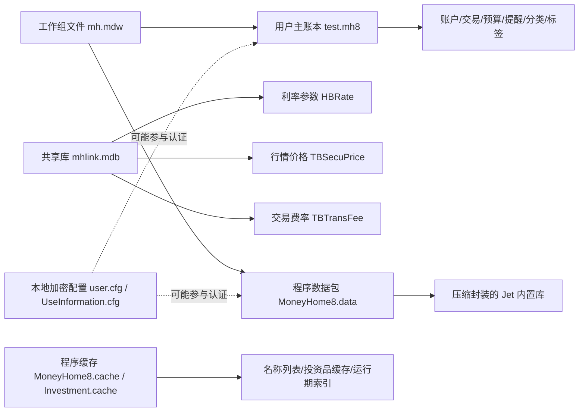

# MoneyHome8 数据源地图

本文档总结当前已识别的数据源及其职责边界，用于指导 Rust 重构时的存储层设计。

## 1. 当前已识别的数据源

### 1.1 用户主账本

- 文件：`C:\DCG-SZ\IT Manage\Private\Personal-Docs\test.mh8`
- 证据：
  - 文件头包含 `Standard Jet DB`
  - 文件尾包含 `mhlink.mdb` 路径片段
  - 被 `MoneyHome8.exe` 打开时会产生文件占用
  - 关闭主程序后直接访问会进入工作组认证/权限错误

当前判断：

- `test.mh8` 是用户主账本
- 应包含账户、交易、分类、标签、预算、提醒等用户业务数据
- 访问受工作组文件 `mh.mdw` 与应用认证链控制
- 已实测确认文件头为 `Standard Jet DB`
- 从主账本 UTF-16 字节流中已可直接看到大量 `TB*` 业务对象名，涵盖：
  - 账户与账户组
  - 交易与流水
  - 分类、币种、人员
  - 债权债务
  - 预算与提醒
  - 规划与目标
  - 证券、基金、同步记录等扩展对象

### 1.2 共享链接库

- 文件：`C:\Program Files (x86)\MoneyWise\MoneyHome8\Data\mhlink.mdb`
- 证据：
  - 文件头同样包含 `Standard Jet DB`
  - 可被 ODBC 直接只读打开
  - 已成功枚举用户表和字段

当前判断：

- `mhlink.mdb` 不是用户主账本，而是程序共享参考库
- 至少承载以下共享数据：
  - 定期利率参数
  - 证券/基金/债券行情价格
  - 交易手续费率配置
- `test.mh8` 中已多次出现 `mhlink.mdb` 完整路径，且伴随 `Connect / Database / Tables / MSysRelationships` 等元数据词，说明 `mhlink.mdb` 高概率通过链接表或等价外部连接机制参与主账本运行

### 1.3 程序数据包

- 文件：`C:\Program Files (x86)\MoneyWise\MoneyHome8\Program\MoneyHome8.data`

证据：

- 文件头标识为 `.MH8D`
- 文件头中直接出现 `MoneyHome8 Data`、`MoneyWise`
- 二进制头部紧跟压缩特征 `78 DA`

当前判断：

- 这不是 Jet 数据库，而是程序自定义的数据包
- 很可能承载：
  - UI/业务元数据
  - 默认配置或静态字典
  - 需要解压或反序列化的内部结构
- 进一步实测发现：
  - 在偏移 `125` 处可 `zlib` 解压出一份约 `4.58 MB` 的 Jet 数据库
  - 解压后的数据库同样需要工作组认证
  - 当加入 `SystemDB=...\\mh.mdw` 时，错误也收敛为“不是有效的账户名称或密码”

因此更合理的判断是：

- `MoneyHome8.data` 不是简单资源包
- 它更像“压缩封装的受控 Jet 内置库”
- 很可能用于承载程序默认业务字典、系统初始数据或内置对象库
- 从解压库字节流中已可见大量 `TB*` 对象名，涵盖：
  - 账户组/账户类型
  - 交易流水
  - 分类、币种、人员
  - 债权债务
  - 预算、提醒、报表设置
  - 财务规划、目标
  - 证券、基金、期货、贵金属、融资融券等扩展投资域

### 1.4 程序缓存库

- 文件：
  - `C:\Program Files (x86)\MoneyWise\MoneyHome8\Program\MoneyHome8.cache`
  - `C:\Program Files (x86)\MoneyWise\MoneyHome8\Program\Investment.cache`

证据：

- 两者都以 `MoneyHomeCache` 开头
- `MoneyHome8.cache` 中可见大量 `_LIST`、`_PY` 结构标记
- `Investment.cache` 中可见大量证券、基金、投资类名称

当前判断：

- `MoneyHome8.cache` 更像综合业务缓存或字典缓存
- `Investment.cache` 更像投资品名称、列表或行情关联缓存
- 这两者属于“程序运行加速层”，不是用户主账本真相源

### 1.5 工作组/权限文件

- 文件：`C:\Program Files (x86)\MoneyWise\MoneyHome8\Program\mh.mdw`

当前判断：

- `mh.mdw` 参与 Access/Jet 工作组安全控制
- 不是普通公开查询库
- 仅加入 `SystemDB` 就能把错误从“无权限”推进为“账号或密码无效”

### 1.6 本地加密配置

- 文件：
  - `C:\Program Files (x86)\MoneyWise\MoneyHome8\Program\user.cfg`
  - `C:\Program Files (x86)\MoneyWise\MoneyHome8\Program\UseInformation.cfg`

当前判断：

- 这两个文件中存在 Base64 风格密文
- 解码后仍为高熵二进制
- 很可能存放：
  - 登录态
  - 应用自定义加密参数
  - 设备绑定或认证材料

## 2. 已确认的共享参考表

### 2.1 `HBRate`

字段：

- `ID`
- `CurrType`
- `DepoType`
- `DepoTime`
- `ARate`

样例含义：

- 不同币种
- 不同存款类型
- 不同期限
- 对应利率值

数据量：

- `113` 行

### 2.2 `TBSecuPrice`

字段：

- `ID`
- `SecuCode`
- `PriceDate`
- `Price`
- `ObjectQuant`
- `CurrType`
- `ObjType`

样例含义：

- 标的代码
- 价格日期
- 行情价格
- 计价单位
- 币种
- 对象类型

当前已知类型推断：

- `ObjType = 4`
  - 高可信对应场外基金/公募基金产品
- `ObjType = 3`
  - 高可信对应交易型市场标的
  - 包括股票、ETF、LOF、REIT、指数、新股、部分海外证券
- `ObjType = 10`
  - 高可信对应贵金属/黄金白银现货及延期品种
- `ObjType = 100000`
  - 更像系统内部标识记录

当前已知币种推断：

- `CurrType = 1`
  - 高可信对应人民币
- `CurrType = 2`
  - 高可信对应美元
- `CurrType = 8`
  - 特殊市场/币种值，待进一步确认

数据量：

- `12207` 行

时间跨度：

- 最早：`2020-06-22`
- 最晚：`2026-04-29`

### 2.3 `TBTransFee`

字段：

- `ID`
- `Type`
- `YJFL`
- `YHSL`
- `YHSL_SELL`
- `ZDYJ`
- `GHF`
- `FJF`
- `JSFL`
- `JSFSX`
- `JYGF`
- `YJFL_SELL`
- `ZDYJ_SELL`

样例含义：

- 不同交易类型对应的佣金率、印花税、过户费、附加费、结算费等费率口径

数据量：

- `11` 行

## 3. 当前数据边界判断

## 4. 对 Rust 重构的直接影响

### 4.1 存储层不能只设计一个数据库适配器

至少需要区分：

- `ledger_store`
  - 面向用户账本
- `reference_store`
  - 面向共享参考参数与行情
- `package_store`
  - 面向程序内置数据包与静态资源
- `cache_store`
  - 面向运行时列表缓存与投资品索引
- `auth_context`
  - 面向工作组/本地加密配置

### 4.2 行情、利率、费率不应硬编码

Rust 版至少需要独立的参考数据模块：

- 利率表
- 行情表
- 交易费率表
- 投资品名称/索引缓存

### 4.3 主账本与参考库可能存在引用关系

例如：

- 证券/基金交易需要引用 `TBSecuPrice`
- 定期与理财统计可能引用 `HBRate`
- 买卖、赎回、融资融券等场景可能引用 `TBTransFee`
- 投资一览、证券列表、基金列表等页面可能还会引用 `.cache` 中的名称索引

## 5. 待验证问题

- `test.mh8` 是否直接通过 Access 链接表方式引用 `mhlink.mdb`
- `mh8` 中是否还保存了一份本地缓存的费率/行情快照
- `CurrType`、`ObjType`、`Type` 的枚举映射表位于主账本、共享库还是程序资源中
- 交易表和参考表之间的真实关联键是什么
