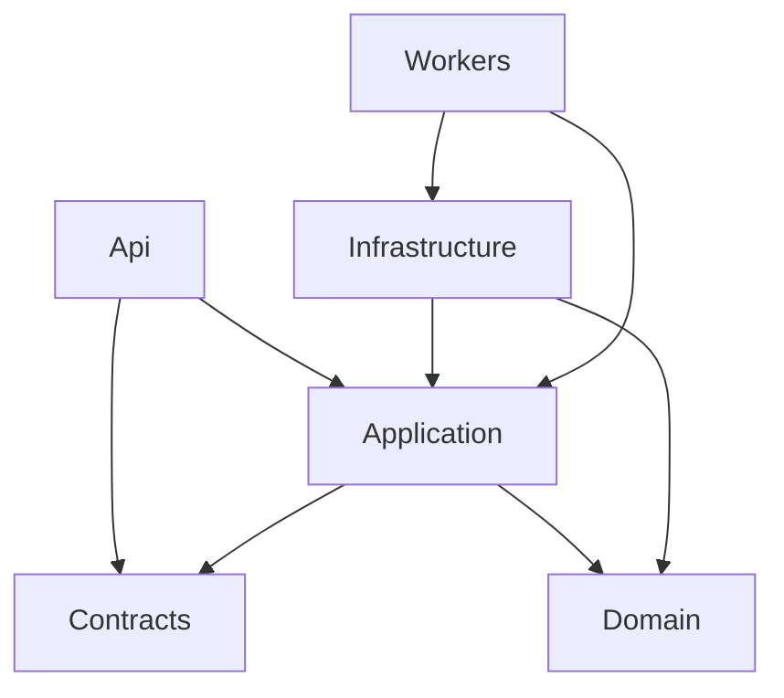

# .NET 后端目录结构设计

> 状态：当前实施参考。第一版云端服务采用 .NET，配合 PostgreSQL 保存新系统财务对象副本并协调三端同步；Rust 仅作为 PC 本地核心和旧格式迁移模块。

本文档给出 `Finance Own` 的 `.NET` 后端建议目录结构，目标是：

1. 后端完全自主可控
2. 支撑 Flutter 三端
3. 支撑本地离线 + 云端同步
4. 与 Rust 旧格式导入工具保持清晰边界

## 1. 设计原则

- 后端负责：
  - 认证
  - 同步
  - 云端对象副本与同步协调
  - 报表聚合查询
  - 文件与附件元数据
  - 行情/费率/利率服务
- 后端不负责：
  - 直接解析旧 `mh8`
  - 直接解析 `MoneyHome8.data`
  - 直接解析 `.cache`

这些旧格式工作应交给：

- PC 端 Rust 本地核心
- PC 端本地迁移流程

## 2. 推荐仓结构

```text
backend/
1. FinanceOwn.sln
2. src/
   2.1 FinanceOwn.Api/
   2.2 FinanceOwn.Application/
   2.3 FinanceOwn.Domain/
   2.4 FinanceOwn.Infrastructure/
   2.5 FinanceOwn.Contracts/
   2.6 FinanceOwn.Workers/
3. tests/
   3.1 FinanceOwn.Api.Tests/
   3.2 FinanceOwn.Application.Tests/
   3.3 FinanceOwn.Domain.Tests/
   3.4 FinanceOwn.Infrastructure.Tests/
4. tools/
5. docs/
```

## 3. 各项目职责

### 3.1 `FinanceOwn.Api`

职责：

- 提供 HTTP API
- 认证入口
- 参数校验
- 路由和版本管理
- 错误码转换

建议目录：

```text
FinanceOwn.Api/
1. Program.cs
2. Extensions/
3. Middleware/
4. Controllers/ 或 Endpoints/
5. Filters/
6. Auth/
7. OpenApi/
8. Config/
```

建议接口分组：

- `Auth`
- `Sync`
- `Accounts`
- `Transactions`
- `Investments`
- `Budgets`
- `Reminders`
- `Reports`
- `Files`
- `Imports`
- `Settings`

### 3.2 `FinanceOwn.Application`

职责：

- 用例编排
- 事务边界
- 命令 / 查询处理
- 同步流程
- 报表聚合

建议目录：

```text
FinanceOwn.Application/
1. Abstractions/
2. Accounts/
3. Transactions/
4. Investments/
5. Budgets/
6. Reminders/
7. Planning/
8. Goals/
9. Reports/
10. Sync/
11. Files/
12. Imports/
13. Settings/
14. Common/
```

每个业务域再按 CQRS 风格拆：

```text
Accounts/
1. Commands/
2. Queries/
3. Dtos/
4. Validators/
5. Handlers/
```

### 3.3 `FinanceOwn.Domain`

职责：

- 领域实体
- 值对象
- 枚举
- 领域服务
- 领域规则

建议目录：

```text
FinanceOwn.Domain/
1. Common/
2. Accounts/
3. MasterData/
4. Transactions/
5. DebtsCredit/
6. Investments/
7. Budgets/
8. Reminders/
9. Planning/
10. Goals/
11. Sync/
12. Reports/
```

建议实体先从这些开始：

- `AccountGroup`
- `Account`
- `Category`
- `Currency`
- `Person`
- `Transaction`
- `Budget`
- `Reminder`
- `Goal`
- `Security`
- `Fund`
- `Quote`
- `RateRule`
- `FeeRule`
- `SyncRecord`

### 3.4 `FinanceOwn.Infrastructure`

职责：

- PostgreSQL
- 文件存储
- 缓存
- 外部行情适配
- 同步状态持久化
- Token 存储

建议目录：

```text
FinanceOwn.Infrastructure/
1. Persistence/
2. Repositories/
3. EntityConfigurations/
4. Migrations/
5. Authentication/
6. Sync/
7. Storage/
8. Quotes/
9. Clock/
10. Serialization/
```

#### `Persistence/`

建议内容：

- `FinanceOwnDbContext`
- 数据库连接配置
- PostgreSQL provider 初始化

#### `Repositories/`

建议拆法：

- `AccountRepository`
- `TransactionRepository`
- `BudgetRepository`
- `ReminderRepository`
- `InvestmentRepository`
- `SyncRepository`

#### `Storage/`

职责：

- 附件元数据
- 文件落盘或对象存储
- 导出文件任务状态

### 3.5 `FinanceOwn.Contracts`

职责：

- API DTO
- 请求/响应模型
- 错误码模型
- 同步协议模型

建议目录：

```text
FinanceOwn.Contracts/
1. Auth/
2. Accounts/
3. Transactions/
4. Investments/
5. Budgets/
6. Reminders/
7. Reports/
8. Sync/
9. Files/
10. Common/
```

说明：

- 这个项目可以同时被：
  - `Api`
  - `Application`
  - Flutter OpenAPI 生成脚本
  使用

### 3.6 `FinanceOwn.Workers`

职责：

- 后台任务宿主
- 行情刷新
- 同步清理
- 通知派发
- 导出任务执行

建议目录：

```text
FinanceOwn.Workers/
1. Program.cs
2. Jobs/
3. Schedulers/
4. HostedServices/
5. Config/
```

## 4. 项目间依赖建议



原则：

- `Domain` 不依赖其它项目
- `Application` 不依赖 `Infrastructure`
- `Infrastructure` 实现 `Application` 抽象
- `Api` 只做暴露层，不写业务规则

## 5. 本地/云端边界

### 后端管理的对象副本与协调状态

- 云端 PostgreSQL 新系统财务对象副本
- 同步批次
- 用户身份
- 附件元数据
- 共享参考数据快照

### 后端不直接管理的本地来源

- PC 本地 SQLite 运行态
- 手机端本地草稿、待同步队列和缓存
- 旧 `mh8` 文件
- 本地导入中间文件

## 6. 同步模块建议

建议在 `Application/Sync` 下拆成：

```text
Sync/
1. Commands/
   1.1 PushChanges/
   1.2 ResolveConflict/
2. Queries/
   2.1 PullChanges/
   2.2 GetSyncStatus/
3. Dtos/
4. Services/
   4.1 SyncOrchestrator
   4.2 ConflictResolver
   4.3 TombstoneService
```

在 `Infrastructure/Sync` 下拆成：

```text
Sync/
1. SyncBatchStore/
2. SyncCursorStore/
3. SyncConflictStore/
4. SyncTombstoneStore/
```

## 7. 报表模块建议

报表不要直接从 Controller 拼 SQL。

建议：

```text
Reports/
1. Queries/
   1.1 GetIncomeExpenseReport/
   1.2 GetBalanceSheetReport/
   1.3 GetInvestmentReport/
   1.4 GetTagSummaryReport/
2. Projections/
3. Dtos/
4. Filters/
```

说明：

- 报表层要和 `Flutter` 左侧报表导航一一对应
- 表格/图表共用同一查询 DTO

## 8. 投资模块建议

建议在 `Application/Investments` 下按子域拆：

```text
Investments/
1. Securities/
2. Funds/
3. ForeignExchange/
4. Bonds/
5. PreciousMetals/
6. Futures/
7. Financing/
8. Assets/
9. Insurance/
10. SocialSecurity/
11. Shared/
```

`Shared/` 负责：

- 行情引用
- 费率计算
- 市值计算
- 持仓快照

## 9. 导入模块建议

虽然旧格式解析由 Rust 工具负责，但后端仍需要导入业务编排：

```text
Imports/
1. Commands/
   1.1 StartImportBatch/
   1.2 ConfirmImportBatch/
2. Queries/
   2.1 GetImportPreview/
3. Dtos/
4. Services/
   4.1 ImportBatchService
   4.2 ImportPreviewService
```

后端只处理：

- 预览结果接收
- 校验结果落库
- 确认导入后的正式写入

不直接承担：

- `mh8` 字节级解析

## 10. 配置建议

建议配置分层：

```text
appsettings.json
appsettings.Development.json
appsettings.Staging.json
appsettings.Production.json
```

配置项建议包括：

- PostgreSQL
- JWT
- File Storage
- Quote Provider
- Sync
- Logging

## 11. 首批最值得创建的项目

如果现在开始建后端，我建议最先创建：

1. `FinanceOwn.Api`
2. `FinanceOwn.Application`
3. `FinanceOwn.Domain`
4. `FinanceOwn.Infrastructure`
5. `FinanceOwn.Contracts`

然后先打通：

- 账户树查询
- 交易查询
- 交易写入
- 分类/币种查询
- 同步 push/pull 骨架

## 12. 当前建议结论

如果你现在就开工后端目录，我建议按这份结构直接搭建。

这样后面：

- Flutter 三端
- PostgreSQL
- SQLite 同步
- Rust 导入工具

都能自然接上。*** End Patch
"]} to=functions.apply_patch code
