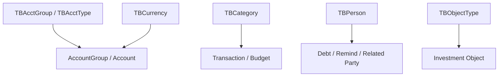
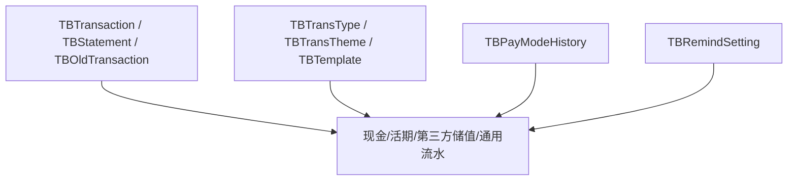
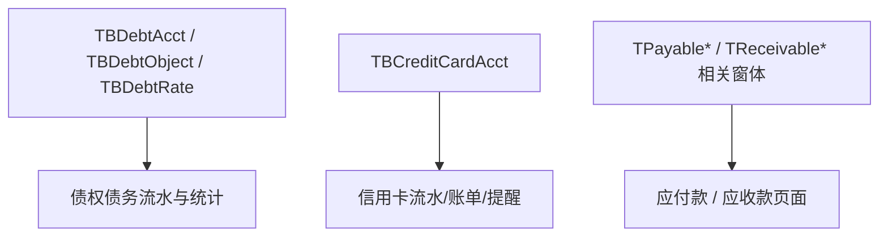
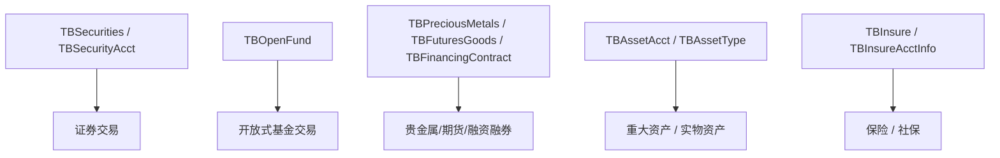
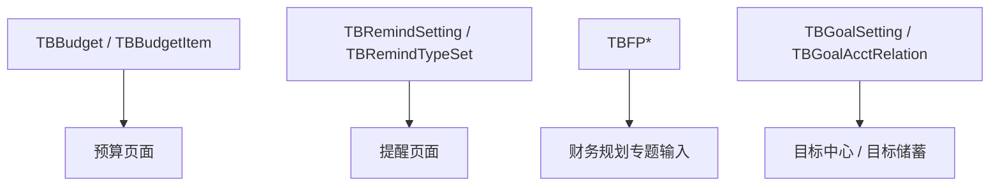
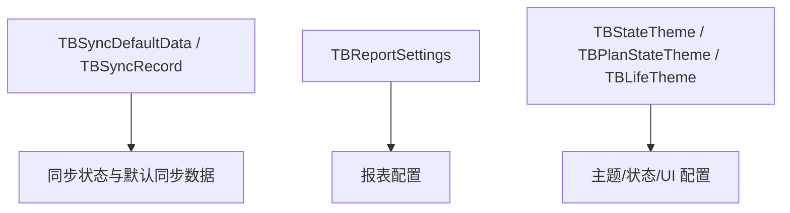
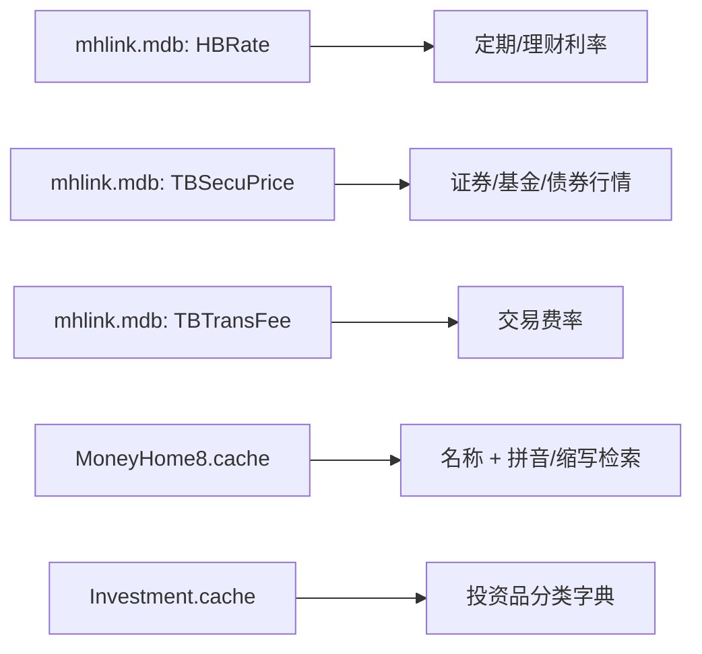

# 实体与数据流映射

本文档将当前已发现的表名候选、参考库表、缓存语义与功能域组合起来，形成一个面向开发的实体关系草图。

## 1. 账户与基础资料主链

## 2. 交易主链

## 3. 债权债务与信用链

## 4. 投资与扩展资产链

## 5. 预算、提醒、规划、目标链

## 6. 同步与系统链

## 7. 参考库与缓存链

## 8. 当前最重要的实现优先级

### P0：一切都依赖的对象

- `TBAcctGroup`
- `TBAcctType`
- `TBTransaction`
- `TBCategory`
- `TBCurrency`
- `TBPerson`

### P1：财务实用功能

- `TBBudget`
- `TBRemindSetting`
- `TBTemplate`
- `TBPayModeHistory`

### P2：投资重度功能

- `TBSecurities`
- `TBOpenFund`
- `TBPreciousMetals`
- `TBFuturesGoods`
- `TBFinancingContract`

### P3：计划与同步

- `TBFP*`
- `TBGoal*`
- `TBSync*`
- `TBReportSettings`

## 9. 对 Rust 代码的直接映射

- `accounts` 模块：
  - 对齐 `TBAcct*`
- `transactions` 模块：
  - 对齐 `TBTransaction`、`TBStatement`、`TBTemplate`
- `investments` 模块：
  - 对齐 `TBSecurities`、`TBOpenFund`、`TBPreciousMetals`、`TBFutures*`
- `planning` 模块：
  - 对齐 `TBBudget`、`TBRemind*`、`TBFP*`、`TBGoal*`
- `sync` 模块：
  - 对齐 `TBSync*`
- `reports` 模块：
  - 对齐 `TBReportSettings` 与 `TRpt*` 窗体资源
