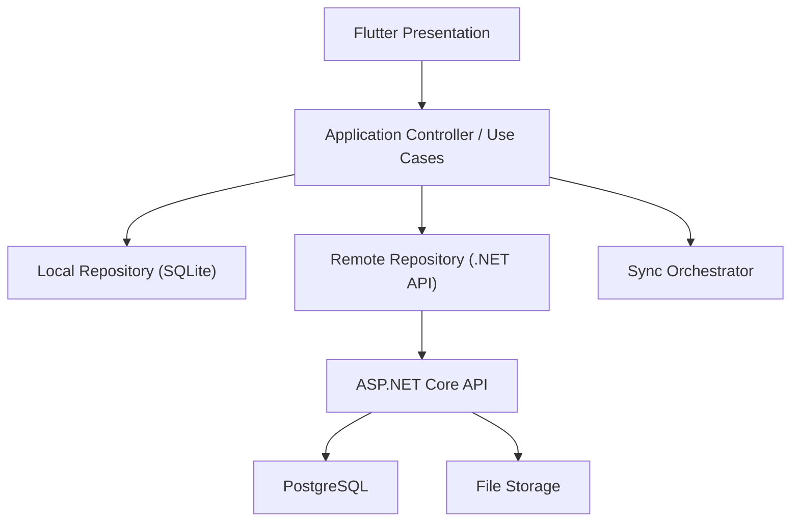

# Flutter + .NET 接口分层方案

> 状态：当前实施参考。本文承接 `technical-architecture-proposal.md`，用于定义 Flutter 三端与 .NET 云端服务之间的接口分层；旧格式迁移仅由 PC 端 Rust 本地核心执行。

本文档定义 `Flutter` 三端前端与 `.NET` 后端之间的接口分层与责任边界，目标是：

1. 前端尽量统一三端代码
2. 后端保持自主可控
3. 支持本地离线与云端同步并存
4. 不让旧 `mh8` 兼容逻辑污染主业务接口

## 1. 总体原则

### 1.1 前端不直接依赖旧格式

Flutter 前端不直接读取：

- `mh8`
- `mhlink.mdb`
- `MoneyHome8.data`
- `MoneyHome8.cache`
- `Investment.cache`

这些旧格式统一由：

- PC 端 Rust 本地核心
- PC 端本地迁移流程

负责处理。

### 1.2 前端只看统一业务接口

Flutter 前端只依赖三类接口：

1. `认证接口`
2. `同步接口`
3. `查询/命令接口`

### 1.3 本地与云端分离

- 本地 `SQLite`
  - 负责离线读写
- `.NET API`
  - 负责云端同步、鉴权、远程查询、附件、共享参考数据

## 2. 架构分层



## 3. Flutter 侧接口分层

### 3.1 Presentation Layer

职责：

- 页面展示
- 表单交互
- 列表、图表、筛选
- 空状态与错误状态

不负责：

- 拼接 SQL
- 直接调用旧账本工具
- 处理同步冲突规则

### 3.2 Application Layer

职责：

- 组织业务用例
- 编排本地与远端调用顺序
- 决定是否先读本地、后刷远端
- 触发同步

典型用例：

- `LoadAccountTree`
- `SaveTransaction`
- `LoadReport`
- `CreateBudget`
- `RunSyncNow`

### 3.3 Repository Layer

拆成两类：

- `LocalRepository`
- `RemoteRepository`

例如：

- `AccountLocalRepository`
- `AccountRemoteRepository`
- `TransactionLocalRepository`
- `TransactionRemoteRepository`

### 3.4 Sync Layer

职责：

- 推送本地变更
- 拉取远端变更
- 处理 tombstone / version / updated_at
- 记录同步批次状态

## 4. .NET API 分层

建议后端结构：

```text
backend/
1. Api/
2. Application/
3. Domain/
4. Infrastructure/
5. Contracts/
6. Workers/
```

### 4.1 `Api`

职责：

- HTTP Controller / Minimal API
- 参数校验
- 权限入口
- 返回 DTO

### 4.2 `Application`

职责：

- 用例编排
- 事务边界
- 同步流程
- 查询聚合

### 4.3 `Domain`

职责：

- 账户、交易、预算、提醒、投资等核心规则

### 4.4 `Infrastructure`

职责：

- PostgreSQL
- 文件存储
- 队列
- 第三方行情接口

### 4.5 `Contracts`

职责：

- 前后端共享 DTO 规范
- 请求/响应结构
- 错误码

### 4.6 `Workers`

职责：

- 后台同步任务
- 行情刷新任务
- 通知派发任务

## 5. 接口分类建议

## 5.1 认证接口

### 建议接口

```text
POST   /api/auth/login
POST   /api/auth/refresh
POST   /api/auth/logout
GET    /api/auth/me
```

### 典型职责

- 用户登录
- 刷新 token
- 返回当前用户和设备信息

## 5.2 同步接口

### 建议接口

```text
POST   /api/sync/push
POST   /api/sync/pull
POST   /api/sync/run
GET    /api/sync/status
POST   /api/sync/resolve
```

### 建议请求模型

#### `push`

上传本地变更批次：

```json
{
  "deviceId": "desktop-001",
  "batchId": "uuid",
  "mode": "bidirectional",
  "items": [
    {
      "entityType": "transaction",
      "entityId": "uuid",
      "operation": "upsert",
      "version": 5,
      "updatedAt": "2026-07-30T12:00:00Z",
      "payload": {}
    }
  ]
}
```

#### `pull`

按游标拉取远端变更：

```json
{
  "deviceId": "desktop-001",
  "sinceCursor": "cursor-value",
  "entityTypes": ["account", "transaction", "budget", "reminder"]
}
```

### 关键设计

- 同步对象按实体类型分组
- 不传数据库文件
- 不传整库快照作为日常同步主体

## 5.3 查询接口

### 账户与主数据

```text
GET    /api/accounts/tree
GET    /api/accounts/{id}
GET    /api/categories
GET    /api/tags
GET    /api/persons
GET    /api/currencies
```

### 交易

```text
GET    /api/transactions
GET    /api/transactions/{id}
POST   /api/transactions
PUT    /api/transactions/{id}
DELETE /api/transactions/{id}
```

### 投资

```text
GET    /api/investments/catalog/search
GET    /api/investments/quotes
GET    /api/investments/holdings
POST   /api/investments/trades
```

### 预算与提醒

```text
GET    /api/budgets
POST   /api/budgets
GET    /api/reminders
POST   /api/reminders
GET    /api/goals
POST   /api/goals
```

### 报表

```text
GET    /api/reports/income-expense
GET    /api/reports/balance-sheet
GET    /api/reports/investment-summary
GET    /api/reports/tag-summary
GET    /api/reports/account-summary
```

## 5.4 导入导出接口

桌面端可本地执行，Web 端则通过 API：

```text
POST   /api/imports/mh8
POST   /api/imports/data
POST   /api/imports/jiaogedan
GET    /api/imports/{batchId}

POST   /api/exports/ledger
POST   /api/exports/report
GET    /api/exports/{jobId}
```

## 6. 前后端 DTO 设计原则

### 6.1 不直接暴露数据库结构

前端看到的应是：

- 业务 DTO
- 查询 DTO
- 表单 DTO

而不是：

- 原始 SQLite 行
- 原始 PostgreSQL 表结构
- Jet 表字段名

### 6.2 统一 ID 策略

建议：

- 所有业务实体都使用 `UUID`

原因：

- 本地先创建，后同步到云端时不会依赖数据库自增主键

### 6.3 时间字段统一

建议：

- 服务端和同步接口统一使用 `UTC ISO-8601`

例如：

```text
2026-07-30T13:45:00Z
```

## 7. 本地 SQLite 与远端 API 的关系

### 7.1 桌面/手机端

默认读写路径：

```text
UI -> Local SQLite
Sync -> .NET API
```

也就是：

- 记账先写本地
- 有网时再同步

### 7.2 Web 端

默认读写路径：

```text
UI -> .NET API -> PostgreSQL
```

Web 端不依赖本地离线库作为主路径。

## 8. 平台差异建议

### 8.1 桌面端

可以额外暴露：

- 旧账本导入
- 本地文件导出
- 高级同步修复
- 本地附件路径处理

### 8.2 手机端

只暴露：

- 高频交易录入
- 轻量查看
- 正常同步

### 8.3 Web 端

只暴露：

- 在线查询
- 轻录入
- 普通同步状态查看

## 9. 错误模型建议

统一返回：

```json
{
  "code": "SYNC_CONFLICT",
  "message": "检测到冲突，请先处理后再继续同步。",
  "details": {}
}
```

建议错误码至少包括：

- `UNAUTHORIZED`
- `FORBIDDEN`
- `VALIDATION_FAILED`
- `SYNC_CONFLICT`
- `LEDGER_IMPORT_FAILED`
- `ATTACHMENT_UPLOAD_FAILED`
- `QUOTE_PROVIDER_UNAVAILABLE`

## 10. 当前最适合先做的接口

如果现在开工，建议先实现：

1. `GET /api/accounts/tree`
2. `GET /api/transactions`
3. `POST /api/transactions`
4. `GET /api/categories`
5. `GET /api/currencies`
6. `POST /api/sync/push`
7. `POST /api/sync/pull`
8. `GET /api/reports/income-expense`

因为这批接口最能支撑：

- 账户中心
- 基础记账
- 本地同步
- 第一批报表

## 11. 最终建议

这套接口分层最核心的原则是：

1. Flutter 前端不碰旧格式
2. 日常业务先写本地 SQLite
3. .NET API 负责云端对象副本与同步协调
4. Rust 工具专注旧数据接入与解析
