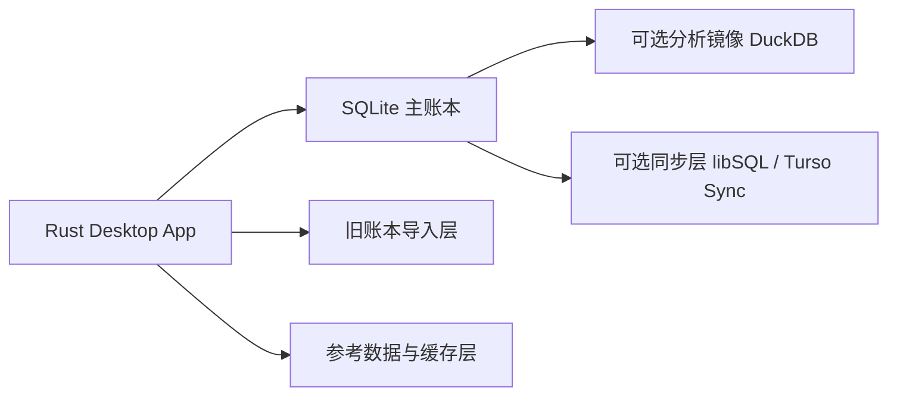

# 本地数据库选型结论

本文档回答 Rust 重构里最关键的一个实现问题：新系统的本地数据库应该怎么选，以及是否需要继续复刻原 `mh8` 的结构。

结论先行：

1. 新系统不需要按原 `mh8` 结构一模一样落库。
2. 新系统默认主存储推荐 `SQLite`。
3. 如果后续需要多端同步，可以在 `SQLite` 基础上追加 `libSQL / Turso Sync` 路线，而不是一开始就把同步耦合进核心账本。
4. `DuckDB` 适合做重报表或分析加速层，不适合做默认主账本。

本文依据两部分事实：

- 2026-07-28 之前已完成的 `MoneyHome8` 本地逆向证据
- 2026-07-28 当天补充查看的官方资料：
  - `SQLite`
  - `DuckDB`
  - `Turso / libSQL`

## 1. 原程序给我们的约束

从当前实测看，`MoneyHome8` 不是一个简单记账本，而是一个长期积累后的本地财务工作台。新数据库必须同时满足下面几类要求：

- 本地优先
  - 桌面可离线使用
  - 不依赖常驻数据库服务
- 事务可靠
  - 收支、转账、投资成交、预算、提醒不能因为异常退出而产生半写入状态
- 查询灵活
  - 账户树、流水、预算、标签、投资、报表都需要大量筛选与聚合
- 部署简单
  - 用户不应该额外安装数据库服务
- 可迁移
  - 能承接旧账本导入
  - 未来可扩展同步、报表加速、导出
- 可审计
  - 财务软件必须能明确追溯余额、持仓、预算消耗和报表来源

这些约束天然更接近“嵌入式事务型数据库 + 可选分析层”，而不是“先追求旧格式复刻”。

## 2. 是否需要复刻原 `mh8` 结构

结论：`不需要`。

原因：

- 用户目标已经明确：
  - 功能要一致
  - 数据结构可以按我们自己的需要重新设计
- 当前证据已经说明原系统是：
  - `test.mh8` 主账本
  - `mhlink.mdb` 参考库
  - `MoneyHome8.data` 内置库
  - 缓存
  - 工作组权限
  - 本地加密配置
  的多源系统
- 如果强行复刻旧结构，会把新系统绑死在：
  - Jet/Access 权限体系
  - 旧历史字段冗余
  - 难维护的对象可见性问题

因此，重构应遵循下面的边界：

- `功能口径` 尽量对齐原系统
- `导入映射` 尽量兼容原系统
- `内部表结构` 由 Rust 新系统自行设计

## 3. 候选方案对比

## 3.1 SQLite

适配度：`最高，推荐作为默认主存储`

官方资料显示，`SQLite` 是嵌入式、无独立服务、零配置、支持事务的单文件 SQL 数据库，文件格式稳定，适合作为应用文件格式。

为什么适合本项目：

- 本地桌面部署成本最低
- 单文件账本天然接近用户对“账本文件”的认知
- ACID 事务适合财务写入
- SQL 表达力足够覆盖：
  - 账户
  - 流水
  - 预算
  - 提醒
  - 标签
  - 投资持仓
  - 报表汇总
- Rust 生态成熟
  - `rusqlite`
  - `sqlx` 的 SQLite 方言
- 后续做导出、备份、诊断、修复都更容易

风险与限制：

- 不适合把所有复杂分析都压在实时 OLTP 查询上
- 多端同步不是 SQLite 单体的强项
- 对特别重的宽表分析、超复杂透视，可能不如专门分析引擎

结论：

- 作为 `Finance-own` 的默认主账本，新系统优先选 `SQLite`

首版可执行模式与查询契约已经落地：

- [sqlite-schema-and-query-contract.md](C:\DCG-SZ\SZ-System-Docs\CodexWorkSpace\Finance-own\docs\sqlite-schema-and-query-contract.md)
- [0001_core.sql](C:\DCG-SZ\SZ-System-Docs\CodexWorkSpace\Finance-own\migrations\0001_core.sql)
- [0002_planning_and_automation.sql](C:\DCG-SZ\SZ-System-Docs\CodexWorkSpace\Finance-own\migrations\0002_planning_and_automation.sql)
- [0003_contracts_exchange_and_sync.sql](C:\DCG-SZ\SZ-System-Docs\CodexWorkSpace\Finance-own\migrations\0003_contracts_exchange_and_sync.sql)
- [0004_insurance_cash_value.sql](C:\DCG-SZ\SZ-System-Docs\CodexWorkSpace\Finance-own\migrations\0004_insurance_cash_value.sql)
- [0005_insurance_cash_value_as_of.sql](C:\DCG-SZ\SZ-System-Docs\CodexWorkSpace\Finance-own\migrations\0005_insurance_cash_value_as_of.sql)
- [0006_insurance_cash_value_amount_guard.sql](C:\DCG-SZ\SZ-System-Docs\CodexWorkSpace\Finance-own\migrations\0006_insurance_cash_value_amount_guard.sql)
- [0007_payroll_income_and_application_identity.sql](C:\DCG-SZ\SZ-System-Docs\CodexWorkSpace\Finance-own\migrations\0007_payroll_income_and_application_identity.sql)
- [0008_party_profile.sql](C:\DCG-SZ\SZ-System-Docs\CodexWorkSpace\Finance-own\migrations\0008_party_profile.sql)
- [0009_party_list_lifecycle.sql](C:\DCG-SZ\SZ-System-Docs\CodexWorkSpace\Finance-own\migrations\0009_party_list_lifecycle.sql)
- [0010_prepaid_expenses.sql](C:\DCG-SZ\SZ-System-Docs\CodexWorkSpace\Finance-own\migrations\0010_prepaid_expenses.sql)
- [0011_deposit_rate_versions.sql](C:\DCG-SZ\SZ-System-Docs\CodexWorkSpace\Finance-own\migrations\0011_deposit_rate_versions.sql)
- [0012_financial_goal_progress_baseline.sql](C:\DCG-SZ\SZ-System-Docs\CodexWorkSpace\Finance-own\migrations\0012_financial_goal_progress_baseline.sql)
- [0013_plan_and_reminder_occurrences.sql](C:\DCG-SZ\SZ-System-Docs\CodexWorkSpace\Finance-own\migrations\0013_plan_and_reminder_occurrences.sql)
- [local-storage-and-ledger-architecture.md](C:\DCG-SZ\SZ-System-Docs\CodexWorkSpace\Finance-own\docs\local-storage-and-ledger-architecture.md)
- [sqlite-domain-coverage-audit.md](C:\DCG-SZ\SZ-System-Docs\CodexWorkSpace\Finance-own\docs\sqlite-domain-coverage-audit.md)

十三版迁移当前共创建 `63` 张表、`21` 个视图和 `56` 个显式索引，已覆盖核心交易、投资输入、报表预设、模板计划、逐次计划实例、预算、提醒规则、提醒触发实例、今日提醒投影、目标、规划输入、专属合同、导入审计、同步冲突、保险现金价值审计、工资收入组成、人员资料字段、人员列表生命周期、待摊费用期次、存款利率版本和财务目标进度基线。`53` 类运行时实体候选已全部获得数据库或适配器契约，账簿内不再有计划缺失对象。

Rust 具体适配器 `SqliteLedgerStore` 已实现文件账簿创建/打开、v6/v7/v8/v9/v10/v11/v12 到 v13 原子升级、应用文件标识、十三版迁移、完整性检查、原子交易写入和七组报表查询；当前 Rust 基线为 `67 passed, 0 failed`。

## 3.2 libSQL / Turso Sync

适配度：`中高，适合作为后续同步扩展，不建议先做默认主存储依赖`

当前官方资料显示：

- `libSQL` / Turso 可基于本地 SQLite 文件工作
- 支持 Embedded Replicas
- 对新项目，官方更推荐 `Turso Sync`
  - 本地读写
  - 显式 `push()` / `pull()`

为什么值得保留这条路线：

- 原软件本身就有同步、通知、远程状态上传能力
- 如果 Rust 重构后要支持：
  - 多设备同步
  - 局域网/云端备份
  - 家庭多人共用
  这条路线很自然

为什么不建议现在就绑定：

- 当前目标先是摸清功能、落地本地版
- 同步会引入额外复杂度：
  - 冲突合并
  - 认证
  - 远端状态
  - 隐私与加密
- 现在最需要稳定的是本地账本，不是先上云

结论：

- `libSQL / Turso Sync` 适合作为 Phase 3/4 的增强路线
- 不替代 Phase 1/2 的本地主存储决定

## 3.3 DuckDB

适配度：`中，适合作为分析副存储，不推荐做默认主账本`

官方资料显示，`DuckDB` 是嵌入式 SQL 分析数据库，重点面向分析型查询。

它的优点：

- 内嵌部署同样简单
- 对聚合、窗口函数、报表透视、分析型 SQL 很强
- 非常适合：
  - 重报表
  - 历史分析
  - 导入大批量交易后的离线统计

它不适合直接做本项目主账本的原因：

- 当前目标不是先做 OLAP 产品，而是做本地财务应用
- 原软件大量操作都是高频小事务：
  - 新增记账
  - 编辑流水
  - 调整预算
  - 更新提醒
  - 调整持仓
- DuckDB 的官方定位更偏分析，而不是个人财务主交易库
- 官方安全文档还特别提醒：
  - DuckDB 具备读写文件、访问网络、加载扩展等能力
  - 处理不可信 SQL 时要额外谨慎

结论：

- 若后续重报表需要加速，可把 `DuckDB` 作为分析镜像库
- 不建议把它定为默认账本主存储

## 3.4 PostgreSQL / MySQL 类服务型数据库

适配度：`低，不建议作为默认桌面单机方案`

不推荐原因：

- 桌面安装和运维成本高
- 与“本地单文件账本”的用户习惯冲突
- 不利于便携、备份、导入导出
- 对当前阶段是明显过度设计

可保留的场景：

- 仅在未来做团队版、服务端版、SaaS 版时再考虑

## 4. 推荐落地架构

## 4.1 主结论

推荐架构如下：

## 4.2 分层说明

### 主账本：SQLite

承载：

- 账户与账户组
- 分类、标签、人员
- 交易头与交易明细
- 债权债务
- 预算与预算消耗
- 提醒
- 投资持仓与成交
- 版本、迁移、审计日志

### 导入层：Legacy Import

承载：

- `test.mh8` 导入
- `mhlink.mdb` 辅助映射
- `MoneyHome8.data` 内置字典补全
- 两个缓存文件的代码/名称/类别对照

### 分析层：可选 DuckDB

仅在下列情况启用：

- 大时间跨度投资分析
- 宽表透视
- 高维趋势统计
- 用户自定义重报表

### 同步层：可选 libSQL / Turso

仅在下列场景启用：

- 多设备账本同步
- 远程备份
- 家庭协作

## 5. 新表结构设计原则

新结构不要复制旧表名，而应围绕领域语义来设计。

推荐原则：

1. `交易统一头 + 业务扩展明细`
2. `账户余额可重算，不把关键财务事实只放缓存字段`
3. `持仓、预算、提醒都保留来源交易或来源规则`
4. `导入映射单独存，不污染主业务表`
5. `同步状态单独存，不和业务主表硬耦合`

推荐核心表族：

首版已落地：

- `ledgers`
- `account_groups`
- `accounts`
- `categories`
- `tags`
- `parties`
- `exchange_rate_snapshots`
- `transactions`
- `transaction_entries`
- `transaction_tags`
- `account_tags`
- `attachments`
- `transaction_attachments`
- `investment_instruments`
- `investment_trades`
- `investment_lot_allocations`
- `market_quotes`
- `report_presets`
- `legacy_id_map`

十三版迁移已经增加：

- 模板、计划、预算、提醒、财务目标和规划输入
- 导入批次、字段映射、原始行和错误明细
- 债务、信用、期货、融资融券、保险、社保和实物资产专属合同
- 同步配置、对象结果、冲突、墓碑和通知投递日志
- 保险现金价值快照、变更历史、生效区间和金额下限保护
- 工资收入组成、账户投影核对和 Finance Own SQLite 文件标识
- 家庭成员、往来人员、机构精确分类，以及联系方式、地址、性别和带历法生日字段
- 三类共享的账簿级人员名称唯一性，以及按类别、隐藏状态和名称读取列表的索引
- 存款利率更新批次、逐行校验结果、不可变版本和当前生效利率投影
- 待摊费用主体、分期计划、幂等交易引用和剩余金额查询投影
- 财务目标起始日期、允许负值的初始估值快照、账户范围、公式版本和进度输入投影
- 计划执行实例、提醒触发实例、实例生命周期统计和今日提醒统一投影
- 下一版计划实例能力快照：补充今日提醒可见性、可执行和可跳过策略，覆盖保险仅提醒 `0/1` 与固定账户自动计划不进入今日提醒；十三版当前统一 `1/1` 投影不得作为最终兼容结论

后续数据库工作以真实业务校准和查询优化为主，不再为已覆盖实体预建猜测表。新增对象必须由新的页面证据、业务合同或性能证据驱动。

## 6. SQLite 具体实施建议

## 6.1 文件组织

- `finance-own.db`
  - 主业务库
- `attachments/`
  - 附件目录
- `exports/`
  - 导出目录

当前默认使用 SQLite 回滚日志，不把 `-wal` 和 `-shm` 作为账簿长期组成。只有真实并发基准证明需要 WAL，并且检查点、关闭和备份流程全部完成后，才允许启用 WAL。

## 6.2 必要能力

- 开启外键
- 使用 `PRAGMA user_version` 管理迁移版本，并用 `PRAGMA application_id` 识别 Finance Own 账簿
- 使用 `synchronous=FULL` 保护财务写入持久性
- 所有写入走事务
- 账本金额使用 `INTEGER` 保存币种最小单位，Rust 对应受检 `i64` 或封装金额类型；禁止用 `REAL/f64` 保存余额、现金价值、费用或报表汇总事实
- 金额文本在应用边界按币种小数位和显式舍入模式解析；空值、负数、超范围和聚合溢出返回明确错误，数据库再用约束或触发器守住领域下限
- 为常见筛选条件建索引：
  - `account_id`
  - `date`
  - `category_id`
  - `tag`
  - `person_id`
  - `security_code`
  - `fund_code`
- 搜索场景优先考虑：
  - 规范化关键字表
  - 或 `FTS5`

## 6.3 不建议的做法

- 不要把报表结果长期当真相表保存
- 不要把所有投资类型都挤进一个无法审计的大 JSON
- 不要为了兼容旧库而保留大量无业务意义的历史字段

## 7. 最终推荐

截至 2026-07-31，当前最稳妥、最符合项目节奏的结论是：

1. `SQLite` 作为默认主账本
2. `libSQL / Turso Sync` 作为未来同步增强可选项
3. `DuckDB` 只作为可选分析副存储
4. 新结构按 Rust 领域模型重建，不复刻旧 `mh8` 表结构

这个方案既保留了：

- 本地优先
- 离线可用
- 财务事务可靠
- 账本文件可备份

也给后续：

- 多端同步
- 重报表
- 旧账本导入

留出了足够清晰的演进空间。

## 8. 参考来源

以下资料均于 `2026-07-28` 查阅：

- [About SQLite](https://sqlite.org/about.html)
- [Why DuckDB](https://duckdb.org/why_duckdb.html)
- [Securing DuckDB](https://duckdb.org/docs/lts/operations_manual/securing_duckdb/overview.html)
- [Embedded Replicas - Turso Docs](https://docs.turso.tech/features/embedded-replicas/introduction)
- [Turso SDK Introduction](https://docs.turso.tech/sdk/introduction)
- [Turso Rust Quickstart](https://docs.turso.tech/sdk/rust/quickstart)
