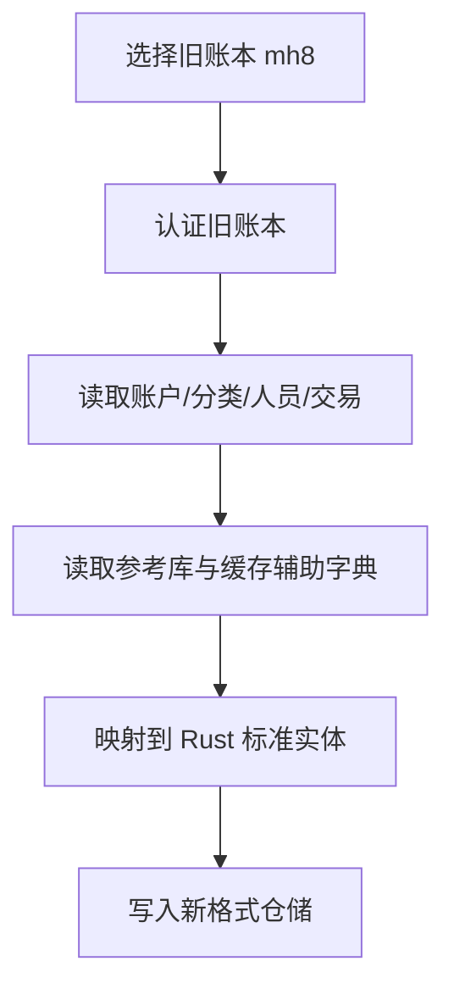
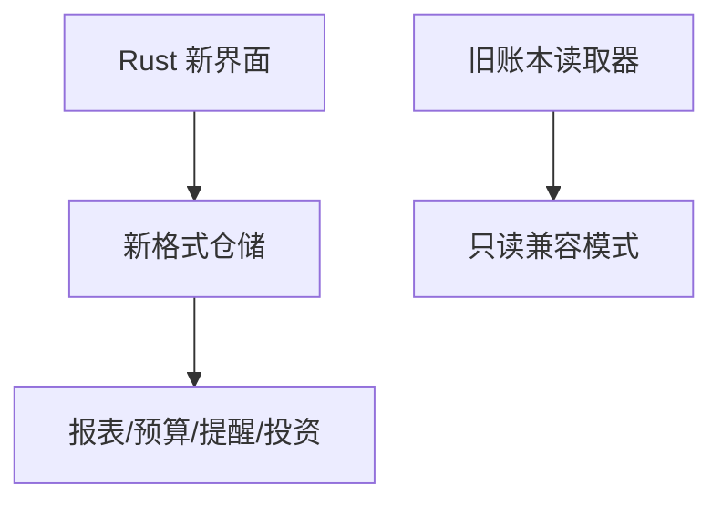

# MoneyHome8 Rust 重构迁移策略

本文档基于当前对 `test.mh8`、`mhlink.mdb`、`MoneyHome8.data`、缓存文件、工作组文件和本地加密配置的排查结果，给出重构时的迁移路线建议。

## 1. 当前事实基础

### 1.1 已确认可直接读取的部分

- `mhlink.mdb`
  - 可直接只读打开
  - 已拿到表、字段、样例、数量级
- `MoneyHome8.cache`
  - 已拿到代码/名称/拼音缩写检索模式
- `Investment.cache`
  - 已拿到投资品类别码 `_3 / _4 / _9` 的高可信推断

### 1.2 已确认但仍受权限控制的部分

- `test.mh8`
  - 主账本
  - 已确认 `Standard Jet DB`
  - 已确认大量对象名和字段名
  - 正式认证未打通
- `MoneyHome8.data`
  - 可解压为 Jet 内置库
  - 已确认大量对象名和字段名
  - 正式认证未打通
- `mh.mdw`
  - 参与工作组认证
- `user.cfg` / `UseInformation.cfg`
  - 存在本地加密配置层

## 2. 不建议的路线

### 2.1 一开始就承诺“原位完全兼容写回 `mh8`”

原因：

- 主账本正式认证还未打通
- 工作组用户/口令链条尚未还原
- 内置库与主账本可能共享模型但职责不同

风险：

- 很容易在未知权限边界上损坏旧账本
- 会把重构进度锁死在旧格式完全复刻上

### 2.2 把所有数据都硬塞进一个 Rust 数据库适配器

原因：

- 当前数据源至少分五层：
  - 主账本
  - 参考库
  - 内置库
  - 缓存
  - 认证上下文

风险：

- 领域边界混乱
- 后续无法渐进替换旧存储

## 3. 推荐路线

### 路线 A：只读导入优先

目标：

- 先做“读旧账本、展示数据、完成核心业务流”

步骤：

1. 固化共享参考库读取器
2. 固化缓存读取器
3. 建立主账本读取骨架
4. 以只读方式展示账户、流水、预算、提醒、投资
5. 新写入优先落到新格式仓储，而不是直接写回旧库

适用阶段：

- Phase 1
- Phase 2

优点：

- 能最快交付 Rust 新界面与新领域层
- 不被旧权限链完全阻塞

### 路线 B：双轨存储过渡

目标：

- 旧账本只读导入
- 新系统用自己的存储格式工作

步骤：

1. 建立 `legacy_import` 流程
2. 建立 `new_store` 作为新主存储
3. 把旧账本导入为新系统的标准实体
4. 后续新录入、新预算、新提醒写入新格式

适用阶段：

- Phase 2
- Phase 3

优点：

- 避开旧库写回风险
- 后续可逐渐脱离 Jet/工作组权限体系

### 路线 C：认证打通后补旧格式兼容层

目标：

- 认证打通后，再补“旧格式直接读写/导出”能力

步骤：

1. 继续研究 `mh.mdw` + 本地加密配置
2. 正式枚举 `test.mh8` 真实表结构
3. 把 `schema-hypothesis.md` 中的假设逐项验证
4. 只在必要时补写回旧格式能力

适用阶段：

- Phase 3
- Phase 4

## 4. 新格式存储建议

如果 Rust 重构不被要求“完全依赖旧格式工作”，推荐新系统使用：

- `SQLite`
  - 适合作为单机桌面默认存储
- 可选配导出：
  - `JSON`
  - `CSV`
  - 自定义归档包

建议保留：

- `legacy_reader`
  - 只读旧格式
- `legacy_exporter`
  - 可选导出回兼容格式

## 5. 迁移流程建议

### 首次导入流程

### 后续使用流程

## 6. 对功能实现顺序的影响

### 可先做的

- 账户中心
- 通用流水
- 分类/标签/人员
- 预算与提醒
- 投资品检索
- 参考库行情/费率读取

### 应后做的

- 旧账本直接写回
- 全量同步复刻
- 全量旧格式导出
- 工作组权限完全兼容

## 7. 当前建议结论

截至当前证据，最稳妥的重构路线是：

1. 先把 Rust 版本做成“旧数据可读、新数据可写”的双轨系统
2. 旧账本优先作为导入源与只读兼容源
3. 等认证链打通后，再决定是否补齐旧格式直接写回

这样最符合当前事实，也最不容易把整个项目卡死在旧权限体系上。
