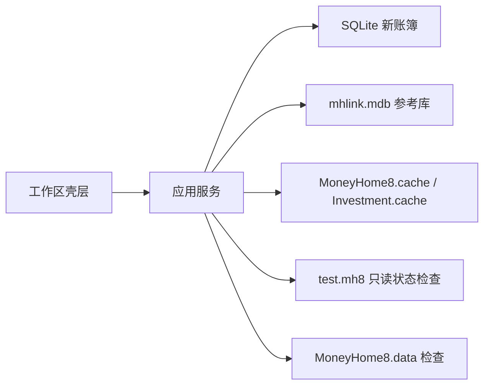

# 第一期需求分析

本文档承接 `rebuild-prd.md`、`requirements-analysis.md`、`phase1-build-spec.md`、`implementation-backlog.md` 和 `acceptance-criteria.md`，把第一期从“实施规格”进一步整理为可评审、可拆任务、可验收的需求分析。第一期的核心不是完整替代财智 8，而是在旧账本认证尚未完全打通前，先建立新系统可持续迭代的本地基础盘。

## 1. 阶段目标

第一期目标是交付一个可运行、可验证、可扩展的 Rust 基础版本：

1. 建立稳定的 Rust 工程、SQLite 新账簿和分层模块骨架。
2. 接入当前已确认可访问的数据源，包括共享参考库和两个缓存文件。
3. 为旧主账本和内置库建立只读适配边界，即使暂时无法枚举正式表，也必须返回结构化状态。
4. 建立账户、基础资料、参考数据、检索、最小交易、预算和提醒等核心领域模型骨架。
5. 提供四大工作区壳层，让后续账户中心、流水、报表和分析功能能在稳定导航中迭代。

第一期完成后，产品应从“分析材料充足”进入“可以持续实现和回归验证”的状态。

## 2. 范围边界

### 2.1 本期必须做

- SQLite 新账簿创建、打开、迁移执行、完整性检查和应用文件标识校验。
- 共享参考库 `mhlink.mdb` 读取能力，覆盖利率、行情和费率。
- `MoneyHome8.cache` 与 `Investment.cache` 的检索读取能力。
- `test.mh8` 和 `MoneyHome8.data` 的只读打开/检查接口，明确返回认证、权限、占用、对象不可见或未实现状态。
- 第一批核心领域对象和仓储契约。
- 四大工作区 UI 壳层及财务数据、报表、分析、记账的基础导航。
- 最小验证脚本或测试，证明迁移、读接口状态和核心查询端口可重复运行。

### 2.2 本期明确不承诺

- 不原位写回旧 `.mh8`。
- 不宣称已完全兼容旧主账本正式表结构。
- 不完整复刻 `记账` 工作区和全部投资子域页面。
- 不要求同步、通知、行情联网协议完整成功。
- 不承诺报表、投资收益、诊断、规划和目标的全部精确公式已经校准。

### 2.3 并行但不阻塞的工作

- `test.mh8` 正式认证和表结构枚举。
- 旧字段到 SQLite 新模型的迁移映射。
- 代表性运行结果、公式、失败回滚和导入导出协议校准。

这些工作会影响后续兼容深度，但不能阻塞第一期新主库、领域模型和工作区壳层落地。

## 3. 用户与场景

### 3.1 本地记账用户

用户希望新系统能安全创建和打开本地账簿，看到清晰的财务数据、记账、报表和分析入口。第一期只要求空状态或占位状态可用，但导航、错误页和账簿状态必须可靠。

### 3.2 迁移用户

用户已有 `test.mh8` 或旧 MoneyHome8 资料，希望系统能判断旧账本是否可读取、为何不能读取、下一步需要什么认证或适配工作。第一期不要求完整导入，但必须避免“失败就是崩溃”或“失败原因不可知”。

### 3.3 后续开发者

开发者需要在稳定的领域模型、仓储接口、SQLite 迁移和 UI 壳层上继续实现 Phase 2。第一期的接口命名、错误分类和验收样例必须足够明确，避免后续把旧窗体逻辑直接堆进 UI。

## 4. 功能需求

### F1 账簿生命周期骨架

- 系统应支持创建新的 SQLite 账簿文件。
- 系统应在打开账簿时校验应用文件标识和模式版本。
- 系统应能执行现有迁移并运行外键、完整性和关键视图检查。
- 系统应区分无账簿、打开中、已打开、关闭中和打开失败状态。
- 最近账簿、窗口位置和导航历史属于应用会话设置，不得写入财务真相表。

验收证据：

- `tools/run-rust-checks.ps1 -Action all` 能通过。
- `tools/validate_sqlite_schema.py` 能通过。
- 创建、重开和错误账簿路径分别返回明确结果。

### F2 旧主账本只读状态检查

- 系统应提供 `open_legacy_ledger(path)` 或等价应用服务。
- 返回状态至少覆盖 `success`、`locked`、`permission_denied`、`auth_failed`、`object_invisible`、`not_implemented` 和 `file_not_found`。
- 当 Access/Jet 能打开但对象集合为空时，应返回对象不可见或认证不足的结构化状态，而不是当作成功读取。
- 旧主账本适配器不得修改原始 `.mh8` 文件。

验收证据：

- 指向不存在文件、被占用文件、当前 `test.mh8` 样例时都有可区分结果。
- 结果对象包含路径、文件可访问性、识别到的容器类型和下一步诊断建议。

### F3 内置库检查

- 系统应能识别 `MoneyHome8.data` 数据包。
- 系统应复用已确认的偏移和解压规则生成受控 Jet 库检查结果。
- 在认证未打通时，仍应返回“已解压但对象不可见/认证不足”的状态。

验收证据：

- 对有效数据包能稳定给出解压结果或检查状态。
- 对损坏文件返回结构化错误，不崩溃。

### F4 共享参考库读取

- 系统应读取 `mhlink.mdb` 中的 `HBRate`、`TBSecuPrice` 和 `TBTransFee`。
- 利率映射到 `RateRule`。
- 行情映射到 `Quote`。
- 费率映射到 `FeeRule`。
- 查询接口应支持全量列表、按代码查询行情、按类型查询费率。

验收证据：

- `list_rate_rules()` 返回非空或明确空结果。
- `find_quotes_by_code(code)` 可按代码过滤。
- `list_fee_rules()` 保留旧字段到新对象字段的映射说明。

### F5 缓存检索读取

- 系统应读取 `MoneyHome8.cache` 的综合名称、代码、拼音或缩写检索信息。
- 系统应读取 `Investment.cache` 的投资品目录信息。
- `_3`、`_4`、`_9` 等已确认类别码应固定为枚举或带中文注释的常量。
- 检索接口应支持按名称、代码、缩写和投资品类型查询。

验收证据：

- `search_lookup(keyword)`、`search_lookup_by_code(code)`、`search_lookup_by_abbr(abbr)` 有确定返回结构。
- `list_investment_catalog_by_type(type_code)` 能区分证券类、基金类和货币基金类目录候选。

### F6 核心领域模型

本期必须具备下列模型或等价结构：

- `AccountGroup`
- `Account`
- `Category`
- `Currency`
- `Person`
- `Quote`
- `RateRule`
- `FeeRule`
- `LookupIndex`
- `InvestmentCatalog`

本期应建立最小骨架：

- `Transaction`
- `Budget`
- `Reminder`
- `Plan`
- `Goal`
- `Security`
- `Fund`
- `SyncRecord`

模型要求：

- 公共类型和跨层 DTO 必须包含必要中文注释，说明业务含义、数据来源、单位和边界。
- 旧对象名、旧字段名和新模型字段之间的映射必须能追溯到文档或代码注释。
- 不使用一个全字段可空的大对象承载所有资产类型。

### F7 仓储与应用服务边界

- UI 不直接访问 SQLite、Jet、缓存文件或外部数据源。
- 仓储层负责数据读取、状态分类和底层错误翻译。
- 应用层负责组织账簿状态、工作区状态和命令结果。
- 写入命令只面向 SQLite 新账簿，不写旧 `.mh8`。

第一期建议接口：

- `LedgerRepository::open_legacy_ledger`
- `LedgerRepository::inspect_legacy_ledger`
- `ReferenceRepository::list_rate_rules`
- `ReferenceRepository::find_quotes_by_code`
- `ReferenceRepository::list_fee_rules`
- `CacheRepository::search_lookup`
- `CacheRepository::list_investment_catalog_by_type`
- `SqliteLedgerRepository::create_or_open`
- `SqliteLedgerRepository::integrity_check`

### F8 UI 工作区壳层

第一期必须具备四大工作区壳层：

- 财务数据
- 记账
- 财务报表
- 财务分析

财务数据至少包含：

- 概况
- 财务记录
- 投资一览
- 标签
- 账户中心

财务报表至少包含：

- 日常收支类
- 资产负债类
- 投资类
- 一个占位报表页或空状态页

财务分析至少包含：

- 财务预算
- 财务诊断
- 财务规划
- 财务目标
- 一个预算空状态页

记账至少包含：

- 收入录入
- 支出录入
- 转账录入
- 流水账

UI 壳层验收重点是导航和状态边界，不要求本期完成完整业务提交。

## 5. 非功能需求

### N1 安全

- 不记录密码、token、cookie、明文账号、旧同步凭据或真实财务敏感数据。
- 旧 HTTP 服务、AI 外联和同步凭据不进入第一期默认能力。
- 打开旧账本和测试账簿时不得修改非指定文件。

### N2 数据安全

- 所有 SQLite 写入必须使用事务。
- 迁移失败不得留下被误识别为有效账簿的半成品。
- 只读适配器不得写旧 `.mh8`、`mhlink.mdb`、缓存文件或程序目录文件。

### N3 可诊断性

- 外部数据源读取失败必须返回结构化错误。
- 错误消息应区分用户可处理问题、权限问题、认证问题、格式问题和暂未实现问题。
- 日志不得包含敏感字段；路径和状态可记录。

### N4 可测试性

- 关键接口必须可在无 UI 环境下验证。
- 迁移、外键、参考库读取、缓存解析和旧账本状态检查应可用脚本或单元测试覆盖。
- 未完成的旧库认证不得导致测试假失败；应以明确状态作为阶段性验收。

## 6. 数据与模型边界

第一期的新系统真相源是 SQLite 账簿。旧 `.mh8`、参考库和缓存只通过适配器进入，不反向决定新表结构。

关键边界：

- SQLite 保存新系统账簿、交易、基础资料和投影。
- `mhlink.mdb` 只提供利率、行情和费率参考数据。
- `.cache` 文件只提供检索和投资品目录候选。
- `test.mh8` 在第一期只做状态检查和结构线索，不做写回。
- `MoneyHome8.data` 在第一期只做解压和受控库识别。

## 7. 验收清单

第一期需求分析对应的完成检查如下：

1. 账簿创建和迁移可重复执行。
2. SQLite 完整性和外键检查通过。
3. `mhlink.mdb` 三类参考数据可查询。
4. 两个缓存文件可解析并提供检索接口。
5. `test.mh8` 返回结构化打开/检查状态。
6. `MoneyHome8.data` 返回结构化解压/检查状态。
7. 核心领域模型和仓储接口具有中文业务注释。
8. 四大工作区壳层可导航，并能展示空状态或占位内容。
9. UI 不直接访问底层文件或 SQLite。
10. 验证命令、测试结果和未完成缺口在交付说明中明确列出。

## 8. 风险与缺口

| 风险 | 影响 | 第一期处理方式 |
| --- | --- | --- |
| `test.mh8` 正式认证未打通 | 影响旧数据迁移和真实表结构 | 返回结构化状态，作为并行迁移线 |
| 投资和报表公式未完全校准 | 影响高兼容阶段 | 不在第一期 SQL 中隐式固化未验证公式 |
| 同步与云端服务尚未闭环 | 影响三端数据流 | 第一阶段先建本地模型、对象级同步契约和隔离适配边界 |
| 旧缓存协议字段仍有缺口 | 影响检索完整度 | 先覆盖已确认 `_PY/_LIST/_3/_4/_9` 语义 |
| Flutter PC 本地 API 尚未封装 | 影响首屏页面落地 | 第一阶段先固化工作区、命令状态和 Flutter 可消费 DTO |

## 9. 建议任务拆分

### P1-RA-01 账簿与 SQLite 基线

- 确认现有 13 版迁移仍可执行。
- 补齐账簿创建、重开、应用标识和完整性检查的需求用例。
- 对应验收：F1、N2。

### P1-RA-02 外部只读数据源

- 梳理 `mhlink.mdb`、`MoneyHome8.cache`、`Investment.cache` 的输入路径、返回对象和错误状态。
- 对应验收：F4、F5。

### P1-RA-03 旧账本与内置库适配边界

- 定义 `test.mh8`、`MoneyHome8.data` 的检查结果结构和状态枚举。
- 对应验收：F2、F3。

### P1-RA-04 核心领域模型与仓储契约

- 对照 `domain-mapping-spec.md` 和 `rust-module-plan.md` 固化第一期模型、DTO 和 Repository。
- 对应验收：F6、F7。

### P1-RA-05 工作区壳层需求

- 固化四大工作区、子导航、空状态、错误状态和命令禁用规则。
- 对应验收：F8。

### P1-RA-06 第一轮验证计划

- 串联 `tools/run-rust-checks.ps1 -Action all`、`tools/validate_sqlite_schema.py`、参考库/缓存读取检查和旧账本状态检查。
- 对应验收：第 7 节全量清单。

## 10. 第一期开工判断

第一期可以开工。需求、范围、数据边界、模块拆分和验收口径已经足够明确；当前缺口主要影响旧格式深兼容和高阶业务公式，不影响本期主线。后续实现应优先保证新 SQLite 主库、只读适配器状态分类、核心模型和工作区壳层稳定，再逐步补齐 Phase 2 的真实业务闭环。
