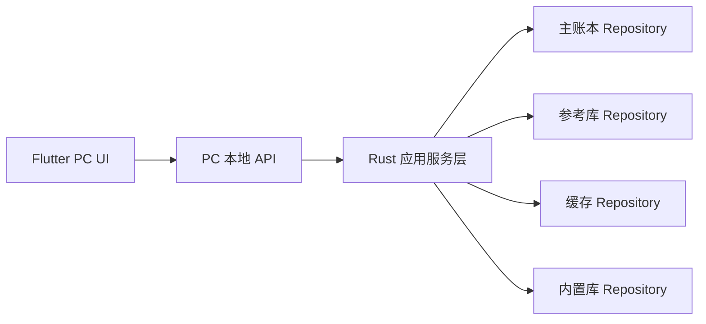
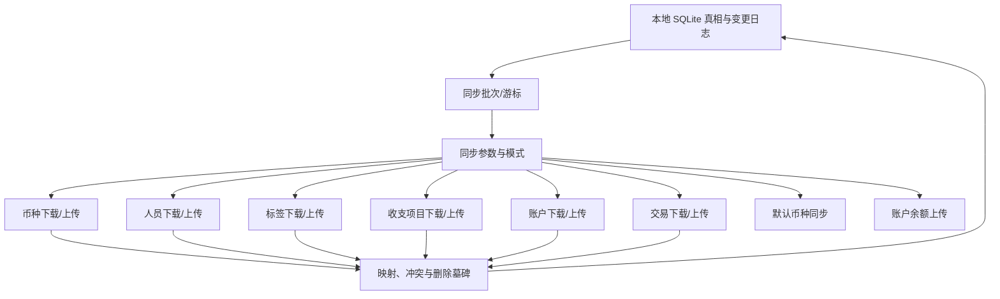
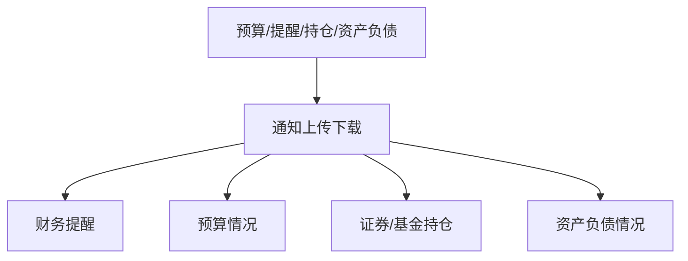
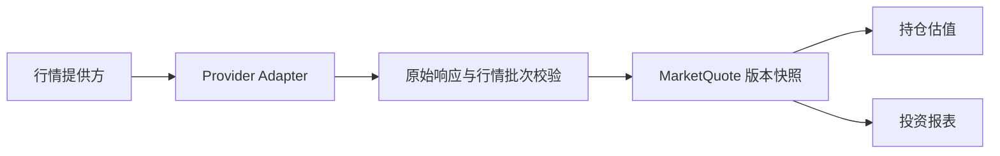

# MoneyHome8 重构 PRD

本文档是当前阶段的总览式产品与技术需求说明。它整合本目录下的功能矩阵、数据源排查、共享模型结论和实现拆分建议，用于指导后续正式实现。

关联文档：

- [data-page-observations.md](C:\DCG-SZ\SZ-System-Docs\CodexWorkSpace\Finance-own\docs\data-page-observations.md)
- [feature-inventory.md](C:\DCG-SZ\SZ-System-Docs\CodexWorkSpace\Finance-own\docs\feature-inventory.md)
- [function-matrix.md](C:\DCG-SZ\SZ-System-Docs\CodexWorkSpace\Finance-own\docs\function-matrix.md)
- [domain-mapping-spec.md](C:\DCG-SZ\SZ-System-Docs\CodexWorkSpace\Finance-own\docs\domain-mapping-spec.md)
- [analysis-page-observations.md](C:\DCG-SZ\SZ-System-Docs\CodexWorkSpace\Finance-own\docs\analysis-page-observations.md)
- [report-page-observations.md](C:\DCG-SZ\SZ-System-Docs\CodexWorkSpace\Finance-own\docs\report-page-observations.md)
- [top-level-navigation-observations.md](C:\DCG-SZ\SZ-System-Docs\CodexWorkSpace\Finance-own\docs\top-level-navigation-observations.md)
- [technical-architecture-proposal.md](C:\DCG-SZ\SZ-System-Docs\CodexWorkSpace\Finance-own\docs\technical-architecture-proposal.md)
- [requirements-analysis.md](C:\DCG-SZ\SZ-System-Docs\CodexWorkSpace\Finance-own\docs\requirements-analysis.md)
- [data-source-map.md](C:\DCG-SZ\SZ-System-Docs\CodexWorkSpace\Finance-own\docs\data-source-map.md)
- [mh8-structure-evidence.md](C:\DCG-SZ\SZ-System-Docs\CodexWorkSpace\Finance-own\docs\mh8-structure-evidence.md)
- [shared-model-summary.md](C:\DCG-SZ\SZ-System-Docs\CodexWorkSpace\Finance-own\docs\shared-model-summary.md)
- [rust-module-plan.md](C:\DCG-SZ\SZ-System-Docs\CodexWorkSpace\Finance-own\docs\rust-module-plan.md)
- [local-database-selection.md](C:\DCG-SZ\SZ-System-Docs\CodexWorkSpace\Finance-own\docs\local-database-selection.md)
- [similar-systems-benchmark.md](C:\DCG-SZ\SZ-System-Docs\CodexWorkSpace\Finance-own\docs\similar-systems-benchmark.md)
- [functional-ledger.md](C:\DCG-SZ\SZ-System-Docs\CodexWorkSpace\Finance-own\docs\functional-ledger.md)
- [cross-domain-dataflow-catalog.md](C:\DCG-SZ\SZ-System-Docs\CodexWorkSpace\Finance-own\docs\cross-domain-dataflow-catalog.md)
- [runtime-dfm-functional-evidence.md](C:\DCG-SZ\SZ-System-Docs\CodexWorkSpace\Finance-own\docs\runtime-dfm-functional-evidence.md)
- [runtime-dfm-control-catalog.md](C:\DCG-SZ\SZ-System-Docs\CodexWorkSpace\Finance-own\docs\runtime-dfm-control-catalog.md)
- [runtime-form-coverage-audit.md](C:\DCG-SZ\SZ-System-Docs\CodexWorkSpace\Finance-own\docs\runtime-form-coverage-audit.md)
- [runtime-form-composition-evidence.md](C:\DCG-SZ\SZ-System-Docs\CodexWorkSpace\Finance-own\docs\runtime-form-composition-evidence.md)
- [runtime-internal-surface-evidence.md](C:\DCG-SZ\SZ-System-Docs\CodexWorkSpace\Finance-own\docs\runtime-internal-surface-evidence.md)

## 1. 产品目标

重构 `财智8 8.50.0.0`，最终达到：

1. 可打开旧账本并浏览核心业务数据。
2. 可替代原软件完成常见记账、投资、预算、提醒、报表工作流。
3. 对旧格式、共享参考库、缓存字典和同步接口有清晰边界。
4. 具备逐步脱离旧存储和旧权限体系的迁移空间。

## 2. 功能范围总览

当前已确认的主功能域：

- 账本生命周期：新建、打开、关闭、备份、还原
- 主导航：财务数据、财务报表、财务分析、记账、概况、财务记录、投资一览、标签、账户中心
- 基础资料：统一资料路由；分类、标签、人员与机构、币种、汇率、存款利率、常用备注，以及金融产品目录和费率入口
- 账户体系：账户组、多类型账户、新建账户向导、余额汇总
- 通用交易：收入、支出、转账、流水账、模板、计划
- 债权债务与信用：借入借出、应收应付、信用卡、预付待摊
- 投资与扩展资产：定期、理财、外汇、证券、开放式基金、债券、期货、黄金、贵金属、融资融券、保险、社保、重大资产
- 预算与提醒：预算、财务提醒、限额提醒、远程通知
- 财务规划与目标：年收入、资产收入/支出、教育、退休、通胀、购置计划、目标储蓄
- 导入导出：分类导入、数据导入、交割单导入、导出
- 同步与行情：用户登录/注册、同步参数、对象上传下载、行情更新、通知状态同步
- 报表分析：收支、资产、投资、趋势、标签、账户、资产负债多口径报表

当前已有截图实测的导航中心：

- `财务数据` 工作区
  - 概况
  - 财务记录
  - 投资一览
  - 标签
  - 账户中心
- `财务报表` 导航中心
  - 日常收支类
  - 资产负债类
  - 投资类
- `财务分析` 导航中心
  - 财务预算
  - 财务诊断
  - 财务规划
  - 财务目标

当前仍待同级别截图确认的顶层入口：

- `记账`

补充的运行时结构证据：

- 已从普通权限运行副本解析并分类全部 `460/460` 个真实 DFM 窗体，未分类数为 `0`
- 当前分层为 `400` 个直接业务表面、`37` 个父窗体驱动嵌入视图、`2` 个内部或实验入口和 `21` 个技术支撑组件
- `37/37` 个嵌入视图已通过 `107` 条逻辑直接组合关系定位父窗体和最终宿主；`10` 个组件被多个业务页面复用
- `TCalcuFm` 已确定为 `429` 个金额计算输入控件的共享计算器宿主；结果、错误、`Esc` 和方向上键均走 VCL 窗体关闭路径
- 控制台热键已确认为 `Ctrl+F12`，包含主控制台、网银插件与网络、SQL 三页、最近 10 条命令历史和 `25` 个命令类
- AI 面板加载本地 HTML，但咨询、术语解释和 FAQ 会向旧明文 HTTP 服务发送用户输入、key、时间值和 MD5 签名
- `记账` 的公共录入、转账、分拆、模板、计划、专项交易页和财务记录操作已直接确认
- 财务诊断、财务规划和财务目标已完成代表性动态页面验证，预算、目标和规划临时数据已清理
- 已逐页动态查询 `25` 张业务报表，其中投资类 `12` 张；`23` 张生成表格或图表，网贷和银行理财返回明确空结果
- 已把 `2332` 条 DFM 事件绑定归并为 `2000` 个按窗体去重处理器，其中 `1951` 个已定位当前类或真实父类代码；核心交易、账户、报表、规划和投资页面均进入代码入口追溯
- 已进一步把 `2000` 个处理器映射为 Rust 应用命令、数据方向和展示状态候选，提取 `159` 条精确命名调用边；名称分类用于拆需求，真实副作用仍按代码字符串和动态结果验收
- 已将静态证据转换为 `20` 个动态执行批次，逐项覆盖 `460` 个窗体、`1407` 个可交互控件、`2000` 个事件和 `502` 个高风险事件候选；每条结果必须按统一 Schema 回填入口、状态、数据流和需求结论
- 产品设计已将 `460` 个旧窗体归并为 `11` 个 Rust 目标分区和 `40` 个页面族；其中 10 个投资子域的 `197` 个旧窗体共享 7 个参数化页面族，28 个报表窗体共享一个报表工作区，同时保留逐窗体 `execution_id` 追溯
- 另有 3 个窗体只有资源和事件绑定、没有可执行 VMT，不能在动态可达性确认前自动列入功能等价范围

因此 `记账` 当前缺的是动态下拉排列与视觉截图，不再缺功能范围、主要字段和命令证据。

### 2.0 范围治理

需求分成三层，验收时不能混用：

1. `功能等价必需`
   - 来自 MoneyHome8 的已确认功能、字段、命令、状态、数据流和动态结果口径
   - 是最终替代原软件必须通过的范围
2. `实现现代化必需`
   - SQLite 真相表、原子事务、Rust 分层、可重建投影、迁移映射、逐实体数据库覆盖审计和可测试命令状态
   - 不要求复制 Jet 表结构、工作组权限或原窗体内部实现
3. `同类系统可选增强`
   - 规则引擎、多设备同步、自定义报表增强、自动导入等
   - 只有进入明确版本计划后才成为交付范围，不能反向挤占功能等价工作

对标取舍见 [similar-systems-benchmark.md](C:\DCG-SZ\SZ-System-Docs\CodexWorkSpace\Finance-own\docs\similar-systems-benchmark.md)。

### 2.1 关键功能合同

范围追溯必须支持：

- Rust 版可以合并旧窗体，不要求逐窗体复刻 Delphi UI，但 `460` 个旧运行时窗体都必须有明确映射
- 页面合并必须以 [target-ui-consolidation-map.json](C:\DCG-SZ\SZ-System-Docs\CodexWorkSpace\Finance-own\docs\target-ui-consolidation-map.json) 为基线，交互控件、事件、高风险命令和动态验收条目不能因 UI 收敛而丢失
- 每个被合并或移除的业务表面都必须追溯旧命令、字段、初始状态、数据流和替代入口
- 每个进入功能等价范围的旧事件必须映射到 Rust 应用命令、状态转换或明确的无操作结论；不能只按控件标题复刻
- 写入、删除、覆盖、导入、备份、还原和同步事件必须进入应用层事务或适配器边界；输入、绘制和生命周期事件默认不直接访问数据库
- 旧程序运行观察表明无账簿参数启动也会自动打开 `test.mh8` 并产生文件级写入；Rust 版恢复最近账簿时必须区分会话元数据与财务真相，打开失败不得破坏账簿，关闭或检查点后应能验证一致状态
- 只有资源、没有可执行 VMT 的旧窗体必须先验证动态可达性；不可达时记录排除依据，可达时按运行结果补建功能合同
- `37` 个嵌入视图必须通过已确认父窗体场景验收；`10` 个多父窗体复用组件应优先落为共享视图或共享查询投影；AI 保留为默认关闭的外部适配器，控制台只进入开发/诊断构建；`21` 个技术支撑组件只在其承载可见规则时进入产品范围，其中金额计算器必须实现回填和错误处理
- 不得复制旧 AI 的明文 HTTP、客户端内置秘密或无同意上传行为；财务核心必须在无 AI、无网络时完整可用

记账必须支持：

- 收支账户、收支项目、金额、日期、主题、备注和分期
- 转出/转入账户、币种、手续费和手续费账户
- 多分类、多账户分拆
- 模板、计划、自动执行
- 复制、粘贴、退款、转计划、批量分类/标签/备注和附件

分析必须支持：

- 资产性质调整和财务诊断
- 家庭、工资、资产收支、教育、购置、退休、通胀和年度预测
- 目标金额、日期、账户绑定和余额/市值进度
- 月/季/年预算、分类选择、十二个月金额、实际支出导入、年度复制和预算执行差异
- 普通提醒、收支计划、转账计划、基金申购/定投计划，以及账户余额、信用卡透支、证券和基金价格限额提醒
- 今日提醒统一展示到期计划和预算偏差，并支持执行、跳过、自动弹出和当日静默状态
- 计划定义、每次应发生实例、最终交易和提醒触发实例分层保存；今日提醒只做统一查询投影
- 规划输入采用草稿聚合；专题取消零写入，清除规划需明确确认并恢复未建立状态
- 目标创建必须校验名称、日期和金额，账户绑定读取可重建余额/估值投影，删除需确认并恢复空状态

报表必须支持：

- `25` 张已确认报表
- 资产、人员、活动类型、分类、标签、币种/对象和金额范围公共筛选
- 表格/图表切换、筛选预设、刷新、导出和打印
- 表格与图表共享同一查询结果，覆盖旧程序已确认的 `30` 个图表组件
- 财务记录的本币流入、本币流出、差额合计，以及标签流水和标签资产合计
- 流水、账户余额、投资持仓、已实现盈亏、标签流水、标签资产六类稳定查询投影

交互状态必须支持：

- 财务记录选择相关命令的显式启用/禁用
- 普通模式与批量操作模式切换
- 报表筛选修改后的 `dirty / loading / ready / error` 状态
- 报表结果生成前禁用导出与打印，成功后启用
- 预算月份复制范围、趋势图默认序列和提醒开关持久化
- 菜单与快捷键进入同一应用命令和校验路径

数据交换与持久化必须支持：

- 整账簿 21 类数据集的选择性导入导出，以及日期、账户和增加/覆盖范围
- 来源、原始行、映射、预览、逐行校验、重复检测、选择提交和结果报告组成的导入流水线
- `legacy_import` 能读取旧版 `GB2312`/代码页 936、CRLF、`INOUTDATA VERSION=1.21` XML，并按数据段输出可审计的解析结果
- 解析和预览只写账簿外暂存区；最终确认前不得修改 SQLite 主库或旧账簿文件
- 不兼容文件、坏行或适配器异常必须返回批次级和字段级错误，不得导致应用进程崩溃
- 交割单 12 类交易、10 个字段、分隔符识别、列头/列序号映射、含费口径、方案版本和批量修正
- SQLite 一致性备份、完整性/哈希校验、保留/压缩策略、默认新账簿还原和覆盖前自动备份
- 附件受管副本、稳定附件 ID、原文件名/MIME/大小/SHA-256、独立业务关系、暂存复制与原子发布、最后引用删除和启动一致性审计；迁移识别旧 `账簿名/Account/账户 ID` 目录，但新协议不依赖账簿名
- 本地优先的双向同步/单向上传适配器、批次日志、冲突和删除墓碑；网络失败不能阻塞本地记账
- 报表、财务记录和文件导出共享同一查询 DTO，导出不能替代备份
- 账户永久删除前展示带版本的关联收支、转账双腿、兑换、计划和其它关系影响快照，确认后原子级联并从剩余事实重算对手账户与全局汇总；隐藏、注销和永久删除使用不同命令。账户组删除默认解除关系而不删除账户；已使用分类、币种和人员按引用保护规则拒绝物理删除
- 账户组使用稳定 ID、规范化名称和乐观版本；名称先裁剪首尾空白并执行 Unicode/大小写规则后保证同账簿同级唯一。名称与联系电话、联系方式、可选受保护凭据、备注在父级命令中原子保存；账户成员关系独立建模，以稳定账户 ID、可空组 ID 和预期版本原子替换。取消零写入，保存后刷新概况、导航、原组、目标组和小计，不产生余额事实。`H-Current: Halifax -> CASH` 已通过同会话和冷启动验证，余额、558 条交易、开户银行和全局汇总均不变
- 自定义账户导航偏好独立于账户组关系和账户状态，保存稳定账户 ID 的可见标志、顺序、作用域与版本。全选、反选、上移、下移和单项勾选只修改草稿；确定原子替换整份偏好并刷新导航，取消或失败保持旧版本。该命令不得改变账户余额、交易、组归属、标签或附件
- 标签主数据使用稳定 ID、规范化唯一名称、隐藏状态和乐观版本；单个与分号批量新增共用原子校验，修改按 ID 原位更新，隐藏可逆，显示隐藏是独立查看偏好。删除前读取完整引用图，有引用时拒绝、迁移或显式解除关系。交易/资产投影、组合筛选、批量加入/移出/转移、导入记录、导出和打印共享同一查询 DTO；取消导出不得误报成功
- 标签排序偏好保存稳定标签 ID 的完整序列和乐观版本，固定 `<无>` 筛选项不进入序列。拖动或键盘上移/下移只修改草稿；确定原子替换，取消、冲突或失败保留旧顺序。排序只刷新标签页和选择器投影，不得修改标签名称、隐藏状态、账户/交易关系或财务事实
- 新增账户类型目录使用稳定 `AccountCapability` 和显式路由表定义分组、排序、创建策略、模式参数与可用性条件；目录只创建向导草稿并导航，不写业务事实。显示标题和旧窗体类名仅作呈现/迁移追溯；菜单与窗口生命周期必须安全支持取消、目标加载失败和应用退出
- 现金账户使用两页 `CashAccountDraft`：账户资料页和期初状态页。翻页只修改草稿；名称必填与规范化唯一校验在进入第二页前执行；取消或标题栏关闭释放草稿。最终确认以幂等命令原子创建账户、期初余额事件和可选组关系，返回稳定 ID、版本和提交结果；投影刷新失败可重试且不得重复开户
- 活期一本通使用三页组合草稿并建模为 `CurrentPassbook + CurrentAccount`，不是普通账户组加显示约定。首次确认原子创建容器、首个子账户、稳定关系和期初事件；容器小计由子账户查询聚合。后续新增、移出或删除子账户必须校验容器能力和版本；提交返回容器/子账户稳定 ID 与幂等结果，刷新重试不得复制组合
- 普通活期账户使用两页 `CurrentAccountDraft`：账户资料页包含名称、币种、所有者、备注和可选账户组，期初页包含日期、余额和可选资金来源。最终确认原子创建账户、可空组关系、期初事件和可选平衡分录；无组与外部期初使用明确空值语义。提交返回稳定账户 ID、版本和幂等结果，账户中心、流水和资产汇总从同一提交版本刷新
- 定期一本通使用四页 `DepositPassbookDraft`，建模为 `DepositPassbook + FixedDeposit`。条款页保存存款类型、期限值/单位、起存日、年利率快照和自动续存；金额页保存本金和可选资金来源。期限变化从版本化利率目录重新建议默认值，最终确认固化规则版本与用户确认利率。提交原子创建容器、首个存单、关系、条款、续存规则和期初事件，并生成可追溯的到期日、计息参数和到期本息投影
- 开户流程共享 `WizardShell`，通过组合式步骤协议接收标题、说明、草稿、校验器、按钮状态和最终命令。宿主不建立业务实体或数据库表；下一步只切换已验证步骤，完成只调用一次具体领域命令，取消释放草稿。提交中、错误聚焦、重试和幂等查询是公共交互协议，事务仍归领域服务所有
- 账户选择器使用宿主提供的 `AccountSelectionSpec` 配置单选/多选、可空、内联新增、账户类型、状态范围、币种提示、排除集合和查询版本。单选返回稳定账户引用，多选返回有顺序的 `账户 ID + 金额` 分配明细；搜索复用同一候选快照。内联新增是独立命令，取消返回原草稿，成功刷新候选并显式选中。同账户、跨币种、余额和最终版本约束由外层业务命令校验
- 收支项目选择器使用 `CategorySelectionSpec` 配置允许方向、默认方向、跨方向搜索、内联新增、管理入口、隐藏/系统项目、父项可选性和查询版本。结果返回 `CategoryRef`，包含稳定分类 ID、方向、父级和版本；父窗保存显式交易种类并在提交前重验。搜索跨收入/支出时显示方向和层级路径；内联新增继承当前方向，取消恢复原草稿，不能复制旧版收入上下文仍默认支出的缺陷
- 标签选择器使用 `TagSelectionSpec` 配置空集合、多选、内联新增、隐藏范围、最大数量、候选作用域、查询版本和失焦策略。结果返回有序去重的 `TagRef` 集合，过滤复用同一候选快照；确定或失焦只更新宿主草稿，父级保存才提交对象标签关系。内联新增独立写标签主数据，批量成功必须返回全部新标签及明确默认选择策略，父级取消或关系失败不得删除已创建标签
- 收支项目使用稳定 ID，并显式保存收入/支出方向、可选父级、同级排序、隐藏状态、系统预置标志和乐观版本；名称按明确的 Unicode、大小写与空白规则规范化后保证同账簿同方向同级唯一。父子必须同方向且无环；普通保存与保存并新添每次只提交一个项目，成功后刷新列表投影，冷启动按持久化事实重建层级。列表偏好显式保存 `use_frequency/manual` 排序模式及隐藏/系统显示开关；自定义顺序以稳定分类 ID 序列和分类树版本原子提交，使用量模式禁用顺序编辑。显示开关只影响查询投影，系统项目由能力标志保护
- 常用备注使用稳定 ID、规范化文本和乐观版本；空内容阻止保存，修改按 ID 原位更新，删除显式确认并写审计。交易提交时把所选常用备注复制为交易备注快照，主档后续修改或删除不得回写历史交易
- 币种主档与汇率时间序列分离；汇率以日期、基准币、报价币和报价方式组成稳定业务键，保存十进制定点值、方向、来源、批次、版本和审计。币种列表当前牌价由最新有效历史查询产生；修改后上下投影和冷启动必须一致，删除最新报价后回退到下一有效记录，无剩余报价时返回明确缺失状态。按日期跨币种视图与按币种时间序列共享同一查询服务，不能写回事实
- 存款利率使用币种、存款类型和期限组成稳定业务键，并以年利率、生效时间、来源、批次和乐观版本保存历史；人民币矩阵支持校验后即时提交。手工编辑与在线更新共用暂存、校验和原子发布服务，失败保留上一有效版本，新版本不得回写历史利息、已结交易或冻结报表
- 证券全局费率使用市场、证券类型和不可变模板版本，字段显式区分百分比、千分比和带币种固定金额；手工编辑即时发布新版本，在线更新先展示 11 行逐字段差异，确认并完整校验后原子覆盖。新建账户复制当时模板为账户快照，已有账户及历史交易不随全局版本变化
- 现货贵金属与贵金属 TD 使用不同账户能力类型；现货账户创建原子保存账户资料、固定币种、期初资金来源和账户组关系
- 贵金属产品目录与价格快照分离；价格记录产品、日期、来源、批次和有效状态，被交易或持仓引用的产品不得静默物理删除
- 贵金属买卖原子写入交易头、资金与费用分录、持仓数量事件和成本结转；余额/持仓调整保存差额事件，不直接覆盖投影
- 贵金属持仓、交易明细、市值变动、历史盈亏、导出和打印共享同一持仓、行情与查询快照
- 账户概况与编辑器以不可变账户 ID 和版本关联，并验证名称等关键字段往返一致，不能复制旧程序 `zi` 名称错绑行为
- 账户资料修改原位更新名称、日期、所有者、备注和版本；名称使用明确规范化唯一规则，现金账户币种默认不可直接修改，保存后排序和跨页面投影刷新但余额与历史关系保持
- 贵金属 TD 账户独立保存每万元交易手续费和默认资金账户；品种独立保存代码、报价单位、交易单位、每手数量和保证金比例
- TD 开仓按方向建立持仓批次并占用保证金，平仓按可平批次释放保证金并确认已实现盈亏；交易、费用、资金和持仓必须原子提交
- 递延费、超期费、其它费用和利息收入使用独立业务类型；当前持仓/全部历史合约、交易明细和历史盈亏共享同一查询与估值快照
- TD 行情适配器必须显式绑定合约与来源，保留抓取批次和失败状态，不复用旧界面含糊的“贵金属价格”语义
- 期货账户使用自身人民币余额承载可用资金与保证金，不绑定独立资金账户；账户资料、期初余额和开户机构原子创建
- 期货品种、到期合约和合约日价格分层建模；品种保存合约乘数、手续费规则、保证金比例和交易所，合约形成规则在真实开仓校准后锁定
- 期货开仓按方向增加持仓并占用保证金，平仓只允许选择可平合约并释放保证金、确认盈亏；交易、费用、持仓、保证金和账户余额单事务提交
- 期货行情适配器显式选择期货价格源，持仓、交易明细、历史盈亏、当前/全部合约范围和汇总共享同一行情与持仓快照
- 融资融券账户固定人民币并独立保存默认融资、融券年利率；默认值只初始化新合同，不改写历史合同利率快照
- 融资买入原子创建证券持仓、融资合同债务、费用和资金变化；融券卖出原子创建数量债务、卖出资金和费用
- 卖券还款、买券还券、利息还款及批量直接偿还必须绑定具体合同并保存分配明细；批量提交全成或全败，重复提交不得重复减债
- 担保物买卖按信用账户证券交易处理；担保物划入/划出按跨账户数量与成本转移处理，不确认虚假成交或交易盈亏
- 融资融券持仓、合同债务、交易明细、历史盈亏、当前/全部证券范围和汇总共享同一行情、持仓与合同快照
- 商业保险账户、保单主体和缴费计划分层建模；四步向导在单事务中创建账户、保单、开户已缴保费事件及可选固定扣款或提醒计划，无资金账户时不得虚构资金分录
- 人身、财产和投资分红险保留产品大类；终生有效、保费收支统计、投保人与受益关系及缴费策略均保存为可审计业务字段
- 社保以参保人员 ID 为必填引用，并在一个总账户下管理养老、工伤、失业、医疗、生育和住房公积金六类可选子账户及独立余额
- 社保开户原子创建自动账户组、选中子账户和期初余额；删除最后一个子账户时按明确策略保留或清理空组，不得留下无法管理的孤立对象
- 保险与社保共享交易/现金价值/概况工作区壳层，但保单事件和社保子账户事件按产品能力路由；旧窗体复用不作为合并领域模型的依据
- 缴费、领取、分红、退保、现金价值快照和缴费计划使用显式业务类型；退保资金事实与可选账户终止分离并保存 `finish_account` 命令快照；现金价值以账户和估值日唯一，同日新增执行可审计 upsert，只刷新估值投影，不改写保险交易或资金流水
- 旧 `.mh8k` 只作为迁移兼容格式；新备份使用一致 SQLite 快照、哈希和模式版本，源库与备份目标不得为同一路径

兼容边界：旧程序已确认 `20` 个计算字段和 `38` 个交易/统计窗体字段集合，但事件处理器公式不在 DFM 中；余额顺序、本币折算、成本法和收益率分母必须经代表性数据校准后才能标记为兼容。

## 3. 数据源架构

当前已确认的程序数据层由多部分组成：

### 3.1 主账本

- 文件：`test.mh8`
- 特征：`Standard Jet DB`
- 角色：用户账户、交易、预算、提醒、投资、同步等主业务数据
- 状态：受工作组认证控制，尚未拿到正式表枚举

### 3.2 共享参考库

- 文件：`mhlink.mdb`
- 角色：
  - `HBRate` 利率参数
  - `TBSecuPrice` 行情价格
  - `TBTransFee` 交易费率
- 状态：已成功只读打开并拿到字段与样例

补充口径：

- `TBSecuPrice.ObjType`
  - `4`：高可信对应场外基金/公募基金产品
  - `3`：高可信对应交易型市场标的，如股票、ETF、LOF、REIT、指数、新股、部分海外证券
  - `10`：高可信对应贵金属/黄金白银现货及延期品种
  - `100000`：系统内部标识记录
- `TBSecuPrice.CurrType`
  - `1`：高可信对应人民币
  - `2`：高可信对应美元
  - `8`：特殊市场/币种值，待进一步确认

### 3.3 内置业务库

- 来源：`MoneyHome8.data`
- 特征：`.MH8D` 数据包，偏移 `125` 可 `zlib` 解压出 Jet 数据库
- 角色：承载程序内置业务对象、系统字典或默认数据
- 状态：受与主账本相近的工作组认证控制

### 3.4 运行时缓存

- 文件：
  - `MoneyHome8.cache`
  - `Investment.cache`
- 角色：
  - 名称检索
  - 拼音/缩写搜索
  - 投资品分类字典
  - 列表加速

补充口径：

- `MoneyHome8.cache`
  - 更像“代码 + 中文名 + 拼音/缩写索引”的检索缓存
- `Investment.cache`
  - 更像“投资品分类字典 + 类别码缓存”
  - 当前高可信类别码推断：
    - `_3`：交易型市场标的
    - `_4`：场外基金/公募基金
    - `_9`：货币基金/现金管理类产品
  - 当前样本量级：
    - `_3` 约 `78763` 条
    - `_4` 约 `24314` 条
    - `_9` 约 `286` 条

### 3.5 权限与本地加密配置

- 文件：
  - `mh.mdw`
  - `user.cfg`
  - `UseInformation.cfg`
- 角色：
  - 工作组认证
  - 本地加密配置
  - 可能的登录态/设备绑定信息

## 4. 共享业务模型结论

当前最重要的结构结论：

- `test.mh8` 主账本与解压后的 `MoneyHome8.data` 内置库共享约 `103` 个核心表名
- 主账本字节流中还能直接看到大量字段名与索引名
- 这说明二者极大概率共享同一套业务模型，只是承载的数据职责不同

关键共享对象包括：

- `TBAcctGroup`
- `TBAcctDetail`
- `TBTransaction`
- `TBCategory`
- `TBCurrency`
- `TBPerson`
- `TBBudget`
- `TBRemindSetting`
- `TBOpenFund`
- `TBSecurities`
- `TBSyncRecord`

## 5. 领域模型建议

建议至少建立以下核心实体：

- `Ledger`
- `AccountGroup`
- `Account`
- `Category`
- `Tag`
- `Person`
- `Transaction`
- `CashTransaction`
- `DebtTransaction`
- `ForeignExchangeTransaction`
- `SecurityTransaction`
- `FundTransaction`
- `Budget`
- `Reminder`
- `Goal`
- `MarketQuote`
- `RateRule`
- `FeeRule`
- `SyncRecord`

## 6. 实现分层建议

顶层模块建议：

- `ledger`
- `security`
- `master_data`
- `accounts`
- `transactions`
- `investments`
- `planning`
- `sync`
- `import_export`
- `reports`
- `ui`

建议读取器分层：

- `ledger_repository`
  - 主账本 `test.mh8`
- `builtin_repository`
  - 解压后的内置 Jet 库
- `reference_repository`
  - `mhlink.mdb`
- `cache_repository`
  - `.cache` 检索索引
- `auth_context`
  - 工作组/本地加密配置

## 6.5 新数据库选型原则

当前已经可以直接落地的结论是：

- 新系统不必按旧 `mh8` 结构一比一建库
- 默认主存储优先选择 `SQLite`
- 若后续需要多端同步，可在 `SQLite` 之上增补 `libSQL / Turso Sync`
- 若后续需要重分析报表加速，可增补 `DuckDB` 作为分析副存储

原因：

- 用户目标是“功能一致”，而不是“底层 Jet 结构复刻”
- 原软件本身就是多数据源系统，不适合机械照抄单一旧库结构
- `SQLite` 最符合本地桌面、离线可用、单文件账本、事务可靠这几个核心约束
- 当前十三版迁移已创建 `63` 张表、`21` 个视图和 `56` 个显式索引，覆盖核心交易、模板计划、计划执行实例、预算、提醒规则、提醒触发实例、今日提醒投影、目标、规划输入、专属合同、导入审计、同步冲突、保险现金价值审计、工资收入组成、人员资料字段、人员列表生命周期、待摊费用期次、存款利率版本和财务目标进度基线
- `53` 类运行时实体候选均已建立 SQLite 或适配器契约；账簿内没有 `planned_missing` 或 `partial_existing` 项，账簿外备份清单 Schema 与模板也已落地

详细选型结论见：

- [local-database-selection.md](C:\DCG-SZ\SZ-System-Docs\CodexWorkSpace\Finance-own\docs\local-database-selection.md)
- [sqlite-domain-coverage-audit.md](C:\DCG-SZ\SZ-System-Docs\CodexWorkSpace\Finance-own\docs\sqlite-domain-coverage-audit.md)
- [similar-systems-benchmark.md](C:\DCG-SZ\SZ-System-Docs\CodexWorkSpace\Finance-own\docs\similar-systems-benchmark.md)
- [local-storage-and-ledger-architecture.md](C:\DCG-SZ\SZ-System-Docs\CodexWorkSpace\Finance-own\docs\local-storage-and-ledger-architecture.md)

## 7. 数据流设计

### 7.1 本地业务流

### 7.2 同步流

双向同步合并本地与远端对象；单向上传以本地为准覆盖远端。两种模式都必须先形成可审计批次，本地提交与远端结果分开记录。B18 已动态确认双向为默认、条款同意控制开始同步、关闭账簿自动同步可独立设置，且设置切换会立即写入旧账簿。

旧程序只声明同步账簿内部分数据，并通过明文 HTTP 打开条款、范围说明和密码修改页面。Rust 版将旧服务隔离为可禁用适配器，密码和令牌使用系统凭据存储；核心账簿、日志、截图和 UI Automation 树均不得出现明文秘密。

### 7.3 提醒与通知流

B18 已确认手机快查复用同步身份，开关即时保存，并用于移动端提醒及投资、预算快查。该能力只能是外部投影和通知通道，本地预算、持仓、提醒和账簿仍是唯一真相源。

### 7.4 行情流

B18 已动态验证九类最新数据源、七类历史数据源、`28` 条外汇牌价成功写入和股票更新中止。存款利率与证券交易费率又分别完成成功更新；证券费率批次发布 `11` 条并覆盖本地手工值，且更新状态至少部分位于账簿外共享参考层。行情和参考数据只有完整校验后才能发布新快照；中止、超时或部分失败保留最近有效版本。

### 7.5 当前最适合开发落地的总台账

为了避免功能点和数据流散落在多篇分析里，当前已经补齐五份直接面向开发的总表：

- [functional-ledger.md](C:\DCG-SZ\SZ-System-Docs\CodexWorkSpace\Finance-own\docs\functional-ledger.md)
  - 用于功能范围、阶段优先级和后续验收
- [cross-domain-dataflow-catalog.md](C:\DCG-SZ\SZ-System-Docs\CodexWorkSpace\Finance-own\docs\cross-domain-dataflow-catalog.md)
  - 用于仓储边界、模块拆分和数据来源归属
- [runtime-dfm-functional-evidence.md](C:\DCG-SZ\SZ-System-Docs\CodexWorkSpace\Finance-own\docs\runtime-dfm-functional-evidence.md)
  - 用于页面字段、命令、数据流和计算口径追溯
- [runtime-calculation-and-report-projections.md](C:\DCG-SZ\SZ-System-Docs\CodexWorkSpace\Finance-own\docs\runtime-calculation-and-report-projections.md)
  - 用于计算证据等级、SQLite 查询投影和样例校准验收
- [sqlite-schema-and-query-contract.md](C:\DCG-SZ\SZ-System-Docs\CodexWorkSpace\Finance-own\docs\sqlite-schema-and-query-contract.md)
  - 用于新库真相表、事务边界、索引、查询视图和 Rust Repository 契约

这五份文档可以作为后续 backlog 与实现的直接输入。

## 8. 分阶段开发建议

### Phase 1：可读可查

目标：

- 建立旧账本读取框架
- 建立账户、分类、标签、人员、币种、交易的只读能力
- 建立参考库与缓存读取能力

完成标准：

- 能打开旧账本
- 能展示账户树
- 能展示流水
- 能使用缓存完成投资品检索

### Phase 2：可录可算

目标：

- 完成通用收支、转账、债权债务、预算、提醒
- 完成账户中心和流水账核心页面

完成标准：

- 能录入收入/支出/转账
- 能编辑预算/提醒
- 能生成基础报表
- 能通过同日多笔交易、转账手续费和跨币种流水样例验证余额及本币汇总

### Phase 3：投资与分析

目标：

- 完成证券、基金、外汇、债券、期货、黄金等投资域
- 完成投资统计与趋势分析

完成标准：

- 能替代主要投资工作流
- 能展示投资一览与持仓分析
- 能创建、浏览和删除现货贵金属及贵金属 TD 账户，并维护现货产品、TD 品种与价格资料
- 能以代表性现货买卖和 TD 开平仓样例验证资金、费用、持仓、保证金、成本、市值和已实现/未实现盈亏全链路一致
- 能创建、浏览和删除期货账户，维护期货品种、合约与日价格，并以代表性开平仓样例验证保证金、资金和盈亏全链路一致
- 能创建、浏览和删除融资融券账户，并以代表性融资买入、融券卖出、合同偿还和担保物划转样例验证持仓、债务、费用、资金与盈亏全链路一致
- 能创建、浏览和删除商业保险及社保账户；现金价值同日 upsert、修改、删除、多日期回退均有验收样例，并以代表性缴费、领取、分红、退保和六类社保余额验证资金、保单、计划与统计全链路一致
- 能浏览重大资产持仓、交易、市值历史、趋势、成本/市值构成和概况，并以跨币种样例验证统一估值快照、汇率折算和交易编辑一致性
- 能创建、浏览和永久删除家居物品账户，维护物品分类、物品主档和价格历史，并以代表性买入、卖出和价值变更验证数量、成本批次、市值、资金和未实现损益全链路一致

### Phase 4：外围与迁移

目标：

- 完成同步、行情、导入导出、财务规划、目标
- 明确旧格式迁移方案

完成标准：

- 能导入旧数据
- 同一交换文件重复导入不会复制交易，错误行可预览并给出字段级原因
- 交割单含费/不含费口径能生成可审计且平衡的资金与费用分录
- 备份还原通过 SQLite 完整性、外键和哈希检查，覆盖失败不损坏原账簿
- 账簿目录整体移动后附件仍可打开
- 断网时本地记账可用，恢复后能继续同步关键对象并展示冲突
- 能完成至少一条财务规划/目标工作流

## 9. 当前已知风险

- `test.mh8` 认证尚未打通，旧库正式表结构和真实样例仍未拿到
- 顶层 `记账` 动态下拉和主要投资产品页面已有截图；B01 至 B20 的 `460` 个窗体均已有结构化观察或范围决策，当前为 `448 partial + 1 parent + 9 pass + 2 unreachable`。保险有 `2` 个当前版本不可达旧资源；现金价值同日 upsert 和修改、待摊费用、账户标签外层选择器及第三方储值编辑器的代表性生命周期已验证，真实保险交易、六类社保并存、合同或持仓分配及公式校准仍缺
- 诊断部分指标公式、规划输入与年度余额图、目标账户进度及 `25` 张报表结果已动态确认；全部诊断公式、逐年规划算法、目标边界、投资/报表精确公式仍未完成校准
- `MoneyHome8.data` 内置库虽已解压，但仍受权限控制
- `.cache` 协议语义尚未完全逆向
- `user.cfg` / `UseInformation.cfg` 的密文尚未解出
- 通用 XML 导出格式、通用账户流水来源选择和 CSV 预览已动态验证；行情更新、同步设置、注册和手机快查也已有运行证据。账户附件目录、复制、预览、打开、删除和冷启动已闭环；成功回导、21 类完整节点映射、信用卡专用解析器、备份压缩、附件随备份还原的全量比对以及旧同步冲突/删除传播仍未闭环
- AI/控制台静态代码合同已确认，但 AI 动态入口、控制台命令语法与副作用、计算器回填和焦点结果仍待运行校准
- 3 个资源型无 VMT 窗体中，`TImportJiaoGeDanDlgFm` 已证明可达；`TCashWithdrawDlgFm` 和 `TRzFrmCustomizeToolbar` 仍待动态确认

## 10. 当前最优先的未完成项

1. 用代表性数据校准诊断全部指标、规划逐年现金流、目标进度边界、投资收益与报表精确计算口径
2. 在已完成 SQLite 账簿、十三版迁移、应用文件标识、可用账簿初始化、账户树与基础资料维护、待摊费用期次、存款利率版本、目标进度基线、计划/提醒实例、交易写入和报表查询基础上，实现计划、预算和目标应用服务
3. 在已用临时融资/融券合同解除 3 个条件入口阻塞、已完成保险现金价值同日 upsert 和修改校准的基础上，继续验证偿还、合同编辑、现金价值删除/多日期及物品估值与分期的代表性真实写入
4. 将旧账本认证和结构枚举保留为 `legacy_import` 并行工作，不阻塞新系统主库设计
5. 继续隔离旧 XML 回导崩溃原因，完成成功回导、交割单确认导入、备份还原中的附件全量比对，以及同步模式校准
6. 用 `Ctrl+F12` 校准控制台 `help`、三页数据源和命令副作用，并验证金额计算器回填；AI 只做入口和发送字段观察，不向旧 HTTP 服务发送真实财务数据
