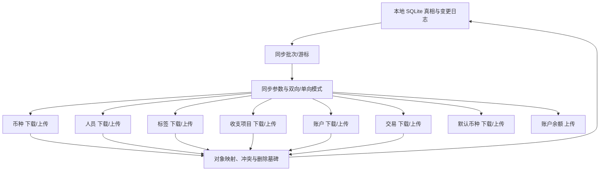
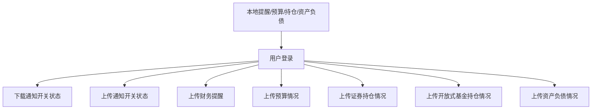

# MoneyHome8 Rust 重构需求分析

本文档基于 2026-07-28 对 `MoneyHome8.exe`、`test.mh8`、运行中界面截图、`Moneyhome.ini`、`DealOption.ini`、`mwSync.ini`、`Notification.ini` 的实测与静态分析整理，用于指导 Rust 重构的落地开发。

## 1. 目标定义

重构目标不是做一个“近似记账工具”，而是做一个在业务功能和关键结果上可替代 `财智8 8.50.0.0` 的 Finance Own 三端应用：Flutter 负责 PC、手机和 Web UI，.NET 负责云端服务，Rust 作为 PC 本地核心负责旧账本迁移和本地 SQLite 能力。旧 Jet 权限体系不是新系统目标，`test.mh8` 读取仅作为 PC 本地迁移适配并行线。最小交付必须覆盖以下四层：

1. 新 SQLite 账本可创建、可浏览、可安全保存，旧账本可通过迁移层逐步导入。
2. 核心业务对象可完整表达：账户、收支、转账、债权债务、外汇、证券、基金、预算、提醒、标签、分类。
3. 主要页面与统计口径可复现：财务数据、财务报表、财务分析、投资一览、账户中心、流水账。
4. 外围能力可迁移：备份恢复、同步、行情更新、导入导出、通知上报。

## 2. 已确认的产品结构

### 2.1 一级导航与入口

已从界面和快捷键确认以下一级入口：

- 财务数据
- 财务报表
- 财务分析
- 记账
- 概况
- 财务记录
- 投资一览
- 标签
- 账户中心
- 财务日历
- 计划与提醒
- 限额提醒
- 今日提醒
- 系统设置
- 同步数据
- 更新行情数据

B01 的 `15/15` 个系统外壳资源已形成结构化部分观察记录。主窗口真实菜单包含账簿、资料管理、计划提醒、财务工具、设置、帮助和退出；账簿菜单已动态到达新建、结算、密码设置、备份和还原，设置菜单已动态到达系统设置和快捷键设置，帮助菜单已动态到达软件许可和关于。后续已在唯一测试账簿上完成真实备份、覆盖还原、结算、密码设置、错误校验、清除和冷启动，并在每轮结束恢复精确基线；授权序列号、保护信息、用户资料和临时密码均已脱敏。

Rust 版必须把主外壳会话状态、账簿生命周期、账簿安全、应用设置和授权状态分离。新建账簿拒绝覆盖并原子创建；备份使用一致性快照和哈希清单；还原默认到新账簿，覆盖前自动安全备份；结算保留截止日封存和性能治理目的，但完整历史仍应在产品内可查询。2026-08-01 已真实生成旧 `.mh8k`：页面固定后缀、拒绝空名称、目录选择取消不改草稿、同名目标显示完整路径并要求覆盖确认，覆盖否零写入；成功文件是加密 7z，内部单条 `BOOK` 声明长度与源账簿一致。同一样本随后完成空来源 `00701`、来源选择取消、覆盖确认取消、当前账簿真实覆盖还原、成功重开、业务摘要抽查和冷启动；旧程序未生成可见的还原前自动 `.mh8k` 安全备份。新版不复制该私有容器作为主格式，而以版本化 SQLite 快照包、清单、逐文件 SHA-256、临时文件和原子改名实现；旧 `.mh8k` 进入隔离的 `legacy_import`，在 Rust 端完成解密迁移以及数据库、附件和设置全量比对前不宣称兼容。密码动态验证已确认无密码两字段、受保护三字段、两次输入不一致、旧密码错误、设置、清除、空/错误密码重试、取消和正确解锁；Rust 版采用版本化密钥派生与原子迁移，把清除保护做成显式确认，并补充失败退避和安全审计。设备级、应用级、账簿级和授权级设置分别存储。详细合同见 `runtime-ledger-lifecycle-and-settings-contract.md`。

B02 的 `41/41` 个账户与基础资料资源已形成结构化部分观察记录。账户类型目录的五个分区、全部直接入口和七个展开组已真实取证，并通过后续向导记录建立入口到创建策略的路由矩阵；目录只负责稳定 `AccountCapability` 与模式参数分派，字段校验和最终事务归目标向导。自绘菜单检查后的特定关闭序列曾触发 `EAccessViolation`，正常人工路径仍待复现，目标实现必须让菜单模型、窗口销毁和应用退出具备明确所有权。现金向导已进一步闭环直接与内联入口、两页默认值、空名称和既有名称校验、上一步草稿保持、标题栏取消、`12.34 CNY` 直接开户及冷启动。旧程序在业务提交后刷新账户中心时先报 `closed dataset`，再报 `C0000025` 并退出，但冷启动确认账户、备注、余额及资产/净资产增量已经持久化；目标实现必须用幂等开户命令和可查询提交结果消除模糊提交。动态验证还到达活期、活期一卡通、定期一卡通、一卡通、金融产品和第三方储值的代表性开户向导，以及分类、人员、币种、汇率和存款利率维护页。`RT-02-034` 已闭环人员编辑器：家庭成员、往来人员、机构三类不可合并；机构隐藏性别和生日；生日必须保留公历/农历与原始年月日；空值、取消、新增、修改和冷启动均已验证。`RT-02-035` 进一步确认三类共享账簿级名称空间，列表按类别投影差异化字段并支持显示字段即时搜索；隐藏可逆且默认排除，引用检查先于删除确认，无引用记录才允许确认后物理删除。HTML 导出取消仍误报成功，系统打印取消不产生作业；新版必须以真实 I/O 结果决定成功状态。`RT-02-036` 已闭环待摊费用：创建页校验人员、名称、正金额、支出项目、正频率、正总次数及已摊次数上界；`100.01 CNY / 3期 / 已摊0期 / 无资金账户` 保存为独立资产账户和一条余额调整流入，概况页只允许修改名称、人员、业务日期和备注，删除会明确列出并级联清理收支、转账和财务计划等关联。目标模型必须拆分主体、初始资金事实和确定性期次，不能只靠账户余额或备注重建。`RT-02-017` 确认资料管理是路由宿主；`RT-02-019`、`RT-02-020` 和 `RT-02-021` 分别校准账户、分类和标签选择器。多账户结果必须包含逐账户金额，三个选择器都只返回版本化引用或引用集合，跨字段规则及最终状态由外层命令校验。旧版“其它金融产品”实际路由到货币基金列表，必须作为兼容别名而非领域合并处理；宿主关闭无隐式保存，业务事务归子编辑器所有。汇率和存款利率已有真实写入与冷启动证据。其它开户向导仍按各自执行条目闭环，不因目录路由已观察就宣称全部业务兼容。详细合同见 `runtime-accounts-and-master-data-contract.md`。

活期一本通也已从页面巡检提升为真实组合提交：空组名、既有组名、空子账户名和既有账户名都在对应步骤阻断；第三页关闭后组名可重新使用。成功样例原子形成 `CodexCurrentPass-1537`、`CodexCurrentSub-1537`、归属关系和 `7.89` 余额调整，冷启动后组小计、子账户余额、导航层级和资产/净资产增量一致。目标模型必须区分组合容器与普通账户组，容器小计只从子账户事实聚合，并对首次组合创建提供幂等、可查询的提交结果。

普通活期账户向导也已完成真实提交：第一页默认名称、人民币、空所有者、空备注和空账户组，第二页默认当前业务日、零余额和空资金来源；空名称和既有 `Cash-CNY` 在第一页阻断，跨页往返保留草稿，第二页关闭后名称可重新使用。成功样例 `CodexCurrent-1604 / 23.45 CNY` 立即进入无账户组投影，冷启动后只有一条 `余额调整` 流入 `23.45`，记录数 `1`，资产和净资产各增加 `23.45`、负债不变。本向导正常退出且未复现另外两个向导的刷新崩溃，但目标提交仍必须原子、幂等并可查询；空账户组和空资金来源分别是可空关系与外部期初语义。

定期一本通已从四页巡检提升为真实组合提交。组名和子账户名分别执行空值与统一重名校验；第三页默认整存整取、`1个月`、`0.25%`，改为 `3个月` 后自动建议 `0.80%`，并可勾选自动续存；第四页保存本金和可选资金来源。成功样例原子形成 `CodexDepositPass-1625`、`CodexDepositSub-1627`、组合关系、定期条款和 `1200.00` 余额调整，冷启动后组小计、余额、`2026-11-01` 到期日、`1202.40` 到期本息和记录数 `1` 均保持。目标系统必须把利率目录建议与开户利率快照分离，显式保存期限单位、日历到期规则、计息方法和舍入策略；自动续存冷启动回填、其它存款类型及完整到期生命周期仍待验证。

一卡通已从结构巡检提升为活期子账户代表性提交。外层第一页只校验账户组名称，既有普通账户名 `Cash-CNY` 可继续，既有组名 `Halifax` 会阻断；第二页要求至少一个勾选子账户。成功样例 `CodexOneCard-2255 + CodexOneCardCurrent-2255 + 88.88 CNY` 在即时投影和冷启动后保持父子关系，组小计等于子账户余额，总资产和净资产各增加 `88.88`、负债不变。旧程序完成内联活期子向导时已经提交子账户，关闭外层向导后组未创建但子账户泄漏到无账户组；Rust 版不得复制该非原子边界，应在外层完成时一次提交容器、成员、关系与期初事实，或为提前提交建立可审计补偿。定期子账户、现有子账户选择、多成员、重复归属和并发失败仍待验证。

家居物品账户也已达到代表性 `pass`。单页向导默认 `我的物品 / 人民币 CNY / 投资`，空名称和既有 `Cash-CNY` 分别触发必填与账户/账户组统一重名提示；切换为自用后标题栏取消，同名仍可成功开户。`CodexItem-2334` 创建后账户行、持仓、成本、市值和交易均为零，资产、负债、净资产不变，证明开户只创建账户身份和类型配置。账户编辑器允许维护名称、所有者、备注、创建日期、资金账户和投资/自用性质，币种只读；自用改投资后即时和冷启动保持，零投影不变。目标模型必须把 `HouseholdItemAccount` 与物品主档、交易、持仓批次和估值快照分层，余额只从后者派生；旧程序隐式恢复旁文件应替换为可识别、可校验、可治理的显式恢复快照。

第三方钱包账户向导也已达到代表性 `pass`。支付宝、微信钱包和其它储值入口复用同一两页窗体，但通过模式参数生成各自子类型和默认名称；旧窗体标题仍可能保留“支付宝、微信钱包”，不能作为类型键。第一步维护账户资料，第二步维护创建日期、余额和可选资金来源，空名称在进入第二页前阻断，跨页往返保持完整草稿。`CodexWeChat-0018 / 0.00 CNY` 无来源提交不生成交易或改变汇总；`CodexRT41Wallet / 12.34 CNY` 其它储值无来源提交则生成一条外部期初余额调整，财务记录 `2189 -> 2190`，资产和净资产各增加 `12.34`。后者提交成功后旧程序在刷新阶段报 `Cannot perform this operation on a closed dataset` 并退出，但冷启动确认业务已持久化，进一步证明开户命令必须幂等并可查询明确提交结果。`TThirdDepositsAcctDlgFm` 已验证名称、所有者、备注和创建日期可原位修改，币种只读，资料取消零写入，资料保存不改变余额或新增交易。目标模型必须保存显式 `ThirdPartyWalletKind`，把零余额、外部期初和既有账户资金来源分成明确语义；真实资金账户来源必须原子生成双边平衡事实。开户与充值、提现继续保持独立命令边界。财付通、提供方专属字段、真实资金来源和有交易账户的引用保护仍待验证。

公共 `TNewAcctWizardDlgFm` 不再作为独立业务页面计数。其 DFM 只有提示区和 `TWizardCtrl`，没有账户字段、数据集或业务页；现金、普通活期、活期一本通和定期一本通的两页、三页、四页运行结果已经覆盖其上一步、下一步/完成和取消协议。Rust 版应以 `WizardShell` 组合具体步骤，宿主只管理展示状态、按钮状态、切页和错误聚焦；草稿、事务、幂等、稳定 ID 和审计必须归具体领域命令。

B03 的 `38/38` 个交易与流水资源已形成结构化部分观察记录。动态验证覆盖财务记录、现金/活期/第三方账户流水、日常收支、取款、转账、工资收入、分拆收支、批量记账、批量转账、查找、筛选及概况收支图表；模板零金额跳过和批量转账手续费从转出账户扣除的页面规则已确认。初始页面巡检没有提交业务写入；后续已分别真实保存日常收入、日常支出、同币种转账、带来源手续费的取款、钱包零手续费充值/提现，以及钱包充值和提现手续费，并完成冷启动复核。分期、批次和其余交易仍不能标记为已成功落库。详细合同见 `runtime-transactions-and-ledger-contract.md`。

B04 的 `54/54` 个债权债务、信用卡、分期和网贷资源已形成结构化部分观察记录。动态验证到达债权债务交易明细、构成、还款表、概况及应收、应付、预收投影，并确认信用卡交易、分期管理、账户设置、账户概况、还款和双币/网贷开户向导。该轮仅创建并删除零余额临时信用卡以解锁页面，未提交债权债务、还款、分期或网贷业务交易；因此账单归属、摊还公式、本息费用分配和失败回滚仍不得标记为已兼容。详细合同见 `runtime-debts-credit-and-amortization-contract.md`。

B05 的 `19/19` 个定期存款与银行理财资源已形成结构化部分观察记录。动态验证到达定期账户编辑、统计工作区、交易宿主、三步开户向导和账户概况，以及银行理财账户编辑、产品目录、产品编辑、统计工作区、交易宿主和产品信息页。2026-08-01 又补齐银行理财账户的两页默认值、空名称与统一重名校验、账户自身/其它账户切换、跨页保持、标题栏取消、`250.00 CNY` 账户自身余额开户、账户中心投影和冷启动；总资产与净资产各增加 `250.00`，负债不变。账户编辑器确认币种只读，并维护开户机构和默认资金账户模式。开户余额只是账户可用现金，不自动生成产品或持仓。真实其它账户的非零双边转入、产品核销、持仓本金、申购赎回、收益公式和失败回滚仍不得标记为已兼容。详细合同见 `runtime-deposits-and-bank-wealth-contract.md`。

B07 的 `6/6` 个投资公共能力资源已形成结构化部分观察记录。动态验证确认投资一览按账户分组展示持仓，并可在按市值和按成本两种构成图间切换；两种图例合计分别与页面当前市值和投入成本精确一致。历史盈亏及市值构成和变动已在贵金属、TD、期货、融资融券等最终宿主中到达。该轮没有提交持仓调整、费用、利息或行情更新，因此成本批次分配、实现盈亏、跨币种估值和失败回滚仍不得标记为已兼容。详细合同见 `runtime-investment-shared-projections-contract.md`。

B08 的 `21/21` 个上市证券资源已形成结构化部分观察记录。动态验证到达证券账户向导、账户编辑和概况，证券资料与历史价格目录，全局 A/B 股费率模板，证券代码变更，持仓统计、交易明细、市值构成和历史盈亏；原有买入、卖出、新股申购、中签确认、配股、送股/缩股和现金红利表单证据也已纳入统一账簿边界。全局费率已进一步完成代表性真实写入：A 股卖出印花税和 B 股结算费手工提交后冷启动保持，在线更新成功发布 `11` 条并覆盖两个手工值；更新窗口内账簿外 `mhlink.mdb` 时间状态发生变化。持仓样例满足“市值 `15,860.00` - 成本 `16,424.30` = 浮动盈亏 `-564.30`”，成本和市值构成图也分别与页脚合计一致。账户级费率页、新股三记录关联和独立证券选择对话框因运行态前置条件不足保持部分验证；真实交易费用、成本批次、已实现盈亏和代码迁移仍不得标记为已兼容。详细合同见 `runtime-securities-ledger-and-valuation-contract.md`。

B09 的 `29/29` 个开放式基金与货币基金资源已形成结构化部分观察记录。动态验证到达两类账户向导、账户编辑和概况，开放式基金与货币基金目录、基金净值、持仓统计、交易明细、市值和历史盈亏；既有申购、赎回、转换、现金红利、分红再投资、新基金认购、认购确认和拆分表单也已统一到最终账簿边界。开放式基金样例满足“数量 `60,000.81` * 净值 `2.4195` = 市值 `145,171.96`”和“浮动盈亏 `73,716.97` + 已实现盈亏 `132,594.11` = 总盈亏 `206,311.08`”。本轮创建并删除零余额临时货币基金账户以覆盖空工作区，退出后已恢复 B09 前指纹；后续基金计划又完成代表性真实申购，确认金额 `1.00`、前端费率 `1.00%`、费用 `0.01`、净份额 `0.99`、含费均价 `1.0101`，且成交净值与最新行情估值分离。其它金额和收费模式的舍入、赎回、收益结转、成本批次、认购和拆分公式仍不得标记为已兼容。详细合同见 `runtime-open-and-money-market-funds-contract.md`。

B10 的 `15/15` 个债券资源已形成结构化部分观察记录。动态验证到达债券资料目录与编辑器、账户开户向导、账户编辑和概况、持仓统计、交易明细、成本市值构成和历史盈亏，并确认买入、卖出、到期、提前兑取和利息五类专用表单。该轮仅创建并删除零余额人民币临时债券账户以解锁工作区，未保存债券资料、持仓或交易；退出后已恢复 B10 前指纹。真实净价/全价、应计利息、费用舍入、成本批次、兑付损益、税务和失败回滚仍不得标记为已兼容。详细合同见 `runtime-bonds-ledger-and-maturity-contract.md`。

### 2.2 账户与资产域

已确认账户体系至少包含以下类型：

- 现金
- 活期（卡折）
- 定期
- 第三方储值
- 上市证券
- 开放式基金
- 外汇
- 重大资产
- 应付款
- 预收款
- 应收款

从资源窗体进一步确认，还存在更广义的账户/资产域：

- 信用账户
- 商业保险
- 社会保险
- 期货
- 黄金
- 标准贵金属
- 融资融券
- 债券/国债
- 货币理财/金融产品
- 实物或重大资产
- 预付类资产/待摊类资产

当前界面可见账户组织方式为“账户组 -> 账户”树结构，说明 Rust 重构时必须保留以下能力：

- 账户组分层管理
- 按账户类型筛选
- 按账户类型查看
- 新增账户组
- 新增账户
- 账户余额汇总
- 资产/负债/净资产底部总计

运行态曾校准到账户中心资产 `8,535,534.04`、负债 `1,444,074.57`、净资产 `7,091,459.47`，而同次概况页净资产为 `7,091,459.48`，存在 `0.01` 差异。B19 在行情更新后的同一账簿状态再次核对，概况与账户中心均显示资产 `8,540,196.43`、负债 `1,444,589.25`、净资产 `7,095,607.18`，当前快照一致。Rust 版仍必须定义唯一金额聚合、估值时点与舍入策略，并用确定性回归测试防止旧的跨页面漂移。

账户组编辑链路进一步确认：`TEditAccountGroupFm` 负责账户组名称和父级保存命令，`详细资料...` 打开复用的 `TAcctDetailDlg` 二级模态窗。账户组模式下字段为联系电话、联系方式、密码和备注；父窗名称为空时，二级窗仅以 `未命名` 作为临时展示值。空名称点击确定会提示 `请输入账户组名称`，提示关闭后保留原编辑器且不会写入账簿，证明必填规则在保存命令中执行，`未命名` 不是合法默认值。有效名称和详细资料已经实测成功保存：密码在 UI 中以星号遮罩，二级窗确定后文件时间不变，父账户组确定后文件才发生写入。Rust 版应采用“账户组编辑草稿 + 详细资料子草稿”，二级窗确认只回写草稿，父窗确认时才在一个事务中持久化；校验失败保留草稿，任意层取消必须整体丢弃未确认数据。复用详细资料窗需要按上下文显式切换字段和外部集成入口，密码字段必须采用遮罩展示、受保护存储并禁止进入普通日志。

账户组名称和修改链路已进一步用真实保存与冷启动校准。精确输入既有组名 `CASH` 会在写入前提示 `已有相同名称的账户组存在，请重新输入账户组名称`，但前后带空格的 ` CASH ` 被旧程序作为不同名称接受，账户中心和重新打开编辑器又都显示为 `CASH`，形成视觉重名。随后把该组原位修改为 `Codex-Group-Edit-20260801`，并保存联系电话、联系方式、遮罩密码和备注；二级详细资料确认仍不写文件，父级确认才提交，同会话和冷启动均完整回填。Rust 版不能复制此缺陷：名称必须先执行首尾空白裁剪、Unicode 规范化和明确大小写规则，再由领域校验与数据库唯一索引共同保证同账簿同级唯一。

组级“添加账户”打开名称和余额多选表。本轮把 `Cash-CNY 608.00` 加入新组后，目标组小计从 `0.00` 变为 `608.00`，原 `CASH` 小计从 `9,495.70` 降为 `8,887.70`，资产、负债、净资产保持 `8,540,196.43 / 1,444,589.25 / 7,095,607.18`，冷启动后关系保持。目标模型应以稳定账户 ID 和账户组 ID 保存关系；关系提交只刷新目标组、原组、账户选择器和汇总投影，不生成余额事件、改写交易或依赖名称连接。

账户中心还支持“按账户类型”和“按自定义分组”两种投影，以及已结清债权债务、到期、隐藏、注销账户四个独立显示开关。自定义分组视图按组聚合余额，空组显示 `0.00`。四个开关基线均关闭；开启已结清账户会显示多条零余额历史账户，开启隐藏或注销会分别展示灰色“已隐藏”和“已注销”账户，到期开关在当前测试库无可见对象。开关只改变可见投影，资产、负债和净资产保持；“显示注销账户”会跨冷启动保持，说明查看偏好需要持久化但必须与账簿业务事实分离。选中组后提供修改、删除和添加账户；删除确认明确约定永久删除账户组，但组内账户只解除关联。真实把 `Cash-CNY 608.00` 移入临时组再删除该非空组后，账户进入 `无账户组`，原 `9` 条交易、累计流入 `15,708.00`、流出 `15,100.00`、账户余额和全局资产负债汇总均保持，冷启动结果一致。Rust 版应让两种投影共享同一查询、估值和总计服务；删除组、删除组专属详细资料、清除账户关联和审计事件必须在一个事务中完成，不能级联删除账户、余额事件、交易、附件或标签。

左侧账户导航还有独立的 `设置[自定义]显示` 编辑器。真实操作确认它按组/账户层级提供勾选、半选、全选、反选、上移和下移；隐藏 `H-Current` 并把 `Halifax` 下移后，左侧导航立即刷新且资产、负债、净资产完全不变，冷启动保持。重新勾选并上移后再次冷启动恢复；标题栏关闭不提交。静态代码会先清空全部 `NavigationOrder` 再逐账户写 `NavigationOrder/NavigationShow`，说明旧实现是批量偏好替换。Rust 版应改为独立、版本化、原子提交的导航偏好模型，使用稳定账户 ID，不把导航隐藏混同于账户隐藏状态，也不改写账户组关系或财务事实。

账户状态生命周期已用既有零余额样例动态往返。隐藏账户的菜单显示“取消隐藏”，恢复活动状态无确认；重新隐藏时明确提示该账户及其交易不再参与统计且不会在其它页面展示，选择否零变化，选择是写入“已隐藏”。注销账户的菜单显示“取消注销”，恢复同样无确认；重新注销时提示余额将被清零但历史交易保留，选择否零变化，选择是写入“已注销”。两种状态及对应显示偏好都通过冷启动保持。Rust 版必须把 `active / hidden / written_off` 建模为可逆、可审计、带版本的状态转换，而不是删除或复制账户；隐藏只影响统一查询策略，注销必须保留账户 ID 和历史关系。零余额样例确认了状态转换和查询投影，非零余额样例进一步校准了注销清零分录与取消注销的不对称语义。

非零余额注销现已用 `Cash-CNY 608.00` 校准。旧程序确认注销后新增一条流出 `608.00` 的“余额调整”，交易数 `9 -> 10`，账户变为 `已注销 / 0.00`；`CASH`、资产和净资产均减少 `608.00`，历史 9 条交易保留并通过冷启动。取消注销只恢复活动状态，不删除或冲销这条清零调整，余额、交易数和降低后的净资产继续保持，第二次冷启动结果一致。目标系统应把这一复合操作拆成可追踪但原子提交的 `account_writeoff` 和 `account_writeoff_balance_clear`，禁止用无来源的普通余额调整或直接覆盖余额。取消注销必须明确“只恢复状态，不恢复余额”；如需恢复余额，应提供引用原清零事件的独立反向分录并保留完整审计。

账户标签关联已用无标签基线完成动态往返。`Cash-CNY` 的“加入标签”先打开外层 `TSelectTagDlgFm`；按 `F4` 展开的 `TmwSelectTagDrop` 支持过滤、多选和受控新增。关闭外层对话框不写入。通过 `[新增标签]` 保存 `Codex-AccountTag-20260801-0409` 时，标签主数据立即独立持久化并自动回填外层草稿；只有再点击外层“确定”才写账户与标签的关系。关联后账户行显示标签，但余额、账户组小计和资产负债汇总不变，冷启动保持。取消选中并提交空集合只解除关系；第二次冷启动后关系仍为空，而标签仍作为未选候选存在。Rust 版必须分离 `tag` 主数据与 `account_tag` 关系，用稳定标签 ID 提交目标集合差异。创建标签、关联和解除关联是三个独立、可审计、可幂等的业务动作；解除关系不得级联删除标签，关联失败也不得回滚已成功创建且可能被其它对象使用的标签。

非空账户永久删除已用 `Cash-CNY 608.00` 和原有 `9` 条账户流水完成动态校准。删除确认明确声明会移除账户、相关收支、与其它账户的转账和关联财务计划；选择否时页面与文件均零变化。确认后账户消失，但结果不是把全局总额简单减去 `608.00`：`CASH` 小计从 `9,495.70` 变为 `-149.80`，`China Bank` 从 `337,760.19` 变为 `341,760.19`，资产/负债/净资产分别变为 `8,544,887.67 / 1,445,417.99 / 7,099,469.68`。全历史记录从 `2,189` 条变为 `2,180` 条，精确移除流入 `26,845.50`、流出 `30,708.00`，被删除事实净额 `-3,862.50` 与净资产增加 `3,862.50` 完全对应，冷启动保持。Rust 版必须分离隐藏、注销和永久删除；永久删除先生成带版本的影响快照，再单事务处理账户业务可见性、收支、转账双腿、计划关系、索引和审计，最后从剩余事实统一重建对手账户及全部汇总。底层可以使用墓碑或隔离审计存档支持恢复，但正常查询不得留下孤立分录、单边转账或悬空计划。

账户附件现已完成真实添加、打开、冷启动、删除和再次冷启动。空态 `TAccessoriesDlg` 只启用添加；选择任意文件后旧程序立即把字节级副本写到 `账簿名\Account\账户数字 ID\原文件名`，本轮 `Cash-CNY` 映射为 `test\Account\23\account-attachment-probe.txt`，源文件与副本 SHA-256 一致。预览、系统打开、动态附件菜单和“打开附件文件夹”都读取该受管副本，冷启动后账户行显示 `1个附件`。删除选择否零变化；选择是删除关系、文件和最后空目录。旧版在同一会话仍残留 `1个附件`，冷启动才刷新，属于投影缺陷。Rust 版无需沿用旧目录命名，但必须使用稳定附件 ID、独立业务关系、受管相对路径和内容哈希；添加采用暂存复制与原子提交，删除采用引用计数或最后引用检查，数据库、文件系统、附件计数和备份清单必须保持可恢复一致。

现金账户修改已用 `Cash-CNY` 完成真实校验和保存。编辑器读取名称 `Cash-CNY`、日期 `2024-01-01`、币种 `人民币 CNY`、所有者 `Lzb` 和空备注；已有现金账户的币种控件禁用。空名称提示 `请输入账户名称`，改为既有 `Cash-GBP` 提示 `已有相同名称账户`，两个失败都保留编辑器且不写入。有效保存 `Codex-Cash-CNY-Edit` 和临时备注后，账户行显示新资料并按名称从 `CASH` 组第一行移动到第三行；余额 `608.00`、组小计 `9,495.70` 和资产负债汇总完全不变，同会话重开和冷启动均正确回填全部字段。目标实现必须以稳定账户 ID 和预期版本原位更新主数据，用规范化唯一索引兜底名称竞争；资料修改不得重建账户、余额事件或历史关系，成功后所有选择器、流水和报表从同一账户版本刷新。

修改所属账户组已从 `H-Current` 的账户工作区真实到达：`操作 -> 查看账户资料 -> 选择账户组` 打开 `TEdtAcctGrpDlgFm`，初始关系为 `Halifax`。选择器包含 `<无>`、既有账户组和 `[新增]`；先选 `CASH` 后关闭，概况仍为 `Halifax`，证明取消只丢弃草稿。重新选择并确定后，概况和左侧导航立即把账户移到 `CASH`，同会话重开及冷启动都读回 `CASH`；余额 `795.57`、`558` 条交易、开户银行 `Halifax` 和资产/负债/净资产完全不变。Rust 版必须把账户组关系独立建模为稳定账户 ID 到可空组 ID 的版本化关系，确定时原子替换并刷新原组、目标组、概况和导航；不得按组名或开户银行文本绑定，也不得生成余额事实。保存到 `<无>`、内联新建、组失效、并发和失败回滚仍需补测。

标签排序编辑器已用三个无关联临时标签验证入口、空态、有数据态、完整初始顺序、拖动视觉预览、标题栏取消、确定按钮和冷启动读回。固定 `<无>` 只出现在标签页，不进入排序窗。后台自动化能移动旧 VCL 子控件但未触发内部顺序状态，因此不能把真实拖放后的持久化标记为已验证，也不能据此判定旧程序存在保存缺陷。Rust 版应使用独立的 `TagOrderPreference(scope, ordered_tag_ids, version)` 或等价模型，按稳定标签 ID 原子替换完整序列；取消、冲突和失败保留旧版本，排序不得改写标签主数据、隐藏状态、账户/交易关系或财务事实，并提供键盘上移/下移替代拖放。

标签页主数据生命周期已用无标签基线完整往返。空名称和单个精确重复在写入前阻断；单个标签保存、改名取消/保存、无引用删除取消/确认均符合明确提交边界。`RT-02-033` 进一步校准半角分号批量语义：空分段和尾分号被忽略，批次内精确重复被合并；混合新旧名称时创建全部新名称并跳过已有名称，只有批次没有任何新名称时才提示重复。保存后标签页默认选中批次第一项，五个标签经冷启动保持且没有自动生成账户或交易关系。Rust 版应通过预检和单事务复现这一可见结果，显式返回新建、已有和默认选择，不能逐项写入。隐藏不是删除，`显示隐藏标签` 是独立且可持久化的查看偏好，二者通过冷启动保持。页面同时提供标签范围内的交易记录和资产账户投影、文本查找、多条件筛选、快速加入/移出/转移、导入记录到标签、导出和打印。无记录选择时批量命令阻断；两类网页导出在系统保存对话框取消后仍误报成功，目标实现不得复制。Rust 版应以稳定标签 ID、规范化唯一名称、隐藏状态和乐观版本建模主数据，以稳定交易 ID/标签 ID 建模关系差异；删除前检查完整引用图，查询、批量、导出和打印共享同一范围快照。

### 2.3 交易与明细域

从 `DealOption.ini` 的窗体与列定义可以确认，至少存在以下交易子域：

- 现金交易 `TCashTransFm`
- 活期交易 `TCurrentTransFm`
- 定期交易 `TFixedDepositTransFm`
- 第三方储值交易 `TThirdDepositsTransFM`
- 债权债务交易 `TClaimsTransFm`
- 外汇交易 `TForeignTransFm`
- 证券交易 `TSecurityTransFm`
- 开放式基金交易 `TOpenFundTransFm`
- 流水账总览 `TWasteBookFm`

这意味着 Rust 版本不能只做单一“收支表”，而应至少建模为“统一交易基类 + 分类型扩展字段”的体系。

运行态已校准：财务记录页默认查询最近一月的全部记录，当前返回 `23` 条，流入 `249,277.84`、流出 `240,556.08`、差额 `8,721.76`。切换 `仅收支记录` 后排除转账等非收支活动，结果为 `13` 条，列标题和底部汇总同步变化。列表、合计、图表、导出和打印必须共享同一查询 DTO 与筛选快照。

查找窗口支持日期、活动类型、流入、流出、资产账户、标签和备注；`查找下一个` 仅移动当前选择，`重新开始` 仅重置查找游标。筛选窗口支持账户、活动类型、关键字、标签和金额条件，并保留条件供再次编辑。关键字 `Council Tax` 命中一条 `GBP 242.00` 记录时，底部流出显示 `2,185.16`，证明行投影保留原币金额而汇总使用本位币折算。清空筛选恢复相同 `23` 条记录后，流出与差额各出现 `0.01` 漂移。Rust 版必须在查询 DTO 中同时表达原币金额、本位币金额、汇率快照和汇总币种，禁止 UI 临时换算，并保证相同查询快照结果确定可复现。

财务记录支持列拖放分组和显式批量模式。批量模式增加逐行复选框，未选择时删除、设置标签和设置备注禁用。选中转账执行修改会按交易类型打开 `TCashXferDlgFm`，说明统一交易列表必须通过交易种类分派到专用编辑策略；转账草稿包含两侧账户、金额、币种、手续费、手续费账户、标签、备注、日期和附件。保存时交易头、两侧分录、手续费及关系数据必须单事务提交。

同币种转账真实保存进一步校准了金额口径：`Cash-CNY -> 顺德农行` 本金 `50.00`、来源手续费 `1.00` 后，来源余额由 `608.00` 变为 `557.00`，目标余额由 `100.00` 变为 `150.00`，净资产减少 `1.00`；来源流水显示单条 `51.00` 流出，全局财务记录以同一业务身份显示流入 `50.00`、流出 `51.00`，冷启动后完全保持。目标系统必须把本金和手续费作为独立业务组成原子保存，再按查询用途决定是否合并展示。账户候选必须绑定稳定 ID；只有显示文本而未绑定对象时应阻止提交，不能按名称猜测账户。

普通收入和普通支出则复用 `TIncExpDlgFm` 与内嵌 `TIncExpEditFrame`。父窗按交易方向切换 `日常收入` / `日常支出`，框架统一承载收支项目、金额、收支账户、标签、日期、备注和附件。已有 `职业工资` 记录仍进入通用日常收入编辑器，而不是 `TPayrollIncomeDlgFm`，证明收支项目名称不是编辑器分派键。真实新增又确认空白草稿先显示 `日常收支`，选择 `其它收入` 或 `教育培训` 后才切换方向；两个方向都输入正金额，分别生成单边流入和单边流出。`Cash-CNY +3.00 / -2.00 CNY` 保存后余额、CASH 分组和全局流水逐分更新并在冷启动后保持。目标系统必须保存显式交易种类和稳定分类 ID，在提交事务内校验分类方向；公共字段组件只能修改父级草稿，父窗确定时统一原子更新交易头、单侧账户分录及各类关系，父窗取消时整体丢弃。

共享收支项目选择器已进一步校准。空白日常收支默认打开支出页，运行态创建 `22` 个支出候选和 `12` 个收入候选；`交通` 与子项 `公共交通`、`汽车` 在同一层级行展示。搜索 `工资` 只返回 `职业工资 / 收入`，搜索 `其它` 同时返回 `其它收入 / 收入` 和 `其它支出 / 支出`，无匹配返回空集合。选择结果会即时切换父窗日常收入/支出方向，失焦或只切页签不会修改原分类。目标系统应以 `CategorySelectionSpec` 查询同一版本分类树，并返回包含稳定 ID、方向、父级和版本的 `CategoryRef`；搜索结果必须显式显示方向和层级。内联新增是独立命令，但旧版从收入页新增仍默认支出，目标实现必须继承当前方向或要求显式确认，取消和失败返回原草稿。管理入口的可见宿主、成功新增刷新和真实键盘仍待补测。

共享标签选择器已在日常收支宿主完成独立校准，并与账户标签外层流程交叉验证。无标签基线显示明确空态；创建 `CodexSelTagA-1409;CodexSelTagB-1409` 后形成两个候选，过滤 `TagB` 只显示第二项，无匹配返回空候选，清空过滤保持原选择。两个候选可同时选中，确定后父级以分号文本展示；取消全部可返回空集合。旧版失焦会把当前集合自动回填父级草稿，但不会保存交易。内联新增空值阻断，分号批量创建独立写标签主数据，父级只自动选中第一项；关闭父级后两个标签仍存在。Rust 版应以 `TagSelectionSpec` 查询版本化候选，并返回有序去重的 `TagRef` 集合；过滤、确定和失焦只更新宿主草稿，父级保存才提交对象标签关系。批量新增必须明确返回全部新标签和默认选择策略，父级取消或关系失败不得删除已创建标签。真实键盘、隐藏/范围过滤、候选失效、批量失败和交易标签保存仍待补测。

收支项目主档已完成代表性真实写入校准。列表按支出/收入方向切换，并在一级项目行直接提供“新增二级项目”；编辑器默认支出，名称为空时提示“请输入收支项目名称”，同方向已有名称 `交通` 时提示“已有相同名称的收支项目存在，请重新输入收支项目名称”。切换收入后，父级候选只出现收入项目，未混入支出项目。真实创建 `CodexParent0801 -> CodexChild0801` 后，列表在同一行分别显示一级和二级项目；`保存并新添` 提交 `CodexBatchA0801` 后保持编辑器打开、清空名称并保留支出方向，随后普通保存 `CodexBatchB0801`。四个对象均在冷启动后保持。目标系统必须使用稳定分类 ID，显式保存收入/支出方向、父级关系、排序、隐藏/系统标志和乐观版本；父级必须与子项同方向且不得形成环，空名称和规范化重名必须在写入前阻断，连续新增每次只提交一个完整命令并按明确规则重置草稿。

分类列表默认勾选“按使用量排序”，此时“调整收支项目顺序”禁用；切换“按自定义排序”后两个模式互斥，顺序编辑器立即启用。真实拖动 `CodexLifeB0801` 跨越多个一级项目并点击确定后，主列表按新顺序刷新，冷启动仍保持自定义模式和完整顺序。目标系统必须把排序模式与按稳定 `category_id` 保存的有序集合分开建模：拖动只更新草稿预览，确定时基于分类树版本原子提交，排序不得改变方向、父级、交易引用或余额。显示系统类别时支出控件数由 `46` 增至 `57`，增加 `11` 个固定系统项目；关闭后恢复。显示隐藏类别在当前无隐藏项目基线下不改变数量，因此只确认了查询开关，尚未验证具体项目隐藏与恢复。两个显示选项应作为查询投影条件，系统项目必须由能力标志保护，不能依赖显示名称。

常用备注使用 `TFmIncExpCaptionForm` 管理列表、`TIncExpCapionDlgFm` 编辑单条“备选说明”。空内容保存提示“请输入常用备注”；真实保存 `CodexMemo0801` 后列表立即追加，随后修改为 `CodexMemoEdited0801` 时原行更新而不是新增重复对象。删除提示“您确定删除此备注吗？”，选择否保持记录，选择是后删除并通过冷启动复核。目标系统必须把常用备注建模为带稳定 ID 和版本的可复用主数据，交易提交时保存备注文本快照；主档修改或删除不能回写历史交易。空白、重复、超长、Unicode、多行、引用中删除和并发失败仍待校准。

币种与汇率页使用 `TCurrListFm` 组合币种主档和日期化汇率历史。上半区显示本币、名称、代码和对人民币当前牌价，下半区按日期显示货币对、报价方向与四位汇率。把 `2026-07-29 USD/CNY` 从 `6.7894` 修改为 `6.7895` 后，上下两个投影即时同步并通过冷启动；删除选择否零变化，确认删除后当前值和历史首行同时回退到 `2026-07-28 / 6.7829`。按日期显示全部汇率会切换为指定日期的跨币种查询，默认当天无记录时返回空表。Rust 版必须让当前牌价由最新有效历史查询产生，以日期、货币对和报价方式组成稳定业务键，并使用版本、来源和审计处理修改与删除；不得维护第二套可漂移当前值，也不得用主档变化静默回写历史成交、冻结报表或既有估值快照。

存款利率使用 `TRateFm` 分成人民币和外币两张矩阵。人民币表按储蓄类型、期限和年利率展示，类型与期限受控、年利率可内嵌编辑；把活期利率从 `0.35` 改为 `0.36` 后无需额外保存，冷启动仍保持。操作菜单的“更新利率”进入 `TOnlineGetDataFm`，只勾选存款利率即可执行在线批次；本轮日志显示两批分别接收 `70/3` 条并更新 `63/0` 条，返回后人民币活期变为 `0.10`，当前可见外币矩阵未变化。历史行情页不提供存款利率或证券交易费率。运行时反汇编进一步确认旧编辑器只检查文本能否解析为数字，失败时静默恢复旧值；有效输入按二进制浮点乘 `10000` 后取整并即时写入，没有发现负数、上限或小数位校验。Rust 版不得复制该宽松与浮点协议：按币种、存款类型、期限、生效时间、来源和批次保存十进制定点不可变版本，无效输入显示字段错误，在线批次整批校验后原子发布，不得回写历史利息或冻结报表。

顶部 `记账` 已实测为跨域命令菜单：一级直接提供日常收支、批量记账、批量转账、工资收入、存款、取款、转账、借入、借出和物品买入，更多交易活动再按调整、收支、银行存款、第三方钱包、信用卡、证券、基金、债券、理财、贵金属、外汇、融资融券、网贷、期货、重大资产、物品和保险等业务域分组。Rust 版应把它实现为应用层命令注册与发现入口，而不是把所有窗体逻辑塞进导航组件。

工资收入使用独立 `TPayrollIncomeDlgFm`，而不是根据“职业工资”等分类名称路由普通收入。DFM 与 19 个当前类事件处理器确认页面维护收入项目、扣款项目和社保账户缴费三组明细；每行包含隐藏稳定 ID，社保明细进一步拆分个人缴费与公司缴费。2026-08-01 动态校准又确认收款账户选择器可从真实候选列表绑定 `Cash-CNY`，社保人员候选为 `<无>`、`LHM`、`Lzb`、`Qrd`；选择 `Lzb` 后页面才展开社保账户、个人缴费和公司缴费三列表格。仅向收入项目编辑器写入“职业工资”显示文字不能形成有效对象绑定，点击确定仍提示“请选择收入项目”，因此 Rust 选择器必须返回稳定 ID 和版本，不能把显示文字当成领域引用。收入金额 `10.00`、没有有效扣款和社保明细时，旧页面即时显示收入合计和实收均为 `10.00`，确认实收是草稿派生值。Rust 目标口径为 `实收现金 = 收入合计 - 普通扣款 - 个人社保缴费`，公司缴费与个人缴费共同增加社保账户权益；工资头、全部组成、实收账户流入、社保账户权益、标签、税务计算快照和审计必须单事务提交。个人所得税计算器必须保存税制版本、输入和舍入结果后显式回填草稿，不能直接入账。旧程序普通扣款与社保缴费的完整实收公式，以及现金、资产和报表投影仍待真实样例校准。取款使用 `TCashWithdrawDlgFm`，包含取款账户、资金去向、可用资金、全部取完、手续费及手续费支出账户；真实保存 `顺德农行 -> Cash-CNY` 本金 `4.00 CNY` 和来源手续费 `1.00 CNY` 后，来源减少 `5.00`、目标增加 `4.00`、净资产只减少 `1.00`，全局记录显示流入 `4.00`/流出 `5.00` 且冷启动保持。存款使用 `TLZCashDepDlgFm`，包含存款账户、资金来源和金额。存取款都属于双边资金移动，不能退化为普通单边收支；取款本金与手续费必须保留独立组成并在同一事务内提交。

`调整` 子菜单中的余额调整使用 `TNewRecTransDlgFm`，现金、贵金属、期货、融资融券和保险账户工作区均复用该编辑器。它读取稳定账户 ID、可选币种维度、有效日期、账面余额和余额版本，用户输入真实余额后由领域层计算“真实余额 - 账面余额”，再按所选差额策略生成交易。`Cash-CNY` 已真实验证：默认类型账面 `608.00`、真实 `609.00` 生成流入 `1.00`，修改为真实 `607.00` 后同一记录跨零改为流出 `1.00`，删除完整恢复全部投影；默认“保存并继续”提交后保留账户、日期和类型，账面余额刷新为 `609.00`，真实余额、标签和备注清空。两个策略均允许零差额，默认类型生成零金额调整事件，日常收支生成零金额普通“对账收入”；这类事实参与记录数、查询、审计、迁移和删除，但不改变余额与金额汇总。动态 `日常收支` 类型已校准为转换策略：`delta < 0` 生成普通“对账支出”，其它情况生成普通“对账收入”，后续修改分别进入日常支出/日常收入编辑器并以差额绝对值为正金额，不再返回真实余额编辑器。日常收支保存并继续可提交正负差额，但旧界面保留已提交的真实余额、备注和陈旧账面显示；目标系统必须刷新权威余额版本，只保留账户、日期和策略，并清空真实余额、标签、备注和附件。目标系统必须把默认调整事件和对账收支转换拆成明确命令分支，二者共享余额版本读取但具有不同后续生命周期；分类使用稳定 ID，不能根据显示文字路由。账户、日期和隐藏币种选择均会触发余额刷新，说明调整基线不能只取当前页面缓存。目标系统禁止直接覆盖账户余额，并通过乐观并发校验防止期间新增交易造成错误调整。对账收支的完整报表口径、系统对手分录和历史日期重算仍待校准。

持仓调整使用 `TAdjustHeldDlgFm`，输入账户/资产、持有产品、持仓总成本和持仓数量。目标系统同样不得直接覆盖持仓投影，而应保存可审计的调整事件：数量差额等于新数量减当前数量，成本差额等于新总成本减当前成本基础；提交前必须校验持仓版本，成功后再重建持仓、成本和估值投影。

`收支` 子菜单实际包含日常收支、分拆收支、待摊费用和工资收入。分拆收支使用 `TSplitIncExpDlgFm`：上表按项目拆分收入、支出、标签和备注，下表按账户拆分金额。原软件由第一行项目类型决定交易方向、第一行账户币种决定交易币种；Rust 版应把方向和币种提升为显式交易头字段，并要求项目合计与账户分录合计逐分相等。待摊费用使用 `TPrepaidExpensesIncExpDlgFm` 创建，记录款项、人员、金额、币种、可选资金账户、项目、首次摊销日期、频率、总次数和已摊销次数；运行态已确认人员、名称、正金额、项目、正频率、正总次数和已摊次数上界校验。无资金账户样例 `100.01 CNY / 3期` 保存后创建独立资产账户和一条余额调整流入，未当场产生项目支出；账户行修改命令打开 `TPrepExpeAcctDlgFm`，只允许改名称、人员、业务日期和备注，金额、币种、项目和计划参数只读。目标模型应拆分为待摊费用主体、外部期初或双边初始资金事实、确定金额期次和幂等摊销交易；尾差分配由新版明确策略保证期次合计等于原始金额，MoneyHome8 旧公式在真实到期执行前不得标记为已兼容。

第三方钱包分组包含充值和提现，两个方向复用 `TRechargeDlgFm`。充值读取钱包账户、资金来源、金额和手续费；提现读取提现账户、资金去向、金额和手续费。目标系统必须把方向保存为显式 `wallet_recharge` 或 `wallet_withdrawal` 业务动作，不能依赖窗体标题、字段显示文字或金额正负判断持久化语义；充值原子写入资金来源本金出账、钱包本金入账和可选手续费，提现原子写入钱包本金出账、目标账户本金入账和可选手续费。运行时 DFM 进一步确认两侧账户选择器都提供新建账户命令，账户创建返回编辑器时必须绑定稳定账户 ID 并保留当前草稿。真实保存 `Cash-CNY -> 微信钱包` 本金 `2.00 CNY`、手续费 `0.00` 后，来源余额 `608.00 -> 606.00`、钱包余额 `2,986.44 -> 2,988.44`，全局记录以同一充值身份显示流入/流出各 `2.00`；反向真实保存 `微信钱包 -> Cash-CNY` 本金 `1.00 CNY`、手续费 `0.00` 后，钱包余额 `2,986.44 -> 2,985.44`、资金账户余额 `608.00 -> 609.00`、CASH 分组 `9,495.70 -> 9,496.70`，全局记录同样显示流入/流出各 `1.00`。两个方向净资产均不变且冷启动保持，证明交易方向必须由显式业务动作决定。手续费样例进一步确认统一规则：充值本金 `1.00 CNY`、手续费 `0.10 CNY` 时，`Cash-CNY 608.00 -> 606.90`、钱包只增加 `1.00`；提现同额手续费时，钱包总减少 `1.10`、资金去向只增加 `1.00`。两个方向全局流入/流出均为 `1.00/1.10`，净资产只减少 `0.10`；因此发出资金的一侧承担手续费并流出 `本金 + 手续费`，接收侧只取得本金，本金和费用必须作为可区分组成原子提交。充值手续费生命周期继续确认：把费用 `0.10 -> 0.20` 时，钱包本金不重复入账，来源账户、来源分组和净资产只追加差额 `-0.10`；删除该充值前出现显式确认，确认后交易行、钱包、来源账户、分组和净资产全部恢复基线，修改态与删除态都通过冷启动。Rust 应以稳定交易 ID 和版本执行修改，按原组成与新组成计算差额；删除应保留审计并原子撤销所有组成和投影。充值与提现的“保存并继续”都提交当前草稿并保持窗口，保留当前钱包账户和业务日期，清空对方账户、金额、手续费、标签与备注；两个方向修改后直接关闭和删除确认选择否都不写入，确认删除后恢复基线并通过冷启动。目标实现应显式创建下一草稿实例，并保证取消路径不改变交易版本、余额或审计状态。两次无新增业务的正常退出产生不同 Jet 文件哈希，因此冷启动兼容验收必须比较业务事实而不能要求文件字节恒等。费用报表分类、提现费用修改差额、附件/标签/内联账户保留策略及技术失败回滚仍待校准。

信用卡分组包含信用卡取现和信用卡还款。`TCashCardDlgFm` 的取现输入取款信用卡、资金去向、金额和手续费，应原子增加信用卡负债、增加目标账户资金并记录手续费；`TDrawalCardDlgFm` 的还款输入信用卡、资金来源、还款金额和利息，并显示还款总额。还款总额应逐分等于本金加利息，资金来源出账、信用卡本金减少、利息费用和可用额度刷新必须单事务提交。

银行存款分组除存取款和转账外，还包含利息收入和货币兑换。利息收入使用标题为 `资金利息收入` 的 `TInvestFeeDlgFm`，读取资金账户及其币种并录入金额；同一窗体可能被其它投资费用/利息动作复用，因此领域模式必须由业务命令显式传入。真实保存 `Cash-CNY +2.00 CNY` 后，余额从 `608.00` 增为 `610.00`，CASH 分组人民币折算值同步增加 `2.00`，全局列表生成一条只有流入的“利息收入”，冷启动保持。该 CNY 行币种显示为空而既有 GBP 利息行显示币种，说明本位币可在 UI 隐藏文字，但领域事实、分录和审计仍必须保存明确 CNY。货币兑换使用 `TCurrChgXferDlgFm`，只显示换出账户/金额和换入账户/金额，没有独立汇率输入。真实保存 `9.00 CNY -> 1.00 GBP` 后，原币余额分别减少 `9.00`、增加 `1.00`，冷启动保持；目标系统应同时保存两侧原币金额、币种和报价方向，以“换入金额 / 换出金额”形成可追溯隐含成交比例，并按确定性舍入规则处理尾差和汇兑损益。补充失败验证确认：当前上下文自动绑定 `Cash-CNY` 为换出账户，缺失换入账户时“确定”和“保存并继续”都提示“请选择换入账户”；仅显示 `Cash-GBP` 文本而没有从候选列表绑定对象时仍被拒绝。运行时处理器依次校验两账户稳定 ID、ID 不同、币种不同和双金额正数，并把两侧账户与按 `10000` 倍整数表示的两侧金额写入同一交易对象。Rust 版必须用稳定 ID 和版本绑定账户，禁止按名称猜测；同币种错误应修正旧程序含混的“转出转入账户币种不相同”文案。旧账本是否另存成交汇率快照仍未确认。

本次换汇又确认成交汇率和估值汇率不能合并：`CASH` 账户组人民币折算值只增加 `0.04`，说明账户中心使用既有估值汇率或估值结果，而不是本次 `1 GBP = 9 CNY` 的成交比例。全局财务记录以单条“货币兑换”展示流入 `1.00`、流出 `9.00` 和两侧账户，但币种列为空，页脚仍直接累加不同币种名义金额。Rust 版必须保存成交事实与有时间、来源、版本的估值快照，跨币种列表按原币分组或统一折算后汇总。

`外汇交易` 子菜单已动态确认包含外汇买卖、转账、其它费用和利息收入。外汇买卖使用 `TCurrExchangeDlgFm`，显式录入交易账户、卖出币种、买入币种、交易汇率、卖出金额和买入金额；交易汇率为 4 位小数，两侧金额为 2 位小数。真实保存样例为 `6.00 CNY -> 0.88 USD`，界面报价“每 1 人民币兑换 0.1473 美元”，未舍入结果 `0.8838 USD` 在金额端显示为 `0.88 USD`。保存后外汇账户折算总值从 `100.00 CNY` 变为 `99.97 CNY`，全局财务记录生成一条“外汇买卖”，流入 `0.88`、流出 `6.00`，冷启动保持。运行时反汇编进一步确认：金额字段变化只设置联算脏标记，离开卖出金额会重算买入金额，离开买入金额会反算卖出金额；汇率变化会保存直接值与反向值、刷新报价说明，并以卖出金额重新计算买入金额。真实方向点击又确认 CNY/USD 的直接显示为 `0.1473`、反向显示为 `6.7894`、再次点击返回 `0.1473`，全过程卖出/买入腿不交换。由于 `1 / 0.1473` 约为 `6.7889`，反向值必须由更高精度的内部或规范牌价生成，不能对已经舍入的四位显示值直接求倒数。保存前必须选择账户和两侧币种，且汇率、卖出金额、买入金额均大于零；真实选择 CNY/CNY 时旧界面接受同币种组合、汇率归一为 `1.0000` 并隐藏方向链接，双边金额为零时提交精确提示“卖出金额必须大于零”。正金额同币种能否成功保存仍待验证。它与银行存款下的货币兑换不是同一个旧窗体，但新系统可以复用双边换汇领域命令，前提是同时保存报价方向、未舍入规范牌价、两侧最终金额、成交汇率、舍入差额和业务来源，禁止只保存一个净额。

外汇菜单下的其它费用已真实保存 `Cash-CNY -1.25 CNY`：账户和 CASH 分组均减少 `1.25`，全局财务记录显示通用活动类型“其它费用”、单边流出和资金账户，冷启动保持，但没有可见外汇来源。目标模型必须保存 `product_domain=foreign_exchange` 或等价来源上下文；共享窗体标题和全局活动类型不足以重建业务来源。

外汇账户使用三步向导创建：基本资料与本位币、期初余额与资金来源、附加持有币种与各自资金来源。创建后工作区包含交易明细、外汇构成、当前持有/全部交易过币种范围、原币余额、当前牌价、人民币折算额和合计。有数据样例 `CodexFX-1706` 显示 `0.88 USD × 6.7894 = 5.974672 CNY -> 5.97 CNY`，与 `94.00 CNY` 合计 `99.97 CNY`；构成图图例也直接使用 `美元 5.97 / 人民币 94.00`，证明统计表、合计和构成必须消费同一已发布估值快照及同一舍入结果。交易明细把余额调整显示为单侧 `100.00 CNY` 买入腿，把外汇买卖显示为 `6.00 CNY -> 0.88 USD / CNY-USD / 0.1473` 双侧事实，并提供当前选中币种/所有交易、日期预设、查找、修改、删除、导出和打印。账户资料编辑器复用通用账户主档保存名称、日期、币种、所有者和备注，外汇扩展只追加开户银行稳定 ID 与最长 50 字符的账号；保存依次校验名称非空、日期有效、账户名称不重复和币种已绑定，所有者、银行、账号和备注可为空。编辑既有账户时币种控件被禁用，资料修改不得改变余额、分币种持仓、交易或牌价。手工牌价窗体实际输入日期、两个稳定币种 ID 和 4 位小数汇率，“报价方式”只是由有序币种对自动生成的只读说明；旧处理器按有效日期、两侧币种存在、币种不同和正汇率顺序校验，并把汇率乘 `10000` 保存为整数。Rust 版应使用明确 scale 的十进制定点值和有序币种对，不把展示说明保存成可漂移事实。在线行情入口复用共享行情更新窗口，行情真相还必须记录来源、抓取批次、现钞/现汇分类和有效状态；这些附加维度如何进入同一业务键仍待动态校准。

本轮仅在指定 `test.mh8` 中创建并删除零余额临时外汇账户。删除确认明确提示会级联删除关联收支、转账和债权债务计划等数据；新系统删除前必须先给出影响摘要并在单事务中执行。Jet 文件在逻辑删除后比操作前增长 `20,480` 字节，说明文件长度不是“数据已恢复原样”的充分证据，验证必须同时检查业务对象不存在、页面刷新和可获取时的文件哈希。

2026-08-01 的补充运行把开户路径推进到非零余额和冷启动。第一页空名称提示“请输入账户名称”，既有 `Cash-CNY` 触发账户或账户组统一重名提示；第三页空附加币种集合允许完成，点击空白数据区会创建“币种 / 金额 / 资金来源”草稿行，但本轮未完成有效附加币种选择，因此多币种开户仍保留验证缺口。关闭第三页草稿后 `CodexFX-1706` 未出现在账户中心，同名可重新开户。最终以 CNY、`2026-08-01`、外部期初 `100.00` 创建后，无账户组小计、总资产和净资产均增加 `100.00`，负债不变；冷启动后名称、备注、余额和全部汇总保持。目标实现应使用显式三步草稿和逐页校验，不能依赖旧自定义控件的隐式失焦；提交时以幂等事务原子创建账户、基准币种持仓、可选附加持仓、期初事实和资金关系。`<无>` 来源表示外部期初，真实来源才生成双边平衡事实。两次业务投影一致的正常退出产生了不同 Jet 哈希，再次确认兼容验收应比较领域事实和投影，而不是要求文件字节恒等。

现货贵金属账户采用两步向导：基本资料页录入账户名称、币种、所有者、备注和账户组，期初页选择账户自身余额或其它资金账户。创建后自动进入贵金属工作区；工作区统一展示产品持仓、数量、买入均价、成本、市值、浮动盈亏、最新行情，以及交易明细、市值构成和变动、历史盈亏三个页签。现货贵金属与贵金属 TD 是独立账户类型，目标系统应以能力类型区分，不能依赖名称或菜单位置。

贵金属买入和卖出都录入投资账户、资金账户、产品、单价、数量、手续费、总金额、标签、日期和备注；买入额外提供产品新增和行情更新入口。交易保存应同时产生资金分录、费用分录和持仓事件，卖出还要基于同一持仓版本结转成本并生成已实现盈亏。当前只验证了字段和取消无写入，买卖总额、成本法、收益率分母和舍入规则仍需真实成交样例校准，不能提前标记兼容。

贵金属资料管理把产品和每日价格分为上下两张表。产品支持新增、修改、删除、查找、获取价格、价格整理、导出和打印；价格支持按日期维护、修改、删除、导出和打印。目标模型应拆分产品目录与价格快照，价格至少记录产品、日期、来源、抓取批次和有效状态；产品删除必须检查交易、持仓和价格引用。余额调整与持仓调整都必须保存差额事件，禁止直接覆盖余额、数量或成本投影。

本轮临时账户 `Codex-Gold-Probe-20260729` 创建、进入工作区并永久删除成功；删除确认覆盖关联收支、转账和理财计划等数据。删除后 Jet 文件反而增长 `24,576` 字节，再次证明物理文件长度不等于逻辑回滚。另发现 `TGoldAcctDlgFm` 将完整账户名称错误读取为 `zi`，本轮未保存；Rust 版账户概况和编辑器必须通过不可变账户 ID 与版本关联，并增加“列表名称、概况名称、编辑草稿名称一致”的往返测试。

贵金属 TD 也采用两步开户向导，但第二步额外配置每万元交易手续费和默认资金来源。账户工作区上部按合约显示手数、保证金、市值、占比、浮动盈亏、均价、收盘价和浮动收益率，并汇总总浮动盈亏、总买卖盈亏、总盈亏、合约市值、保证金、可用资金和资产总值；下部只有交易明细和历史盈亏两个页签。查询范围区分当前持仓合约与所有交易过的合约。

TD 品种目录保存品种名称、代码、报价单位、交易单位、每手数量和保证金比例，默认品种包含 `Ag`、`Au` 和 `mAu`。开仓需要 TD 账户、资金账户、品种、方向、成交单价、手数、手续费和保证金；平仓改为选择既有 TD 合约，并显示收回保证金、收回金额和已实现盈亏。保存时必须以同一事务写入方向持仓批次、保证金占用或释放、手续费、资金分录和盈亏事件，超量平仓与资金不足必须拒绝。递延费、超期费、其它费用和利息收入是独立业务类型，不能只依靠备注区分。

本轮临时账户 `Codex-TD-Probe-20260729` 以零余额创建，完整名称在账户编辑器中正确往返；品种、开平仓、四类费用/收入、转账、余额调整、账户资料和共享行情入口均已观察并以取消结束，随后账户永久删除成功。旧界面的 TD 在线更新仍默认勾选“贵金属价格”，因此新系统必须显式定义 TD 合约行情源，不能把现货行情协议直接视为兼容；成交金额、保证金、保证金释放、已实现盈亏和收益率公式也仍需真实持仓样例校准。

期货账户同样使用两步开户向导，但第二步只录入日期、账户余额和开户机构，没有贵金属 TD 的每万元手续费或独立资金来源账户。账户固定为人民币，账户自身余额同时承载可用资金和保证金变化。工作区上部按合约展示手数、保证金、市值、占比、浮动盈亏、均价、收盘价和浮动收益率，并汇总总浮动盈亏、总买卖盈亏、总盈亏、合约市值、保证金、可用资金和资产总值；下部为交易明细和历史盈亏，范围区分当前持仓合约与所有交易过的合约。

期货品种目录保存代码、名称、报价单位、每手数量、交易单位、手续费数值与计费单位、保证金比例和交易所；合约目录与日价格目录独立展示。开仓录入品种、方向、到期年月、成交价、手数、手续费和保证金比例，成交金额与保证金为派生字段；平仓选择已有合约，显示收回保证金和收回金额。由品种与到期年月形成合约只是当前界面推断，必须经真实开仓保存确认后才能锁定模型与迁移规则。

本轮零余额临时账户 `Codex-Futures-Probe-20260729` 创建、工作区观察和永久删除成功；账户编辑器正确显示完整名称。期货记账菜单包含开仓、平仓、其它费用、利息收入和转账，在线更新明确默认选择“期货价格”。所有交易、价格和行情表单均以取消结束，因此成交金额、手续费、保证金占用/释放、持仓批次、已实现/浮动盈亏、收益率、合约形成和在线协议仍不得标记为已兼容。

融资融券账户使用两步向导并固定为人民币，第二步独立保存融资年利率和融券年利率。默认利率用于新合同初始化，不能在后续修改账户资料时回写历史合同。账户工作区上部按证券或合同展示持仓数量、持仓成本、市值、占比、浮动盈亏、交易盈亏、均价、保本价、收盘价和收益率，并汇总担保物市值、融资负债、融券负债、可用资金和资产总值；下部提供交易明细和历史盈亏，范围区分当前持有证券与所有交易过的证券。

融资买入和融券卖出均保存证券、价格、数量、合同号、合同年利率及印花税、佣金、过户费、附加费等费用快照。融资买入应原子形成证券持仓、融资合同债务、费用和资金变化；融券卖出应原子形成数量债务、卖出资金和费用。卖券还款、买券还券和利息还款必须关联准确合同并保留偿还分配；批量直接还款和批量直接还券必须按同一批次全成或全败。担保物买卖属于信用账户内证券交易，担保物划入/划出则在融资融券账户与普通证券账户之间转移数量及成本，不得虚构成交和交易盈亏。

零余额临时账户 `Codex-Margin-Probe-20260729` 已完成创建、工作区、记账菜单、费率设置、账户概况、在线行情入口和永久删除验证。融资权益、融券权益、融资买入、融券卖出、卖券还款、买券还券、利息还款、批量偿还及四类担保物表单均已到达并取消。随后使用临时账户 `Codex-B12-Contract-20260730` 真实创建最小融资合同 `FM-CODEX-20260730-1` 与融券合同 `SM-CODEX-20260730-1`，动态打开直接还款、直接还券和合同编辑，确认合同绑定、未偿提示、默认偿还值、利息、日期及取消路径；三项状态由 `blocked` 更新为 `partial`。顶部记账菜单实际打开批量偿还窗体，单笔偿还与编辑属于具体合同对象命令。2026-07-31 又保存并重启复核融资合同 `FM-BATCH-20260731-1`：工作区持续显示未结融资负债，但批量直接还款候选仍为空；`F2` 可激活空行，空行确定被“请选择合约并输入还款金额”阻断且无写入。Rust 必须按稳定账户 ID、合同类型、未结状态和剩余量查询批量候选，不能依赖显示文本、当前选中行或过期缓存。偿还分配、费用与盈亏公式、成功保存、幂等和事务回滚仍不得标记为已兼容。详细边界见 `runtime-margin-financing-contract.md`。

商业保险开户采用四步向导。第一步区分人身保险、财产保险和投资分红险；第二步保存账户名称、人民币、所有人、备注和“将保费作为收支统计”开关；第三步保存投保金额、生效/终止日期、缴费年限、保险机构、保险种类、投保人、被保险人、受益人和终生有效；第四步保存缴费金额、频率、已缴保费、缴费账户及固定账户定期扣款、仅提醒或不提醒策略。账户、保单主体和缴费计划是不同生命周期对象，但创建时必须全成或全败。

零金额商业保险账户已验证空状态、共享工作区和删除清理。本轮进一步以投保金额 `100.00`、已缴保费 `10.00`、年缴 `10.00`、无缴费账户和仅提醒创建临时终身寿险。开户后自动生成一条日期为 `2026-07-30`、缴费 `10.00`、活动类型为“余额调整”的保险交易，缴费总额为 `10.00`、领取总额为 `0.00`、记录数为 `1`，现金价值初始仍为 `0.00`。这证明向导“已缴保费”与现金价值是独立事实；没有资金账户时不得把初始调整推断为资金流水。

保险缴费计划又完成了代表性动态生命周期校准。缴费金额 `0.00` 或 `1.00`、未绑定资金账户并选择“仅做提醒”时，旧版生成类型为“计划”的保单派生计划；到期实例进入今日提醒，执行禁用、跳过启用。跳过单缴费年度的实例后不生成保险事件或资金交易，计划只在“显示已完成”范围内投影为“执行完毕”。绑定 `Cash-CNY`、金额 `1.00` 并选择“固定账户定期扣款”时，旧版生成类型为“自动计划”的派生计划，创建时不会立即扣款，也不进入今日提醒；中央列表允许手工执行，但禁用直接修改和删除。手工执行先打开 `执行计划-缴纳保费` 草稿并预填保单、支付账户、金额、日期和计划来源备注，点击立即入账后 `Cash-CNY 608.00 -> 607.00`、资金记录数 `9 -> 10`，保险工作区新增同一笔缴费 `1.00`、累计保费 `1.00`、记录数 `1`，现金价值保持 `0.00`。

两缴费年度样例进一步确认专用修改生命周期。保单工作区“修改缴费计划”打开 `TPlanInsurePayFeeDlgFm`，频率菜单包含年缴、月缴、半年缴、季度缴和一次性缴。把年缴 `1.00` 改为半年缴 `1.01` 后，中央列表立即重算为每 `6` 月、开始日 `2026-08-03`、最后应期 `2028-02-03`，当前执行草稿也回填 `1.01`。关闭未入账草稿并正常重启后的首次核对已存在 `1.01` 自动缴费：下次日期推进为 `2027-02-03`，`Cash-CNY 608.00 -> 606.99`、记录数 `9 -> 10`，保险累计保费 `1.01`、记录数 `1`，独立编辑器仍回填半年缴、`1.01` 和 `Cash-CNY`。账户中心短暂显示旧余额 `608.00`，现金工作区才显示真实 `606.99`，这是必须修复的读模型刷新缺陷。Rust 必须把保单拥有的计划版本、应期实例、领取动作、执行草稿、保险事件和资金交易分层，并用同一幂等事务提交最后两类事实；修改只重算未处理实例。关闭草稿到自动入账之间的精确提交点、其它频率的多年度保存、月末/闰年、失败补偿和并发仍待校准。

现金价值页已真实保存同日新增和修改：在开户日 `0.00` 行上通过“添加”保存 `8.00`，软件不提示重复且仍只有一行；再通过“修改”保存 `9.00` 后，快照表、上部保险账户余额和趋势图同步刷新。切回交易页时，仅现金价值汇总变为 `9.00`，原缴费交易、缴费/领取汇总和记录数均不变。因此 Rust 以 `(insurance_account_id, valuation_date)` 作为有效快照唯一键，同日新增执行可审计 upsert，跨日期保留历史；快照写入不能生成或改写保险交易。商业保险和社保可以复用工作区壳层与查询组件，但保单、社保子账户及其命令不能因旧窗体标题复用而合并成同一领域对象。

现金价值删除复测确认了旧程序不应复制的缺陷：删除唯一 `2026-07-30 / 11.00` 快照时没有确认框，表格清空且图表归零，但当前会话账户余额和现金价值汇总变为 `1.00`；正常退出并重开后快照仍为空，余额和汇总却恢复为 `11.00`。保险初始交易、缴费 `10.00`、领取 `0.00` 和记录数 `1` 均未变化。Rust 必须让删除命令追加审计，并以同一提交版本重新选择最新有效快照；无剩余快照时账户余额、现金价值汇总、趋势图和资产投影全部为零，重启后仍一致。旧程序既有恢复文件是否参与重建和精确数据库根因继续保持验证缺口。

两日期复测进一步确认选择规则：新增 `2026-07-31 / 13.00` 后，列表按日期降序排列；删除该最新值的当前会话正确回退 `2026-07-30 / 11.00`，各页面一致。重开后被删行仍未恢复，快照表和图表仍为 `11.00`，但账户余额和现金价值汇总错误回到 `13.00`。因此 Rust 的当前值只能由估值日最大的剩余快照派生，启动重建、页面刷新和资产汇总必须读取同一版本，不能另存一个脱离快照事实的当前值缓存。

删除非最新值复测验证了另一条边界：在相同两日期数据中删除较早的 `2026-07-30 / 11.00`，当前会话及重启后都只保留 `2026-07-31 / 13.00`，账户余额、交易页汇总和图表稳定为 `13.00`，原保险交易和缴费/领取统计不变。目标实现只删除对应历史快照并追加审计；如果最大估值日未被删除，不应触发当前值变化。

历史与未来日期复测修正了“最大估值日即当前值”的假设。新增 `2026-07-29 / 7.00` 和 `2026-08-01 / 15.00` 后，列表与趋势图包含全部快照，但在 `2026-07-31` 当前会话中，账户余额和交易页现金价值汇总仍为最近已生效的 `2026-07-30 / 11.00`。重开后三条快照仍在，旧程序当前值却错误归零。Rust 必须让当前值查询显式接收 `as_of_date`，默认使用应用或账簿业务日期，并按左闭右开生效区间选择唯一快照；未来快照在生效日前只能进入历史和完整趋势，不得计入余额、资产或报表。

金额边界复测确认旧程序不能作为精度实现基准：负数 `-1` 和空值都无提示保存成 `0.00`；人民币输入 `1.234` 保存为 `1.23`、`1.235` 保存为 `1.24`；输入控件将 `999999999999.99` 截成 `99999999999.99`，保存后又错误进位为 `100,000,000,000.00`。较小的 `9,999,999,999.99` 能跨现金价值页、交易汇总、账户中心和重启保持精确。Rust 必须拒绝负数和空值，按币种精度显式舍入后转换为 `i64` 最小单位，输入与聚合均执行溢出检查；不能使用二进制浮点或复制旧控件的静默截断。

旧 `TInsureBalaInDlgFm / TInsureBalaOutDlgFm` 只有保险账户和金额字段，现行账户操作、保险记账和现金价值菜单均无入口，当前版本以按日期现金价值快照维护替代。Rust 不复刻两个不可达旧窗体，但迁移层必须识别旧价值增减事实并转换为可追溯迁移事件或快照；现金价值变化不得自动推断为资金流水或已实现收益。详细边界见 `runtime-insurance-and-social-security-contract.md`。

社保向导第一页保存参保人、社保编码、城市和保费收支统计开关，参保人必须绑定人员主数据 ID；只写显示文本会被明确拒绝并提示“请选择参保人”。人员选择器实际列出 `LHM`、`Lzb`、`Qrd`，选择 `Lzb` 后进入第二页；第二页按记账日期至少选择养老、工伤、失业、医疗、生育和住房公积金之一，每项勾选后显示独立记账日余额。本轮以余额 `0.00` 创建 `Lzb-养老`，同时生成 `Lzb的社保账户组`。

养老子账户动态进入共享 `TSocialSecurityTransFm`，交易空状态的现金价值、缴费总额、领取总额和记录数均为零；现金价值页受保费收支统计开关约束，账户概况与通用保险编辑器按社保模式展示参保人、社保编码和地区。记账菜单仍复用缴纳保费、保费返还、退保和保险分红。删除养老子账户会级联提示收支、转账与财务计划，但最后一个子账户删除后空账户组仍保留，需独立删除。目标系统应以社保组聚合六类子账户并原子创建期初余额事件，同时明确最后一个子账户删除后的空组策略。

更多交易活动末尾的债权与债务分组已完整动态映射。债权包含借出、预付、收回、提前收回、垫付、报销、债权坏账和待摊费用；债务包含借入、预收、返还、提前返还和债务坏账。借入/借出复用 `TNewDebtBorrowDlgFm`，共同承载往来人、款项、币种、本金、年利率、收还款方式、资金账户和发生日；目标系统必须显式保存借贷方向，并原子创建合同、本金分录和可选还款计划。

预付使用 `TAdvanceTransDlgFm`，形成可后续核销的债权余额和支付账户流出；预收使用 `TPayableMoneyTransDlgFm`，形成可后续返还或冲销的债务余额和收入账户流入。垫付使用 `TBlockupDlgFm`，除人员、款项、金额和资金账户外还选择收支项目，并生成可供报销逐条核销的来源明细；不能只靠备注关联垫付与报销，也不能把可报销垫付重复计入最终费用。

普通收回 `TDebtRecDlgFm` 和返还 `TDebtReturnDlgFm` 均把本金与利息分开，本息合计应逐分等于本金加利息；收回原子写入收款账户流入、债权本金减少和利息收入，返还原子写入付款账户流出、债务本金减少和利息费用。提前收回/返还复用 `TPrepaymentFm`，额外读取剩余本金、剩余期数和每期金额，并按处理方式重算后续计划；结算交易、账户分录和计划重算必须基于同一合同版本提交。

债权坏账和债务坏账复用 `TDebtAdjustDlgFm`。债权坏账减少应收本金并确认损失，债务坏账减少应付本金并确认豁免收益；金额不得超过同版本未结本金，禁止直接覆盖余额或把两个方向合并成无方向的通用调整。

重大资产分组包含买入、卖出、追加投资、投资收益和投资费用。买入 `TAssetBuyFm` 同时表达资产名称、所有者、取得总额、币种、资产性质、支付账户和可选贷款；卖出 `TAssetEncashDlgFM` 分开记录卖出原始成本、所得金额、收入账户、市值减少方式和可选欠款。`RT-14-001` 已真实保存 `1.00 CNY` 无支付账户买入，以及 `10.00 CNY` 稳定绑定 `Cash-CNY` 的买入：前者使资产和净资产各增加 `1.00`，后者使现金减少 `10.00`、重大资产成本和市值各增加 `10.00`，全账簿资产、负债和净资产不变。`RT-14-002` 已验证两种处置：`1.50 CNY` 全额卖出结转成本 `1.00` 后成本和市值归零、累计收益为 `0.50`；绑定 `Cash-CNY` 的部分卖出以所得 `6.00` 结转成本 `4.00` 后，剩余成本和市值均为 `6.00`，现金增加 `6.00`，全账簿资产和净资产各增加已实现利润 `2.00`。无支付账户是外部资金来源；无稳定收入账户则是外部所得，两者都不得虚构资金账户分录。目标模型必须独立保存取得成本、当前市值、关联负债和所有权，出售时以移出成本和所得金额计算已实现损益，不能用账户余额代替资产估值。

旧程序只阻止空资产名称，填写名称后允许 `0.00` 总额保存。零金额对象会出现在账户中心、冷启动后仍保留且不改变资产/负债/净资产汇总，但不进入“当前持有资产”列表。Rust 迁移必须兼容并可审计这类历史对象；交互式新建应把允许、警告或拒绝零金额定义为显式规则，不能继续静默形成账户中心与持仓页不一致。

追加投资 `TAssetInvestDlgFM` 绑定重大资产工作区当前选中行，默认同时增加市值，但用户可以取消该联动，证明成本与市值是两个独立口径。`RT-14-004` 已真实确认：旧程序允许 `0.00` 追加并保存零值事件；无支付账户的 `2.00` 联动追加把成本和市值从 `1.00` 同时增至 `3.00`，资产和净资产各增加 `2.00`，既有资金账户不变；随后 `3.00` 仅成本追加把成本增至 `6.00`，市值、账户中心余额、资产和净资产均保持不变；绑定 `Cash-CNY` 的 `5.00` 联动追加把另一资产的成本和市值从 `6.00` 同时增至 `11.00`，现金 `604.00 -> 599.00`，全账簿资产、负债和净资产不变；新增贷款融资 `2.00` 把该资产成本和市值从 `11.00` 增至 `13.00`，全账簿资产和负债各增加 `2.00`，现金与净资产不变，并创建 `Lzb的普通应付款`、本金事件和资产关系。贷款款项留空时旧版按债权人自动生成“债权人的普通应付款”。同日市值历史最终仍为单个当前有效值。目标模型必须独立保存追加事件、成本增量、可选估值增量、可选资金分录、负债本金和资产债务关系，并把外部资金、绑定账户和贷款融资建模为显式资金来源。选择已关联 `顺德房产` 的 `农业银行 / 顺德房贷` 后，旧版无提示返回且无写入；Rust 必须过滤不可用候选或返回明确领域错误。后续样本确认既有贷款可复用 `1.00` 且不会重复增加本金；现金加贷款混合融资总额 `3.00` 时，`Cash-CNY` 仅支付贷款之外的差额 `2.00`，新贷款承担 `1.00`，资产成本和市值各增加 `3.00`、负债增加 `1.00`、净资产不变。目标模型应保存一个业务头和多条资金来源分配，约束各分配金额之和等于追加总额。工作区菜单数字命令 ID 在不同会话观察到 `1223` 与 `574`，只能按稳定资产 ID 和命令语义寻址，不能硬编码数字 ID。多贷款选择、分摊与顺序，以及已关联贷款的过滤、限制和拒绝规则仍待校准。资产投资收益 `TPracIncDlgFm` 和资产投资费用 `TAssetOtherFeeDlgFm` 分别使用收入项目、支出项目和可选资金账户；收益、费用、出售损益与未实现市值变化必须分开保存，净收益率由这些可追溯事件统一计算。`RT-14-020` 已确认收益金额必须大于零，收入项目默认 `投资收益` 但可从完整收入类别列表选择；`0.50` 外部收益只把累计收益增至 `0.50`，不改变成本、市值、账户余额或净资产；再绑定 `Cash-CNY` 收入 `0.25` 后，累计收益变为 `0.75`，现金、全账簿资产和净资产各增加 `0.25`，冷启动页面保持。顶部全局入口不会继承账户中心的资产选择，工作区入口才稳定回填当前资产，目标命令必须显式携带稳定资产 ID。`RT-14-005` 已确认费用金额必须大于零，`0.50` 外部支付只把累计收益降为 `-0.50`，不改变成本、市值、账户余额或净资产；再绑定 `Cash-CNY` 支付 `0.25` 后，累计收益变为 `-0.75`，现金、全账簿资产和净资产各减少 `0.25`。费用没有资本化开关，支出项目默认 `资产费用` 但可从完整支出类别树选择，目标模型必须保存稳定类别 ID 和显式外部支付语义。`RT-14-003` 已纠正为当前不可达旧资源：旧记录截图实际属于物品价值变更 `TPracChangeValueDlgFm`；现行重大资产估值由 `TEditSecurityPriceFm` 和市值管理页完成。

物品分组包含买入、卖出和价值变更。买卖窗体保存物品账户、分类、名称、单价、数量、总金额和资金账户；总金额应按货币精度确定性等于单价乘数量，卖出时必须校验可售数量并按明确成本方法结转成本。价值变更 `TPracChangeValueDlgFm` 显示只读重估前价值并输入重估后价值，目标系统应保存重估事件和未实现损益，禁止覆盖历史价值。

重大资产工作区 `TAssetTransFm` 已确认包含持仓统计、交易明细、市值管理、成本/市值构成和资产概况。新建 `1.00 CNY` 样本在持仓列表显示成本 `1.00`、累计收益 `0.00`、市值 `1.00`，交易明细显示同日买入事件，市值管理显示自动生成的同日 `1.00` 估值点。全额卖出后当前持有范围排除该资产，所有记录范围仍显示成本和市值 `0.00`、累计收益 `0.50`；同日估值只保留一个当前有效 `0.00` 版本，构成图例和资产概况继续保留清仓对象。`RT-14-006/010` 进一步确认市值允许显式零值，跨日期新增形成新历史点，修改锁定资产和日期，同日“添加”按资产与日期 upsert，删除最新快照无二次确认并回退上一日期。`1.00 -> 2.50` 的估值只让资产和净资产增加 `1.50`，成本、累计收益、`Cash-CNY` 和负债不变，冷启动后历史和投影保持。市值历史按日期保存并生成趋势；成本和市值构成同时纳入跨币种折算，统计、图表和净资产必须共享估值时点、汇率快照与舍入策略。现有买入记录回载时锁定所属资产，资金账户、金额、贷款关系、标签、备注和日期作为同一交易草稿修改。

家居物品不是重大资产的简单别名。账户工作区使用 `TPracStatisticFrame + TPracTransFrame` 管理数量、购买均价、购买成本、市值和交易；资料管理使用 `TPracListFm` 独立维护分类、物品主档和价格历史。账户概况由通用外壳装载 `TPracGroupViewFrame`，展示资金来源账户和投资/自用性质。分类、主档、价格、账户、交易和持仓批次必须拆分实体并通过稳定 ID 关联。

`RT-02-031` 进一步证明家居物品开户本身没有金额或资金来源步骤。零余额账户创建后立即进入 `TPracTransFm`，但当前持有物品、购买成本、市值和交易均为空，三项全局汇总不变；投资/自用性质是可修改的账户配置，不能被当成交易方向或估值方法。空账户删除已有 B14 证据，有持仓账户的删除保护、迁移和注销仍需真实样例。

物品价值变更必须保存独立估值事件，不能覆盖购买成本或生成资金流水。成本市值构成页的列表、合计与双图必须来自同一查询快照；零持仓显示零合计和明确空状态。`TPracBuyInstallmentWizardDlg` 第一页及物品分类必填校验已动态确认，但普通买入模式下分期控件存在且不可见；Rust 必须提供可见入口，并在完成时原子创建买入、持仓、分期协议和计划分录。详细边界见 `runtime-major-and-tangible-assets-contract.md`。

账户中心按 `物品` 类型过滤后可以定位零余额空账户。永久删除确认明确说明账户资料、相关收支、账户间转账和财务计划会被级联删除；Rust 版必须提供可审计影响预览、单事务删除和失败回滚，不能只从 UI 树隐藏账户。

保险分组包含缴纳保费、保费返还、退保和保险分红。四类交易均绑定保险账户和资金账户；保费必须保留保障费用、累计保费与现金价值口径，返还与分红必须显式区分。退保 `TInsureOverDlgFM` 默认同时终止保险账户，但可取消；退保金额、到账分录、损益和可选账户终止必须在同一保单版本上原子提交，`finish_account=false` 时不得提前关闭保单。

缴纳保费编辑器的支付账户使用只读 `TmwSelectAccount`，并发布 `SelFundAcctNewAccountClick` 内联新建账户命令。目标系统必须把保险事件作为独立业务真相，把可选资金交易作为稳定关联；内联账户向导完成或取消后恢复原保费草稿，账户创建与保费保存分别返回结果和幂等标识，不能把两个提交点隐藏为不可审计的一次 UI 操作。

真实保存样例进一步确认：内联创建期初 `100.00` 的现金账户后，编辑器保留当前保单和日期并自动选择新账户；缴纳保费 `10.00` 后资金余额为 `90.00`，累计保费为 `10.00`，现金价值和保单账户余额仍为 `0.00`。保险侧活动显示支付账户，资金侧活动显示保单。Rust 版必须在同一事务中提交这对关联事实，并从同一提交版本刷新两侧投影；非零金额、标签和备注的草稿往返仍作为验收缺口。

保费返还真实样例在同一保单累计缴费 `10.00` 的基础上返还 `4.00`。保存后保险侧新增“保费返还 | 我的现金”，累计缴费仍为 `10.00`、累计领取为 `4.00`、记录数为 `2`、现金价值仍为 `0.00`；零期初领取账户新增“保费返还 | B13Policy0730”流入并形成余额 `4.00`。因此 Rust 版必须把累计缴费和累计领取作为按事件类型分别聚合的口径，不得用返还负数冲减历史缴费；返还事件与资金流入必须原子关联。旧程序未向该编辑器提供既有 `B13PayCash` 候选，但具体过滤原因尚未确认，目标候选规则不得由这一个样例臆测。

保险分红真实样例进一步确认领取汇总的组成：分红 `2.00` 后累计缴费仍为 `10.00`、累计领取为 `2.00`、记录数为 `2`、现金价值仍为 `0.00`；零期初 `B13DividendCash` 产生“保险分红 | B13Policy0730”流入并形成余额 `2.00`。财务记录同步出现活动类型“保险分红”、流入 `2.00` 和账户关系 `B13Policy0730 -> B13DividendCash`。Rust 版应让保险工作区按领取类事件汇总金额，同时以 `dividend` 稳定类型支持收益、税务和报表；财务记录必须投影同一资金交易，不能复制第二份收入事实。

退保真实样例在同一保单累计缴费 `10.00`、现金价值 `0.00` 的状态下结算 `5.00`，运行时默认勾选“同时终止保险账户”，保存时没有二次确认。零期初 `B13SurrenderCash` 收到“退保 | B13Policy0730”流入并形成余额 `5.00`，原支付账户仍为 `90.00`；财务记录投影“退保”流入 `5.00` 和 `B13Policy0730 -> B13SurrenderCash`，保单随即退出活动账户列表。目标系统必须原子提交 `surrender` 事件、资金交易、保单 `surrendered` 状态和账户关闭标记，同时保留稳定 ID 与全部历史。旧程序终止后清空上方保单列表，却让下方交易框架短暂保留旧缴费行和汇总；Rust 版必须让依赖当前保单的全部组件在同一版本刷新。该样例未展示独立损益、费用或税费，精确公式仍待校准。

同额对照样例取消“同时终止保险账户”后，退保 `5.00` 仍新增关联 `B13SurrenderKeepCash` 的领取行，累计缴费保持 `10.00`、累计领取变为 `5.00`、现金价值保持 `0.00`、记录数变为 `2`；`B13Policy0730` 继续处于活动列表并保持选中，交易和汇总立即刷新。目标模型必须在退保事件中保存 `finish_account=false`，保持保单 `active`、账户可见和后续命令可用；不能仅因存在 `surrender` 事件就反推保单已终止。本轮因锁屏未重新拍摄到账账户和财务记录页，这两个交叉投影仍保留直接验证缺口。

上市证券分组已动态确认 15 个业务命令：证券买入、证券卖出、新股申购、新股申购确认、送股、缩股、配股配债、现金红利、权证行权、放弃行权、债券到期、债转股、兑付债券利息、其它费用和利息收入。菜单分组跨越证券、债券、融资融券和投资公共能力，Rust 版必须按领域事件与产品能力路由，不能把菜单层级直接当成聚合边界。

证券买入和卖出分别使用 `TStockBuyDlgFm` 与 `TStockSellDlgFm`，同时表达证券账户、资金账户、代码、价格、数量、印花税、佣金、过户费、附加费、费用小计和金额合计。买入应形成数量、成本批次、资金净流出和分项费用；卖出应形成数量减少、移出成本、成交毛额、费用、净到账和已实现损益。送股与缩股复用 `TStockDividDlgFm`，只改变数量与单位成本，不产生普通现金流；现金红利则独立形成资金收入和投资收益。

新股申购 `TStockOrderBuyDlgFm`、中签确认 `TStockMarkBuyDlgFm` 和申购返款必须共享申购业务标识。确认窗体默认处于未中签状态，勾选中签后还可表达中签证券、价格、数量、费用以及可分离债产生的权证；目标模型应以状态机保存申购、冻结资金、普通中签、可分离债中签、返款和结清，禁止把这些步骤退化为互不关联的流水。

权证行权 `TExertionRightsDlgFm`、放弃行权 `TQuitExertionRightFM`、债转股 `TDebtEquitySwapTransDlgFm` 和债券到期 `TStockBondMatureDlgFm` 都是跨持仓或持仓终止事件。必须保留来源标的、目标标的、数量、比例/转股价格、来源成本、转入成本、现金价款或尾差、费用和条款快照。债券利息、到期本金、证券现金红利、资金利息和其它投资费用使用不同业务类型，统计时再投影为统一投资回报。

开放式基金分组已动态确认申购、赎回、新基金认购/确认、基金拆分、现金红利、分红再投资、转为开放式基金、转为货币基金、其它费用和利息收入。申购与赎回窗体同时保存单位净值、收费模式、费率、费用、金额和份额；买入应以净申购金额换算份额，赎回应以转出份额与净值计算毛额，再扣费用并结转成本。净值、费率和收费模式必须保存为交易快照，禁止以后用最新规则重算历史成交。

新基金认购 `TFundOrderBuyDlgFm` 与确认 `TFundMarkBuyDlgFm` 形成独立状态机。确认窗体默认勾选中签，同时展示认购本金、认购期利息、本息合计、中签净值/数量、费用、购买金额合计和返款。目标实现必须把认购本金、期间利息、中签份额、费用、返款和结清绑定同一认购标识；未中签与中签重复提交均不得造成重复返款或份额。

基金拆分 `TFundSplitDlgFM` 以 9 位小数比例把原份额转换为拆分后份额，属于不产生现金流的公司行为；总成本原则上保持不变，单位成本随份额重算。现金红利 `TFundInterestDlgFm` 产生资金收入，分红再投资 `TFundReinvestDLGFm` 同时确认收益并按再投资净值增加份额，但不得生成虚假的外部资金收支。

开放式基金转换 `TFundConvertDlgFm` 和货币基金转换 `TCurrFundConvertFm` 都是双边持仓事务。来源侧保存基金、净值/本金、转出份额和赎回费用，目标侧按产品类型动态显示基金账户、收费模式、净值、转换费用和转入份额；保存时必须原子减少来源份额、增加目标份额、转移成本并处理费用和舍入尾差。

货币基金申购仅输入金额，不要求单位净值、费率和份额；赎回则分开显示赎回份额、赎回金额和利息，红利再投资以金额换算只读份额。该差异证明货币基金应使用本金/累计收益策略，开放式基金使用净值/费率策略，不能通过大量可空字段强行共用一个计算模型。

债券分组包含买入、卖出、到期、提前兑取和利息。买卖窗体均分开保存净价、应计利息、张数、总费用和金额；到期使用全价、张数和金额，提前兑取使用净价、应计利息、张数和金额但没有普通交易总费用。Rust 版必须把净价对应的资本成本/处置价、应计利息和交易费用分开入账，避免把购入应计利息计入持仓成本或把卖出应计利息计入资本利得。

债券市场卖出、正常到期和提前兑取是三个不同终止事件。市场卖出由成交净价、费用和应计利息决定；正常到期结清本金与末期利息；提前兑取还依赖发行条款、持有期和可能的罚息/补息。三者都要校验可用张数、结转对应成本，并在同一事务内更新持仓、资金、利息和损益。

银行理财分组包含申购、赎回、分红、其它费用和利息收入。申购按本金金额建立持仓，不显示基金份额或净值；赎回明确输入赎回本金和实际收回金额，并以只读赎回收益表达两者差额。目标模型应保存产品条款快照、起息/到期/赎回日期、持仓本金、实际现金流和收益，不能套用基金份额模型。

银行理财产品分红复用 `TNMarketBondInterestDlgFm`，但运行时把债券账户/名称改为理财账户/产品名称；其它费用和利息收入继续复用 `TInvestFeeDlgFm`。这证明共享编辑器必须接收显式 `product_type` 与 `event_type`，领域命令不能从窗体类名、静态标题或金额正负推断业务。

报销使用债权债务页面中的上下文入口，而不是顶部普通记账菜单。用户先选择具体债权款项，再从 `记账 -> 债权 -> 报销` 打开 `TExpenseDlgFm`；债权子菜单同时包含借出、预付、收回、提前收回、垫付、债权坏账和待摊费用。报销读取尚未核销的垫付记录，可关联借款款项，并把本次报销金额分摊到一个或多个实收账户。Rust 版必须逐条保存垫付核销关系，保证“实收账户合计 + 借款抵扣 = 本次报销金额”，并通过幂等键和并发校验防止同一垫付金额被重复报销。报销交易、账户分录、垫付核销、借款抵扣和债权余额刷新必须单事务提交。

`替换收支项目` 是独立批量维护流程：先查询候选，再选择记录、目标项目并确认替换。该命令必须预览影响数量并原子更新全部引用。财务记录导出实际支持 HTML 和 XLS；旧程序在取消文件对话框后错误提示导出成功且没有输出文件，Rust 版必须以真实文件提交结果决定成功、失败或取消状态。

### 2.4 报表、分析与投资域

从界面和配置可确认以下分析/统计能力：

- 投资一览 `TInvestmentListFm`
- 分类报表 `ReportFormdbgCategory`
- 定期统计
- 债权债务统计
- 外汇统计
- 证券统计
- 开放式基金统计

证券与基金统计列直接暴露了成本、市价、市值、盈亏、收益率、仓位等口径，说明原软件不是只做流水罗列，而是内置了估值与收益分析。

运行态已校准：投资一览按账户分组，本轮投入成本 `4,778,184.00`、市值 `6,997,592.58`、浮动盈亏 `2,219,408.58`，算术关系一致。投资构成图支持按市值和按成本统计，图例合计分别精确等于页面对应合计。Rust 版应由带账簿版本、估值时间、行情批次和汇率批次的同一持仓快照统一驱动列表、合计、构成图和报表。

从报表窗体资源进一步确认，至少还存在以下报表类型：

- 现金流水报表
- 收入列表报表
- 收入统计报表
- 收支对比报表
- 年度收支报表
- 月度资产报表
- 月均收支报表
- 资产负债统计报表
- 投资收益报表
- 投资表现统计报表
- 证券投资/亏损报表
- 开放式基金投资/亏损报表
- 股票趋势报表
- 基金趋势报表
- 标签收入统计报表
- 账户收入统计报表

B16 动态查询已进一步确认全部 `25` 张业务报表的运行结果：日常收支类覆盖分组汇总、逐笔明细、账户/标签汇总、两期差额、月份矩阵、趋势、月平均和现金流；资产负债类覆盖资产负债、可用资金、债权债务和资产/负债/净资产月趋势；投资类覆盖投资、证券、开放式基金、外汇、网贷和银行理财，并区分真实表格、趋势图和明确无数据状态。公共筛选与操作属于 `TReportFm` 通用合同，不应在 Rust 各报表页重复实现。

### 2.5 外围业务域

从资源窗体和配置可确认，原软件不仅是账本，还包含多种外围能力：

- 导入数据、导入分类、导入交割单、导入预览、导出数据
- 预算管理、预算复制、预算分类调整
- 提醒管理、限额提醒、远程通知
- 财务规划中心、财务诊断、目标中心、目标储蓄
- 快捷键管理、密码校验、密码修改
- 云端登录、注册、同步用户管理、验证码更新
- 附件对话框、支票簿/票据、账单日管理、充值、工资收入专用录入、证券代码转换、净价计算、新股关联记录等长尾辅助场景

运行时数据交换窗体进一步确认：

- 整账簿导入导出共同覆盖账户、交易、费率、模板、投资目录、提醒、预算、标签/主题、汇率等 21 类数据
- 交割单支持 12 类交易、日期/证券/价格/数量/金额/四类费用共 10 个字段，以及分隔符、列头/列序号、含费、预览和批量修正
- B17 已确认旧版交换 XML 为 `GB2312`/代码页 936、CRLF、`INOUTDATA VERSION=1.21`，最小货币导出和全量 14 数据段文件均可解析；全量导出存在长时间无反馈但后台继续完成的问题
- 通用账户流水支持 `csv/xls/xlsx/htm/html/txt`，CSV 可进入原始数据和规范化预览；旧程序预览阶段会修改账簿文件，回导自身 XML 还会崩溃，这两项均明确列为不复刻缺陷
- 无可执行 VMT 的交割单窗体已从财务工具菜单真实到达，一条证券买入样本已成功解析到预览
- 备份直接显示 `.mh8` 扩展名，系统设置提供目录、保留数量、完整性优化和压缩，还原明确建议新建账簿
- 附件支持凭证、照片、视频、截图和文档，并确认旧程序存在账簿名/目录/路径依赖
- B18 已动态确认同步设置默认选择双向同步，支持单向上传覆盖、关闭账簿自动同步和条款同意门禁；未同意条款时必须禁用开始同步
- B18 已动态确认行情更新包含九类最新数据源和七类历史价格源，外汇牌价一次成功写入 `28` 条记录；股票更新中止后未改变文件大小与时间戳
- B18 已动态确认手机快查设置会复用同步身份并即时保存启用状态，注册页包含邮箱、密码、确认密码和昵称字段
- B19 已动态确认日记按年月导航、富文本编辑和粗体持久化、空内容校验、修改、放弃未保存更改、搜索命中/空结果、查看全部、冷启动、保存计数刷新、财务日历投影、删除确认和清理闭环；导出只确认到目录选择器
- B19 已动态确认附件空态和命令门控、19 类财务计算器目录、`F4` 唤起共享金额计算器、客户服务页和价格整理的高风险删除条件
- B19 通过零余额临时信用卡完整到达账单日管理与设置页面，并在取证后永久删除账户；账单日规则按生效日期展示，支持每月固定日和每月最后一天
- B19 已动态确认概况六类图表、信用卡/投资/预算区块及五项拖动排序；AI 无用户入口且旧明文 HTTP 请求未触发，控制台仅确认 `Ctrl+F12` 配置而未打开可见窗口

从规划相关资源窗体进一步确认，财务规划并不是一个单页统计面板，而是一套带输入向导的专题模块，至少包含：

- 年收入信息
- 资产收入信息
- 资产支出信息
- 资产购置计划
- 每日支出信息
- 教育支出信息
- 其它收入信息
- 其它支出信息
- 支出调整信息
- 通货膨胀率
- 退休信息
- 年度数据输入
- 规划资产选择

2026-07-29 的 B15 动态验证进一步确认：预算按月/季/年建立，分类和十二个月金额分开编辑，可从最近十二个月实际支出导入并复制年度；计划与提醒分为普通提醒、收支、转账、基金申购/定投以及四类限额提醒；财务规划把家庭资料、收入、支出、资产、债务、商业保险、通胀和未来事件汇总为逐年余额结果；财务目标按名称、起止日期、目标金额和账户范围计算初始值、标准进度与实际进度。2026-08-02 至 2026-08-03 的 `RT-15-002/003/005/007/008/009` 又完成真实保存、冷启动和只读日历投影：预算创建实际是“名称/频率 + 分类范围”两步提交；月度额度以正数显示，支出页脚使用负方向；执行率在预算大于零时按 `actual / budget * 100` 四舍五入为整数且不封顶，预算为零时按实际是否为零显示 `0%` 或 `100%`。最近 12 个月导入读取执行日前一个完整月份结束的连续 12 个月实际支出，并按月份编号覆盖目标预算年度；在 2026-08-02 执行时，2026 年 1 至 7 月来自 2026 年同期，8 至 12 月来自 2025 年同期，手工输入会被无确认覆盖。金额复制依赖当前单元格选择，单元格复制只覆盖勾选月份的同一分类，整列复制覆盖勾选月份的全部分类；尚无额度的未来年度以前一年度十二月分类额度铺满全年，跨年度复制再用来源年度逐月矩阵整体覆盖。复制先更新编辑草稿，父级确定后才持久化。分类移除会删除该分类全部月份额度，重新加入从零初始化；收入与支出分类共用额度网格，但主页分别展示总收入和总支出，网格页脚另算净额。受控样例为收入 `17.89`、支出 `43,660.70`、净额 `-43,642.81`，并已冷启动保持。财务日历默认系统当前日期，按年月查询交易等事件存在性，显示公历、农历、节日节气和账务标记；当前环境年份菜单为 `2026..1990`，年月切换保留日值，关闭重开回到当前日期。日历没有业务写入命令，必须实现为交易、计划实例、提醒、生日和日记事实的只读投影。目标实现应为导入、复制和分类范围变更提供来源、目标、旧值、新值和覆盖范围预览。该轮临时预算、规划和目标均已清理；普通提醒的后续真实生命周期见下文。

2026-08-03 的 `RT-15-009` 生日补充样例确认：公历当天人物保存后，日历显示“今天是CodexRT15Bday的生日”，并与“有账务记录”独立共存；删除人物后生日摘要消失而交易标记保持。农历 `1991-06-07` 人物在 `2026` 年对应农历六月初七、原始月日和精确出生日期均未出现摘要。Rust 版继续以 `PartyBirthday` 保存原始历法分量，通过带 `party_id`、人物版本、发生日期和规则版本的只读 `BirthdayOccurrence` 聚合到日历；应明确实现并测试公历周年、农历换算、闰月、`2月29日`、时区和业务日规则，不复制旧版已观察到的农历遗漏。详细合同见 `runtime-birthday-calendar-contract.md`。

同日 `RT-15-009` 普通提醒补充样例又确认：一次性 `CodexRT15CalendarReminder` 保存后，同时进入计划列表、今日提醒和财务日历；日历日期格使用独立勾选图标，右侧只显示提醒名称，没有观察到“查看”入口，并与“有账务记录”独立共存。从今日提醒跳过后，提醒图标和摘要立即消失，交易来源保持；显示已完成范围内的定义仍存在并统一显示“执行完毕”。因此 Rust 版必须以稳定 `occurrence_id` 投影仍待处理的提醒实例，跳过原子保存真实 `skipped` 动作、处理时间和审计，只移出当前日历与今日待办，不删除定义或同日其它来源。应发生日与提前提醒资格窗口必须分别保存；未来提醒、重复提醒、跨来源排序和摘要下钻在完成真实验证前不得臆造兼容规则。详细合同见 `runtime-reminder-calendar-contract.md`。

2026-08-03 的 `RT-15-011` 进一步完成财务规划真实写入和冷启动：家庭资料支持无配偶和有配偶分支，`1990` 年出生、预计寿命 `85` 生成 `2026..2075` 共 `50` 个年度；当前财务情况包含收入、支出、现金与投资、债权债务、商业保险和通胀，未来重大事件包含养老、重大支出和资产购置。受控年工资 `120000`、家庭年日常支出 `60000` 在零增长条件下使年度余额按每年净增加 `60000` 递增并显示绿色健康状态，家庭、工资、支出和图表均在冷启动后保持。`RT-15-012..027` 已把主流程证据拆分到各规划子编辑器；其中家庭、工资和日常支出有真实保存及冷启动证据，其余专题保留为已观察未保存，`TFPBASEDLGFM` 作为公共基类不应实现成独立用户页面，`TFPYEARDATAINFODLGFM` 仍缺独立年度明细窗体证据。该结果只校准基础年度收入减支出；起始余额组成、通胀/退休/资产增长复利顺序、分期购置逐年展开、跨币种/舍入/负值和清除确认仍需验证。Rust 版应保存规划版本、专题输入、账户/估值快照、逐年结果、公式版本和计算时间，并把图表缩放与健康文案作为可重算展示。

财务目标的旧运行样例 `Codex-Goal-Probe-20260729` 已确认名称、起止日期、目标金额和指定账户范围：期间为 `2026-07-29..2026-10-29`，目标金额 `1,000.00`，创建时账户聚合值 `-550,000.00`，起始日的初始值、实际进度和标准进度均为 `-550,000.00`。因此目标基线必须允许负数，并由初始总值、估值时间和逐账户输入组成不可拆分的创建快照；后续余额变化只重算实际进度，不能覆盖初始值。标准进度的期间内插、端点、跨币种与舍入规则仍待解锁桌面后的代表性日期样例校准，Rust 版在此之前必须保存 `progress_formula_version` 并把公式标记为待校准。

`RT-15-001/004/006/031..042` 已进一步把计划与提醒拆为 15 份页面级记录。财务计划列表包含类型、名称、频率、开始/结束、下次执行和状态；普通提醒保存名称、日期、重复、重复次数和提前量；收支、转账和基金计划各自保存类型化交易草稿及自动执行；限额提醒统一管理账户余额、信用卡透支、证券市价和基金价格四类规则；今日提醒统一展示到期计划实例、阈值触发和预算偏差。2026-08-03 先真实创建一次性 `CodexReminder-20260803-0455`：默认开始日期为当天、重复一次性、提前 3 天，保存后立即进入计划列表和今日提醒；该来源不可执行但可跳过，跳过后旧列表把下次执行日期和状态都折叠为“执行完毕”。随后逐项确认重复菜单的业务选项为一次性、每天、每周、每月、每年和自定义，静态计数中的第 7 项只是分隔线；自定义窗体默认“每 1 天重复”，单位为天、周、月、年；提前提醒为当天及提前 1 至 7 天。每天规则会显示默认重复次数 `999`，其次数包含首次发生：`CodexDailyReminder-20260803` 从 `2026-08-03` 推导结束日 `2029-04-27`。跳过当天实例后，下次日期推进到 `2026-08-04`，结束日期和执行中状态保持。执行中的重复提醒操作菜单也仅有修改、删除和显示已完成，不提供终止/恢复。

收支计划随后完成真实生命周期校准。一次性手工计划绑定 `Cash-CNY`、食物和 `0.01`；到期保存时旧版询问是否继续执行，选择否仍保存定义且不生成交易。从计划列表执行时先打开可编辑的日常支出草稿，点击立即入账后才生成独立交易。每天重复 3 次的计划从 `2026-08-03` 推导结束日 `2026-08-05`，首期执行生成 `0.02` 支出并把下次日期推进到 `2026-08-04`；今日提醒连续跳过后两期时不生成交易，日期推进到 `2026-08-05` 后进入完成态。两条交易使记录数从 `2189` 增至 `2191`，`Cash-CNY` 从 `608.00` 降至 `607.97`。收支计划执行中和完成态的操作菜单同样没有终止/恢复；完成计划的修改入口为全字段禁用的只读快照，删除定义不删除既有交易。

转账计划也已完成一次性执行和周期跳过校准。新增态默认当天、一次性、提前 3 天、金额/手续费 `0.00` 且自动执行未勾选；选择 `Cash-CNY` 后手续费账户自动跟随，转入绑定 `Qrd 农行`。一次性计划本金 `0.03`、来源手续费 `0.01` 在到期保存询问中选择否后只保存定义；人工执行打开可编辑转账草稿，最终入账使 `Cash-CNY 608.00 -> 607.96`、China Bank 分组增加 `0.03`、净资产只减少 `0.01`，财务记录新增一条流入 `0.03`/流出 `0.04` 的转账。每天 2 次的周期计划两期均跳过后未新增交易，但完成快照的“已执行次数”显示 `2`，证明旧字段实际是已处理实例数。转账计划执行中和完成态同样没有终止/恢复，完成修改只读，删除定义不删除既有交易。

基金计划随后完成真实生命周期校准。新增态默认当天、一次性、提前 3 天、基金账户 `国泰证券开放基金`、费率/定额 `0.00`，自动执行未勾选。一次性计划绑定 `Cash-CNY`、`008903 广发科技先锋混合`、费率 `1.00%` 和定额 `1.00`；到期保存询问选择否只保存定义。人工执行草稿仍要求输入成交单位净值，按净值 `1.0000` 计算费用 `0.01`、份额 `0.99`，入账后 `Cash-CNY 608.00 -> 607.00`，财务记录数 `2189 -> 2190`。持仓成本为 `1.00`、均价 `1.0101`，投资一览再按独立最新行情显示市值 `1.10`、浮动盈亏 `0.10`，证明成交快照与估值快照必须分离。每天 2 次的基金计划两期均跳过后无新增交易；提前 3 天使第二期在 `2026-08-03` 已以“1天后”进入今日提醒。基金周期计划即使完成，旧列表结束日期仍显示 `-`，下次日期和状态统一显示“执行完毕”。

Rust 版必须分离交易模板、计划定义、计划实例、可编辑执行草稿和最终交易，也必须分离提醒规则与触发实例，并保留真实 `executed/skipped/failed` 动作；兼容界面需要的“已执行次数”只能由明确的 `processed` 统计投影，不能回写覆盖真实统计。本次两期均跳过样例证明 `processed` 至少包含 `skipped`，取消实例是否计入仍待校准。结束日期由规则确定性推导，跳过只消费单个实例；基金计划兼容列表可以显示 `-`，但领域层仍需保存可计算的规则边界。转账执行必须以单个幂等事务生成来源本金、目标本金和独立手续费组成；基金执行必须在同一幂等事务中提交资金流出、费用、份额和成本，并由独立行情快照重建估值。第 13 版迁移已有实例幂等键、条件/模板快照、执行/跳过/失败状态、关联交易、观测值和今日收件箱投影；收支、转账和基金计划的自动执行/失败重试/冷启动，转账同账户/跨币种/其它手续费账户/余额不足，基金其它收费模式/舍入/余额不足，以及限额等于边界、精确调度、月末短月/闰年、自定义间隔边界仍待动态校准。

四类限额提醒现已完成代表性动态校准。新规则默认启用，统一列表可直接停用且跨冷启动保持；账户上下限要求严格 `lower < upper`。`Cash-CNY=608.00` 对下限 `609.00` 触发“低 1.00 元”，证券下限 `0.0100` 也在冷启动触发；停用信用卡规则和未越界基金规则均不出现。限额告警在今日提醒中不可执行、不可跳过；删除证券规则会立即移除当前告警并跨冷启动保持删除。Rust 版应以类型化 `LimitCondition`、稳定目标 ID、条件版本和目标快照版本进行幂等评估，当前告警与不可变触发审计分层保存。证券价格的四位领域精度不得被统一列表的两位显示格式覆盖。完整实现边界见 [runtime-limit-reminder-contract.md](runtime-limit-reminder-contract.md)；等于边界、目标删除、精确评估调度、并发和失败回滚仍待验证。

保险计划复用同一实例状态机，但其定义由保单条款拥有：缴费年限和频率决定应期范围，策略决定实例进入今日提醒还是自动执行队列，支付账户是固定扣款的必填稳定引用。旧版单缴费年度的年缴计划开始日和结束日相同，跳过与执行都会消费唯一实例；自动计划的“自动”标签不代表保存定义时立即扣款。Rust 的后台执行器必须显式领取到期实例、创建可审计执行草稿快照并使用实例幂等键提交，不能让数据库触发器或页面刷新直接生成保费交易。

## 3. 数据模型需求

本节描述逻辑领域对象；可执行数据库结构以 [sqlite-schema-and-query-contract.md](C:\DCG-SZ\SZ-System-Docs\CodexWorkSpace\Finance-own\docs\sqlite-schema-and-query-contract.md) 和 `migrations/0001_core.sql` 为准。旧字段名只用于迁移映射，余额、持仓、预算消耗和报表结果均为可重建投影。

### 3.1 核心实体

Rust 领域层建议至少包含以下实体：

- `Ledger`
  - 账本元信息、默认币种、用户配置、最近打开信息。
- `AccountGroup`
  - 账户分组树、排序、展示状态，以及联系电话、联系方式、受保护密码和备注等可选详细资料。
- `Account`
  - 类型、名称、机构、币种、账号/卡号、用户名、是否隐藏、是否完成、是否核销、余额。
- `Category`
  - 收支项目、层级、同步标识。
- `Tag`
  - 标签名称、颜色或展示属性、同步标识。
- `Person`
  - 债权债务往来人、同步标识。
- `Transaction`
  - 通用交易头。
- `CashTransaction`
  - 收入、支出、转账、余额变更。
- `LiabilityTransaction`
  - 借出、借入、还本、付息、收息。
- `ForeignExchangeTransaction`
  - 转出币种/金额、转入币种/金额、成交价。
- `SecurityTransaction`
  - 标的、数量、价格、佣金、总费用、持仓变化。
- `FundTransaction`
  - 标的、份额、净值、佣金、持仓变化。
- `Reminder`
  - 财务提醒、到期日、状态。
- `Budget`
  - 预算名称、频率、分类范围、目标期间和正的预算额度；已用值必须由交易事实按业务日期、方向、分类层级、币种和状态重建，不保存为第二套交易真相。
  - 滚动导入需保存来源起止月份、目标年度、覆盖前后版本和导入批次；创建、分类范围和十二个月额度替换均需原子提交或使用显式草稿状态。
- `MarketQuote`
  - 股票、基金、外汇行情时间序列。
- `SyncProfile`
  - 同步用户、服务器参数、同步批次配置。

### 3.2 交易头的通用字段

统一交易头保存业务身份和审计顺序，不保存可漂移余额：

- `id`
- `ledger_id`
- `sequence_no`
- `business_date`
- `occurred_at`
- `kind`
- `status`
- `party_id`
- `theme`
- `description`
- `created_at`
- `updated_at`

### 3.3 交易扩展字段

账户发生额进入稳定排序的原子分录：

- `account_id`
- `line_no`
- `role`
- `direction`
- `amount_minor`
- `currency_code`
- `base_amount_minor`
- `base_currency_code`
- `fx_snapshot_id`
- `category_id`
- `memo`

标签与附件通过关系表关联交易。按业务域补充独立扩展对象：

- 债权债务：合同对象、本金、利息、期限与还款关系
- 定期：存款类型、起止日期、利率、期限与到期规则
- 外汇：账户本位币、分币种持仓、两侧币种分录、报价方向、成交汇率、市场牌价快照、舍入差额和估值时点
- 证券/基金：投资标的、成交类型、持仓影响、数量、价格和费用分录
- 成本、持仓、市值、盈亏与收益率：由成交、批次分配和行情投影生成，校准前不写入交易真相

## 4. 数据流转分析

### 4.1 账本本地数据流

新 SQLite 账本是核心真相源。账户余额、流水、报表和投资统计必须从交易与原子分录重建，而不是依赖页面缓存或旧库字段。旧 `mh8`、参考库和缓存只通过导入/参考数据边界进入，不直接决定新表结构。

### 4.2 同步数据流

来自 `mwSync.ini` 的同步步骤明确如下：

这说明 Rust 重构时，同步不是一个模糊的“云备份按钮”，而是面向多种业务对象的分步骤同步协议。B18 运行时进一步确认设置页显示上次同步时间，默认双向同步，可切换为单向上传，可配置关闭账簿自动同步；未勾选用户条款时“开始同步”必须禁用。登录或网络失败不得阻塞本地记账；远端 DTO 必须经过映射和领域命令，不能直接覆盖核心表或计算余额。

旧程序的账号字段可被 UIAutomation 读取到明文凭据，且条款、同步和修改密码入口使用明文 HTTP 地址。这是需要消除的安全缺陷，不属于兼容目标。Rust 版必须把同步凭据存入操作系统安全凭据库，日志、截图、崩溃报告、自动化树和账簿文件均不得出现明文；网络协议必须使用 HTTPS，旧 HTTP 协议只能放在默认关闭、显式警告的隔离适配器中。关闭账簿自动同步必须具备超时、取消和明确结果，不能无限阻塞账簿关闭。

### 4.3 通知与提醒数据流

来自 `Notification.ini` 的通知链路如下：

这意味着提醒系统不是纯本地功能，而是和服务器通知开关、预算、投资持仓联动。B18 动态确认“手机快查设置”复用同步账号，启用开关会即时保存，并声称可在移动端接收财务提醒、查看投资与预算数据。Rust 版应把本地开关、待发布快照和远端发布结果分层保存；未完成真实远端查询与通知验证前，不得把旧协议标记为已兼容。

### 4.4 行情数据流

B18 动态确认“最新行情”支持股票收盘价、港股收盘价、美股收盘价、开放式基金净值、贵金属价格、期货价格、外汇牌价、存款利率和证券交易费率九类来源；“历史行情”支持前七类价格源，并允许按开始、结束日期限定区间。适用来源还支持“当前持仓”“持仓和历史交易过”“全部”三种范围。

本轮外汇牌价成功获取 `2026-07-29` 的 `28` 条记录。股票收盘价更新在写入前中止后，筛选控件恢复，账簿大小与修改时间未变化。Rust 版需要以不可变抓取批次保存来源、范围、请求时间、数据日期、原始记录、校验结果和中止状态；只有整批校验通过后才原子发布为当前行情，持仓、报表和图表必须读取同一已发布批次。失败或中止不得部分覆盖当前行情。

### 4.5 财务数据工作区查询流

2026-07-29 已动态确认 `概况`、`财务记录`、`投资一览`、`标签`、`账户中心` 五个入口都可达。目标实现按以下边界组织：

- 概况读取期间收支、账户估值、负债、信用卡和投资摘要，不直接修改交易真相。
- 财务记录以统一筛选 DTO 查询交易明细和合计，并把同一结果提供给导出与打印。
- 投资一览先生成持仓估值快照，再派生账户分组、成本、市值、盈亏和构成图。
- 标签维护标签实体及其与交易的关系；被历史记录引用时采用拒绝删除、迁移引用或归档，不静默物理删除。
- 新增标签对话框支持单个名称和半角分号分隔的多个名称；保存命令过滤空分段、合并批次内精确重复，混合批次创建新名称并返回已有名称引用，全部名称已存在时提示重复。首尾空白、大小写和 Unicode 规范化仍待验证；所有新标签必须在一个事务内提交。
- 账户中心从账户树和余额投影生成分组小计、资产、负债和净资产；概况复用同一汇总服务。

只读页面导航后，`test.mh8` 大小未变但最后写入时间推进，说明旧程序会写入会话或页面状态。Rust 版应把 UI 偏好、最近页面和窗口状态放入独立设置存储，不污染财务交易真相，也不因打开只读页面制造审计事件。

## 5. 文件格式判断与适配需求

### 5.1 当前结论

- `test.mh8` 不是明文文本文件。
- `test.mh8` 与 `C:\Program Files (x86)\MoneyWise\MoneyHome8\Data\mhlink.mdb` 同样呈现 `Standard Jet DB` 头特征。
- 程序目录同时存在 `mh.mdw` 与 `mh.ldb`，强烈指向 Access/Jet 工作组安全模型。
- `MoneyHome8.exe` 清单中声明了 `requireAdministrator`，说明原软件运行依赖提升权限，至少会影响自动化驱动、外部接管和后续安装策略。
- ODBC 在文件被软件占用时返回“文件已在使用中”。
- 关闭软件后，ODBC 返回“没有使用该对象的必要权限”。
- 在连接串中加入 `SystemDB=C:\Program Files (x86)\MoneyWise\MoneyHome8\Program\mh.mdw` 后，错误进一步收敛为“不是有效的账户名称或密码”。
- 直接尝试把 `mh.mdw` 当作 Access 对象打开时，依然返回“没有必要权限”，说明工作组文件本身也受保护，不能当作公开元数据源直接读取。
- 本机 32 位 Jet Provider 可创建 `ADODB.Connection` COM 对象，但在对 `test.mh8` 执行 `Open(...)` 时未直接返回公开表结构或成功文本，说明 32 位 Provider 通路存在，但仍受连接阶段的权限/认证控制。
- `user.cfg` 与 `UseInformation.cfg` 中存在 Base64 风格密文，解码后仍为高熵二进制数据，说明本地还存在应用自定义加密配置层。
- `mhlink.mdb` 已可直接只读打开，并确认存在：
  - `HBRate`：利率参数
  - `TBSecuPrice`：证券/基金/债券等行情价格
  - `TBTransFee`：交易手续费率配置
- `MoneyHome8.data` 可在偏移 `125` 处解压出一份受权限保护的 Jet 内置库，并且字节流中已可见大量 `TB*` 业务对象名，如：
  - `TBAcctGroup`
  - `TBTransaction`
  - `TBCategory`
  - `TBPerson`
  - `TBBudget`
  - `TBRemindSetting`
  - `TBOpenFund`
  - `TBSecurities`
  - `TBPlanTransaction`
  - `TBSyncRecord`
- `test.mh8` 主账本的 UTF-16 字节流中也已可见与内置库高度重合的 `TB*` 对象名与索引名，如：
  - `TBAcctDetail`
  - `TBAcctGroup`
  - `TBTransaction`
  - `TBBudget`
  - `TBRemindSetting`
  - `TBOpenFund`
  - `TBSecurities`
  - `TBSyncRecord`

这组证据共同说明：

1. `mh8` 很可能是 Access/Jet 体系或兼容容器，而不是完全自定义裸二进制。
2. 账本访问不仅要解决文件格式，还要解决工作组或用户级权限。
3. Rust 重构主线应先完成新 SQLite 真相表、交易写入、查询投影和核心页面；旧库只读解析与字段映射并行推进。
4. 自动化验收与桌面回归测试需要考虑管理员权限窗口，不能默认按普通用户窗口处理。
5. 账本认证参数有可能不只来自 `mh.mdw`，还可能依赖本地加密配置、登录态或运行时派生信息。
6. 原软件至少是“主账本 + 共享参考库 + 工作组权限文件”的多数据源结构，而不是单一数据文件模型。
7. 原软件还包含“压缩封装的受控 Jet 内置库”，说明不少基础业务对象并不只存在于 UI 资源中，而是落在内部数据库模型里。
8. 主账本与内置库在对象命名上高度重合，说明它们更可能共享同一套业务模型，只是分别承载用户数据与系统内置数据。

### 5.2 对重构方案的直接影响

- 第一阶段优先做只读适配器，不直接写回原始 `mh8`。
- 需要单独设计“导入原账本 -> 归一化内存模型 -> 另存或导出”的迁移通路。
- 若后续无法合法稳定复用 Jet 权限体系，则需要考虑：
  - 只读导入旧账本
  - 新版使用自定义 SQLite/Postgres/文件数据库
  - 提供一次性迁移工具，而不是长期双写旧格式

## 6. 落地开发需求

### 6.1 第一阶段必须落地

- SQLite 账本创建、迁移与事务验证
- 账户、基础资料和通用交易仓储
- `mh8` 文件识别与只读导入实验作为并行迁移工作
- 账户树与账户类型的领域模型
- 通用交易头模型
- 现金/活期/定期/第三方储值/债权债务/外汇/证券/基金的扩展交易模型
- 保险、期货、黄金、债券、融资融券、实物资产等扩展资产模型
- 标签、分类、人员、预算、提醒模型
- 财务数据工作区统一查询 DTO、金额精度和舍入策略
- 静态截图与字段清单对照文档
- 资源窗体索引与功能分组文档

### 6.2 第二阶段必须落地

- 账户中心页面
- 流水账页面
- 概况页、投资一览和标签页的只读/空状态
- 收支录入与编辑
- 转账录入与编辑
- 债权债务录入与编辑
- 外汇、证券、基金交易录入与编辑
- 信用账户、保险、债券、期货、黄金、融资融券等页面
- 投资统计与分类报表的基础查询
- 预算、提醒、目标、财务规划等基础页面
- 财务规划中的关键输入页与结果页

### 6.3 第三阶段必须落地

- 同步协议接入或替代方案
- 行情更新
- 通知/提醒联动
- 导入导出
- 备份恢复
- 历史兼容验证
- 交割单导入、模板、计划任务、远程通知等增强能力
- SQLite 一致性备份、覆盖前自动备份、附件相对路径/哈希和导入批次审计

### 6.4 共享 UI 与技术支撑

- 金额筛选、树形选择、日期选择、日期范围、模态对话框、页签、进度、统计树/表格和详情投影必须实现为共享组件，不复制 Delphi 基类层次。
- 共享组件只接收宿主模型、草稿和命令回调，不得直接访问 SQLite 或提交领域事务。
- 日期范围统一支持日/周/月/季/年、最近区间和自定义区间，并在查询层转换为明确时区的半开区间。
- 统计树、表格、图表、导出和打印必须共享同一不可变查询快照。
- 长任务统一提供阶段、进度、协作式取消、不可取消提交阶段、错误和重试状态。
- 本地 Web 内容宿主必须限制外部导航和脚本桥权限，并提供加载失败降级。
- 第三方 `TRzFrmCustomizeToolbar` 不进入首版产品功能；旧网格 `TfmCustomDialog` 只作为按需启用的高级筛选能力。

## 7. 当前验证缺口

- `记账` 顶部菜单和债权上下文菜单的主要排列已验证，普通收支、工资、存取款、余额/持仓调整、分拆、钱包充值/提现、信用卡取现/还款、银行利息、货币兑换、债权债务、重大资产、物品、保险、上市证券 15 项、开放式基金 11 项、货币基金 7 项、债券 5 项、银行理财 5 项，以及现货贵金属、贵金属 TD、期货、融资融券、商业保险和社保的账户、交易编辑器或工作区均已到达；日常收入、日常支出、带来源手续费的取款、同币种转账、钱包零手续费双向流与双向手续费、`Cash-CNY` 余额调整完整生命周期、默认与日常收支保存并继续、两个策略的零差额和对账收入/支出转换、最小跨币种货币兑换、银行 CNY 利息收入和外汇入口 CNY 其它费用均已真实保存并冷启动复核。重大资产工作区、市值历史、构成和概况，以及物品账户、工作区、主数据、价格与删除清理也已补齐。钱包费用报表、余额调整日期/多币种/并发边界、陈旧草稿不修改重复提交、对账收支完整报表口径、批量与分期，以及投资产品的真实保存、合同或持仓分配、公式、校验失败和回滚，社保六类并存和代表性交易仍待验证。
- 财务诊断两种收支来源、八项手工输入冷启动持久化、定期/货币基金资产性质、十二项公式和参考区间已动态确认；诊断年总支出排除储蓄支出，月收入/月支出按年值除以 `12` 后先舍入到 `4` 位小数，定期 `103,501.97` 重分类只改变流动/投资资产。规划已校准工资减年日常支出的基础年度净现金流和冷启动，但起始余额、复利/分期、跨币种与舍入仍待补齐；目标已确认负初始值和起始日初始/实际/标准进度等值，仍需校准多账户估值、期间中点与终点、超期、跨币种和舍入边界；投资收益率仍待代表性数据校准。
- 概况与账户中心的净资产相差 `0.01`，旧程序具体舍入顺序仍待定位；Rust 版需求已确定为跨页面一致。
- 五个财务数据页面的初始/数据状态已记录，但菜单命令、写入、取消、确认、失败与回滚路径仍待逐项执行。
- `25` 张报表的真实列、分组、小计、合计、图表和空结果已形成动态证据；精确 SQL、收益率公式、排序钻取、导出格式和打印仍待校准。
- 旧 XML 成功回导、21 类节点映射、信用卡专用账单、备份压缩和报表导出格式仍待闭环。
- 交割单最终提交与边界值、旧附件目录行为仍待动态验证；同步设置、注册、账号删除确认、手机快查和行情更新页面已由 B18 动态取证，但真实同步对象结果、冲突合并、删除传播、断点续传、其余行情源成功/失败路径及移动端真实查询仍是缺口。
- `test.mh8` 正式表结构和样例数据仍待映射，但只影响旧数据迁移深度。
- B20 已完成 19 个共享 UI/技术支撑资源的代表性验证和保留、合并、排除决策；剩余缺口是日期边界、金额边界、键盘/焦点、统计快照和 WebView 隔离等组件级行为校准。
- B01 已补齐 15 个系统外壳资源的入口、初始/取消路径和脱敏安全边界，并完成备份账簿的空名称校验、目录选择取消、真实 `.mh8k` 成功输出、加密 7z 容器识别、同名覆盖确认和覆盖否零写入，该样本的空来源错误、覆盖确认取消、当前账簿真实还原、成功重开和冷启动，结算账簿的工作区恢复点、真实成功、余额调整算法、前后记录对比和冷启动，以及账簿密码的设置、清除、两次不一致、旧密码错误、空/错误密码重试、取消和正确解锁；仍需真实新建成功、还原到新账簿、Rust 解密迁移、附件/设置与全量业务内容比对、结算日期/重复范围/跨域口径和失败回滚、密码 KDF/迁移失败恢复及许可协议校准。
- B02 已补齐 41 个账户与基础资料资源的页面结构、代表性开户步骤和取消边界，完成资料管理宿主路由、账户选择器单选/多选/搜索/内联新增取消、人员与机构三类列表搜索/新增/隐藏/删除保护，以及存款利率手工编辑、冷启动与在线刷新；仍需校准选择器键盘与状态过滤、有效多账户金额、内联新增成功、其它成功/失败保存、组合账户原子性、期初资金来源、人员名称规范化与复用、汇率更新历史、外币利率编辑、利率失败回滚、真实导出内容和实际打印。
- B03 已补齐 38 个交易与流水资源的列表、编辑器、模板、查找筛选和图表结构，并完成常用备注空值、新增、修改、删除取消/确认及冷启动生命周期；仍需校准单笔/批量真实提交、跨币种和手续费分录、分拆尾差、分期计划、退款审计、附件、常用备注边界及失败回滚。
- B04 已补齐 54 个债权债务、信用卡、分期和网贷资源的工作区、筛选、账户、向导和编辑器结构；仍需校准合同真实保存、本息费用分配、账单生成、还款核销、分期摊还、网贷计划、并发冲突及失败回滚。
- B05 已补齐 19 个定期存款与银行理财资源的账户、向导、工作区、产品目录和编辑器结构；仍需校准续存与到期事件、产品创建/核销、持仓本金、真实申购赎回、收益公式、删除保护及失败回滚。
- B07 已补齐 6 个投资公共能力资源的持仓调整、费用/利息、投资一览、成本/市值构成图、历史盈亏和市值变动结构；仍需校准真实持仓调整、成本批次、实现盈亏、跨币种估值、输出和失败回滚。
- B08 已补齐 21 个上市证券资源的账户、资料、行情、费率、代码变更、持仓、交易、市值构成、历史盈亏及交易/公司行为结构，并完成全局费率手工提交、冷启动和在线 11 条覆盖；仍需校准账户级费率、新股关系、证券选择、真实费用舍入、成本批次、代码迁移、导出打印和失败回滚。
- B09 已补齐 29 个开放式基金与货币基金资源的账户、向导、资料、净值、持仓、交易、市值、历史盈亏及专项交易结构，并通过基金计划完成 `1.00` 金额、`1.00%` 费率、`0.01` 费用、`0.99` 份额和含费均价 `1.0101` 的代表性真实申购；仍需校准其它金额与收费模式的舍入、收益结转、成本批次、认购、拆分和失败回滚。
- B10 已补齐 15 个债券资源的资料、账户、向导、持仓、交易、构成图、历史盈亏及五类专项交易结构；仍需校准真实净价/全价、应计利息、费用舍入、成本批次、兑付损益、税务和失败回滚。

这些缺口不影响我们现在开始做 Rust 领域建模，但会影响“完全兼容原格式”和“完整复刻所有页面细节”的排期判断。

## 8. 建议的下一步

1. 按运行态验证场景校准交易、投资、诊断全部公式、规划逐年结果和报表结果。
2. 使用隔离测试数据校准代表性账户和基础资料的成功保存、无效输入、引用保护、组合账户回滚及汇率/利率版本历史。
3. 在已完成 SQLite 可用账簿初始化、账户树与基础资料维护、交易写入和报表查询适配器基础上，实现计划、预算和目标 CRUD。
4. 继续补齐 `记账` 其余专用入口、保存结果、校验失败和回滚截图。
5. 并行研究 `test.mh8` 到新模型的迁移映射，不再围绕权限本身消耗主线时间。
