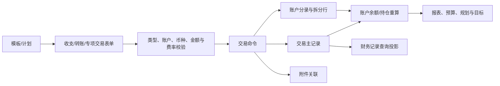

# MoneyHome8 运行时 DFM 功能证据

本文档记录从 MoneyHome8 普通权限运行副本内存中提取的真实 Delphi `TPF0` 窗体资源，并把控件、字段、菜单和事件转换为 Rust 重构可执行的功能需求。

## 1. 证据方法与覆盖率

磁盘中的 `MoneyHome8.exe` 使用运行时解包结构：PE 资源目录保留了窗体名称、RVA 和大小，但大量载荷位于磁盘没有原始数据的虚拟区段。此前直接从磁盘导出的高熵 `.bin` 不是解包后的真实 DFM，不能继续作为窗体格式判断依据。

本轮采用以下只读路径：

1. 启动工作区内的 `MoneyHome8.exe` 副本，并设置 `RunAsInvoker`。
2. 等待进程将 RCDATA 还原到内存。
3. 按 PE 资源目录的 RVA 只读进程内存。
4. 验证载荷签名为 `TPF0`，再解析 Delphi 对象流。
5. 终止本工具启动的无账本副本，不影响原始 MoneyHome8 实例和 `test.mh8`。

结果：

- PE RCDATA 名称：`465` 个
- 成功解析真实 DFM：`460` 个
- 非 DFM：`5` 个，均为以 `T...` 命名的 PNG 皮肤资源
- 真实窗体解析覆盖率：`460 / 460`

可重复命令：

```powershell
python tools\extract_runtime_dfm.py --pattern "^T.*$" --output docs\runtime-dfm-all-forms.json
python tools\summarize_runtime_dfm.py
```

证据等级：

- 窗体、控件、可见文案、字段绑定和事件名称：运行时直接证据
- 点击后的计算结果、动态生成菜单、真实数据列值和跨窗体跳转：仍需运行流程验证

## 2. 主壳与全局功能

`TMainForm` 直接确认：

- 顶层中心入口：财务数据、财务报表、财务分析
- 快速动作：新增交易、同步、今日提醒、主题、财务工具
- 左侧上下文页签：资产、分析、目标
- 账户树：全部展开/收起、按类型/自定义显示、显示金额、显示到期/隐藏账户

全局菜单直接确认：

- 账簿：新建、打开、结算、设置密码、关闭、备份、还原、导入、导出
- 资料管理：收支项目、人员与机构、证券、基金、债券、贵金属、理财、期货、重大资产、家居物品、费率、币种汇率、存款利率、常用备注
- 计划提醒：财务日历、计划与提醒、限额提醒
- 财务工具：更新行情、导入股票交割单、日记、金融计算器、系统计算器
- 设置：系统设置、快捷键、同步、手机提醒、同步账号密码
- 帮助：FAQ、客户服务、更新、许可、官网、关于

顶部 `记账` 文案已由页面截图确认；DFM 中对应快速动作是 `btnAddTrans -> btnAddTransClick`。其下拉菜单由运行时代码生成，不在 `TMainForm` 静态控件树中，因此具体排列仍保留为 UI 验证项。

## 3. 记账与流水

### 3.1 通用录入

`TTransDlgFm` 直接确认所有交易对话框的公共字段与命令：

- 日期
- 备注
- 主题
- 保存并新添
- 确定
- 查看附件
- 添加删除附件

`TIncExpEditFrame` 直接确认日常收支字段：

- 收支账户
- 收支项目
- 金额
- 日期
- 主题
- 备注
- 分期付款

`TCashXferDlgFm` 直接确认转账字段：

- 转出账户、转入账户及交换动作
- 转账金额、转账币种
- 手续费、手续费账户

`TSplitIncExpDlgFm` 直接确认分拆规则：

- 可按多行收支项目拆分收入/支出、主题和备注
- 可按多行账户拆分金额
- 第一行收支项目决定交易类型
- 第一行账户币种决定交易币种
- 收支项目选择为空时删除对应拆分记录

### 3.2 模板与计划

`TTemplateDlgFm`：

- 批量记账
- 存为模板、删除模板、生成收支记录
- 金额为零的模板行不生成记录

`TTransferTemplateDlgFm`：

- 批量转账
- 存为模板、删除模板、生成转账记录
- 金额为零的转账行不生成记录
- 手续费从转出账户扣除

`TTransactionPlanDlgFm / TXferPlanDlgFm`：

- 交易计划、转账计划
- 转出/转入账户、金额、主题、手续费和手续费账户
- 支持自动执行

### 3.3 账户与专项交易页

已直接确认以下交易工作页标题：

| 功能域 | 运行时页面标题 |
| --- | --- |
| 日常收支 | 日常收支 |
| 现金 | 现金交易列表 |
| 活期存款 | 活期存款交易明细 |
| 第三方储值 | 支付宝交易明细 |
| 债权债务 | 债权债务交易明细 |
| 外汇 | 外汇交易明细 |
| 证券 | 上市证券交易列表 |
| 开放式基金 | 开放式基金交易明细 |
| 定期 | 定期存单 |
| 期货 | 期货账户交易明细 |
| 黄金/贵金属 | 贵金属交易明细 |
| 贵金属 TD | 贵金属TD账户交易明细 |
| 融资融券 | 融资融券账户交易明细 |
| 保险 | 保险交易明细 |
| 社保 | 社会保险账户交易明细 |
| 银行理财 | 银行理财产品交易明细 |
| 实物资产 | 物品交易明细 |

### 3.4 财务记录

`TWasteBookFm` 的绑定字段直接确认：

- 主键与类型：`TransID`, `TransType`, `CType`, `StateID`
- 日期：`TransDate`, `FakeTransDate`, `CreateTime`
- 分类与对象：`CateID`, `CategoryName`, `TransObjectID`, `ObjName`
- 账户：`AcctNo1`, `AcctNo2`, `AcctName`
- 金额：`TransAmount`, `IncAmount`, `ExpAmount`, `IncLocal`, `ExpLocal`
- 币种：`IncCurrency`, `ExpCurrency`
- 标签与说明：`TransTheme`, `sDesc`, `UserMark`
- 附件：`AccessoriesID`
- 批量选择：`TransCheck`

直接确认的操作：

- 双击/修改、删除、查找、筛选、放弃筛选、导出、打印
- 复制、粘贴、粘贴到今天、同日期上移/下移
- 退款、转为计划、更改活动类型
- 替换收支项目、分组显示
- 批量设置标签、备注
- 查看与维护附件
- 设为软件首页

命令状态补充：

- 复制、粘贴、同日期上移、同日期下移和删除分别绑定 `Ctrl+C`、`Ctrl+V`、`Ctrl+Up`、`Ctrl+Down`、`Delete`
- 修改、删除、查找等依赖当前记录的命令在无选择时初始禁用
- 批量模式提供设置标签、设置备注和退出批量模式等独立状态命令
- 详细控件状态和事件见 [runtime-command-and-state-evidence.md](C:\DCG-SZ\SZ-System-Docs\CodexWorkSpace\Finance-own\docs\runtime-command-and-state-evidence.md)

### 3.5 记账数据流



Rust 实现要求：转账、手续费和分拆行必须在一个 SQLite 事务中原子提交；`FakeTransDate`、本币折算金额等旧字段只作为迁移映射，不直接决定新库字段设计。

## 4. 财务诊断、规划与目标

### 4.1 财务诊断

`TFinancialDiagnosisFm` 直接确认：

- 新增账户
- 输入数据类型选择
- 资产性质设置
- 开始诊断
- 调整财务数据
- 定期、货币基金可分别归为流动资产或投资资产
- 页面在输入数据和指标结果两个阶段间切换

数据流要求：账户和持仓先按资产性质归类，再生成诊断指标；分类调整不能修改交易真相，只影响诊断投影。

### 4.2 财务规划

`TFinancialPlanningCenterFm` 直接确认三个主区：未来重大事件、当前财务情况、家庭资料，并支持清除规划数据。

`TFP*` 专题表单直接确认：

| 专题 | 输入口径 |
| --- | --- |
| 家庭资料 | 本人/配偶出生年份、预计寿命、是否有配偶 |
| 工资 | 本人/配偶年工资、结束年份、年增长率 |
| 资产收入 | 名称、关联资产账户、年收入、开始/结束年份、持续年限、增长率 |
| 资产支出 | 名称、关联资产账户、年支出、开始/结束年份、持续年限、增长率 |
| 资产增长 | 现金/投资/存款预计增长率、每年盈余追加投资比例 |
| 资产购置 | 名称、购置年份/金额、首付、利率、期数、月供、一次性/分期、后续收入和支出 |
| 日常支出 | 家庭每年基本生活支出 |
| 教育计划 | 名称、开始/结束年份、持续年限、学费、生活费、其它费用、合计 |
| 支出调整 | 名称、开始/结束年份、持续年限、年支出增减额 |
| 通货膨胀 | 通胀率，作为日常支出的增长参考 |
| 其它收入/支出 | 名称、年度金额、开始/结束年份、持续年限、增长率 |
| 养老计划 | 本人/配偶退休年龄、养老金年收入/增长率、退休后家庭年支出 |
| 资产选择 | 账户名称、余额、新增账户 |
| 年度情况 | 按年度查看上一年/下一年预测结果 |

规划模型必须按年度时间轴保存输入和预测结果，金额、增长率、开始/结束年份不能只存成页面临时状态。

### 4.3 财务目标

`TGoalCenterFm / TGoalSaveFm / TGoalAcctListDlg` 直接确认：

- 新增、修改、删除目标
- 设置是否显示已过期目标
- 目标名称、目标金额、开始日期、结束日期
- 绑定全部账户或账户子集
- 账户余额/市值与合计

目标数据流：目标规则绑定账户集合，账户余额和投资市值形成目标进度投影；删除目标不能删除账户或交易。

## 5. 财务报表

运行时 DFM 直接确认 `25` 张报表：

### 日常收支类

- 日常收支表
- 日常收支明细表
- 账户日常收支表
- 标签日常收支表
- 两段时间收支对比表
- 收支统计表
- 收支走势图
- 月平均收支表
- 现金流表

### 资产负债类

- 资产负债表
- 可用资金表
- 债权债务表
- 月资产走势图

### 投资类

- 投资一览表
- 投资收益一览表
- 投资收益率统计表
- 证券投资一览表
- 证券费用及盈亏一览表
- 证券市值大势图
- 开放式基金投资一览表
- 开放式基金费用及盈亏一览表
- 开放式基金市值大势图
- 外汇交易一览表
- 银行理财产品收益率表
- 网贷盈亏一览表

公共筛选直接确认：

- 相关资产
- 人员、机构
- 活动类型
- 收支项目
- 标签
- 币种、对象
- 金额范围
- 全选、反选、恢复默认条件

公共报表命令直接确认：

- 报表/图表切换
- 筛选条件变化提示与 `F5` 刷新
- 修改、删除、自定义报表另存为
- 导出数据、导出报表、打印预览

报表状态补充：导出报表和打印预览在结果尚未加载时初始禁用；筛选条件变化会进入“待刷新”状态。该行为需要在 Flutter 页面和 PC 本地 API 中实现为明确状态机，不能只在按钮点击时临时判断。

趋势图序列直接确认：

- 基金：资产总值、基金市值、资金余额
- 证券：资产总值、证券市值、资金余额、上证指数、深证成指

计算与汇总直接确认：

- 运行时 DFM 共标记 `20` 个计算字段，包括余额、本币流入/流出、展示日期、附件状态、投资收益率等
- 财务记录按 `IncLocal`、`ExpLocal`、`TransAmount` 求和；其中 `TransAmount` 页脚显示差额
- 标签页按流入、流出和标签资产金额分别求和
- 历史盈亏页将数量列页脚绑定 `YLAmount`、交易金额列页脚绑定 `KSAmount`
- `25` 张报表中存在 `30` 个图表组件，覆盖柱状图、饼图和趋势图
- DFM 数据集没有非空静态 SQL，报表 SQL、动态列和事件公式由运行时代码生成

报表应实现为只读查询投影；筛选预设与报表结果分离保存，不能让报表直接修改交易真相。

## 6. 对新数据库与模块设计的约束

新系统仍采用已确定的 SQLite 主库，不需要复刻 Jet 表结构。运行时证据要求新模型至少覆盖：

- `transactions`：交易业务头、真实日期、展示日期、类型、状态、说明
- `transaction_legs`：账户、方向、原币金额、币种、本币折算金额
- `transaction_splits`：分类、金额、标签、备注和顺序
- `attachments` / `transaction_attachments`：附件元数据与交易关联
- `templates` / `template_lines`：批量收支和批量转账模板
- `schedules`：计划、重复规则、自动执行与最后执行状态
- `investment_transactions`：专项交易扩展数据
- `planning_profiles` / `planning_events` / `planning_years`：家庭资料、重大事件和年度预测
- `goals` / `goal_accounts`：目标规则、账户绑定和进度来源
- `report_presets`：公共筛选、日期口径、图表序列和自定义报表设置

第一批稳定查询投影应包括：

- `v_ledger_entries`：财务记录、标签明细和账户收支共用流水
- `v_account_transaction_running_balance`：账户交易顺序与余额
- `v_investment_position`：持仓、成本、市值、盈亏和收益率
- `v_investment_realized_profit`：历史交易与已实现盈亏
- `v_life_theme_transactions`：标签流水流入/流出
- `v_life_theme_assets`：标签资产与合计

关键边界：

- 旧字段名保留在 `legacy_import` 映射层
- 新交易写入只进入 SQLite，不回写 Jet
- 余额、持仓、预算执行、规划结果和报表都是可重建投影
- 行情、费率和利率继续通过 `reference_data` 边界进入计算

## 7. 剩余验证缺口

本轮已经消除“功能是否存在、主要字段是什么、页面有哪些命令”这一级不确定性。仍需继续验证：

- 顶部 `记账` 动态下拉菜单的真实排列和交互截图
- 诊断指标名称、公式、阈值和结果文案
- 规划算法、年度现金流计算和结果图表
- 专用报表的真实列、分组、小计、图表和空结果已由 B16 动态补证；仍缺精确排序、钻取、筛选边界、导出格式和打印结果
- 投资收益、费用、持仓成本和收益率的精确计算口径
- `test.mh8` 正式表结构、样例数据及旧字段关系

这些缺口影响计算兼容和视觉验收，但不再阻止按已确认功能范围设计 Rust 模块与 SQLite 新模型。

## 8. 关联产物

- [runtime-dfm-control-catalog.md](C:\DCG-SZ\SZ-System-Docs\CodexWorkSpace\Finance-own\docs\runtime-dfm-control-catalog.md)
- [runtime-dfm-all-forms.json](C:\DCG-SZ\SZ-System-Docs\CodexWorkSpace\Finance-own\docs\runtime-dfm-all-forms.json)
- [runtime-dfm-forms.json](C:\DCG-SZ\SZ-System-Docs\CodexWorkSpace\Finance-own\docs\runtime-dfm-forms.json)
- [runtime-calculation-and-report-projections.md](C:\DCG-SZ\SZ-System-Docs\CodexWorkSpace\Finance-own\docs\runtime-calculation-and-report-projections.md)
- [runtime-calculation-evidence.json](C:\DCG-SZ\SZ-System-Docs\CodexWorkSpace\Finance-own\docs\runtime-calculation-evidence.json)
- [runtime-command-and-state-evidence.md](C:\DCG-SZ\SZ-System-Docs\CodexWorkSpace\Finance-own\docs\runtime-command-and-state-evidence.md)
- [runtime-command-state-evidence.json](C:\DCG-SZ\SZ-System-Docs\CodexWorkSpace\Finance-own\docs\runtime-command-state-evidence.json)
- [runtime-validation-scenarios.md](C:\DCG-SZ\SZ-System-Docs\CodexWorkSpace\Finance-own\docs\runtime-validation-scenarios.md)
- [functional-ledger.md](C:\DCG-SZ\SZ-System-Docs\CodexWorkSpace\Finance-own\docs\functional-ledger.md)
- [cross-domain-dataflow-catalog.md](C:\DCG-SZ\SZ-System-Docs\CodexWorkSpace\Finance-own\docs\cross-domain-dataflow-catalog.md)
