# MoneyHome8 核心场景数据流

本文档按用户场景整理当前已确认的数据流，目标是把“功能点”转成“场景 -> 实体 -> 数据源 -> 输出结果”的可执行分析。

依赖文档：

- [function-matrix.md](C:\DCG-SZ\SZ-System-Docs\CodexWorkSpace\Finance-own\docs\function-matrix.md)
- [entity-catalog.md](C:\DCG-SZ\SZ-System-Docs\CodexWorkSpace\Finance-own\docs\entity-catalog.md)
- [data-source-map.md](C:\DCG-SZ\SZ-System-Docs\CodexWorkSpace\Finance-own\docs\data-source-map.md)
- [code-type-mapping.md](C:\DCG-SZ\SZ-System-Docs\CodexWorkSpace\Finance-own\docs\code-type-mapping.md)

## 1. 新建/打开/关闭账本

### 场景目标

- 创建新账本
- 打开已有账本
- 关闭当前账本
- 切换默认账本

### 当前数据流

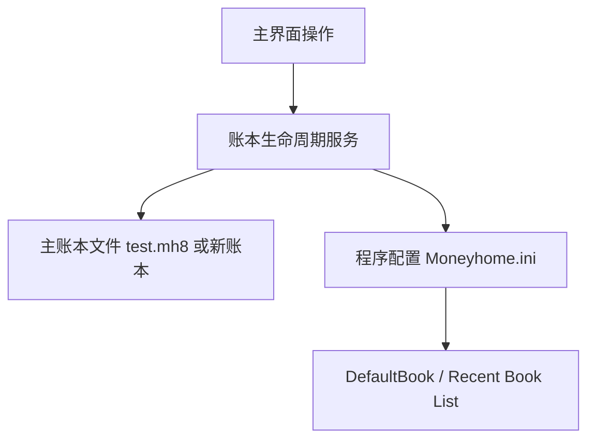
```mermaid
flowchart TD
  A["主界面操作"] --> B["账本生命周期服务"]
  B --> C["主账本文件 test.mh8 或新账本"]
  B --> D["程序配置 Moneyhome.ini"]
  D --> E["DefaultBook / Recent Book List"]
```

### 涉及对象

- `Ledger`
- `LedgerRepository`
- `DefaultBook`
- `Recent Book List`

### 已确认数据源

- `Moneyhome.ini`
- `test.mh8`

### Rust 落地要点

- 账本切换逻辑不能只改 UI 状态，需要同步：
  - 当前连接上下文
  - 最近账本列表
  - 默认账本配置

### 备份动态校准

- 备份页面读取当前账簿名、源路径、系统日期和默认备份目录；用户输入逻辑名称，旧程序固定追加 `.mh8k`。
- 空名称在写文件前被拒绝；目录选择取消保持原草稿；同名目标显示规范化完整路径并要求覆盖确认，选择“否”不改变已有文件。
- 成功样本是加密 7z 容器，内部单条 `BOOK` 声明长度与源账簿一致。旧容器只作为迁移输入，不能作为新版数据库或主备份结构。
- 新版数据流应为“在线一致性快照 -> 临时目录/临时文件 -> 数据库完整性检查 -> 附件与清单哈希 -> 原子改名 -> 成功结果”，失败或取消必须删除临时输出并保持源账簿可用。

### 还原动态校准

- 当前账簿还原页读取备份来源、当前账簿名和完整目标路径；当前可见目标固定为 `test.mh8`，没有显示新账簿名或目标模式切换。
- 空来源在关闭账簿前以 `00701` 拒绝；文件选择取消不改变来源；有效 `.mh8k` 提交后显示关闭当前账簿并覆盖数据的二次确认，选择“否”返回页面。
- 选择“是”后旧程序关闭当前账簿、恢复加密 `.mh8k` 内的账簿内容、重新打开当前账簿并报告恢复成功；完全退出后的冷启动可再次打开，账户余额和资产摘要抽查与基线一致。
- 旧程序本次没有生成可见的还原前自动 `.mh8k` 安全备份，成功报告也没有附件、设置、迁移和校验明细。新版数据流必须为“来源预检 -> 自动安全备份 -> 隔离临时目标解密/迁移 -> 完整性与内容清单校验 -> 关闭连接 -> 原子替换 -> 重开验证 -> 详细报告”。

### 结算动态校准

- 结算输入为截止日和恢复点完整路径。默认截止日为当天，默认恢复点名包含账簿名、日期和“结算备份”，格式固定 `.mh8k`。
- 旧程序的数据流为“选择恢复点 -> 生成加密账簿备份 -> 重写活动账簿 -> 生成同日余额调整 -> 成功提示”。文件时间证明恢复点先于活动账簿写入。
- 最近 1 月基线 `23` 条原始收支/转账记录在结算后变为 `78` 条余额调整；调整记录把账面余额归零，以真实余额形成差额，账户与资产负债汇总保持不变。
- Rust 版改为“影响预览 -> 二次确认 -> 一致性恢复点校验 -> `settlement_batch` -> 原始历史归档标记 -> `opening_balance_entry` 投影 -> 余额/持仓/计划校验 -> 提交报告”。原交易继续在线可查询，不复制只能还原外部备份才能看历史的限制。

### 账簿密码动态校准

- 无密码账簿设置页读取当前保护状态，只显示新密码和确认密码；受保护账簿增加旧密码输入。两次新密码不一致或旧密码错误时不改变保护状态。
- 旧程序把两个空新密码解释为清除保护。Rust 版数据流改为“选择设置/修改/清除 -> 显式确认清除意图 -> 验证旧密码 -> 校验新密码策略与一致性 -> 创建加密临时副本 -> 完整性检查 -> 原子替换 -> 清理密钥材料 -> 返回结果”。
- 冷启动打开受保护账簿时，只有正确密码才创建已解锁会话。空或错误密码保持锁定并进入受控重试；取消返回可操作的无账簿外壳，不加载账户投影或后台任务。
- 错误尝试只写脱敏安全审计和进程内退避状态，不写入交易事实；密码、派生密钥和输入长度等可识别秘密不得进入普通日志、截图、遥测或崩溃报告。

## 2. 账户中心浏览

### 场景目标

- 浏览账户组与账户树
- 按账户类型筛选
- 查看资产/负债/净资产汇总

### 当前数据流

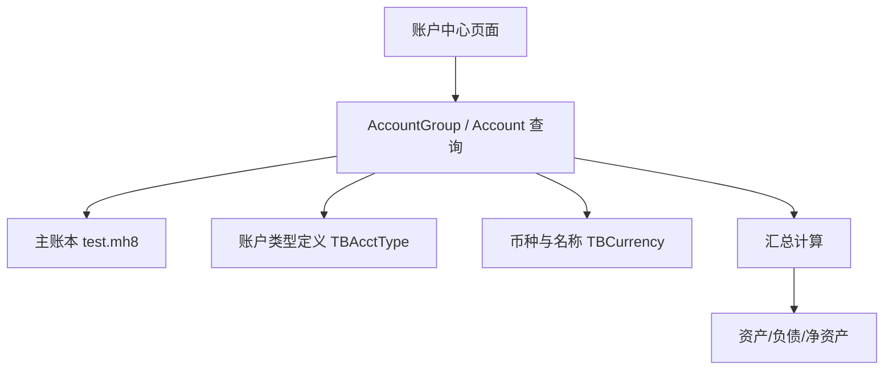
```mermaid
flowchart TD
  A["账户中心页面"] --> B["AccountGroup / Account 查询"]
  B --> C["主账本 test.mh8"]
  B --> D["账户类型定义 TBAcctType"]
  B --> E["币种与名称 TBCurrency"]
  B --> F["汇总计算"]
  F --> G["资产/负债/净资产"]
```

### 涉及对象

- `AccountGroup`
- `Account`
- `AccountType`
- `Currency`

### 已确认数据源

- `test.mh8`
- 主账本对象线索：
  - `TBAcctGroup`
  - `TBAcctDetail`
  - `TBAcctType`
  - `TBCurrency`

### 运行态校准

- 账户中心按账户类型分组显示账户和小计，当前可见现金组 `9,487.88`、活期（卡折）组 `978,715.76`。
- 页面汇总资产 `8,535,534.04`、负债 `1,444,074.57`、净资产 `7,091,459.47`，满足资产减负债等于净资产。
- 概况页显示同一账簿净资产 `7,091,459.48`，比账户中心高 `0.01`，证明旧程序至少存在两条舍入或聚合路径。
- 新增账户组使用父编辑器承载名称，`详细资料...` 再打开二级编辑器承载联系电话、联系方式、密码和备注；空名称在二级窗临时显示为 `未命名`。
- 父窗空名称点击确定会在写入前提示 `请输入账户组名称`；关闭提示后编辑上下文保留，`未命名` 不会作为默认名称入库。
- 依次关闭二级窗和父窗后账簿文件大小与最后写入时间不变，说明打开窗口和取消草稿不产生业务写入。
- 有效详细资料在二级窗确认后只回传父草稿，文件时间保持不变；父账户组确认后才写入账簿。
- 删除账户组会永久删除组及其专属详细资料；若组内有账户，只清除关联并保留账户。真实样例中 `Cash-CNY 608.00` 删除组后进入 `无账户组`，原 `9` 条交易、累计流入 `15,708.00`、流出 `15,100.00` 和全局汇总均不变，冷启动保持。
- 已结清债权债务、到期、隐藏和注销账户使用四个独立查询开关。已结清、隐藏和注销在当前测试库会增加可见历史账户，到期无可见样例；所有开关只改变投影，不改变汇总。“显示注销账户”跨冷启动保持，目标实现应把该偏好存入用户/账簿视图设置而非账户状态表。
- 自定义导航编辑的数据流为“读取账户组/账户树和当前偏好版本 -> 在草稿中全选、反选、勾选或调整顺序 -> 确定时校验稳定账户 ID 集合与版本 -> 原子替换显示和顺序偏好 -> 刷新左侧导航投影”。真实把 `Halifax` 下移并隐藏 `H-Current` 后，导航立即变化且底部汇总不变，冷启动保持；上移并重新显示同样通过冷启动。标题栏关闭丢弃草稿，保存不得触碰账户组关系、账户状态、余额或交易。
- 账户右键菜单按状态动态切换“隐藏账户 / 取消隐藏”和“注销账户 / 取消注销”。恢复命令立即把同一账户转回活动状态；隐藏确认声明账户和交易不参与统计且不在其它页面展示，注销确认声明余额清零但历史交易保留。两个状态和查看偏好都能跨冷启动保持，目标数据流应为“读取账户及版本 -> 预览状态影响 -> 可选确认 -> 写状态事件 -> 刷新统一投影”，不得改写历史交易身份。
- 非零余额注销的真实数据流为“读取当前余额 `608.00` -> 新增等额流出余额调整 -> 余额归零 -> 写已注销状态 -> 账户组和净资产减少 `608.00`”；原 9 条交易不改写，新增清零记录使交易数变为 10。取消注销只写回活动状态，不撤销清零记录。Rust 版应使用明确的注销清零事件和操作 ID；状态恢复与财务冲销是两个独立命令。
- 账户标签数据流分成两个提交点：“选择器内新增标签 -> 立即写标签主数据 -> 回填外层草稿”和“外层确定 -> 比较目标标签 ID 集合 -> 新增/删除账户标签关系 -> 刷新账户行标签投影”。解除关系后标签主数据仍保留。标签关系变化不触碰余额、交易、账户状态、账户组或资产负债汇总，关联和解除均通过冷启动保持。
- 第三方储值开户数据流为“入口提供显式钱包类型 -> 两页草稿收集账户资料、日期、金额和可选资金来源 -> 最终确认原子创建账户、类型配置、可选组关系和期初事实 -> 返回稳定账户 ID、版本及提交状态 -> 刷新账户中心与财务记录”。`CodexRT41Wallet / 12.34 CNY / 资金来源<无>` 生成单条外部期初流入，资产和净资产各增加 `12.34`；旧客户端在提交后刷新阶段报关闭数据集并退出，但冷启动确认原事务成功。目标系统必须用幂等结果查询消除模糊提交；真实资金来源分支改为来源流出与钱包流入的双边事务。
- 标签主数据流为“输入单个或分号名称列表 -> 过滤空分段并合并批次内精确重复 -> 读取现有名称 -> 原子新增全部新名称 -> 返回 created/existing 和默认选择”，以及“按稳定标签 ID 和版本读取 -> 修改名称或切换隐藏状态 -> 原位更新 -> 刷新标签条和选择器”。整体空值阻断；混合批次跳过已有项并创建新项，全部已存在时提示重复。修改关闭取消；无引用删除先显示目标名并支持否/是。隐藏状态与显示隐藏查看偏好分离且均能冷启动读回，固定 `<无>` 不进入主数据命令。
- 标签页查询与关系数据流为“选择标签 -> 读取同一范围的交易/资产投影 -> 应用日期、账户、活动类型、关键词、金额和标签条件 -> 对选中稳定交易 ID 集合执行加入、移出或转移标签关系”。空选择提示 `请选择记录`；导入记录到标签先查询候选，再选择目标标签提交。导出和打印复用当前查询快照；旧程序两类导出取消仍误报成功，目标实现必须以真实文件提交结果决定反馈。
- 标签排序数据流为“读取可排序稳定标签 ID 集合、当前完整顺序和版本 -> 拖动或键盘命令修改草稿 -> 确定时校验集合与版本 -> 原子替换顺序 -> 刷新标签页和选择器投影”。固定 `<无>` 筛选项不进入排序集合；取消、冲突或失败保留旧顺序。`RT-02-015` 已验证 `A -> C -> B` 初始顺序、`C -> B -> A` 视觉位置、确定、同会话重开和冷启动；完整消息拖放只改变子控件坐标，三个读回点仍为原顺序，证明视觉位置不能作为内部草稿或持久化结果。真实物理拖放仍待解锁交互桌面补测。
- 单账户组归属数据流为“从账户概况读取稳定账户 ID、当前组关系和候选组版本 -> 在选择器草稿中选择可空目标组 ID -> 取消则丢弃 -> 确定时校验账户、原组、目标组和预期版本 -> 原子替换关系 -> 从同一提交版本刷新概况、左侧导航、原组、目标组和小计”。`H-Current` 从 `Halifax` 改为 `CASH` 后同会话与冷启动都保持，余额 `795.57`、`558` 条交易、开户银行和全局汇总不变；`<无>` 应解除关系，内联新增账户组必须作为独立提交点处理。
- 永久删除账户的数据流为“读取账户 ID、版本及完整关系图 -> 生成收支/转账/兑换/计划等影响快照 -> 用户确认 -> 原子移除业务可见账户与关联事实 -> 从剩余事实重算对手账户和全部汇总 -> 冷启动重建投影”。`Cash-CNY` 样例删除后全历史记录 `2,189 -> 2,180`，移除流入 `26,845.50`、流出 `30,708.00`；被删除事实净额 `-3,862.50` 对应净资产增加 `3,862.50`。目标账户自身流水合计不足以表达级联范围，禁止按当前余额直接增减总账。
- 账户附件数据流为“选择账户和源文件 -> 复制到受管暂存并计算 SHA-256 -> 写附件元数据和账户关系 -> 原子发布受管文件 -> 刷新附件计数、动态菜单和预览”。旧版实际路径为 `test/Account/23/原文件名`，打开和文件夹命令均指向受管副本。删除流程为“选择附件 -> 确认 -> 解除关系 -> 最后引用删除内容文件 -> 清理空目录 -> 刷新全部投影”；旧版删除后账户行计数要到冷启动才更新，目标实现必须在同一提交版本立即刷新并对数据库/文件不一致提供启动审计。
- 账户资料修改数据流为“按稳定账户 ID 和版本读取字段 -> 编辑草稿 -> 必填与规范化名称唯一性校验 -> 原位更新名称/日期/所有者/备注和版本 -> 重建排序及跨页面账户投影”。`Cash-CNY` 改名并增加备注后仍保留 `608.00` 余额、`CASH 9,495.70` 和相同全局汇总，只因名称排序移动行位置；空名称和精确重名都在写入前阻断。现金账户币种在既有账户编辑态只读，换币种不得作为普通资料修改。

### 账户选择器数据流

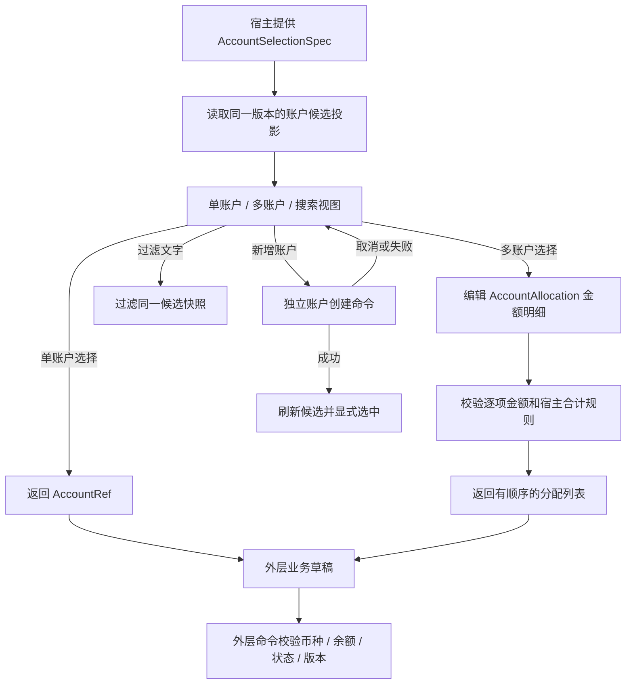
```mermaid
flowchart TD
  A["宿主提供 AccountSelectionSpec"] --> B["读取同一版本的账户候选投影"]
  B --> C["单账户 / 多账户 / 搜索视图"]
  C -->|"单账户选择"| D["返回 AccountRef"]
  C -->|"多账户选择"| E["编辑 AccountAllocation 金额明细"]
  E --> F["校验逐项金额和宿主合计规则"]
  F --> G["返回有顺序的分配列表"]
  C -->|"过滤文字"| H["过滤同一候选快照"]
  C -->|"新增账户"| I["独立账户创建命令"]
  I -->|"成功"| J["刷新候选并显式选中"]
  I -->|"取消或失败"| C
  D --> K["外层业务草稿"]
  G --> K
  K --> L["外层命令校验币种 / 余额 / 状态 / 版本"]
```

- 选择器规格至少包含模式、允许空值、允许新增、账户类型、状态范围、币种提示、排除集合和查询版本；不同业务页通过规格裁剪能力，不复制选择器逻辑。
- 单账户只返回稳定引用；多账户必须返回 `账户 ID + 金额`。旧版零金额确认提示 `请输入账户金额`，证明金额分配是选择结果的一部分。
- 搜索只改变候选投影。空态由查询结果决定；失焦、关闭或内联新增取消保留原宿主草稿。
- 转账目标列表允许来源账户和外币账户，选择 `Cash-USD` 后外层转账币种仍为 CNY。来源/目标相等、跨币种策略、余额不足和版本冲突必须由外层命令在提交前统一校验。

### 收支项目选择器数据流

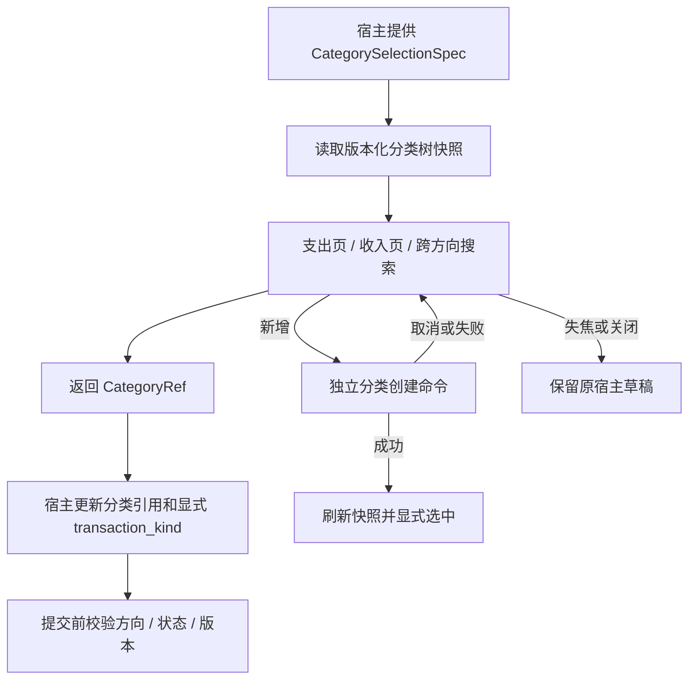
```mermaid
flowchart TD
  A["宿主提供 CategorySelectionSpec"] --> B["读取版本化分类树快照"]
  B --> C["支出页 / 收入页 / 跨方向搜索"]
  C --> D["返回 CategoryRef"]
  D --> E["宿主更新分类引用和显式 transaction_kind"]
  E --> F["提交前校验方向 / 状态 / 版本"]
  C -->|"新增"| G["独立分类创建命令"]
  G -->|"成功"| H["刷新快照并显式选中"]
  G -->|"取消或失败"| C
  C -->|"失焦或关闭"| I["保留原宿主草稿"]
```

- `CategorySelectionSpec` 至少声明允许方向、默认方向、跨方向搜索、内联新增、管理入口、隐藏/系统项目、父项可选性和查询版本。
- `CategoryRef` 至少包含稳定分类 ID、收入/支出方向、可选父级和版本。搜索 `其它` 同时返回收入和支出结果，说明方向必须是结果字段，不能根据名称推断。
- 父窗可根据选择结果即时切换日常收入或日常支出展示，但持久化必须保存显式交易种类，并在提交时重新校验分类方向和版本。
- 内联新增使用当前方向作为默认值。旧版从收入页新增仍默认支出是已证实缺陷；取消或失败必须恢复原分类、页签和父窗草稿。
- 搜索、页签切换和高亮只修改选择器草稿；无匹配结果返回空集合，不创建占位分类。

### 标签选择器数据流

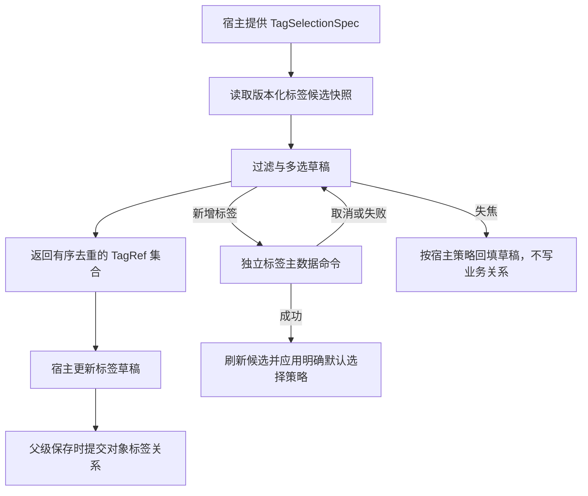
```mermaid
flowchart TD
  A["宿主提供 TagSelectionSpec"] --> B["读取版本化标签候选快照"]
  B --> C["过滤与多选草稿"]
  C --> D["返回有序去重的 TagRef 集合"]
  D --> E["宿主更新标签草稿"]
  E --> F["父级保存时提交对象标签关系"]
  C -->|"新增标签"| G["独立标签主数据命令"]
  G -->|"成功"| H["刷新候选并应用明确默认选择策略"]
  G -->|"取消或失败"| C
  C -->|"失焦"| I["按宿主策略回填草稿，不写业务关系"]
```

- `TagSelectionSpec` 至少声明允许空集合、多选、内联新增、隐藏标签、最大选择数量、候选作用域、查询版本和失焦策略。
- `TagRef` 至少包含稳定标签 ID 和版本；选择结果使用有序去重集合。旧分号拼接文字只用于 UI，不能作为账户标签、交易标签或其它关系的持久化键。
- 过滤只改变同一候选快照的投影。`TagB` 只返回第二项，`NoSuchTag` 返回空集合；清空过滤后原选择仍保持。
- 内联新增和对象关系是两个提交点。旧版批量创建两个标签后只自动选择第一项；混合新旧名称只创建新项并静默跳过已有项。目标实现必须明确返回全部新标签、已有标签和默认选择策略；父级取消不回滚已成功创建的标签。
- 日常收支失焦会把当前集合回填父级草稿，账户标签外层确定才写账户关系。无论宿主采用显式确定还是失焦回填，最终业务关系都只能在父级命令中提交。

### 资料管理宿主路由数据流

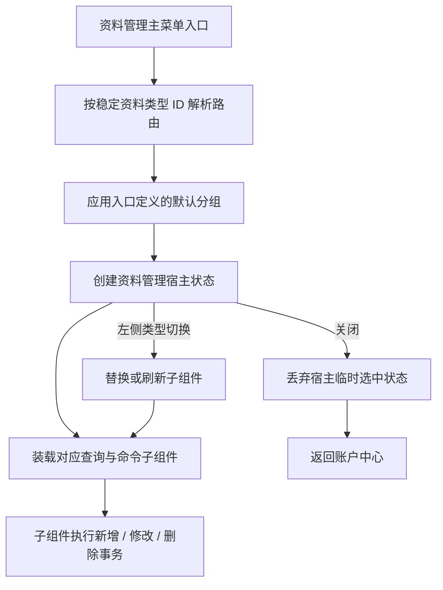
```mermaid
flowchart TD
  A["资料管理主菜单入口"] --> B["按稳定资料类型 ID 解析路由"]
  B --> C["应用入口定义的默认分组"]
  C --> D["创建资料管理宿主状态"]
  D --> E["装载对应查询与命令子组件"]
  D -->|"左侧类型切换"| F["替换或刷新子组件"]
  F --> E
  E --> G["子组件执行新增 / 修改 / 删除事务"]
  D -->|"关闭"| H["丢弃宿主临时选中状态"]
  H --> I["返回账户中心"]
```

- 运行时主菜单有 `11` 个资料入口，金融产品宿主内部有 `10` 类路由；路由表必须保存稳定类型 ID、显示名称、默认分组、子组件和权限要求，不能把菜单标题当作领域类型。
- 旧版“其它金融产品”实际落到货币基金列表，应作为显式兼容别名处理。迁移和测试必须验证别名解析结果，不得据此把其它金融产品与货币基金合并为同一业务实体。
- 宿主切换和关闭不产生隐式写入；所有业务事务、校验、引用保护和失败回滚归当前子组件所有。收支项目从收入切换后再次打开，以及应用冷启动后，均按入口默认值回到支出。

### 账户组编辑数据流

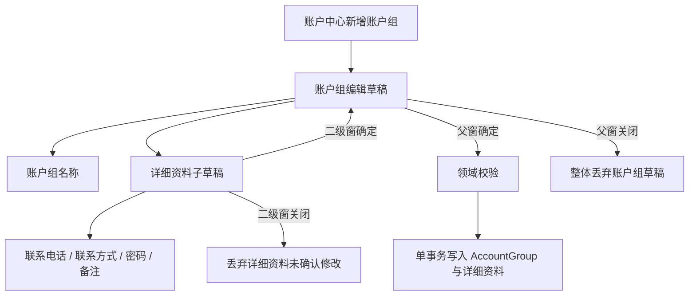
```mermaid
flowchart TD
  A["账户中心新增账户组"] --> B["账户组编辑草稿"]
  B --> C["账户组名称"]
  B --> D["详细资料子草稿"]
  D --> E["联系电话 / 联系方式 / 密码 / 备注"]
  D -->|"二级窗确定"| B
  D -->|"二级窗关闭"| F["丢弃详细资料未确认修改"]
  B -->|"父窗确定"| G["领域校验"]
  G --> H["单事务写入 AccountGroup 与详细资料"]
  B -->|"父窗关闭"| I["整体丢弃账户组草稿"]
```

Rust 版不能在打开详细资料窗或二级窗确定时直接写数据库；最终提交点必须位于父账户组命令，并统一执行空名称、同级重名、层级合法性和敏感字段保护规则。

真实修改进一步确认：旧程序的精确重名校验发生在父级提交前，但未先裁剪首尾空白，` CASH ` 可以绕过已有 `CASH` 并形成视觉重名。目标数据流必须改为“原始输入 -> 首尾空白裁剪 -> Unicode 规范化 -> 明确大小写折叠 -> 账簿/父级范围唯一校验 -> 乐观版本检查 -> 单事务更新组与详细资料”。规范化值用于唯一约束，原始展示值只能在符合命名规则时保存。

添加账户的数据流为“读取目标账户组版本和可选账户余额投影 -> 用户提交目标账户 ID 集合 -> 校验账户与组仍存在且版本未变化 -> 原子写入账户组关系差异 -> 从同一提交版本刷新目标组、原组、选择器和全局汇总”。`Cash-CNY 608.00` 移入新组后目标组为 `608.00`、原 `CASH` 为 `8,887.70`，全局资产负债汇总不变；证明关系不是余额事实，不能通过复制账户或余额记录实现。

删除命令的数据流为“读取组内账户和子组影响 -> 显示确认摘要 -> 单事务删除组专属数据并清除关联 -> 刷新两种账户中心投影”。账户实体和交易历史不属于账户组删除的级联范围。

### Rust 落地要点

- 账户树与账户汇总必须共享同一批源数据，不应由 UI 端重复拼装。
- 账户中心和概况必须共享估值时点、币种换算精度、逐项舍入和最终汇总规则；Rust 版应消除旧程序的 `0.01` 跨页面差异。
- 导航偏好应使用独立版本化存储；批量替换必须具备事务性和并发冲突反馈，不能沿用“先全表清空顺序、再逐行写回”而暴露部分状态。

## 3. 收入/支出/转账记账

### 场景目标

- 新增收入
- 新增支出
- 新增账户间转账
- 浏览通用流水

### 当前数据流

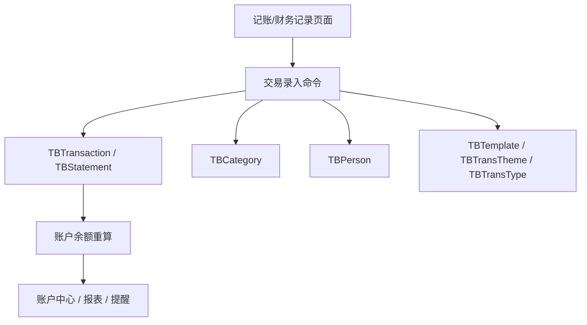
```mermaid
flowchart TD
  A["记账/财务记录页面"] --> B["交易录入命令"]
  B --> C["TBTransaction / TBStatement"]
  B --> D["TBCategory"]
  B --> E["TBPerson"]
  B --> F["TBTemplate / TBTransTheme / TBTransType"]
  C --> G["账户余额重算"]
  G --> H["账户中心 / 报表 / 提醒"]
```

### 涉及对象

- `Transaction`
- `TransactionType`
- `TransactionTheme`
- `Category`
- `Person`
- `Template`

### 已确认数据源

- 主账本 `test.mh8`
- 内置库 `MoneyHome8.data` 中的共享对象名

### 运行态校准

- 财务记录默认显示全部记录，日期范围为 `2026-06-29` 到 `2026-07-29`。
- 当前结果 `23` 条，流入 `249,277.84`、流出 `240,556.08`、差额 `8,721.76`，满足流入减流出等于差额。
- 列表、合计、筛选、导出和打印属于同一查询结果的不同表现，不能分别拼接条件。
- 切换为 `仅收支记录` 后结果为 `13` 条，转账等活动被排除，列标题由流入/流出改为收入/支出。
- 查找只在当前结果集内移动游标；筛选改变结果集并重算汇总，筛选条件会保留到下次编辑。
- `Council Tax` 行显示原币 `GBP 242.00`，底部流出显示本位币 `2,185.16`，交易明细与汇总必须通过同一汇率快照关联。
- 清空筛选恢复相同 `23` 条记录后，流出和差额各变化 `0.01`；旧程序的折算或舍入重算不稳定，目标系统以确定性查询结果为准。
- 批量模式把选择集合传给删除、设置标签和设置备注命令；无选择时三个命令禁用。
- 转账修改按交易种类进入专用编辑器；替换收支项目使用“查询候选 -> 选择记录 -> 选择目标 -> 原子提交”的独立数据流。
- 同币种转账 `Cash-CNY -> 顺德农行` 已真实保存：本金 `50.00`、来源手续费 `1.00` 使来源减少 `51.00`、目标增加 `50.00`、净资产减少 `1.00`，冷启动后余额和记录保持不变。
- 来源账户流水把本金与手续费合并显示为单条 `51.00` 流出；全局财务记录以同一交易身份显示流入 `50.00` 和流出 `51.00`。领域事实必须保留本金、手续费和两侧账户影响，查询投影不得反向决定持久化模型。
- 账户选择器只设置显示文本时被必填校验拒绝；账户候选、草稿和提交命令必须传递稳定账户 ID，而不是名称字符串。
- 取款 `顺德农行 -> Cash-CNY` 已真实保存：本金 `4.00 CNY` 和来源手续费 `1.00 CNY` 使来源余额 `100.00 -> 95.00`、目标余额 `608.00 -> 612.00`，两个账户组分别减少 `5.00` 和增加 `4.00`，净资产只减少费用 `1.00`，冷启动后保持。
- 全局财务记录把该业务显示为单条“取款”，流入 `4.00`、流出 `5.00`、账户 `顺德农行->Cash-CNY`。持久化层必须保留来源本金、目标本金和手续费三个影响，列表合并投影不能成为领域真相。
- 普通收入和普通支出修改均进入 `TIncExpDlgFm`，并复用内嵌 `TIncExpEditFrame`；父窗提供交易方向和提交命令，框架加载项目、金额、账户、标签、日期、备注与附件关系。
- `职业工资` 已有记录仍打开日常收入编辑器，说明编辑器分派读取交易种类或动作上下文，而不是按收支项目名称硬编码。
- 日常收入真实保存 `其它收入 +3.00 CNY` 后，`Cash-CNY 608.00 -> 611.00`、CASH 分组 `9,495.70 -> 9,498.70`，全局记录为单边流入；日常支出真实保存 `教育培训 2.00 CNY` 后，`Cash-CNY 608.00 -> 606.00`、CASH 分组 `9,495.70 -> 9,493.70`，全局记录为单边流出。两个独立状态均通过冷启动复核。
- 分类选择器同时提供支出、收入和搜索页。草稿必须传递稳定分类 ID 与显式 `transaction_kind`；提交时重新校验分类方向，不能根据标题、显示文本或金额正负推断。
- 收支项目维护使用 `CategoryDraft(direction, name, parent_id)`：打开编辑器时默认支出，切换方向后重新加载同方向父级候选；保存前校验名称非空、同方向规范化唯一、父级同方向且不形成环。普通保存提交一个分类后关闭；`保存并新添` 提交当前分类后保留方向、清空名称和父级并继续下一条。列表保存后立即刷新一级/二级投影，冷启动从持久化事实重建相同层级。
- 分类列表偏好使用 `CategoryListPreference(sort_mode, show_hidden, show_system)`，其中 `sort_mode` 只能为 `use_frequency` 或 `manual`。使用量模式禁用顺序编辑；自定义模式通过 `CategoryOrderDraft(direction, tree_version, ordered_category_ids)` 预览拖动结果，只有确定命令才原子保存稳定 ID 顺序。显示隐藏类别和显示系统类别只改变查询投影，不复制、改名或移动分类；冷启动按持久化模式、顺序和显示偏好重建列表。
- 常用备注维护使用 `CommonCaptionDraft(caption_id, text, version)`：新增时 `caption_id` 为空，空文本在写入前阻止；修改按稳定 ID 和版本原位更新；删除先确认并检查版本。交易草稿可以引用常用备注，但交易提交时保存独立备注快照，后续主档修改或删除不得改变历史交易。
- 币种与汇率维护把 `LedgerDefaultCurrency(ledger_id, currency_id, ledger_version)` 与 `ExchangeRateKey(effective_date, base_currency_id, quote_currency_id, quote_kind)` 分开保存。选择 CHF 执行设置为本币后，旧程序无确认即时写入并在冷启动保持，但列表仍显示“对人民币牌价”，证明账簿本币和人民币报价锚点不是同一概念。币种列表当前牌价与历史列表读取同一 `ExchangeRateVersion(rate, source, batch_id, version)`；修改 `2026-07-29 USD/CNY 6.7894 -> 6.7895` 后两个投影即时同步并通过冷启动，删除否零写入，删除是后当前值和历史首行同时回退到 `2026-07-28 / 6.7829`。按日期跨币种视图和按币种时间序列只改变查询参数，不产生写入。
- 存款利率维护使用 `DepositRateKey(currency_id, deposit_type, term)` 与 `DepositRateVersion(rate_percent_scaled, effective_at, source, batch_id, version)`：人民币年利率可在矩阵中直接编辑，校验通过并退出单元格即提交，冷启动按最新有效版本重建。旧处理器只检查可解析数字，失败静默恢复旧值，有效值按浮点乘 `10000` 后取整；目标服务改为十进制定点解析、明确范围校验、字段错误和不可变版本。在线更新先创建批次、保存逐行原文和校验结果，再仅在全部有效时原子发布新版本和上次更新时间；失败或部分来源不可用时保留上一有效版本。历史利息和冻结报表引用原计算快照，不随主档更新回写。
- 顶部记账菜单作为跨域命令调度器，直接进入普通收支、工资、存款、取款、转账、借贷和各类专项资产交易；更多交易活动再按业务域分组。
- 工资收入读取币种对应的收入账户、收入/扣款分类、人员及其社保账户；页面分别维护收入、普通扣款和个人/公司社保缴费三组明细。动态校准确认账户列表可绑定 `Cash-CNY`，社保人员候选为 `<无>`、`LHM`、`Lzb`、`Qrd`，选择 `Lzb` 后条件展开社保三列表格；显示文字不能代替稳定分类对象，未绑定收入项目时提交被“请选择收入项目”阻止。收入金额 `10.00` 且无有效扣款/社保明细时，收入合计和实收即时为 `10.00`。目标实收现金等于收入合计减普通扣款和个人缴费，社保账户权益增加等于个人缴费加公司缴费；工资服务原子提交全部组成、实收流入、社保权益、税务快照、标签和审计，不能只保存实收结果。
- 取款读取来源账户可用资金，可由全部取完生成取款金额，并把资金去向与手续费作为同一交易提交；存款则从资金来源向存款账户生成双边分录。
- 余额调整按稳定账户、可选币种和有效日期读取带版本的账面余额，输入真实余额后由领域层生成差额交易；提交前必须检查账户状态、币种和余额版本未变化。默认策略生成可审计调整事件，正负差额形成单边流入或流出，零差额仍形成零金额事件；保存并继续提交后用新版本刷新账面余额并重置交易字段。`日常收支` 策略按 `delta < 0` 转换为普通“对账支出”，其它差额转换为普通“对账收入”，因此零差额也形成可审计普通收入事实；转换后进入通用收支修改和删除生命周期。日常收支保存并继续的旧界面会保留已提交字段和陈旧账面显示，目标草稿必须改为读取权威新版本并清空交易字段。两个策略都不能直接覆盖当前余额，也不能同时留下重复事实。
- 持仓调整读取账户与产品的当前数量、总成本和版本，输入新数量与新总成本后生成数量差额和成本差额事件。
- 分拆收支把一个交易头关联到多条项目拆分和多条账户分录，两个集合的金额合计必须相等。
- 钱包充值从资金来源流向第三方钱包，提现从第三方钱包流向资金去向；两个方向复用窗体，但业务命令必须显式区分为 `wallet_recharge` 和 `wallet_withdrawal`。零手续费真实保存已分别确认 `Cash-CNY -2.00 / 微信钱包 +2.00` 和 `微信钱包 -1.00 / Cash-CNY +1.00`，两个方向的全局投影都同时显示等额流入和流出，且净资产不变。本金 `1.00`、手续费 `0.10` 的双向验证又确认统一规则：充值由 `Cash-CNY` 资金来源流出 `1.10`、钱包流入 `1.00`；提现由钱包来源流出 `1.10`、目标流入 `1.00`；两个方向净资产均只减少费用 `0.10`。来源账户流水可合并显示总扣款，接收侧只显示本金，但领域事实必须拆分本金和手续费。充值与提现保存并继续都创建只保留钱包账户和日期的新草稿，对方账户、金额、手续费、标签与备注清空；编辑关闭和删除否不产生写入。两侧账户选择器都可进入共享新建账户流程；新建成功返回稳定账户 ID，新建取消或校验失败返回原草稿。
- 银行利息收入从显式利息业务动作生成资金账户流入。真实 `Cash-CNY +2.00 CNY` 保存确认账户余额和 CASH 分组折算值同步增加 `2.00`，全局记录只有流入且冷启动保持；旧界面对本位币隐藏币种文字，但领域事实仍必须保存 CNY。货币兑换同时生成换出与换入两侧原币分录；真实 `9.00 CNY -> 1.00 GBP` 保存确认两侧余额独立更新且冷启动保持，成交比例可由双金额重算。两侧选择器提交稳定账户 ID；仅显示 `Cash-GBP` 文本但没有对象绑定时仍被“请选择换入账户”阻止。“确定”和“保存并继续”共享账户 ID 不同、币种不同和双金额正数校验，失败保留草稿且零写入；旧账本是否另存成交汇率快照仍未确认。
- 外汇买卖草稿同时维护交易账户、卖出币种、买入币种、未舍入规范牌价、直接报价、反向报价、报价展示方向、卖出金额和买入金额。金额变化先标记待联算，离开卖出金额时计算买入金额，离开买入金额时反算卖出金额；汇率变化后以卖出金额为基准重算买入金额。真实方向点击确认 CNY/USD 可在直接 `0.1473`、反向 `6.7894` 和返回直接之间往返，交易腿始终不变；反向值不是已舍入 `0.1473` 的倒数，因此两个显示方向必须从同一规范十进制牌价生成。CNY/CNY 选择被旧界面接受，汇率归一为 `1.0000` 并隐藏方向链接；零金额提交提示“卖出金额必须大于零”。保存前校验账户和两侧币种已选择，汇率与两侧金额均大于零，失败时保留完整草稿并零写入。
- 共享其它费用模式从显式费用动作生成资金账户流出。真实外汇入口 `Cash-CNY -1.25 CNY` 保存确认余额和 CASH 分组同步减少 `1.25`，全局记录为“其它费用”单边流出且冷启动保持；该投影不显示外汇来源，所以来源上下文必须作为交易事实保存。
- 报销先在债权债务页面选择债权款项，再读取该上下文中尚未核销的垫付记录；所选记录形成核销明细，本次报销金额再分摊到实收账户，并可用借款款项抵扣一部分。
- 导出格式为 HTML/XLS；旧程序取消导出后错误提示成功但没有文件，目标实现必须把文件对话框取消与真实导出成功分开。

### Rust 落地要点

- 交易写入必须联动余额更新与后续统计刷新。
- 交易模板、主题、类型是独立对象，不应硬编码在页面里。
- 财务记录应由一个不可变查询 DTO 驱动列表、合计、图表和导出；筛选改变后旧导出结果必须失效。
- 查询 DTO 需要包含范围、日期、账户、活动类型、关键字、标签、金额条件、排序、分组、原币和本位币口径。
- 查找游标、批量选择和分组状态属于页面会话状态，不写回交易真相；批量业务命令通过显式 ID 集合进入应用层。
- 普通收支字段组件只维护内存草稿；父窗确定时在单事务中写入交易头、单侧账户分录、项目、标签、备注和附件关系，取消或失败时整体回滚。
- 本币切换服务按账簿版本原子替换唯一 `LedgerDefaultCurrency`，提交前返回账户、报表、预算、规划、同步和估值缓存的影响预览，提交后使依赖投影失效。历史交易、冻结报表和已保存估值继续引用原币及原汇率快照。汇率命令服务使用稳定报价 ID、业务键和乐观版本；删除最新报价后在同一提交版本中重建当前牌价投影，没有下一有效记录时返回缺失状态。估值服务按日期和报价方式选择版本。
- 记账菜单只负责命令发现和上下文传递，工资、存取款、转账和专项交易的校验与事务由各自应用服务负责。工资应用服务还必须锁定币种、收入账户、人员和社保账户版本，使用受检整数汇总三组明细，并在任一组成失效时保留完整草稿。
- 同币种转账服务以一个业务命令写入来源本金、目标本金和手续费组成；来源账户投影可合并为总流出，但费用报表、审计和退款仍能单独定位手续费。
- 取款服务使用同一余额版本读取可用资金并提交来源本金、目标本金和费用；来源承担费用时来源总流出为 `本金 + 手续费`、目标只增加本金、净资产只减少费用。“全部取完”仍需独立验证后再固定计算规则。
- 余额调整使用 `account_id + currency_id + effective_date + balance_version` 执行乐观并发。默认策略把真实余额、基线账面余额和差额共同写入调整审计事件，修改使用稳定调整 ID 和预期版本，删除使用可审计撤销。`日常收支` 策略只在转换事务中读取基线和计算差额，随后按 `delta < 0` 创建显式普通支出，否则创建显式普通收入，并保存差额绝对金额和稳定对账分类；零金额事实仍须持久化并进入查询、审计、迁移和删除生命周期，金额投影忽略其数值影响。保存并继续必须提交后重新读取余额版本，不能沿用旧显示状态。对账分类和系统对手关系必须显式映射，不能从显示文字猜测。分拆收支由应用服务检查双集合平衡后再提交。
- 持仓调整使用持仓版本执行乐观并发，并保存调整事件后重建投影；钱包充值/提现、银行利息和货币兑换均按显式业务动作路由。钱包命令校验稳定账户 ID、账户状态、币种、正金额、可用余额、余额版本和幂等键，再在单事务中提交交易头、两侧本金分录和费用组成；费用分录归属资金发出侧账户，接收账户只取得本金，失败时保留草稿且不留下单边写入。
- 货币兑换和外汇买卖应在单事务中保存两侧分录、稳定账户与币对、报价展示方向、未舍入规范牌价、隐含或显式成交汇率、两侧最终金额、舍入结果和可选汇兑损益，禁止单边成功。货币兑换要求两侧账户 ID 和账户币种都不同；外汇账户内部买卖可保留同币种兼容草稿，两类命令不能共用错误的同币种规则。所有选择器必须提交稳定 ID 和版本，显示文本不参与身份解析。应用层使用明确的 `base_currency/quote_currency` 与 `sell_currency/buy_currency`；显示方向切换从同一规范十进制牌价生成双向显示，不能倒置已舍入文本，也不能改写交易腿。成交汇率只解释交易，账户组和报表使用带时间、来源和版本的估值汇率；跨币种合计必须按原币分组或统一折算，禁止直接累加名义金额。
- 报销应用服务必须锁定或版本校验垫付记录的未报销余额，并原子写入报销交易、收款分录、逐条核销关系、借款抵扣和债权余额投影；幂等键用于阻止重复提交。
- 导出先生成项目目录内临时文件，校验成功后原子替换目标文件；取消或失败时删除临时文件并返回准确状态。

## 4. 债权债务与信用卡

### 场景目标

- 借入/借出
- 收款/还款
- 记录坏账或利率
- 管理信用卡账单与提醒

### 当前数据流

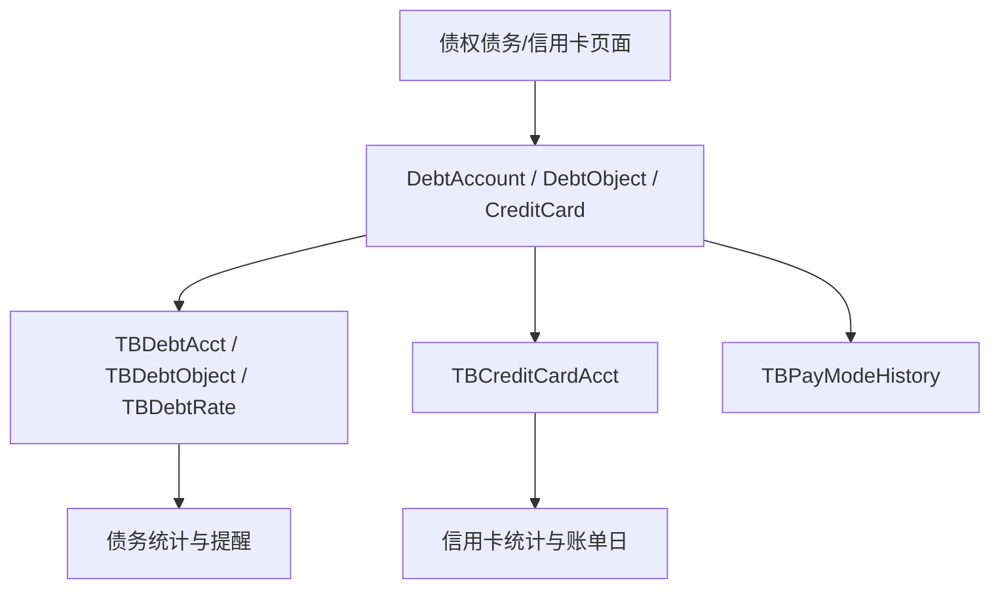
```mermaid
flowchart TD
  A["债权债务/信用卡页面"] --> B["DebtAccount / DebtObject / CreditCard"]
  B --> C["TBDebtAcct / TBDebtObject / TBDebtRate"]
  B --> D["TBCreditCardAcct"]
  B --> E["TBPayModeHistory"]
  C --> F["债务统计与提醒"]
  D --> G["信用卡统计与账单日"]
```

### 涉及对象

- `DebtAccount`
- `DebtObject`
- `CreditCard`
- `PayModeHistory`

### Rust 落地要点

- 债权债务不是普通收支的备注扩展，而是独立业务域。
- 借入/借出命令创建带方向的合同、本金和资金分录；预付/预收创建可核销或冲销的往来余额，不能在收支分类中直接抹平。
- 收回/返还把本金与利息分开：本金调整债权债务余额，利息进入收入或费用，资金账户按本息合计收付。
- 提前收回/返还必须以合同版本读取剩余本金、剩余期数和每期金额，并按处理方式重算未来计划；计划更新失败时结算交易也必须回滚。
- 债权坏账确认损失，债务坏账确认豁免收益；坏账金额受未结本金和版本约束。
- 垫付产生可报销来源明细，报销通过显式核销关系消费明细余额，预防重复报销和双重费用确认。
- 信用卡账单日、还款日和提醒属于独立规则流。
- 信用卡取现写入负债增加、目标账户流入和手续费；信用卡还款写入资金来源流出、本金减少和利息费用，并在同一事务刷新可用额度。
- 信用卡还款总额由本金与利息确定性计算，不能把利息混入本金或只更新页面显示值。
- 待摊费用应作为跨期费用子域处理：创建时写入主体、初始支出和计划，后续每期摊销命令必须幂等并留下来源关系。
- 垫付记录与报销不是备注关联：每条核销关系必须记录来源垫付、核销金额和报销交易；实收账户合计与借款抵扣共同平衡报销金额。

## 5. 证券/基金/投资品选择

### 场景目标

- 搜索投资品
- 录入证券/基金/ETF/LOF/REIT/黄金等交易
- 浏览投资一览

### 当前数据流

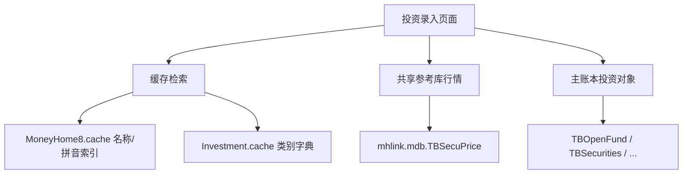
```mermaid
flowchart TD
  A["投资录入页面"] --> B["缓存检索"]
  B --> C["MoneyHome8.cache 名称/拼音索引"]
  B --> D["Investment.cache 类别字典"]
  A --> E["共享参考库行情"]
  E --> F["mhlink.mdb.TBSecuPrice"]
  A --> G["主账本投资对象"]
  G --> H["TBOpenFund / TBSecurities / ..."]
```

### 涉及对象

- `LookupIndex`
- `InvestmentCatalog`
- `Quote`
- `Security`
- `Fund`
- `PreciousMetals`
- `Futures`

### 已确认数据源职责

- `MoneyHome8.cache`
  - 代码/名称/拼音缩写检索
- `Investment.cache`
  - 类型码 `_3 / _4 / _9`
- `mhlink.mdb.TBSecuPrice`
  - 数值行情

### 运行态校准

- 投资一览按投资账户分组显示持仓，当前投入成本 `4,775,044.14`、市值 `6,993,903.35`、浮动盈亏 `2,218,859.21`。
- 当前市值减投入成本与浮动盈亏完全一致，说明底部三项合计至少在本次快照中使用了同一金额口径。
- 页面同时提供投资构成图和行情更新入口，图表应复用同一持仓估值快照。
- B18 已确认最新行情包含九类来源、历史行情包含七类价格源，并可按当前持仓、历史交易过或全部标的限定范围。
- 外汇牌价成功获取 `2026-07-29` 的 `28` 条记录；股票行情在写入前中止后未观察到账簿文件大小或修改时间变化。

### Rust 落地要点

- 投资品选择器至少要支持：
  - 代码搜索
  - 中文名称搜索
  - 拼音/缩写搜索
  - 类别筛选
- 投资列表、合计和构成图必须由带估值时间、行情来源和币种换算口径的同一持仓快照驱动。
- 重大资产的成本、市值、关联负债和所有权必须独立建模；买入、追加、出售、收益、费用和重估作为不同事件进入统一资产投影。
- `RT-14-001` 校准样例要求：`1.00 CNY`、无支付账户、无贷款的买入原子创建资产身份、买入事件、取得成本和同日初始市值；资产和净资产各增加 `1.00`，负债及既有资金账户不变。支付账户为空必须保存为外部资金来源语义，不能丢失来源口径。
- `RT-14-001` 支付账户样例要求：`10.00 CNY` 买入稳定绑定 `Cash-CNY` 后，现金减少 `10.00`，重大资产成本和同日初始市值各增加 `10.00`，全账簿资产、负债和净资产不变。资产事件和资金分录必须共享同一业务 ID 与提交版本。
- 旧版零金额买入会创建账户中心对象但不进入当前持有资产范围。迁移读模型必须保留该事实并提供稳定状态；新建命令必须显式决定允许、警告或拒绝，避免同一对象在账户中心与持仓页出现无解释差异。
- `RT-14-002` 校准样例要求：稳定绑定上述资产后，以卖出所得 `1.50` 结转原始成本 `1.00`，当前成本和市值归零，累计收益为 `0.50`。无稳定收入账户 ID 时不生成资金账户流入，必须保存为外部所得；显示文字不能代替领域引用。
- `RT-14-002` 部分卖出样例要求：从成本/市值 `10.00/10.00` 的资产结转成本 `4.00`、取得 `6.00`，稳定绑定 `Cash-CNY` 并保留“按比例减少市值”后，剩余成本/市值为 `6.00/6.00`，现金增加 `6.00`，全账簿资产和净资产各增加已实现利润 `2.00`，负债不变。成本不等于市值时的比例精度和尾差仍需独立样例。
- 同日买入和卖出保留为两条业务交易，但估值历史只有一个当前有效版本：买入初始 `1.00` 被卖出后的 `0.00` 覆盖。清仓资产退出当前持有范围，仍保留在所有记录范围、零值构成图例和资产概况中。
- `RT-14-004` 校准样例要求：追加投资绑定重大资产工作区当前选中资产。`0.00` 会保留为零值交易；`2.00` 勾选同步市值时同时增加成本和市值，并在无支付账户时以外部资金来源使资产和净资产各增加 `2.00`；后续 `3.00` 关闭同步市值时只增加成本，市值历史、账户中心余额、资产和净资产均不变；绑定 `Cash-CNY` 的 `5.00` 联动追加使现金减少 `5.00`、成本和市值各增加 `5.00`，全账簿资产、负债和净资产不变；新增贷款融资 `2.00` 使成本、市值、资产和负债各增加 `2.00`，现金与净资产不变，并创建负债本金和资产关系。既有贷款复用 `1.00` 不会重复增加本金；现金加贷款混合融资总额 `3.00` 时，现金分配为 `2.00`、新贷款分配为 `1.00`，资产成本和市值各增加 `3.00`、现金减少 `2.00`、负债增加 `1.00`、净资产不变。成本事件、估值事件、资金分录、负债事件和贷款关系必须按显式资金来源原子组合，并以一个业务头关联多条资金来源分配，校验分配金额合计等于业务总额，而不是由金额、控件文字或动态命令 ID 推断。已关联其它资产的既有贷款提交被旧版静默忽略，目标系统必须过滤或明确拒绝；多贷款选择、分摊与顺序以及已关联贷款规则仍需校准。
- `RT-14-020` 校准样例要求：收益金额必须大于零，收入项目默认 `投资收益` 但引用完整收入类别体系。`0.50` 外部取得只创建资产收益和绩效损益，不改变成本、市值、资金账户、资产或净资产；随后绑定 `Cash-CNY` 收入 `0.25`，同一业务事件必须同时增加资产累计收益、现金账户、全账簿资产和净资产 `0.25`，负债不变。资产页、现金账户页和全局财务记录必须引用同一收益事件，冷启动可重建相同投影。全局入口不得从账户中心显示选择态猜测资产，稳定资产 ID 必须由业务命令显式传入。
- `RT-14-005` 校准样例要求：费用金额必须大于零，支出项目默认 `资产费用` 但引用完整支出类别体系。`0.50` 外部支付只创建资产费用和绩效损益，不改变成本、市值、资金账户、资产或净资产；随后绑定 `Cash-CNY` 支付 `0.25`，同一业务事件必须同时减少资产累计收益、现金账户、全账簿资产和净资产 `0.25`，负债不变。资产页、现金账户页和全局财务记录必须引用同一费用事件。
- `RT-14-006/010` 校准样例要求：市值快照按稳定资产 ID 和估值日期唯一保存。跨日 `2026-08-03 / 0.00` 新增独立历史点；修改只改金额；同日再次添加从 `2.50` upsert 为 `3.00` 且不增加行数；删除最新点后回退到最近较早日期。估值从 `1.00` 变为 `2.50` 时，成本和累计收益不变，`Cash-CNY` 与负债不变，资产和净资产各增加 `1.50`。快照、当前值、趋势、构成、账户中心和净资产必须共享同一业务版本。
- 物品需要数量与成本批次，买卖改变数量和资金，价值变更只产生重估事件及未实现损益。
- 重大资产工作区的统计表、市值历史、趋势、成本/市值构成和概况必须读取同一资产选择与估值快照；同日 upsert 保存覆盖审计，删除最新值按日期回退；跨币种资产先按快照汇率折算，再生成总额和构成占比。
- 物品主数据流为 `分类 -> 物品主档 -> 价格快照`，账户与交易只引用稳定 ID。物品买入创建数量和成本批次，卖出结转数量与成本，价值变更新增估值事件，不得直接覆盖主档现价或历史交易。
- 物品账户永久删除会级联影响关联收支、转账和财务计划，目标系统必须先展示影响清单，再在单事务中删除或明确拒绝；取消和失败不得留下部分清理。
- 保险账户聚合保费、返还、分红、现金价值和退保结算；退保与保单终止共享事务但保持两个可审计动作。
- 证券成交统一拆为标的数量变化、成本批次、成交毛额、分项费用和资金净额；卖出再按成本分配生成已实现损益。
- 新股申购以申购聚合跟踪冻结、返款、中签和可分离债权证，任何结算步骤都引用同一业务标识和版本。
- 送股、缩股和现金红利属于公司行为：前两者重建数量与单位成本投影，后者生成资金收入；三者都保留除权/到账规则与来源证券。
- 权证行权、债转股和债券到期是跨标的转换或持仓终止事务，必须原子保存来源持仓减少、目标持仓增加、成本转移、现金尾差及收益。
- 投资费用、资金利息、债券利息和证券红利使用明确事件类型，报表层可聚合但交易真相层不得合并。
- 开放式基金成交由交易时净值、收费模式、费率、费用、金额和份额共同决定；净值与费率快照属于交易证据，不由最新行情或配置覆盖。
- 新基金认购聚合冻结本金、认购期利息、中签份额、费用和返款，并以状态机和幂等键完成结清。
- 基金拆分只改变份额和单位成本；现金分红生成资金收入；分红再投资确认收益并增加份额，三种事件使用不同现金流语义。
- 基金转换以单一事务连接来源持仓与目标持仓，保存两侧基金类型、净值/本金、份额、费用、成本转移和舍入尾差。
- 货币基金采用本金与累计收益投影，申购按金额、赎回拆分本金和利息、红利再投资结转收益；不套用开放式基金净值费率公式。
- 债券交易将净价资本流、应计利息流和费用流拆分；持仓成本不吸收购入应计利息，资本利得不混入卖出应计利息。
- 债券卖出、正常到期和提前兑取共享持仓结转能力，但使用不同条款、现金流和损益规则，并保留终止原因。
- 银行理财以产品条款与持仓本金为核心，申购增加本金，赎回以实际收回金额减本金形成收益，分红不减少本金。
- 债券利息与理财分红可共享编辑器和资金收入管道，但业务事件类型、产品引用和统计口径必须显式保存。

### 5.1 外汇账户与交易

运行态已确认外汇账户采用三步创建流程：先写账户名称、本位币、所有者、备注和账户组，再写期初余额、日期和资金来源，最后按币种补充初始持仓及各自资金来源。账户创建、期初资金分录和分币种持仓必须作为一个业务事务提交；任一步取消都不应留下半成品账户。

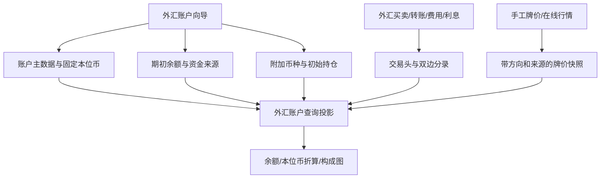
```mermaid
flowchart TD
  A["外汇账户向导"] --> B["账户主数据与固定本位币"]
  A --> C["期初余额与资金来源"]
  A --> D["附加币种与初始持仓"]
  E["外汇买卖/转账/费用/利息"] --> F["交易头与双边分录"]
  G["手工牌价/在线行情"] --> H["带方向和来源的牌价快照"]
  B --> I["外汇账户查询投影"]
  C --> I
  D --> I
  F --> I
  H --> I
  I --> J["余额/本位币折算/构成图"]
```

外汇买卖显式输入卖出币种、买入币种、交易汇率和两侧金额；`6.00 CNY × 0.1473 USD/CNY = 0.8838 USD` 在旧界面金额端显示为 `0.88 USD`，保存后全局记录以同一“外汇买卖”展示流入 `0.88`、流出 `6.00`。真实方向点击显示直接 `0.1473`、反向 `6.7894` 且交易腿不交换，说明两种四位显示必须来自同一未舍入规范牌价。CNY/CNY 被选择器接受并归一为 `1.0000`，零金额提交进入“卖出金额必须大于零”校验；正金额提交仍待验证。两侧金额都作为可编辑字段暴露，但不一致值能否保存仍待验证；规范牌价、成交汇率、两侧最终金额和舍入差额都属于交易证据，不能只保存界面汇率后重算，也不能被之后的市场牌价覆盖。手工市场牌价窗体只提交有效日期、有序的两个币种 ID 和四位汇率，报价说明由币种顺序派生；旧对象按 `rate * 10000` 保存整数，编辑时除以 `10000` 回填。目标模型用 `ExchangeRateVersion(quote_id, currency_1_id, currency_2_id, effective_date, rate_scaled, scale, source, quote_kind, version)` 承载事实，展示标签由查询层生成。当前持有与全部交易过币种是两个查询范围，余额、牌价、折算合计和构成图必须共享同一已发布估值快照。校准账户的统计投影显示 `0.88 USD / 6.7894 / 5.97 CNY` 与 `94.00 CNY / 1.0000 / 94.00 CNY`，合计 `99.97 CNY`；构成图直接复用两个折算金额。交易查询同时保留币种范围和日期范围，余额调整可映射为单侧腿，外汇买卖必须映射为双侧腿，修改或删除后按原查询参数原子刷新持仓、明细、合计和构成。

外汇账户资料修改数据流为“按稳定账户 ID 和预期版本读取 `Account + ForeignAccountProfile` -> 编辑名称、日期、固定币种、所有者、备注、开户银行和账号草稿 -> 校验名称、日期、唯一性及币种 -> 原子更新主档与扩展资料 -> 从同一版本刷新账户树、概况、选择器和工作区”。新增默认绑定账簿本币，编辑态禁用币种；银行和所有者使用可空稳定 ID，账号最长 50 字符。余额、分币种持仓、交易、牌价和估值不进入该命令，换币种必须走独立迁移流程。

持有外汇调整读取当前账面余额和版本，以真实余额减账面余额形成差额事件。删除账户先读取关联收支、转账、计划和其它关系，展示级联影响，确认后单事务删除或归档并刷新账户中心；本轮临时账户逻辑删除后 Jet 文件增长 `20,480` 字节，说明验证不能依赖文件长度回退，而应验证对象、关系和查询投影均已清理。

### 5.2 现货贵金属账户、产品与交易

现货贵金属账户先创建账户主数据和固定币种，再保存期初资金来源。产品目录与按日价格快照独立维护；买入或卖出通过产品 ID 引用目录，通过成交价格引用或固化交易证据，后续行情只能改变估值，不能覆盖历史成交。

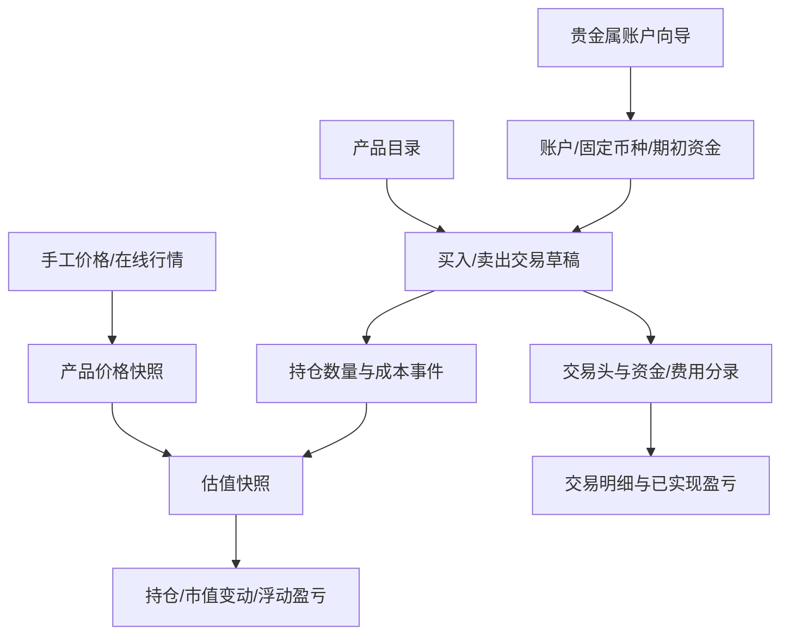
```mermaid
flowchart TD
  A["贵金属账户向导"] --> B["账户/固定币种/期初资金"]
  C["产品目录"] --> D["买入/卖出交易草稿"]
  E["手工价格/在线行情"] --> F["产品价格快照"]
  B --> D
  D --> G["交易头与资金/费用分录"]
  D --> H["持仓数量与成本事件"]
  F --> I["估值快照"]
  H --> I
  G --> J["交易明细与已实现盈亏"]
  I --> K["持仓/市值变动/浮动盈亏"]
```

工作区的持仓表、交易明细、市值构成和变动、历史盈亏必须共享同一账户上下文。买入原子增加持仓并减少资金，卖出原子减少持仓、增加资金并结转成本；余额调整与持仓调整改为保存差额事件。当前真实成交公式尚未校准，因此总金额、成本法、已实现盈亏和收益率必须作为显式策略并通过代表性样例验收。

账户删除先读取交易、转账、计划、持仓、价格引用和其它关系形成影响摘要，再在单事务中删除或归档。临时账户删除后 Jet 文件增长 `24,576` 字节，业务验收应检查账户、关系和查询投影不存在，而不是要求旧文件长度回退。账户概况与编辑器必须以账户 ID 和版本关联，防止已观察到的完整名称被错误加载为 `zi`。

### 5.3 贵金属 TD 品种、开平仓与保证金

贵金属 TD 账户保存每万元交易手续费和默认资金来源，品种目录保存代码、报价单位、交易单位、每手数量和保证金比例。开仓通过品种和方向创建合约持仓批次，占用保证金并扣取费用；平仓只允许选择可平合约和手数，释放对应保证金并确认已实现盈亏。递延费、超期费、其它费用和利息收入作为独立事件进入账户资金流水。

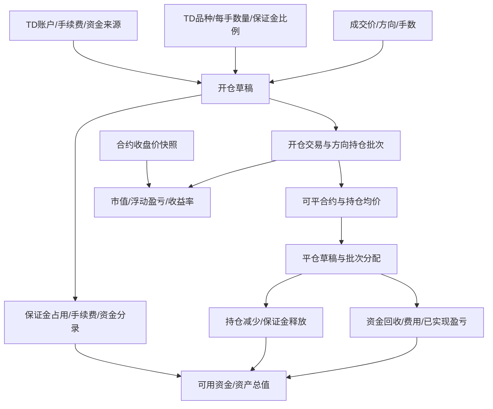
```mermaid
flowchart TD
  A["TD账户/手续费/资金来源"] --> D["开仓草稿"]
  B["TD品种/每手数量/保证金比例"] --> D
  C["成交价/方向/手数"] --> D
  D --> E["开仓交易与方向持仓批次"]
  D --> F["保证金占用/手续费/资金分录"]
  E --> G["可平合约与持仓均价"]
  G --> H["平仓草稿与批次分配"]
  H --> I["持仓减少/保证金释放"]
  H --> J["资金回收/费用/已实现盈亏"]
  K["合约收盘价快照"] --> L["市值/浮动盈亏/收益率"]
  E --> L
  F --> M["可用资金/资产总值"]
  I --> M
  J --> M
```

开仓、平仓、保证金和资金分录必须共享事务与账户/持仓版本。持仓区的数量、保证金、市值、浮动盈亏和汇总，交易明细及历史盈亏必须从同一快照派生。当前只验证了页面初始态和取消路径，成交金额、保证金、保证金释放、批次分配、已实现盈亏和收益率公式不得在代表性样例校准前标记为已兼容。

旧程序从 TD 工作区打开在线更新时仍默认选择“贵金属价格”。Rust 版必须使用显式行情适配器把来源记录映射到稳定合约 ID，保存行情时间、来源、批次和有效状态；无法证明是 TD 合约行情的数据不得参与保证金或盈亏重估。

### 5.4 期货品种、合约、开平仓与保证金

期货账户固定为人民币，并以账户自身余额承载可用资金和保证金变化。品种目录提供代码、交易单位、每手数量、手续费规则、保证金比例和交易所；到期合约及其日价格与品种主数据分离。开仓选择品种、方向和到期年月，平仓选择已有可平合约。当前尚未通过真实保存确认合约是否严格由“品种 + 到期年月”生成，因此该关系在领域模型中保留为待校准规则。

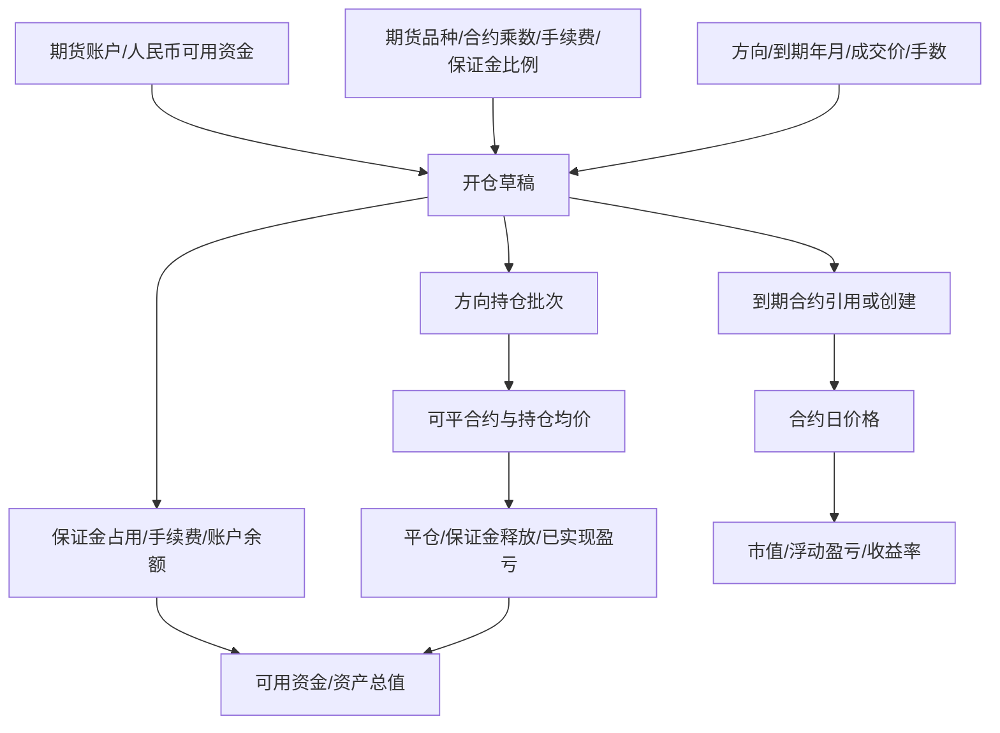
```mermaid
flowchart TD
  A["期货账户/人民币可用资金"] --> D["开仓草稿"]
  B["期货品种/合约乘数/手续费/保证金比例"] --> D
  C["方向/到期年月/成交价/手数"] --> D
  D --> E["到期合约引用或创建"]
  D --> F["方向持仓批次"]
  D --> G["保证金占用/手续费/账户余额"]
  E --> H["合约日价格"]
  F --> I["可平合约与持仓均价"]
  I --> J["平仓/保证金释放/已实现盈亏"]
  H --> K["市值/浮动盈亏/收益率"]
  G --> L["可用资金/资产总值"]
  J --> L
```

期货开平仓与 TD 共享“方向持仓 + 保证金”核心，但资金边界不同：期货表单没有独立资金账户。重构版应复用持仓和保证金计算接口，而不是复用 TD 的资金来源关系。成交金额、手续费、保证金、保证金释放、已实现盈亏和收益率仍需通过代表性开平仓样例校准；在线更新必须记录明确的期货价格来源、合约、时点、批次和失败状态。

### 5.5 融资融券合同、偿还与担保物

融资融券账户固定为人民币，并分别保存默认融资年利率和融券年利率。融资买入建立证券持仓和融资合同债务，融券卖出建立证券数量债务；合同必须保存成交时利率和合同号快照，账户默认利率变化不能重算历史。卖券还款、买券还券和利息还款把市场交易或现金偿还分配到具体合同，批量偿还则在一个批次内处理多份合同。

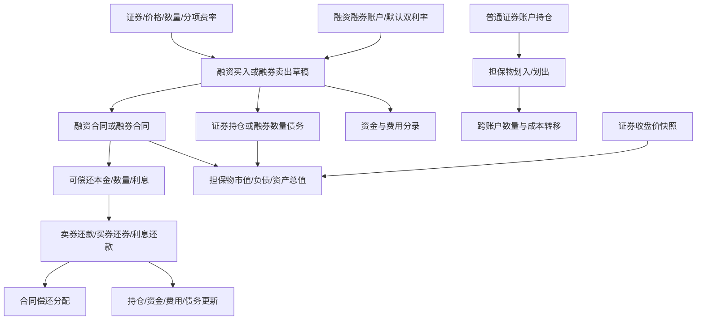
```mermaid
flowchart TD
  A["融资融券账户/默认双利率"] --> C["融资买入或融券卖出草稿"]
  B["证券/价格/数量/分项费率"] --> C
  C --> D["证券持仓或融券数量债务"]
  C --> E["融资合同或融券合同"]
  C --> F["资金与费用分录"]
  E --> G["可偿还本金/数量/利息"]
  G --> H["卖券还款/买券还券/利息还款"]
  H --> I["合同偿还分配"]
  H --> J["持仓/资金/费用/债务更新"]
  K["普通证券账户持仓"] --> L["担保物划入/划出"]
  L --> M["跨账户数量与成本转移"]
  N["证券收盘价快照"] --> O["担保物市值/负债/资产总值"]
  D --> O
  E --> O
```

融资买入、融券卖出及其合同、费用和资金分录必须共享事务与账户版本。批量直接还款和批量直接还券必须全成或全败，并用稳定业务键防止重试重复核销。批量候选查询必须显式使用账户 ID、合同类型、未结状态、剩余量和合同版本；旧版已复现工作区存在未结融资合同、重启后合同仍在，但批量候选为空的跨投影不一致。单笔直接还款和还券已确认由具体合同进入，并分别以未还金额和未还数量初始化输入上限。担保物买卖是信用账户内证券交易；担保物划入/划出是跨账户持仓和成本基础迁移，不确认普通成交盈亏。融资权益与融券权益已确认存在独立编辑器，但其业务口径仍需进一步校准。

持仓表、交易明细、历史盈亏、融资负债、融券负债、担保物市值、可用资金和资产总值必须共享同一持仓、合同与行情快照。真实最小融资和融券合同已成功形成，直接还款、直接还券和合同编辑的有合同加载状态与取消路径已验证；批量直接还款还确认了空行编辑和缺少合同/金额时的提交阻断，但成功候选与保存仍不可达。完整合同字段、偿还保存、利息、费用、成本与盈亏公式、幂等及失败回滚仍不得提前标记为兼容。

### 5.6 商业保险、现金价值与社保子账户

商业保险采用四步开户：先选择人身保险、财产保险或投资分红险，再录入账户资料和“保费计入收支统计”口径，然后录入保额、保障期间、缴费年限、保险公司、险种及投保关系，最后配置保费金额、频率、已缴保费、付款账户和自动扣款或提醒方式。账户、保单条款、投保关系、缴费计划和可选期初缴费必须作为同一个开户事务提交。

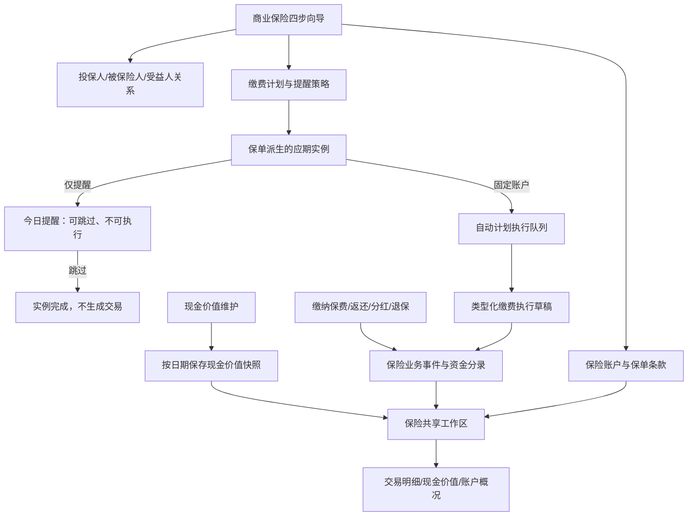
```mermaid
flowchart TD
  A["商业保险四步向导"] --> B["保险账户与保单条款"]
  A --> C["投保人/被保险人/受益人关系"]
  A --> D["缴费计划与提醒策略"]
  D --> K["保单派生的应期实例"]
  K -->|"仅提醒"| L["今日提醒：可跳过、不可执行"]
  L -->|"跳过"| M["实例完成，不生成交易"]
  K -->|"固定账户"| N["自动计划执行队列"]
  N --> O["类型化缴费执行草稿"]
  O --> F
  E["缴纳保费/返还/分红/退保"] --> F["保险业务事件与资金分录"]
  G["现金价值维护"] --> H["按日期保存现金价值快照"]
  B --> I["保险共享工作区"]
  F --> I
  H --> I
  I --> J["交易明细/现金价值/账户概况"]
```

动态实测已完成零金额商业保险账户创建、共享工作区、账户编辑器、现金价值页、账户概况、账户操作菜单和永久删除；还完成了投保金额 `100.00`、已缴保费 `10.00` 的非零开户，以及现金价值同日新增覆盖、修改、唯一快照删除、两日期删除最新值/非最新值、历史/未来估值日和金额边界。删除唯一 `11.00` 时旧程序出现 `1.00/11.00/0.00` 分裂；删除两日期中的最新 `13.00` 时，当前会话正确回退 `11.00`，重开后快照表和图表仍为 `11.00`、余额与汇总却回填 `13.00`；删除较早 `11.00` 时，当前会话及重启均稳定保留最新 `13.00`。加入未来 `2026-08-01 / 15.00` 后，以 `2026-07-31` 查询仍得到 `11.00`，但重开后旧程序错误归零。负数和空值被静默转零，人民币三位小数按两位舍入，十一位整数发生浮点进位，十位整数金额可跨页和重启保持精确。保险交易事实始终不变。Rust 必须把开户保险事件与现金价值快照分开保存，以账户和估值日唯一键实现可审计 upsert；当前值查询显式携带 `as_of_date`，金额按币种精度转换为受检整数最小单位，并在写入、删除、聚合和重启后从同一事实原子重建全部投影。业务日期来源、跨月/跨年/时区、其它币种精度、精确上限、聚合溢出、根因和失败回滚仍不得标记为兼容。

缴费计划的动态样例进一步确认策略分流。未绑定资金账户的“仅做提醒”计划进入今日提醒，执行禁用、跳过启用；跳过只完成单个实例，不写保险事件和资金分录。绑定 `Cash-CNY` 的“固定账户定期扣款”则生成自动计划，定义保存时不扣款；从计划列表执行后先形成可编辑的缴费草稿，最终提交才原子写入保险缴费和资金流出。受控 `1.00` 样例提交后 `Cash-CNY 608.00 -> 607.00`、资金记录数 `9 -> 10`，保险侧累计保费和记录数分别变为 `1.00/1`。

中央列表只投影保单派生计划，不能直接修改或删除；保单工作区专用入口已真实把两缴费年度的年缴 `1.00` 改为半年缴 `1.01`，实例范围重算为每 `6` 月、`2026-08-03..2028-02-03`，执行草稿同步读取新版本。关闭未入账草稿并重启后的状态已包含首期自动缴费，现金余额为 `606.99`、保险累计保费为 `1.01`、下次执行日为 `2027-02-03`；账户中心短暂仍显示旧余额。计划定义必须引用保单及条款版本，实例冻结到期日、策略、金额和账户快照，修改只替换未来未处理实例，保险事件与资金交易共享实例幂等键，所有投影在提交后读取同一版本。关闭草稿到自动提交之间的精确时点仍需隔离复测。

社保采用两步开户：第一页录入参保人、社会保障号码、城市和保费统计口径；第二页选择养老、工伤、失业、医疗、生育和住房公积金中的至少一类，并为每类保存独立期初余额。运行态人员选择器列出 `LHM`、`Lzb`、`Qrd`，选择 `Lzb` 后动态进入第二页；勾选养老会显示独立的记账日余额 `0.00`，完成后创建 `Lzb的社保账户组` 和 `Lzb-养老`。

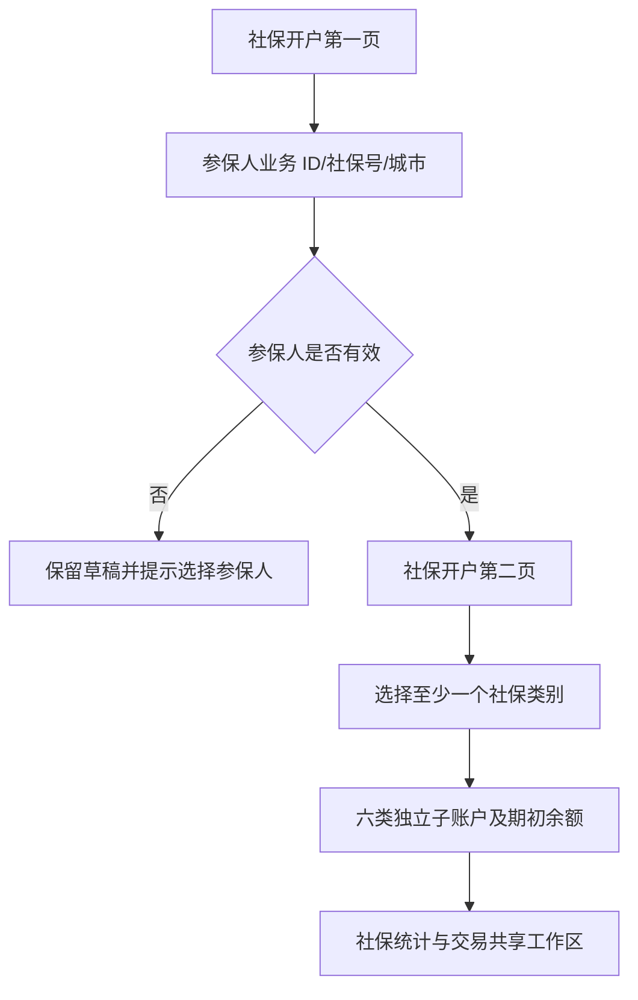
```mermaid
flowchart TD
  A["社保开户第一页"] --> B["参保人业务 ID/社保号/城市"]
  B --> C{"参保人是否有效"}
  C -->|"否"| D["保留草稿并提示选择参保人"]
  C -->|"是"| E["社保开户第二页"]
  E --> F["选择至少一个社保类别"]
  F --> G["六类独立子账户及期初余额"]
  G --> H["社保统计与交易共享工作区"]
```

Rust 版应以人员 ID 建立参保关系，以社保主账户聚合六类子账户；类别余额、缴费和待遇收入分别入账，不得把六类余额压成一个不可追溯总数。商业保险与社保可复用工作区外壳，但保单现金价值、社保类别余额和交易规则必须由各自领域服务提供。

真实养老子账户进入 `TSocialSecurityTransFm` 后，上部显示项目名称、余额和备注，下部交易空状态汇总现金价值、缴费总额、领取总额和记录数。现金价值页受“保费计入收支统计”开关约束，概况和编辑器按社保模式显示参保人、社保编码与地区；记账菜单仍提供缴纳保费、保费返还、退保和保险分红。删除子账户会提示级联清理相关收支、转账和计划，但不会自动删除最后留下的空账户组，因此新系统必须显式定义空组保留或自动清理策略。

## 6. 定期、理财、费率与行情联动

### 场景目标

- 计算定期/理财利率
- 套用买卖费率
- 刷新投资估值

### 当前数据流

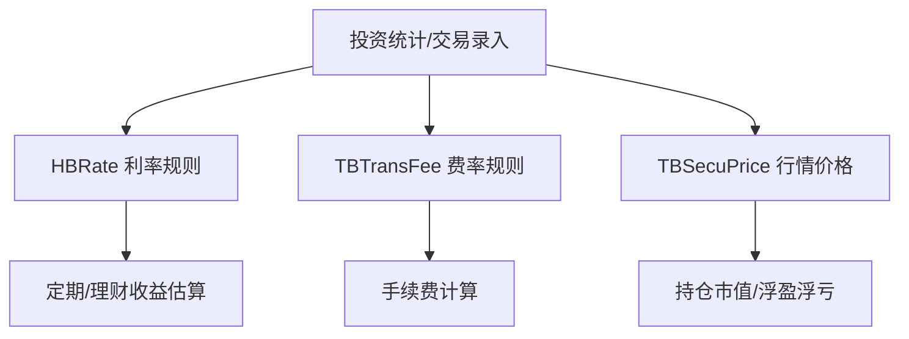
```mermaid
flowchart TD
  A["投资统计/交易录入"] --> B["HBRate 利率规则"]
  A --> C["TBTransFee 费率规则"]
  A --> D["TBSecuPrice 行情价格"]
  B --> E["定期/理财收益估算"]
  C --> F["手续费计算"]
  D --> G["持仓市值/浮盈浮亏"]
```

### 涉及对象

- `RateRule`
- `FeeRule`
- `SecurityFeeTemplateVersion`
- `AccountSecurityFeeSnapshot`
- `Quote`

### Rust 落地要点

- 利率、费率、行情必须拆成可测试的纯计算服务。
- 证券全局费率按市场、证券类型和模板版本保存，字段显式区分百分比、千分比和固定金额。手工编辑与在线更新都生成不可变版本；在线批次完整校验后原子发布，并在覆盖本地手工值前展示逐字段差异。
- 新证券账户创建时复制当时已发布模板为账户费率快照，已有账户不跟随全局模板变化；证券交易进一步冻结实际使用的账户费率和逐项计算结果。
- RT-08-004 观察到在线更新成功发布 `11` 条模板，并在恢复 `test.mh8` 后仍保留账簿外更新时间。应用级参考数据、更新批次元数据与账簿内账户快照必须具有明确所有权和独立恢复策略。

### 行情批次流

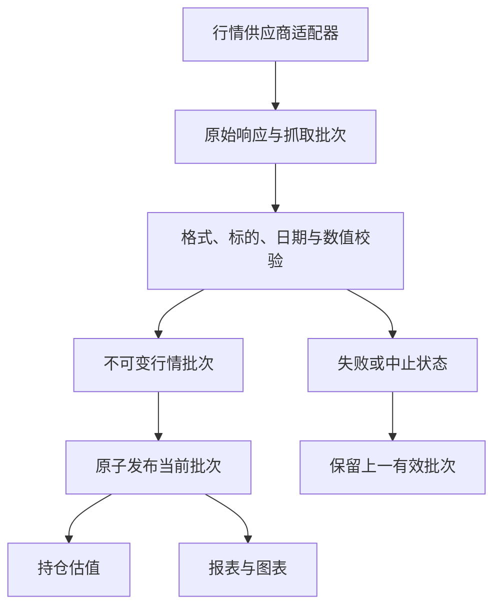
```mermaid
flowchart TD
  A["行情供应商适配器"] --> B["原始响应与抓取批次"]
  B --> C["格式、标的、日期与数值校验"]
  C --> D["不可变行情批次"]
  D --> E["原子发布当前批次"]
  E --> F["持仓估值"]
  E --> G["报表与图表"]
  C --> H["失败或中止状态"]
  H --> I["保留上一有效批次"]
```

每个批次保存来源、最新/历史模式、标的范围、日期区间、请求时间、数据日期、记录数和校验结果。只有完整批次通过校验后才能发布；中止、超时或部分响应只留下审计状态，不得覆盖当前有效行情。持仓、报表和图表必须引用同一发布批次 ID。

## 7. 预算与提醒

### 场景目标

- 设置预算
- 跟踪预算使用
- 创建提醒
- 推送限额提醒或到期提醒

### 当前数据流

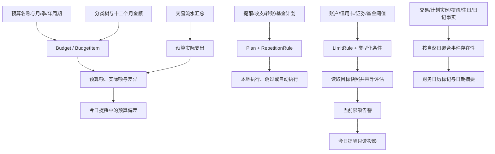
```mermaid
flowchart TD
  A["预算名称与月/季/年周期"] --> B["Budget / BudgetItem"]
  C["分类树与十二个月金额"] --> B
  D["交易流水汇总"] --> E["预算实际支出"]
  B --> F["预算额、实际额与差异"]
  E --> F
  F --> G["今日提醒中的预算偏差"]
  H["提醒/收支/转账/基金计划"] --> I["Plan + RepetitionRule"]
  J["账户/信用卡/证券/基金阈值"] --> K["LimitRule + 类型化条件"]
  I --> L["本地执行、跳过或自动执行"]
  K --> P["读取目标快照并幂等评估"]
  P --> Q["当前限额告警"]
  Q --> R["今日提醒只读投影"]
  M["交易/计划实例/提醒/生日/日记事实"] --> N["按自然日聚合事件存在性"]
  N --> O["财务日历标记与日期摘要"]
```

### 涉及对象

- `Budget`
- `BudgetItem`
- `Plan`
- `RepetitionRule`
- `Reminder`
- `LimitReminder`
- `Transaction`

### Rust 落地要点

- 预算并不是孤立表单，必须与交易聚合查询打通。
- 预算金额按十二个月保存；季度和年度视图应由同一预算明细投影生成，复制年度和导入最近十二个月实际支出需要明确覆盖范围。
- 计划至少区分普通提醒、收支、转账和基金申购/定投，并共享日期、重复规则、最大次数、提前提醒、生命周期状态和可选自动执行能力。
- 普通提醒的重复规则包含一次性、每天、每周、每月、每年和自定义；自定义保存正整数间隔及天、周、月、年单位。提前量为当天或提前 1 至 7 天。
- 非一次性规则的重复次数包含首次发生；每天 `999` 次从 `2026-08-03` 推导结束日 `2029-04-27`。结束日期是规则投影，不应由跳过实例重算。
- 交易模板、计划定义、每次应发生实例和最终交易必须分层。执行实例关联唯一交易；跳过只写实例状态，不能生成交易或覆盖定义。
- 手工收支计划还要在实例与最终交易之间保存可编辑执行草稿。到期保存询问中选择否只提交计划定义；后续执行打开草稿，最终确认才入账。删除计划定义不删除已生成交易。
- 每天重复 3 次的收支计划从 `2026-08-03` 推导结束日 `2026-08-05`。首期执行后下次日期为 `2026-08-04`，连续跳过后两期不生成交易并最终完成；两条已执行计划交易使 `Cash-CNY` 从 `608.00` 降至 `607.97`。
- 手工转账计划同样先保存定义，再在执行时建立类型化转账草稿。本金 `0.03`、来源手续费 `0.01` 的受控实例使 `Cash-CNY -0.04`、目标分组 `+0.03`、净资产 `-0.01`，全局记录流入/流出为 `0.03/0.04`；本金双边和手续费必须由同一幂等事务提交。
- 每天重复 2 次的转账计划两期均跳过后不生成交易并完成，但旧版“已执行次数”显示 `2`。领域模型必须分别统计 `processed/executed/skipped/failed`，兼容列表只能投影已处理数。
- 手工基金计划也先保存定义，再在执行时建立类型化开放式基金申购草稿。计划模板保存基金、基金账户、资金账户、费率和定额；执行草稿补充成交净值、收费模式、费用和份额，最终确认才原子提交资金流出、持仓份额和成本。
- 代表性申购按金额 `1.00`、前端费率 `1.00%`、成交净值 `1.0000` 计算费用 `0.01`、份额 `0.99`，持仓成本 `1.00`、含费均价 `1.0101`。后续市值 `1.10` 和浮动盈亏 `0.10` 来自独立最新行情，不能用成交净值重算或锁死估值。
- 每天重复 2 次的基金计划两期均跳过后不生成交易并完成。提前 3 天使第二期在前一期跳过后立即以“1天后”留在今日提醒；旧列表对基金周期计划的结束日期始终显示 `-`，领域规则结束日和兼容显示必须分离。
- 跳过每天提醒的 `2026-08-03` 实例后，下次日期推进到 `2026-08-04`，结束日期和执行中状态不变。命令能力按来源和状态计算，普通提醒没有终止或恢复。
- 收支、转账和基金计划执行中、完成态的操作菜单都没有终止或恢复；收支和转账完成计划的修改入口是只读快照。命令能力必须按来源类型、实例日期和生命周期状态计算，不能从静态命令名推断。
- 旧版一次性普通提醒在当天保存后立即进入今日提醒，不可执行但可跳过；跳过后默认列表隐藏，显示已完成时却统一标为“执行完毕”。目标实现必须把兼容展示状态与真实 `skipped` 动作分开保存。
- 限额提醒区分账户余额、信用卡透支、证券市价和基金价格；新规则默认启用，生效列停用跨冷启动保持。账户与价格上下限要求 `lower < upper`，条件、稳定目标 ID、条件版本与启用状态必须持久化，每次评估冻结目标快照版本和观测值。
- `Cash-CNY=608.00` 对下限 `609.00` 生成低 `1.00` 元告警；证券下限 `0.0100` 真实触发，停用信用卡和未越界基金不触发。证券编辑器/告警的四位精度不能被列表两位格式截断。
- 今日提醒把计划实例、阈值触发和预算偏差汇总到同一查询列表；限额告警执行和跳过均禁用。删除证券规则后当前告警立即消失，但目标实现仍须保留历史触发审计；“今日不再提醒”只修改当天展示偏好。
- 财务日历是只读日期投影。年月选择只改变查询窗口，日期选择刷新公历、农历、节日节气和事件摘要；不得维护第二套交易或计划事实。
- 受控日记在 `2026-08-03` 保存后进入日历同日摘要，删除后日记摘要消失而账务记录标记保持。日记列表、搜索和日历必须读取同一稳定日记 ID、自然日、正文摘要与删除状态；日历不复制正文。
- 公历 `2026-08-03` 人物生日保存后显示“今天是CodexRT15Bday的生日”，删除人物后生日摘要消失而账务记录标记保持。生日投影读取稳定 `party_id`、当前名称、原始历法/年月日和人物版本，不复制姓名或生日真相。农历 `1991-06-07` 样例在 `2026` 年对应农历六月初七、原始月日和精确出生日期均未投影；目标系统不复制该遗漏，而应显式版本化公历周年、农历换算、闰月、`2月29日`、时区和业务日规则。
- 一次性普通提醒待处理时，财务日历按应发生日显示独立提醒图标和名称摘要；从今日提醒跳过后，该来源立即退出日历，而同日交易标记保持，定义仍在已完成范围。日历必须以 `occurrence_id` 读取 `pending` 实例，跳过只更新实例动作和审计；应发生日与提前提醒资格窗口分开建模。
- 旧版当前年份菜单为 `2026..1990`、月份固定十二项，年月切换保留日值；相邻月份日期可更新选中日期但不自动切换顶部月份。目标实现可以改进交互，但必须显式定义并测试。
- 提醒既有本地场景，也有远程通知链路。

## 8. 财务规划与目标储蓄

### 场景目标

- 输入收入、支出、购置、教育、退休、通胀等条件
- 形成规划结果
- 关联目标储蓄账户

### 当前数据流

```mermaid
flowchart TD
  A["家庭资料"] --> B["TFP* 专题输入"]
  C["收入、支出、资产、债务、保险"] --> B
  D["通胀、退休、教育、重大支出、资产购置"] --> B
  B --> E["FinancialPlanning 聚合模型"]
  E --> F["逐年现金流与年末余额"]
  G["目标名称、日期、金额"] --> H["Goal"]
  I["全部或指定账户余额/市值"] --> J["GoalAccountRelation"]
  H --> K["初始值、标准进度、实际进度"]
  J --> K
  L["账簿统计或手工诊断输入"] --> M["诊断输入快照"]
  C --> M
  N["定期/货币基金资产性质"] --> M
  M --> O["十二项指标、阈值、状态和建议"]
```

### 涉及对象

- `FinancialPlanning`
- `PlanningIncome`
- `PlanningExpense`
- `PlanningEvent`
- `Goal`
- `GoalAccountRelation`
- `Account`

### Rust 落地要点

- 规划域最好单独建子模块，不和普通预算/提醒揉成一团。
- 所有专题编辑器先修改规划草稿，最终统一生成年度结果；单个对话框取消不得留下部分输入。
- 资产购置必须同时表达一次性/分期资金流、首付、利率、月供及购置后收入和支出。
- 家庭资料决定规划年度范围。`1990` 年出生、预计寿命 `85` 的受控样例生成 `2026..2075` 共 `50` 个年度；有配偶时需并列保存配偶出生年份和预计寿命，并按家庭寿命边界生成结果。
- 零增长受控样例中，年工资 `120,000.00`、家庭年日常支出 `60,000.00` 使年度余额按每年净增加 `60,000.00` 递增，并在冷启动后保持；这只校准了基础年度收入减支出，不能外推通胀、退休、分期购置和资产增长的复利顺序。
- 年度图、健康状态和纵轴缩放属于可重算展示。目标实现必须保留逐年数值、输入快照、账户/估值快照、公式版本和计算时间。
- 目标进度读取账户余额或投资估值投影，不得把显示进度保存为不可追溯的真相值。
- 受控目标 `Codex-Goal-Probe-20260729` 的期间为 `2026-07-29..2026-10-29`，目标金额为 `1,000.00`，所选账户聚合值为 `-550,000.00`；在起始日，初始值、实际进度和标准进度均显示 `-550,000.00`，证明负初始值有效且创建时账户估值是三者共同起点。
- 创建时必须保存初始总值、估值时间和逐账户输入快照。标准进度可能由初始值向目标金额按期间推进，但目前只有起始日等值被动态确认，线性内插及舍入规则仍属于待校准推断。
- 诊断、规划和目标共享账户与估值服务，但公式版本、输入快照和计算时间必须可追踪。
- 财务诊断支持账簿统计和持久化手工输入两种来源。诊断年总支出为消费、还款和保费之和，排除储蓄支出；储蓄性支出为保费与储蓄支出之和；月收入和月支出按年值除以 `12` 后先舍入到 `4` 位小数。
- 定期和货币基金的资产性质只重分类流动资产和投资资产，不得改写账户余额、总资产、总负债或净资产。
- 十二项诊断结果是可重算投影；业务阈值、建议文案版本和图表缩放范围必须分开建模。

## 9. 同步与通知

### 场景目标

- 登录/注册
- 同步基础对象与交易
- 同步余额
- 上传提醒、预算、持仓、资产负债

### 当前数据流

```mermaid
flowchart TD
  A["用户登录/同步"] --> B["SyncProfile / SyncRecord"]
  B --> C["币种/人员/标签/分类"]
  B --> D["账户/交易"]
  B --> E["默认币种/余额"]
  B --> F["预算/提醒/持仓/资产负债"]
```

### 已确认接口族

- 币种下载/上传
- 人员下载/上传
- 标签下载/上传
- 收支项目下载/上传
- 账户下载/上传
- 交易下载/上传
- 默认币种下载/上传
- 余额上传
- 通知开关下载/上传
- 提醒/预算/持仓/资产负债上传

### Rust 落地要点

- 同步层需要独立对象映射，不要让远端字段直接污染领域模型。
- B18 已确认双向同步为默认、单向上传为显式选项，未同意条款时开始同步不可执行；关闭账簿自动同步必须支持超时、取消和明确结果。
- 同步账号凭据必须进入操作系统安全凭据库，禁止写入账簿、日志、截图、崩溃报告或 UI 自动化树；新协议必须使用 HTTPS。
- 手机快查的本地启用状态、待发布财务快照和远端发布结果分别存储，断网或旧服务失败不得影响本地记账。

## 9.1 预算

### 已验证数据流

```mermaid
flowchart TD
  A["预算名称与频率"] --> B["预算分类范围"]
  B --> C["年/月/分类预算额度"]
  D["交易事实"] --> E["按月份、方向和分类聚合实际值"]
  C --> F["预算列表投影"]
  E --> F
  F --> G["金额、整数执行率和进度条"]
  H["最近 12 个完整月份导入"] --> E
  H --> I["覆盖预览与导入批次"]
  I --> C
  J["单元格/整列/跨年度复制"] --> K["复制差异预览"]
  K --> C
```

- 预算创建先确认名称和频率，再确认分类范围；目标命令必须原子保存两部分或使用不进入有效列表的显式草稿。
- 月度额度使用正的货币最小单位。旧版支出页脚显示负方向，但单元格和主页面预算额为正；方向不得由金额符号推断。
- 实际支出从交易事实重建。执行率在预算大于零时按 `actual / budget * 100` 四舍五入为整数且不封顶；零预算按实际是否为零显示 `0%` 或 `100%`。
- `2026-08-02` 的导入读取 `2025-08` 至 `2026-07` 共 12 个完整月份，按月份编号写入目标年度 2026 的 1 至 12 月列，并无确认覆盖手工额度。目标实现必须返回来源年月、目标年月和覆盖差异预览，再原子保存导入批次和新额度。
- 单元格复制只覆盖勾选月份的同一分类；整列复制覆盖勾选月份的全部分类；跨年度复制读取同一预算来源年度的逐月分类额度矩阵。没有当前单元格选择时，前两项命令禁用。
- 尚无额度的未来年度在旧版中以前一年度十二月分类额度铺满十二个月。复制子对话框只更新父级编辑草稿，父级确定后才持久化并跨冷启动保持。
- 分类移除会删除该分类全部月份额度，重新加入从零初始化；目标命令必须预览受影响月份和额度，不能把它实现成可逆隐藏。
- 收入和支出共用十二个月额度网格，但主页独立展示总收入和总支出；网格页脚净额是额外派生投影。受控样例为收入 `17.89`、支出 `43,660.70`、净额 `-43,642.81`，并已跨冷启动保持。
- 冷启动从预算持久化数据与交易事实重建同一投影。预算页面不得维护第二套实际支出真相。

### 剩余验证

- 季度、年度和自定义期间。
- 非零实际收入的执行率和导入、父子分类、退款、冲正和分类迁移。
- 多币种、汇率时点和舍入。
- 有效年份范围内无来源额度、父级取消保存、其它周期复制、导出、并发和失败回滚。

## 10. 报表与分析

### 场景目标

- 查看收支报表
- 查看资产报表
- 查看投资表现
- 查看趋势与分类统计

### 当前数据流

```mermaid
flowchart TD
  A["日期、相关资产、人员、活动、分类、标签、币种/对象、金额"] --> B["ReportQuery"]
  B --> C["交易/账户/持仓/行情/汇率查询投影"]
  C --> D["分组、排序、小计、合计、占比和收益率"]
  D --> E["表格 DTO"]
  D --> F["时间序列/图表 DTO"]
  E --> G["导出与打印"]
  F --> G
```

### Rust 落地要点

- 报表一定要走查询投影，不要直接从 UI 端拼字段。
- 同一不可变查询快照必须驱动表格、图表、导出和打印，避免筛选往返后结果漂移。
- 查询前显示明确提示；无匹配数据返回带原因和调整建议的空状态，不能伪装成查询失败。
- 日常收支按收入/支出分组，支持明细、账户、标签、两期对比、月份矩阵、趋势、月平均和现金流投影。
- 投资报表共享买卖、持仓、成本、市值、已实现/浮动盈亏和收益率字段，但证券、基金、外汇和其它产品仍保留显式产品类型。
- 投资收益率必须保存公式版本、期间现金流和估值快照；旧程序当前显示的 `100%` 等异常边界不能在未校准前照搬。

### 概况页运行态校准

- 7 月收入 `24,228.50`、支出 `10,991.94`、结余 `13,236.56`。
- 页面还聚合资产数量、总负债、净资产、信用卡状态和投资入口，并支持按月及多种构成视图。
- 信用卡无数据时显示独立空状态；概况聚合查询不应因某一子域为空而整体失败。

## 11. 当前尚未完全打通的场景

- 顶层 `财务数据 / 财务报表 / 财务分析 / 记账` 下拉菜单的逐项行为
- `test.mh8` 认证后的正式表结构与样例数据
- 旧 XML 成功回导、21 类节点映射、覆盖和重复检测
- 交割单确认提交后的成交、费用、持仓和资金结果，以及负数、千分位、空值和重复边界
- 附件、图片、票据是否存主账本还是外置目录
