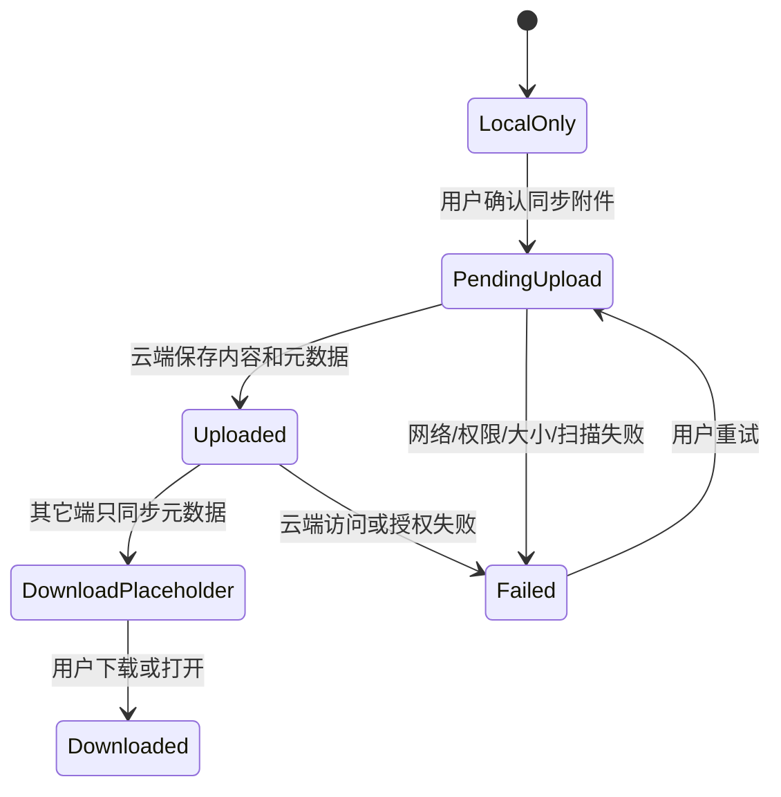

# 附件与隐私需求计划

本文档承接 `three-client-requirements-analysis.md`、`feature-catalog.md`、`function-matrix.md` 和 `requirement-audit-matrix.md`，定义 Finance Own 第一版附件、票据、支票簿类凭证和隐私边界。附件可能包含票据、合同、银行凭证和个人资料，必须按账本、对象和用户权限严格隔离。

## 1. 目标

第一版附件能力必须支持：

- PC 本地附件受管保存。
- 手机端拍摄或选择附件并临时缓存。
- Web 在线上传附件。
- 云端附件元数据和内容存储。
- 交易与附件引用同步。
- 附件下载权限校验。
- 票据、支票簿和银行凭证作为受管凭证或附件引用，保留业务对象关联、票号摘要和生命周期状态。
- 旧迁移审计、迁移报告和旧原始来源只保存在 PC 本地；迁移后的新系统附件对象需用户开启同步并确认附件隐私提示后才可上传。

第一版不得：

- 上传旧 MoneyHome8 原始文件。
- 上传旧迁移审计、迁移报告或旧原始来源。
- 用长期裸 URL 暴露附件。
- 跨账本复用附件引用。
- 在错误消息或日志中暴露完整本地路径。
- 把未验证来源的票据或支票簿记录直接当成付款、收款或账户余额事实。

## 2. 附件对象

### 2.1 AttachmentMetadata

| 字段 | 说明 |
| --- | --- |
| `attachment_id` | 附件稳定标识 |
| `ledger_id` | 所属账本 |
| `owner_object_type` | 交易、账户、预算等引用对象类型 |
| `owner_object_id` | 引用对象 ID |
| `file_name` | 展示文件名，必须可脱敏 |
| `content_hash` | 内容 SHA-256 或等价哈希 |
| `size_bytes` | 文件大小 |
| `mime_type` | 内容类型 |
| `storage_state` | LocalOnly、PendingUpload、Uploaded、DownloadPlaceholder、Downloaded、Failed |
| `created_at` | 创建时间 |
| `created_by_device` | 来源设备 |
| `privacy_scope` | LocalOnly、SyncAllowed、CloudManaged |
| `scan_state` | Pending、Passed、Failed、Skipped |
| `error_code` | 最近失败错误码，成功时为空 |
| `cleanup_state` | active、pending_cleanup、cleanup_failed、physically_removed |
| `reference_count` | 当前有效引用数量，按账本和业务对象权限计算 |

### 2.2 AttachmentReference

同一个附件内容可以有多个业务引用，但权限必须按账本和业务对象校验。

| 字段 | 说明 |
| --- | --- |
| `reference_id` | 引用标识 |
| `attachment_id` | 附件标识 |
| `ledger_id` | 账本标识 |
| `object_type` | 业务对象类型 |
| `object_id` | 业务对象 ID |
| `role` | receipt、contract、note、other |
| `reference_version` | 引用版本，用于删除、移动和并发冲突 |
| `is_primary` | 是否为该业务对象的主附件 |

规则：

1. 同一附件内容可被同账本多个业务对象引用，但不能跨账本共享引用。
2. 删除一个引用只减少该引用关系，不得静默删除其它业务对象仍在使用的附件内容。
3. 最后一个引用删除后，附件元数据进入 `pending_cleanup`，物理清理由后台任务或 PC 本地清理命令执行。
4. PC 本地清理必须验证内容哈希、相对路径仍在受管目录内、引用计数为零和对象版本未变化。
5. 云端物理清理必须验证账本权限、引用计数、保留策略、扫描状态和清理幂等键。
6. 清理失败必须保留元数据和错误码，不能让业务对象出现悬空引用。

### 2.3 PaperDocumentReference

票据、支票簿和银行凭证第一版按结构化凭证引用处理。凭证可以辅助用户查找、归档和证明交易来源，但不能绕过交易命令直接改变余额。

| 字段 | 说明 |
| --- | --- |
| `paper_document_id` | 凭证稳定 ID |
| `ledger_id` | 所属账本 |
| `attachment_id` | 可选附件内容 ID，没有电子文件时可为空 |
| `owner_object_type` | 交易、账户、导入批次或其它业务对象类型 |
| `owner_object_id` | 关联业务对象 ID |
| `paper_kind` | receipt、check、bill、statement、contract、other |
| `external_no_hash` | 票号、支票号或外部编号的脱敏哈希 |
| `display_no_masked` | 可展示的脱敏编号 |
| `issue_date` | 开具日期 |
| `due_date` | 到期或兑付日期，可为空 |
| `amount_minor` | 凭证金额，可为空；为空表示仅作归档凭证 |
| `currency_code` | 凭证币种，可为空 |
| `lifecycle_state` | draft、linked、archived、voided |
| `source_kind` | user_selected、manual_entry、legacy_migrated、imported |

规则：

1. 凭证必须限定 `ledger_id`，不得跨账本引用附件或交易。
2. 凭证金额、票号和图片只能作为交易来源证据，不能替代交易、分录或账户余额事实。
3. 同一凭证关联多笔交易时必须保存引用关系和版本，删除任一交易不能静默删除凭证内容。
4. 删除凭证前必须展示关联交易、账户、导入批次和附件影响。
5. 旧 MoneyHome8 票据、支票簿和凭证原始证据只保存在 PC 本地；同步只允许新系统凭证引用对象和用户确认上传的新系统附件对象进入云端。

### 2.4 附件状态流转

| 状态 | 说明 |
| --- | --- |
| `LocalOnly` | 仅端侧存在；PC 本地附件或未确认上传的迁移附件使用该状态 |
| `PendingUpload` | 用户已确认可上传，等待云端保存 |
| `Uploaded` | 云端已保存附件内容和元数据 |
| `DownloadPlaceholder` | 本端只有云端元数据，没有本地内容 |
| `Downloaded` | 本端已有可打开的附件内容 |
| `Failed` | 上传、下载、扫描或权限校验失败 |

## 3. 端侧行为

### 3.1 PC 端

1. Flutter PC 选择文件。
2. Rust 本地核心计算哈希。
3. Rust 把附件复制到 PC 受管目录。
4. SQLite 保存相对路径、哈希、大小和引用关系。
5. 未开启同步时附件状态为 `LocalOnly`。
6. 开启同步时，用户需要确认附件隐私提示后才上传。

PC 本地附件记录字段：

| 字段 | 可为空 | 说明 |
| --- | --- | --- |
| `attachment_id` | 否 | 新系统附件稳定标识 |
| `ledger_id` | 否 | 所属账本 |
| `relative_path` | 否 | PC 受管附件目录内相对路径，不上传云端 |
| `file_name` | 否 | 展示文件名 |
| `content_hash` | 否 | 内容哈希 |
| `size_bytes` | 否 | 文件大小 |
| `mime_type` | 是 | 内容类型 |
| `storage_state` | 否 | 附件状态 |
| `privacy_scope` | 否 | 未确认同步前必须是 `LocalOnly` |
| `source_kind` | 否 | user_selected、legacy_migrated、imported |

### 3.1.1 PC 迁移附件同步确认

旧迁移附件默认只保存在 PC 本地。用户开启账本同步后，系统必须把“财务对象同步”和“附件内容同步”分开确认。

确认请求字段：

| 字段 | 可为空 | 说明 |
| --- | --- | --- |
| `ledger_id` | 否 | 当前账本 |
| `migration_batch_id` | 是 | 来源迁移批次；非迁移附件为空 |
| `attachment_ids` | 否 | 用户确认允许上传的新系统附件对象 |
| `include_legacy_reports` | 否 | 必须固定为 `false`，不得允许上传迁移审计或迁移报告 |
| `privacy_acknowledged_at` | 否 | 用户确认时间 |
| `client_confirmation_id` | 否 | 幂等确认 ID |

确认后只允许上传迁移生成的新系统附件对象内容和元数据，不允许上传旧原始来源、旧文件完整路径、迁移审计、迁移报告、脱敏摘要或迁移诊断。

### 3.2 手机端

1. 手机端拍摄或选择附件。
2. 附件先进入临时缓存。
3. 业务对象和附件可以分别上传。
4. 业务对象成功但附件失败时，显示部分失败并允许重试。
5. 临时附件允许用户清理。

手机附件上传请求字段必须和 `mobile-offline-queue-plan.md` 对齐：

| 字段 | 可为空 | 说明 |
| --- | --- | --- |
| `local_attachment_ref` | 否 | 手机临时附件引用 |
| `ledger_id` | 否 | 所属账本 |
| `owner_object_type` | 是 | 业务对象类型；业务对象尚未上传时可为空 |
| `owner_object_id` | 是 | 业务对象 ID；业务对象尚未上传时可为空 |
| `file_name` | 否 | 展示文件名 |
| `content_hash` | 否 | 上传时必须计算 |
| `size_bytes` | 否 | 文件大小 |
| `mime_type` | 是 | 内容类型 |
| `client_upload_id` | 否 | 幂等上传 ID |

### 3.3 Web 端

1. Web 端直接通过 .NET API 上传附件。
2. 上传前必须校验账本权限和文件大小。
3. 上传成功后返回附件元数据和引用。
4. 下载使用权限校验或短期授权。

Web 附件上传请求字段：

| 字段 | 可为空 | 说明 |
| --- | --- | --- |
| `ledger_id` | 否 | 所属账本 |
| `owner_object_type` | 否 | 业务对象类型 |
| `owner_object_id` | 否 | 业务对象 ID |
| `role` | 否 | receipt、contract、note、other |
| `file_name` | 否 | 展示文件名 |
| `content_hash` | 否 | 内容哈希 |
| `size_bytes` | 否 | 文件大小 |
| `mime_type` | 是 | 内容类型 |
| `client_upload_id` | 否 | 幂等上传 ID |

Web 附件上传响应字段：

| 字段 | 说明 |
| --- | --- |
| `attachment_id` | 云端附件 ID |
| `reference_id` | 附件引用 ID |
| `storage_state` | Uploaded、Failed 或 PendingScan |
| `scan_state` | Pending、Passed、Failed、Skipped |
| `error` | 失败时的结构化错误 |

## 4. 旧迁移附件

旧迁移附件属于 PC 本地迁移结果的一部分；迁移审计、迁移报告和旧原始来源必须始终只保存在 PC 本地。

1. 旧迁移附件原始来源不上传云端。
2. 迁移审计和迁移报告不上传云端。
3. 迁移后的新系统附件对象默认 `LocalOnly`。
4. 用户开启账本同步时，系统必须单独提示是否同步附件内容。
5. 用户不同步附件时，其它端只能看到业务记录，不应显示假附件。

## 5. 云端规则

1. 云端保存附件元数据和内容存储位置。
2. 云端不保存 PC 本地完整路径。
3. 云端不保存旧迁移审计、迁移报告或旧原始来源。
4. 附件下载必须按账本成员权限校验。
5. 附件 URL 必须短期有效或经过 API 权限校验。
6. 附件删除第一版先解除引用，物理清理后置。

### 5.1 下载授权

附件下载请求必须校验：

1. 用户已登录。
2. 用户拥有 `ledger_id` 的成员权限。
3. 附件引用的业务对象仍属于该账本。
4. 附件未被安全策略阻断。
5. 短期授权未过期。

下载授权响应字段：

| 字段 | 说明 |
| --- | --- |
| `attachment_id` | 附件 ID |
| `download_mode` | stream、short_lived_url |
| `expires_at` | 授权过期时间 |
| `file_name` | 展示文件名 |
| `mime_type` | 内容类型 |
| `size_bytes` | 文件大小 |

### 5.2 删除引用

删除附件引用请求字段：

| 字段 | 可为空 | 说明 |
| --- | --- | --- |
| `ledger_id` | 否 | 所属账本 |
| `attachment_id` | 否 | 附件 ID |
| `reference_id` | 否 | 引用 ID |
| `owner_object_type` | 否 | 业务对象类型 |
| `owner_object_id` | 否 | 业务对象 ID |
| `base_version` | 否 | 引用对象版本 |
| `client_request_id` | 否 | 幂等请求 ID |
| `cleanup_policy` | 否 | detach_only、mark_pending_cleanup |

第一版删除引用不立即物理删除云端内容。没有任何引用的附件进入待清理状态，实际物理清理由后续后台任务执行。

物理清理任务字段：

| 字段 | 可为空 | 说明 |
| --- | --- | --- |
| `cleanup_job_id` | 否 | 清理任务 ID |
| `ledger_id` | 否 | 所属账本 |
| `attachment_id` | 否 | 附件 ID |
| `expected_reference_count` | 否 | 必须为 0 |
| `expected_content_hash` | 否 | 内容哈希 |
| `storage_location_ref` | 否 | 受管存储位置引用，不暴露完整本地路径 |
| `cleanup_request_id` | 否 | 幂等清理 ID |

清理规则：

1. `detach_only` 只解除引用，不改变附件内容状态。
2. `mark_pending_cleanup` 只在引用计数为零时把附件标记为 `pending_cleanup`。
3. 物理清理成功后保留最小墓碑、哈希摘要和审计，不保留可下载内容。
4. 物理清理失败不得恢复已删除引用，也不得删除仍被引用的内容。
5. PC 本地完整路径、旧附件来源路径和旧迁移诊断不得写入云端清理任务。

## 6. 限制与校验

第一版必须预留：

| 限制 | 说明 |
| --- | --- |
| 单文件大小 | 由后续实现配置，但 API 必须能返回 `attachment_too_large` |
| 文件类型 | 允许图片、PDF 和常见文档；可疑类型提示风险 |
| 存储配额 | 账本或账号维度预留配额字段 |
| 病毒扫描 | 可后置，但上传流程必须预留扫描状态 |
| 内容哈希 | 用于完整性校验和去重参考 |

校验规则：

1. 多附件上传必须逐个返回成功、失败或待扫描状态；部分失败不得回滚已成功业务对象，除非用户选择整批原子模式。
2. 大文件、空文件、哈希不匹配、MIME 不可信、配额不足、扫描失败和权限变化都必须返回结构化错误。
3. 上传、下载、删除引用和物理清理都必须有幂等键，重复请求返回原结果。
4. 业务对象删除、恢复或另存副本时必须同步处理附件引用影响预览，不能留下跨账本或悬空引用。

## 7. 验收口径

1. PC 本地附件可在未登录状态使用。
2. 开启同步前不会自动上传附件。
3. 手机附件上传失败不会丢失本地草稿。
4. Web 附件下载必须校验权限。
5. 旧迁移附件默认不上传。
6. 错误消息不暴露完整本地路径。
7. 迁移附件同步确认不能允许上传迁移审计、迁移报告、脱敏摘要、旧路径或旧原始行。
8. 附件下载授权过期后不能继续访问内容。
9. 跨账本附件引用必须被拒绝。
10. 票据、支票簿和银行凭证可以作为受管附件或结构化凭证引用保存，但不得直接生成资金分录或改变账户余额。
11. 删除票据凭证前必须展示关联交易、导入批次和附件影响；取消删除零写入。
12. 同一附件被多个交易引用时，删除一个引用不影响其它引用；删除最后一个引用后进入 `pending_cleanup`。
13. 物理清理成功后内容不可下载，但墓碑、哈希摘要和审计仍可追溯；清理失败不得产生悬空引用。
14. 大文件、空文件、哈希不匹配、扫描失败、配额不足和权限变化返回结构化错误，不暴露完整本地路径。

## 8. 当前无需人工确认

本计划没有引入新的产品取舍；它细化的是已确认的附件隐私、PC 本地迁移和用户确认开启同步边界。
