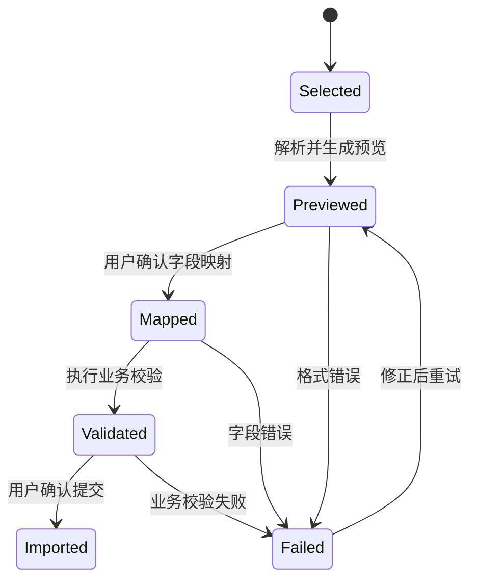

# 备份、恢复与导入导出需求计划

本文档承接 `three-client-requirements-analysis.md`、`data-exchange-and-persistence-contract.md` 和既有运行证据，定义 Finance Own 第一版备份、恢复、导入和导出边界。第一版由 PC 端承担完整本地文件级能力；Web 只提供云端对象恢复入口和在线导出；手机端不承担高级备份恢复和批量导入导出。

## 1. 目标

第一版必须支持：

1. PC 本地 SQLite 账本备份。
2. PC 本地账本恢复，默认恢复为新账本。
3. 覆盖恢复前的安全快照和二次确认。
4. PC 通用数据导入预览和提交。
5. PC 分类导入。
6. PC 交割单导入，具体投资公式未校准部分不得提前固化。
7. PC 旧 XML、CSV 和专用账单类来源的预览、编码识别、字段映射和失败隔离。
8. PC 旧 XML 21 类数据集选择、节点映射、分区结果和覆盖/去重策略确认。
9. PC 旧 `.mh8k` 隔离探测、解密校验、导入预览和还原为新账本。
10. PC/Web 基础数据导出。
11. 导入批次、导入行、字段映射和错误追溯。

第一版不要求：

1. 手机端高级备份恢复。
2. 手机端批量导入导出。
3. Web 读取 PC 本地备份文件。
4. 兼容旧 `.mh8k` 作为新系统主备份格式。

第一版必须禁止：

1. 在云端保存旧 MoneyHome8 原始文件、迁移审计、迁移报告、脱敏摘要、旧路径或旧原始行。
2. Web 或手机上传 PC 本地备份包、旧导入来源文件或旧迁移诊断。

## 2. PC 本地备份

PC 本地备份以新系统 SQLite 账本、附件受管目录和必要设置为输入，生成版本化快照包。

备份请求字段：

| 字段 | 可为空 | 说明 |
| --- | --- | --- |
| `ledger_id` | 否 | 当前 PC 本地账本 |
| `target_directory` | 否 | 用户选择的目标目录 |
| `backup_name` | 否 | 备份展示名，不能为空 |
| `include_attachments` | 否 | 是否包含新系统附件受管内容 |
| `client_request_id` | 否 | 幂等请求 ID |

备份结果字段：

| 字段 | 说明 |
| --- | --- |
| `backup_id` | 本地备份记录 ID |
| `backup_file_label` | 脱敏后的备份文件名 |
| `manifest_hash` | 清单哈希 |
| `ledger_snapshot_hash` | SQLite 快照哈希 |
| `attachment_count` | 纳入备份的新系统附件数量 |
| `created_at` | 备份时间 |

备份规则：

1. 备份过程必须使用一致性快照，不直接复制写入中的 SQLite 文件。
2. 备份包必须包含清单、版本、账本摘要、文件哈希和应用版本。
3. 备份失败不得留下被误认为成功的半成品。
4. 错误响应不得包含完整本地路径、旧原始行或秘密。
5. 旧 `.mh8k` 仅作为旧格式隔离导入来源，不作为新系统主备份格式。

## 3. PC 本地恢复

恢复默认创建新账本；覆盖当前账本必须独立确认并先生成安全快照。

恢复请求字段：

| 字段 | 可为空 | 说明 |
| --- | --- | --- |
| `backup_file` | 否 | 用户选择的备份文件 |
| `restore_mode` | 否 | restore_as_new、overwrite_current |
| `target_ledger_name` | 是 | 恢复为新账本时使用 |
| `current_ledger_id` | 是 | 覆盖当前账本时使用 |
| `confirm_token` | 覆盖时否 | 覆盖预检查返回的确认令牌 |
| `client_request_id` | 否 | 幂等请求 ID |

恢复结果字段：

| 字段 | 说明 |
| --- | --- |
| `restored_ledger_id` | 恢复后的账本 ID |
| `restore_mode` | 实际恢复方式 |
| `pre_restore_backup_id` | 覆盖前安全快照 ID；非覆盖为空 |
| `manifest_verified` | 清单是否验证通过 |
| `restored_at` | 恢复时间 |

恢复规则：

1. 恢复前必须验证备份清单、版本和哈希。
2. 默认恢复为新账本，避免误覆盖当前账本。
3. 覆盖恢复必须展示影响范围并二次确认。
4. 覆盖恢复前必须尝试生成当前账本安全快照。
5. 恢复失败必须保持原账本可打开或返回明确不可恢复错误。

## 4. 导入流程

PC 导入采用预览、字段映射、校验、确认提交四段式流程。

`ImportBatchDto` 字段：

| 字段 | 说明 |
| --- | --- |
| `import_batch_id` | 导入批次 ID |
| `ledger_id` | 目标账本 |
| `source_kind` | generic_csv、category_csv、bank_statement、credit_card_statement、broker_statement、legacy_xml、legacy_mh8k |
| `source_file_label` | 脱敏文件名 |
| `source_hash` | 来源文件哈希 |
| `state` | selected、previewed、mapped、validated、imported、failed |
| `row_count` | 总行数 |
| `valid_row_count` | 可导入行数 |
| `error_row_count` | 错误行数 |
| `created_at` | 创建时间 |
| `encoding` | 来源编码识别结果，例如 utf-8、gbk、legacy_xml_declared |
| `format_version` | 来源格式版本；无法识别时为空 |
| `dataset_selection` | 旧 XML 或复合来源中用户选择的数据集集合 |
| `source_adapter_version` | 来源适配器版本 |
| `overwrite_strategy` | skip_existing、append_new、update_existing、replace_scope；提交前必须确认 |
| `dedupe_strategy` | strict_hash、business_key、manual_review |
| `section_results` | 分区级预览、错误和可提交数量 |

`ImportRowDto` 字段：

| 字段 | 说明 |
| --- | --- |
| `row_id` | 导入行 ID |
| `row_index` | 来源行号 |
| `preview_values` | 预览字段值，敏感字段必须脱敏 |
| `mapped_object_type` | 目标对象类型 |
| `mapped_payload` | 映射后的新系统对象草稿 |
| `validation_errors` | 字段或业务错误 |
| `duplicate_hint` | 重复导入提示 |
| `section_key` | 所属数据集或账单分区 |
| `business_dedupe_key` | 用于重复判断的业务键摘要 |
| `overwrite_decision` | 跳过、新增、更新、覆盖范围内替换或待人工处理 |

`ImportSectionResultDto` 字段：

| 字段 | 说明 |
| --- | --- |
| `section_key` | 数据集、XML 节点、账单分区或工作表标识 |
| `detected_object_type` | 识别出的目标对象类型 |
| `node_map_version` | 旧 XML 节点映射版本；非 XML 来源为空 |
| `preview_count` | 预览行数 |
| `valid_count` | 可提交行数 |
| `error_count` | 错误行数 |
| `duplicate_count` | 疑似重复行数 |
| `section_state` | selected、previewed、validated、blocked、imported |

导入规则：

1. 导入预览不写入正式业务对象。
2. 提交前必须展示错误行、重复提示和影响范围。
3. 导入提交必须原子或按批次明确记录部分成功。
4. 导入来源完整路径不进入云端。
5. 旧 `.mh8k` 和旧 MoneyHome8 相关导入只在 PC 本地处理，不上传旧来源和迁移证据。
6. 旧 XML、CSV 和专用账单来源必须先识别编码、分隔符、列顺序、版本和来源类型，识别失败只进入预览错误。
7. 已知会导致旧程序崩溃的回导样例只能作为兼容风险证据，不能让新系统在预览阶段崩溃或写入半成品。
8. 专用信用卡账单、券商交割单和分类导入必须使用来源适配器；通用 CSV 适配器不得悄悄吞掉无法识别的业务列。
9. 旧 XML 必须把 21 类候选数据集作为可选择分区展示；未选择的数据集不进入提交，也不得被静默丢弃。
10. 旧 XML 节点映射必须记录 `node_map_version`，节点缺失、类型不符、跨分区引用失败必须落到分区级错误。
11. 导入覆盖、追加、更新和跳过策略必须先预览影响范围；用户未确认策略时不得提交。
12. 重复判断必须同时支持来源哈希、业务键和人工复核；不能仅靠来源行号判断是否重复。
13. 成功导入后的同一来源再次导入必须进入可解释的重复预览，不能重复生成不可追溯对象。
14. 银行账单、信用卡账单和券商交割单必须分别校验日期、负数记账方向、千分位、小数位、空行、手续费、税费和同日同金额重复。
15. 券商交割单中的未校准投资公式只能标记 `pending_calibration`，不得把手续费、税费或净额拆分猜测写成正式结论。
16. 部分分区失败时，提交策略必须明确是整批阻断还是仅提交已确认分区；无论哪种策略，失败分区都不得半写入正式对象。

## 5. 旧 `.mh8k` 隔离探测和恢复为新账本

旧 `.mh8k` 是 MoneyHome8 旧备份或容器格式，只能作为 PC 本地隔离来源处理，不作为云端对象、Web 上传文件或新系统主备份格式。

`LegacyBackupProbeDto` 字段：

| 字段 | 说明 |
| --- | --- |
| `source_file_label` | 脱敏来源文件名 |
| `source_hash` | 来源包哈希 |
| `container_kind` | legacy_mh8k、unknown |
| `manifest_detected` | 是否探测到旧清单或目录结构 |
| `encrypted_entry_detected` | 是否存在加密账本条目 |
| `book_entry_label` | 脱敏后的账本条目标识 |
| `decrypt_state` | not_required、password_required、success、failed、unsupported |
| `probe_errors` | 探测错误码集合 |

旧 `.mh8k` 处理规则：

1. 探测阶段只读来源包，不写入正式账本。
2. 解密密码只在 PC 本地内存中使用，不进入日志、云端、迁移审计或导出。
3. 探测成功后必须走普通导入预览或“恢复为新账本”流程；默认不得覆盖当前账本。
4. 恢复为新账本必须生成新系统账本 ID、对象版本、附件引用和设置映射结果。
5. 附件、设置、分类、账户、交易、计划和标签等内容必须给出内容对比摘要；摘要只保存到 PC 本地迁移工作区。
6. 来源包损坏、加密失败、版本不支持或内容哈希不一致时必须阻断提交，并保持当前账本不变。
7. 失败回滚必须删除本次生成的临时账本、临时附件和导入暂存；不得留下可被同步的新系统对象。
8. 旧 `.mh8k` 原始包、解密中间文件、迁移审计、迁移报告、脱敏摘要、旧路径和旧原始行只保存在 PC 本地，不上传云端。

## 6. 导出流程

第一版导出支持 PC 和 Web 基础数据导出。手机端不承担批量导出。

导出请求字段：

| 字段 | 可为空 | 说明 |
| --- | --- | --- |
| `ledger_id` | 否 | 目标账本 |
| `export_type` | 否 | transactions、accounts、categories、tags、basic_report |
| `filters` | 否 | 日期、账户、分类、标签等筛选 |
| `format` | 否 | csv、xlsx、pdf |
| `encoding` | 是 | 导出编码；CSV 默认 UTF-8，旧格式兼容导出必须显式选择 |
| `client_request_id` | 否 | 幂等请求 ID |

导出规则：

1. 导出必须按账本权限校验。
2. Viewer 可导出其有权查看的数据；是否允许导出附件内容由附件权限控制。
3. 报表导出和打印必须复用同一结果 DTO。
4. 报表尚未加载或筛选已变化时，导出和打印必须禁用或先刷新。
5. 导出结果不得包含旧迁移审计、迁移报告、脱敏摘要、旧路径或旧原始行。
6. CSV、XML 或旧格式兼容导出必须记录格式版本、编码、列顺序、筛选条件和生成数据版本。
7. 增加、覆盖或回导类导出选项必须在执行前展示目标范围和冲突策略。

## 7. Web 云端恢复入口

Web 第一版可以提供云端对象恢复入口，但不读取 PC 本地备份文件。

Web 恢复入口第一版范围：

1. 查看云端账本删除、作废、归档和冲突审计。
2. 对可恢复对象发起恢复或另存副本请求。
3. 对高风险恢复展示影响范围和二次确认。

Web 恢复入口第一版不做：

1. 上传 PC 本地备份包。
2. 还原旧 MoneyHome8 文件。
3. 读取 PC 本地路径。
4. 恢复旧迁移审计或迁移报告。

## 8. 错误码

备份、恢复和导入导出错误码至少包括：

| 错误码 | 触发条件 | 前端处理 |
| --- | --- | --- |
| `import_dataset_mapping_missing` | 旧 XML 数据集或节点无法映射 | 阻断对应分区并展示修正入口 |
| `import_section_failed` | 分区预览或提交失败 | 保留分区错误和可重试状态 |
| `import_duplicate_strategy_required` | 存在疑似重复但未选择策略 | 要求用户选择跳过、更新或人工复核 |
| `import_overwrite_preview_required` | 覆盖或更新策略缺少影响预览 | 阻断提交 |
| `broker_statement_value_invalid` | 交割单日期、负数、千分位或费用税费异常 | 标记行级错误 |
| `legacy_backup_decrypt_failed` | 旧 `.mh8k` 解密失败 | 要求重试或放弃，不记录密码 |
| `legacy_backup_damaged` | 旧备份包清单、哈希或内容损坏 | 阻断恢复和提交 |
| `legacy_backup_version_unsupported` | 旧包版本无法安全解释 | 只允许保留 PC 本地诊断 |

## 9. 验收口径

1. PC 可生成带清单和哈希的新系统备份包。
2. PC 恢复默认创建新账本。
3. 覆盖恢复必须有二次确认和覆盖前安全快照。
4. 导入预览不写入正式业务对象。
5. 导入提交有批次、行级错误和重复提示。
6. 旧 XML、CSV 和专用账单导入在预览阶段识别编码、版本、列顺序和来源类型；无法识别时不写入正式对象。
7. 旧 XML 21 类数据集可选择、可分区预览、可分区报错，未选择分区不写入正式对象。
8. 覆盖、更新、追加和重复处理策略必须先预览影响并由用户确认。
9. 旧 `.mh8k` 可在 PC 本地隔离探测；解密、内容对比和失败诊断不进入云端。
10. 旧 `.mh8k` 恢复默认创建新账本，失败时不污染当前账本和同步队列。
11. 导出和打印复用同一结果 DTO，且筛选变化后不会导出过期结果。
12. CSV、XML 或旧格式兼容导出必须记录格式版本、编码、列顺序、筛选条件和数据版本。
13. Web 不读取 PC 本地备份文件。
14. 手机端不承担高级备份恢复和批量导入导出。
15. 旧 MoneyHome8 原始文件、迁移审计、迁移报告、脱敏摘要、旧路径和旧原始行不上传云端。

## 10. 当前无需人工确认

本计划没有引入新的产品取舍；它把已确认的 PC 本地备份恢复、导入导出、Web 云端恢复入口和手机端后置边界整理成实施需求。
