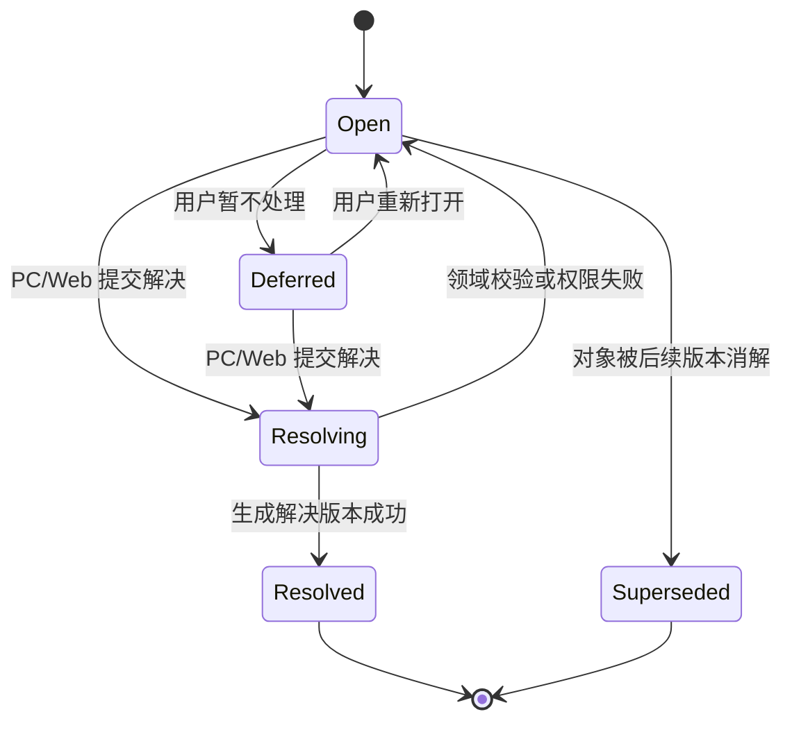

# PC/Web 冲突解决需求计划

本文档承接 `three-client-requirements-analysis.md` 和 `dotnet-sync-api-plan.md`，定义 Finance Own 第一版对象级同步冲突的展示、处理和审计需求。完整冲突解决只在 PC 和 Web 提供；手机端只显示冲突摘要并允许延后处理。

## 1. 目标

第一版冲突解决必须支持：

- 识别同字段编辑、删除与修改并发、关联对象缺失、权限变化和附件引用失败。
- 展示冲突对象、来源端、来源设备、时间、字段差异和影响范围。
- 支持保留本端、保留云端、字段级合并、另存副本和暂不处理。
- 生成新的解决版本。
- 记录处理人、处理端、处理时间、输入版本、处理方式和生成版本。

第一版不得：

- 静默让 PC 覆盖云端。
- 静默让云端覆盖 PC。
- 在手机端实现复杂字段级合并。
- 删除冲突证据后再生成同步结果。

## 2. 冲突类型

| 类型 | 触发条件 | 处理要求 |
| --- | --- | --- |
| SameFieldEdit | 同一对象同一字段在不同端修改 | PC/Web 显式选择或字段级合并 |
| DeleteVsEdit | 一端删除对象，另一端修改对象 | 显式选择删除、保留修改或另存副本 |
| MissingReference | 上传对象引用的分类、账户、标签或附件已不可用 | 要求重选引用或恢复引用 |
| PermissionChanged | 用户离线编辑后权限变为只读或被移出账本 | 阻止写入，提示权限变化 |
| AttachmentPartialFailure | 业务对象已同步但附件上传或引用失败 | 允许重试附件或移除引用 |

## 3. 冲突列表

PC/Web 冲突列表必须包含：

| 字段 | 说明 |
| --- | --- |
| `conflict_id` | 冲突标识 |
| `ledger_id` | 所属账本 |
| `object_type` | 交易、账户、分类、预算等 |
| `object_label` | 可展示对象名称或摘要 |
| `conflict_kind` | 冲突类型 |
| `local_source` | 本端或上传端设备摘要 |
| `cloud_source` | 云端当前版本来源 |
| `created_at` | 冲突产生时间 |
| `severity` | 普通、高风险或权限阻塞 |
| `status` | 未处理、已解决、已延后 |

手机端冲突摘要只需要：

1. 冲突数量。
2. 高风险冲突数量。
3. 最近冲突时间。
4. 建议在 PC/Web 处理的提示。

## 4. 冲突状态流转

| 状态 | 说明 |
| --- | --- |
| `open` | 待处理冲突 |
| `deferred` | 用户暂不处理，但冲突仍阻止同对象自动覆盖 |
| `resolving` | 正在提交解决结果，页面必须防止重复提交 |
| `resolved` | 已生成解决版本并下发同步 |
| `superseded` | 后续对象版本使该冲突不再需要人工解决 |

## 5. 冲突详情

冲突详情必须包含：

| 字段 | 说明 |
| --- | --- |
| `base_version` | 双方共同基线 |
| `local_version` | 本端或上传端版本 |
| `cloud_version` | 云端当前版本 |
| `field_diffs` | 字段差异列表 |
| `related_objects` | 账户、分类、附件等关联对象 |
| `business_impact` | 对余额、报表、附件、预算或提醒的影响摘要 |
| `allowed_resolutions` | 当前冲突允许的处理动作 |

字段差异需要展示字段名、基线值、本端值、云端值和可选合并值。敏感字段必须脱敏展示。

### 5.1 字段差异字段

| 字段 | 说明 |
| --- | --- |
| `field_path` | 对象字段路径，例如 `entries[0].amount_minor` |
| `label` | 可展示字段名 |
| `data_type` | money、date、datetime、text、enum、reference、attachment、boolean |
| `base_value` | 双方共同基线值，敏感字段必须脱敏 |
| `local_value` | 本端或上传端值，敏感字段必须脱敏 |
| `cloud_value` | 云端当前值，敏感字段必须脱敏 |
| `suggested_value` | 系统可解释的建议值；无建议时为空 |
| `mergeable` | 是否允许字段级合并 |
| `risk_level` | normal、high、blocked |

### 5.2 关联对象字段

`related_objects` 必须说明冲突对象依赖的账户、分类、标签、附件和账本成员状态。

| 字段 | 说明 |
| --- | --- |
| `object_type` | 关联对象类型 |
| `object_id` | 关联对象 ID |
| `label` | 可展示名称 |
| `state` | active、archived、deleted、missing、forbidden |
| `impact` | 对当前冲突的影响说明 |

## 6. 解决动作

| 动作 | 适用范围 | 结果 |
| --- | --- | --- |
| `keep_local` | 本端版本正确 | 生成新云端版本，并同步给其它端 |
| `keep_cloud` | 云端版本正确 | 本端拉取云端版本 |
| `merge_fields` | 字段可安全合并 | 生成合并版本 |
| `save_as_copy` | 双方都需要保留 | 创建新对象或补充记录 |
| `defer` | 用户暂不处理 | 保持冲突状态 |

`merge_fields` 必须限制在字段级可解释的对象上。交易金额、账户、币种、日期等高风险字段合并后必须重新通过领域校验。

### 6.1 解决请求字段

| 字段 | 说明 |
| --- | --- |
| `client_resolution_id` | 幂等键，避免重复提交 |
| `resolution` | keep_local、keep_cloud、merge_fields、save_as_copy、defer |
| `base_version` | 用户打开冲突详情时看到的基线版本 |
| `local_version` | 用户看到的本端或上传端版本 |
| `cloud_version` | 用户看到的云端版本 |
| `field_choices` | 字段级选择结果；仅字段合并时必填 |
| `merged_payload` | 合并后的对象；仅字段合并时必填 |
| `reason` | 用户说明；高风险冲突建议必填 |

`field_choices` 字段：

| 字段 | 说明 |
| --- | --- |
| `field_path` | 字段路径 |
| `choice` | base、local、cloud、custom |
| `custom_value` | 自定义值；仅 `custom` 时使用 |

### 6.2 解决响应字段

| 字段 | 说明 |
| --- | --- |
| `conflict_id` | 冲突 ID |
| `status` | resolved、deferred、rejected |
| `generated_object_id` | 另存副本时的新对象 ID |
| `generated_version` | 解决后生成的对象版本 |
| `sync_cursor` | 可下发给其它端的同步游标 |
| `audit_event_id` | 审计事件 ID |
| `error` | 失败时的结构化错误 |

## 7. 审计

每次冲突解决必须记录：

1. `conflict_id`
2. 处理用户
3. 处理端：PC 或 Web
4. 处理设备
5. 处理时间
6. 处理动作
7. 输入版本
8. 生成版本
9. 字段级选择结果
10. 失败或回滚原因

审计记录不得包含旧 MoneyHome8 迁移审计、迁移报告、脱敏摘要、完整本地路径、旧原始行或附件原始内容。

## 8. 页面交互要求

1. PC/Web 打开冲突详情时必须展示对象摘要、来源设备、时间、版本和影响范围。
2. 字段级差异必须能看出本端值和云端值的来源。
3. 高风险字段合并后必须重新调用领域校验，不能只保存前端拼出的 JSON。
4. 删除与修改冲突必须明确展示“删除结果”和“保留修改结果”的差异。
5. MissingReference 冲突必须提供重选引用或移除引用的入口。
6. PermissionChanged 冲突不能通过字段合并绕过权限。
7. 解决提交中必须防止重复点击；幂等重放返回原结果。
8. 手机端只展示摘要和建议处理端，不加载字段级差异。

## 9. 验收口径

1. 同字段编辑不会静默覆盖。
2. 删除与修改并发不会静默删除或恢复。
3. 权限变化会阻止无权限写入。
4. 交易类冲突解决后必须重新通过领域校验。
5. 手机端只显示摘要，不提供字段级合并。
6. 每次解决都有审计记录。
7. 冲突审计不包含旧迁移审计、迁移报告、脱敏摘要、完整本地路径或旧原始行。

## 10. 当前无需人工确认

本计划没有引入新的产品取舍；它细化的是已确认的双向同步、对象级版本合并和显式冲突解决原则。
