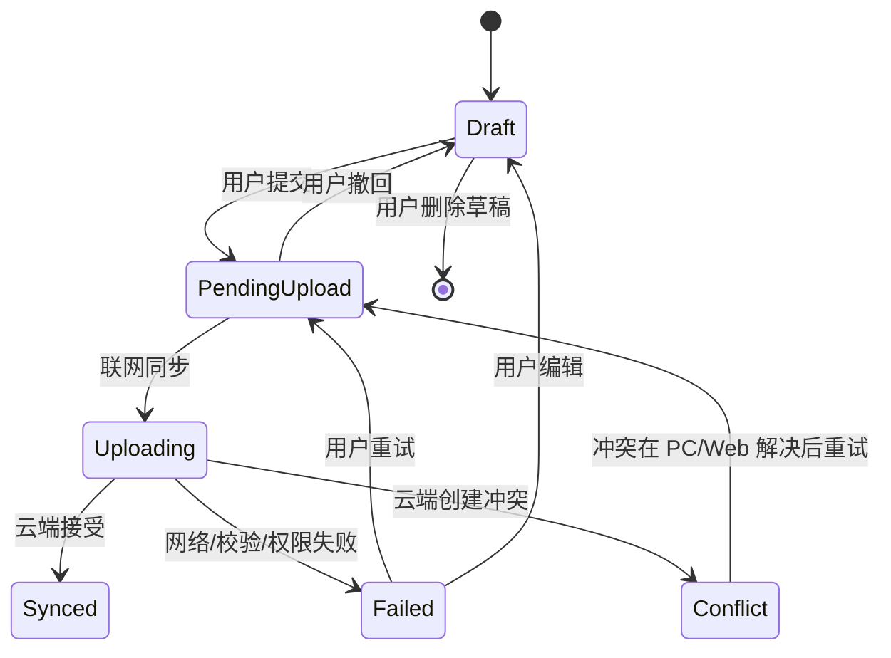

# Flutter Mobile 离线队列需求计划

本文档承接 `three-client-requirements-analysis.md`，定义 Flutter Mobile 第一版离线草稿、待同步队列和轻量缓存的需求边界。手机端离线队列不是完整本地账本引擎。

## 1. 目标

手机端第一版必须支持：

- 在线新增常用财务记录。
- 离线保存收入、支出、转账草稿。
- 联网后幂等上传待同步队列。
- 下载其它端提交的数据摘要。
- 提示冲突并延后到 PC/Web 处理。
- 保存最近查询缓存和附件临时缓存。

手机端第一版不得：

- 保存完整本地账本。
- 迁移旧 MoneyHome8 原始文件。
- 离线修改已同步成功的云端对象。
- 完整解决字段级冲突。
- 执行批量治理、高级备份恢复或复杂投资录入。

## 2. 队列对象

### 2.1 MobileQueueItem

| 字段 | 说明 |
| --- | --- |
| `local_queue_id` | 手机端本地队列标识 |
| `client_change_id` | 幂等键，重复上传必须返回同一处理结果 |
| `ledger_id` | 目标账本 |
| `object_type` | 交易、附件引用等对象类型 |
| `operation` | `create`、`update_draft`、`delete_draft`、`attach_local_file` |
| `payload` | 用户输入的业务字段快照 |
| `state` | Draft、PendingUpload、Uploading、Synced、Failed、Conflict |
| `created_at` | 本地创建时间 |
| `updated_at` | 本地更新时间 |
| `last_attempt_at` | 最近一次上传尝试时间 |
| `attempt_count` | 上传尝试次数 |
| `error_code` | 最近失败错误码 |
| `error_message` | 脱敏后的最近失败原因 |

### 2.2 支持的 payload

第一版离线 payload 只覆盖常用记账：

| 类型 | 字段 |
| --- | --- |
| 收入 | 账本、业务日期、账户、金额、币种、分类、主题、备注、标签、本地附件引用 |
| 支出 | 账本、业务日期、账户、金额、币种、分类、主题、备注、标签、本地附件引用 |
| 转账 | 账本、业务日期、转出账户、转入账户、金额、币种、可选手续费、备注、本地附件引用 |

### 2.3 通用 payload 字段

收入、支出和转账 payload 都必须包含：

| 字段 | 可为空 | 说明 |
| --- | --- | --- |
| `ledger_id` | 否 | 目标账本，必须和队列项一致 |
| `client_change_id` | 否 | 上传到 .NET `SyncApi` 的对象变更幂等键 |
| `client_command_id` | 否 | 手机端表单提交幂等键，可与 `client_change_id` 相同 |
| `business_date` | 否 | 业务日期，格式 `YYYY-MM-DD` |
| `occurred_at` | 否 | 手机端记录的发生时间，ISO 8601 文本 |
| `amount_minor` | 否 | 主金额，最小单位整数且必须大于零 |
| `currency_code` | 否 | 主金额币种 |
| `party_id` | 是 | 人员或机构标识 |
| `description` | 是 | 交易说明 |
| `tag_ids` | 否 | 标签标识列表，同一 payload 不得重复 |
| `local_attachment_refs` | 否 | 手机端临时附件引用列表 |

收入 payload 额外字段：

| 字段 | 可为空 | 说明 |
| --- | --- | --- |
| `account_id` | 否 | 收入流入账户 |
| `category_id` | 否 | 收入分类 |

支出 payload 额外字段：

| 字段 | 可为空 | 说明 |
| --- | --- | --- |
| `account_id` | 否 | 支出流出账户 |
| `category_id` | 否 | 支出分类 |

转账 payload 额外字段：

| 字段 | 可为空 | 说明 |
| --- | --- | --- |
| `from_account_id` | 否 | 转出账户 |
| `to_account_id` | 否 | 转入账户 |
| `fee_amount_minor` | 是 | 手续费金额；为空表示无手续费 |
| `fee_account_id` | 是 | 手续费承担账户；有手续费时必须明确 |
| `fee_category_id` | 是 | 手续费分类，第一版可为空 |

## 3. 队列状态机

## 4. 规则

1. 手机端允许离线编辑或删除尚未上传成功的本机草稿。
2. `PendingUpload` 状态允许撤回到草稿，但如果已经进入 `Uploading`，必须等待结果。
3. `Uploading` 必须防止重复点击导致重复创建。
4. `client_change_id` 必须稳定，网络重试不得创建重复交易。
5. 云端返回 `idempotency_replay` 时，手机端应把队列项更新为原处理结果。
6. 已同步成功的云端对象需要在线修改；第一版不进入离线修改队列。
7. 只读成员不得上传队列；权限变化时队列项进入 `Failed` 或 `Conflict` 摘要。
8. 账本被删除、成员被移除或设备被撤销时，队列必须停止上传并提示用户。

## 5. 附件临时缓存

| 状态 | 说明 |
| --- | --- |
| LocalTemp | 手机本地临时文件，尚未上传 |
| PendingAttachmentUpload | 业务对象等待附件上传 |
| Uploaded | 附件已进入云端 |
| AttachmentFailed | 附件上传失败 |

附件规则：

1. 手机端离线附件只保存临时引用。
2. 业务对象上传成功但附件失败时，队列项可以进入部分失败状态并允许重试附件。
3. 附件临时缓存必须允许用户清理。
4. 上传失败消息不得包含完整本地相册路径。

`MobileTempAttachment` 字段：

| 字段 | 可为空 | 说明 |
| --- | --- | --- |
| `local_attachment_ref` | 否 | 手机本地临时附件引用 |
| `ledger_id` | 否 | 目标账本 |
| `file_name` | 否 | 展示文件名，必须可脱敏 |
| `mime_type` | 是 | 内容类型 |
| `size_bytes` | 否 | 文件大小 |
| `content_hash` | 是 | 上传前可为空，上传时必须计算 |
| `state` | 否 | LocalTemp、PendingAttachmentUpload、Uploaded、AttachmentFailed |
| `cloud_attachment_id` | 是 | 上传成功后的云端附件 ID |
| `error_code` | 是 | 最近上传失败错误码 |
| `error_message` | 是 | 脱敏后的最近失败原因 |

## 6. 同步摘要

手机端首页或同步页至少展示：

1. 待上传数量。
2. 上传失败数量。
3. 冲突数量。
4. 最近同步时间。
5. 当前账本和当前设备。
6. 网络不可用提示。

`MobileSyncSummaryDto` 字段：

| 字段 | 说明 |
| --- | --- |
| `ledger_id` | 当前账本 |
| `device_id` | 当前设备 |
| `pending_upload_count` | 待上传队列数量 |
| `uploading_count` | 上传中数量 |
| `failed_count` | 失败数量 |
| `conflict_count` | 未解决冲突数量 |
| `last_synced_at` | 最近成功同步时间 |
| `network_state` | online、offline、limited |
| `next_retry_at` | 自动重试时间；没有计划时为空 |
| `last_download_cursor` | 最近成功下载游标 |
| `download_has_more` | 是否仍有服务端变更待拉取 |

## 7. 与 .NET SyncApi 的映射

手机端上传时必须把本地队列转换为 .NET 同步批次：

| 手机字段 | .NET 字段 | 说明 |
| --- | --- | --- |
| `local_queue_id` | 本地保留 | 只用于手机本地，不上传云端 |
| `client_change_id` | `changes[].client_change_id` | 对象变更幂等键 |
| `ledger_id` | 路径和对象字段 | 必须和当前账本一致 |
| `object_type` | `changes[].object_type` | 第一版主要是交易和附件引用 |
| `operation` | `changes[].operation` | 草稿删除不上传，已提交对象使用 create |
| `payload` | `changes[].payload` | 新系统对象字段 |
| `created_at` | `created_at` 或 payload 时间 | 用于端侧追溯，不作为云端版本时间 |

手机端收到 .NET 响应时：

1. `applied` 或 `replayed` 更新为 `Synced`。
2. `rejected` 更新为 `Failed`，保留可编辑草稿。
3. `conflict_created` 更新为 `Conflict`，展示摘要并引导 PC/Web 处理。
4. `idempotency_replay` 视为成功重放，不创建第二条记录。
5. `sync_batch_cancelled` 保留队列项为 `PendingUpload` 或 `Draft`，由用户决定是否重试。
6. 拉取墓碑时必须删除或隐藏本机摘要投影，不得把旧缓存重新上传复活。
7. 分页下载中断后必须从 `last_download_cursor` 继续；游标失效时清空摘要缓存并重新拉取。

## 8. 验收口径

1. 离线新增收入、支出、转账后，队列中有稳定 `client_change_id`。
2. 同一队列项重复上传不会创建重复交易。
3. 网络失败后可重试。
4. 字段校验失败后可编辑草稿。
5. 权限失败不会静默丢弃本地草稿。
6. 冲突只提示摘要，不在手机端做字段级合并。
7. 手机上传批次不得包含旧 MoneyHome8 原始文件、迁移审计、迁移报告或 PC 本地路径。
8. 手机下载墓碑后不会在最近列表复活已删除对象。
9. 下载中断后可以从最近游标续拉；游标失效时展示刷新状态并重建摘要缓存。

## 9. 当前无需人工确认

本计划没有引入新的产品取舍；它细化的是已确认的手机端轻量离线队列边界。
