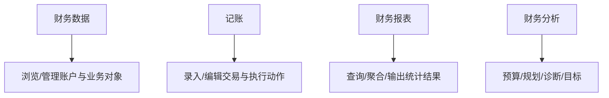

# MoneyHome8 工作区地图

本文档从“顶层工作区 -> 二级导航/页面 -> 典型窗体/实体”角度，整理当前对 `财智8` 产品信息架构的理解。

状态说明：

- `实测`
  - 已有真实页面截图支撑
- `推断`
  - 来自资源窗体、配置、对象模型与已有页面结构

## 1. 财务数据工作区

状态：

- `实测`

证据：

- [data-page-observations.md](C:\DCG-SZ\SZ-System-Docs\CodexWorkSpace\Finance-own\docs\data-page-observations.md)

当前已确认二级导航：

- 概况
- 财务记录
- 投资一览
- 标签
- 账户中心

当前已确认活动页：

- 账户中心

相关核心实体：

- `AccountGroup`
- `Account`
- `Category`
- `Tag`
- `Person`
- `Security`
- `Fund`

## 2. 财务报表工作区

状态：

- `实测`

证据：

- [report-page-observations.md](C:\DCG-SZ\SZ-System-Docs\CodexWorkSpace\Finance-own\docs\report-page-observations.md)
- [runtime-calculation-and-report-projections.md](C:\DCG-SZ\SZ-System-Docs\CodexWorkSpace\Finance-own\docs\runtime-calculation-and-report-projections.md)

当前已确认二级分组：

- 日常收支类
- 资产负债类
- 投资类

当前已确认子报表：

- 日常收支表
- 日常收支明细表
- 账户日常收支表
- 标签日常收支表
- 两段时间收支对比表
- 收支统计表
- 收支走势图
- 月平均收支表
- 现金流表
- 资产负债表
- 可用资金表
- 债权债务表
- 月资产走势图
- 投资一览表
- 投资收益一览表
- 投资收益率统计表
- 证券投资一览表
- 证券费用及盈亏一览表
- 证券市值大势图
- 开放式基金投资一览表
- 开放式基金费用及盈亏一览表
- 开放式基金市值大势图
- 外汇交易一览表
- 银行理财产品收益率表
- 网贷盈亏一览表

相关核心实体：

- `Transaction`
- `Account`
- `Quote`
- `Budget`
- `ReportSettings`

## 3. 财务分析工作区

状态：

- `实测`

证据：

- [analysis-page-observations.md](C:\DCG-SZ\SZ-System-Docs\CodexWorkSpace\Finance-own\docs\analysis-page-observations.md)

当前已确认二级导航：

- 财务预算
- 财务诊断
- 财务规划
- 财务目标

当前已确认活动页：

- 财务预算（空状态）

相关核心实体：

- `Budget`
- `Reminder`
- `FinancialPlanning`
- `Goal`

## 4. 记账工作区

状态：

- `推断`

证据基础：

- 顶部入口 `记账` 已从界面确认存在
- 交易窗体家族非常完整：
  - `TTransDlgFm`
  - `TCashTransFm`
  - `TCurrentTransFm`
  - `TWasteBookFm`
  - `TExpenseDlgFm`
  - `TCashXferDlgFm`
  - `TClaimsTransFm`
  - `TForeignTransFm`
  - `TSecurityTransFm`
  - `TOpenFundTransFm`
  - `TFixedDepositTransFm`
  - `TThirdDepositsTransFm`

当前最合理的二级页面推断：

- 收入录入
- 支出录入
- 转账录入
- 流水账/日记账
- 现金流水
- 活期流水
- 第三方储值流水
- 定期流水
- 债权债务流水
- 外汇交易
- 证券交易
- 开放式基金交易
- 期货/黄金/贵金属交易
- 保险/社保相关流水

当前最合理的产品角色推断：

- `记账` 工作区更偏“录入与执行中心”
- `财务数据` 工作区更偏“浏览与管理中心”

相关核心实体：

- `Transaction`
- `TransactionType`
- `TransactionTheme`
- `Template`
- `DebtAccount`
- `Security`
- `Fund`
- `PreciousMetal`
- `FuturesContract`

## 5. 工作区关系

## 6. 对 Rust 重构的直接意义

- 四个工作区应被建模为四个一层路由/容器，而不是混成一个大页面。
- 每个工作区下再挂自己的二级导航。
- `记账` 与 `财务数据` 不应合并：
  - 一个偏录入
  - 一个偏浏览/管理

## 7. 当前仍待运行验证

- `记账` 动态菜单、页面跳转和真实写入结果
- `财务数据` 除账户中心外的其它二级页面
- `财务报表` 的动态查询列、事件公式和导出结果
- `财务分析` 的诊断/规划/目标公式与真实结果

补充：`记账`、投资类报表、诊断/规划/目标的静态控件、字段和事件已通过运行时 DFM 直接确认。
